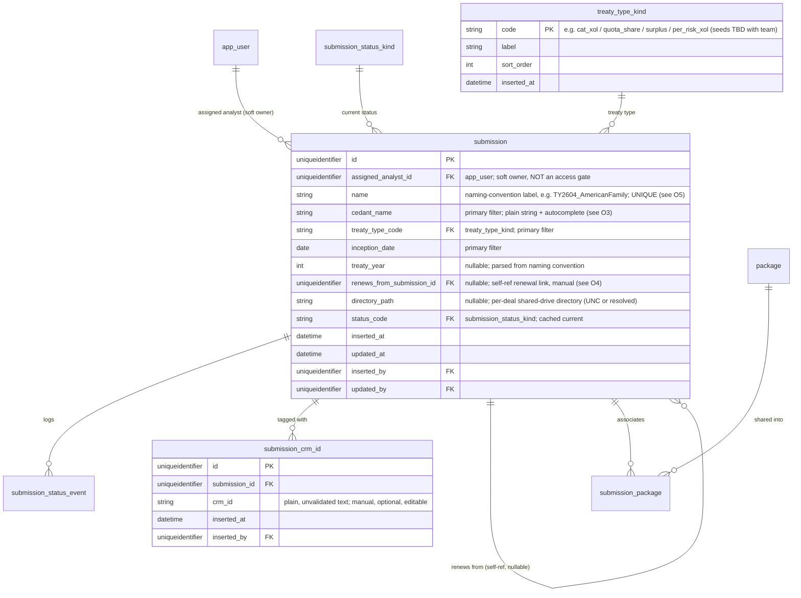
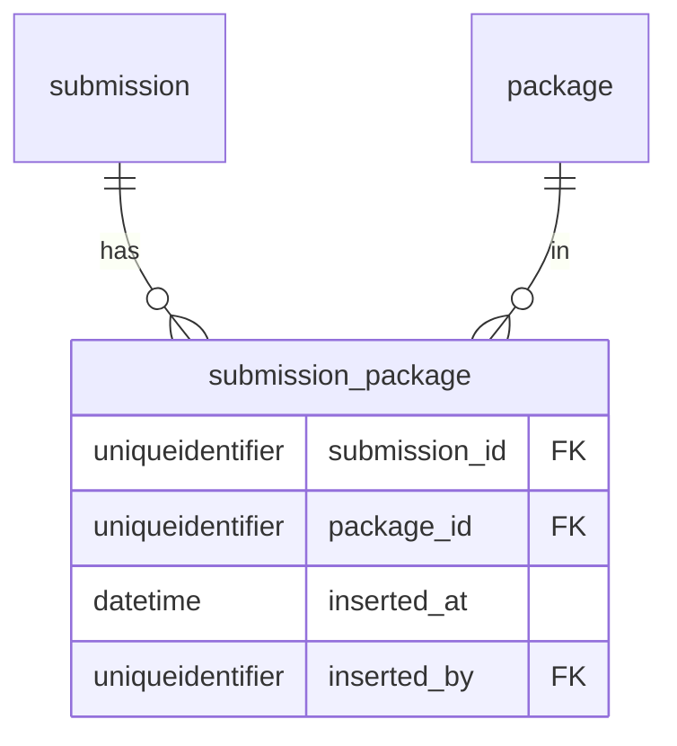
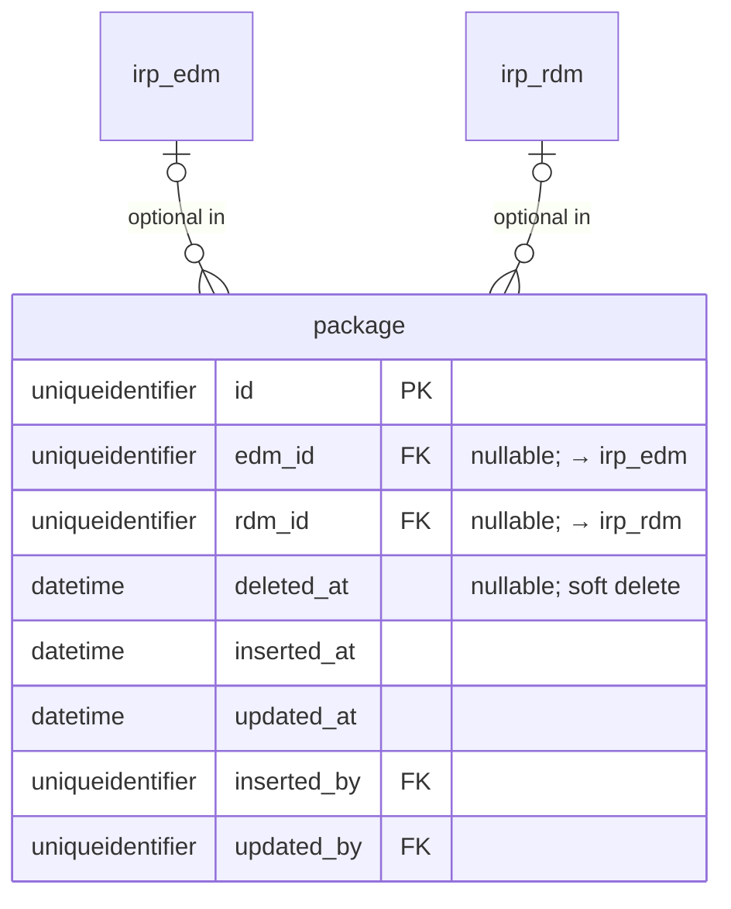

# Change Request — Consolidate to Submission + Package; drop Customer/Program hierarchy and RLS; simplify file handling

**ID:** CR-003

**Status:** DRAFT (decisions locked) — data-model focus. First pass feeding the Thursday design session. **Not applied** to `DATA_MODEL.md`, `PRD.md`, or the constitution yet. All eight decisions O1–O8 are **confirmed (2026-07-07)**, including O2 (allow RDM-only), which the **practice lead has ratified** (2026-07-07) — it supersedes the 2026-07-06 NOT NULL call. No open decisions remain; the schema is ready to fold into `DATA_MODEL.md`.

**Scope of this pass:** the **data model only** (`docs/DATA_MODEL.md`). Downstream edits to `PRD.md` and `.specify/memory/constitution.md` are catalogued (§8) but deliberately deferred to follow-up passes, per the analyst's direction to settle the schema first.

**Applies to (once approved):** `docs/DATA_MODEL.md` §1–§3a, §4, §8–§9, §12–§13; and — in later passes — `docs/PRD.md` (customer/program/file-inventory sections) and `.specify/memory/constitution.md` Articles 3, 6, 7, 12.

**Owner:** Analyst + Practice Leader (IRP domain expert), joint review. CIC domain experts (Wendy Hayes, Cheryl TeHennepe, Ross Konell) are the source authority for the deal/package/CRM-tagging reality captured here.

**Source:** Design session 2026-07-07 — `docs/design_session_notes/01_data_model_and_workbench_organization.md` and `docs/design_session_notes/02_cic_data_organization.md`.

> **How to use this document.** §1 is why. §2 is the five structural moves at a glance. §3 is the target schema, table by table, in the style of `DATA_MODEL.md`. §4 is the table-disposition index (every current table, one row: kept / modified / dropped). §5 is the kind-table seed delta. §6 records the RLS consequence in one place because it is the largest ripple. §7 is the decisions (all confirmed 2026-07-07, including the practice lead's ratification of O2 — no open items remain). §8 is the downstream document impact (PRD + constitution), to be handled in later passes. §9 is out of scope.
>
> **⚠️ This is a DRAFT proposal, not a build spec.** Where any table or nullability here is still marked open in §7, do not build against it yet.

---

## 1. Why this exists

The first IRP Workbench design session (2026-07-07) with the CIC cat-modeling team produced a materially different picture of how work is actually organized than the schema currently assumes. Two findings drive this CR:

1. **The analyst's unit of work is the "deal," not a customer→program→submission tree.** CIC's team confirmed that Program is a vague, disused level and the legacy Customer ID is a flawed identifier they want to stop leaning on (notes 01 §2 D1/D2; notes 02 §2). The thing an analyst sits down to work on is a *deal*: a specific cedant's specific treaty at a specific inception — which produces **one set of modeling data** (one or more EDM/RDM packages) and is tracked for the business by **one or more CRM IDs** (notes 02 §0). "Submission" should model that deal.

2. **The real relationships are many-to-many and degenerate, not a clean tree.** A deal can hold multiple EDMs and multiple RDMs; a single package can be reused across deals; a package can carry multiple CRM IDs and vice-versa; and **EDM-only *and* RDM-only packages are both real** (notes 02 §3). A rigid parent→child hierarchy fights this data; the team's own back-end (exposure/loss repositories) already models the CRM association as **tagging**, not a tree (notes 02 §4).

The current schema — `customer → program → submission`, a submission-scoped `package` with `edm_id` NOT NULL, a full file-inventory/drift-detection subsystem, and a `customer_id` RLS key denormalized onto every table — encodes assumptions that the domain experts have now contradicted. This CR realigns the model to the deal-centric, tag-based reality.

**Implementation-debt note.** Unlike CR-002, this pivot is **not** debt-free. Spec 002 (`specs/002-domain-file-inventory-rls/`, merged as PR #5, 2026-07-06) built the `customer`/`program`/`submission` spine, the RLS/`apply_scope()` machinery, and the entire file-inventory subsystem (`file_artifact`, `discrepancy`, `ignore_rule`, scanner). Much of what this CR drops is freshly implemented. That raises the stakes on getting the decisions in §7 right before touching code — see §8.3.

---

## 2. The five structural moves

| # | Move | Effect |
|---|------|--------|
| M1 | **Drop `customer` and `program`; `submission` becomes the top-level entity.** | The deal is the root. No hierarchy above it (the treaty-system rebuild, Ross's, may add broader objects later — the workbench does not hard-code them now). |
| M2 | **Drop `customer_id` everywhere → retire customer-based RLS.** | No denormalized scoping key on any table; `user_customer_access` gone; `apply_scope()` no longer keyed on customer. All analysts see all deals; `assigned_analyst` is soft ownership, not an access gate. **This is the largest ripple — see §6 and the open decision O1.** |
| M3 | **`submission` carries the deal's identity + filter attributes, and CRM IDs become a tag set.** | Cedant name, treaty type, inception date, treaty year, renewal link live on `submission`. The single `submission.crm_id` text field becomes a many-valued `submission_crm_id` tag table (0..N, manual, optional, editable). |
| M4 | **`package` becomes many-to-many with `submission`, and EDM-only / RDM-only are both valid.** | A `submission_package` join replaces `package.submission_id`. `package.edm_id` and `package.rdm_id` both become nullable (≥1 required). **Supersedes the 2026-07-06 practice-lead call that made `package.edm_id` NOT NULL — practice-lead ratified 2026-07-07, see O2.** |
| M5 | **Collapse the file-inventory subsystem to a single stored path.** | Drop `file_artifact`, `discrepancy`, `ignore_rule`, `submission_directory`, and their kind tables. Keep only the shared-drive path of the file each EDM/RDM was created from, stored directly on `irp_edm`/`irp_rdm`. |

---

## 3. Target data model

Notation and conventions follow `DATA_MODEL.md`. Only changed/new/removed tables are shown; everything not mentioned is unchanged except for the blanket `customer_id` removal (M2), which is called out per-table in §4.

### 3.1 `submission` — redesigned (the deal)



**Notes**

- **`program_id` and `customer_id` are gone** (M1/M2). `submission` no longer sits under any parent; it is the root browse/search entity.
- **Primary filter attributes moved onto the submission** (notes 01 §2 D4; notes 02 §5): `cedant_name`, `treaty_type_code`, `inception_date`. `treaty_year` is captured too (parsed from the `TY{YY}` naming convention) for renewal-year grouping. These are the workbench's system-of-record — they **cannot** be derived from a CRM ID because there is no CRM integration (notes 02 §0.5).
- **`treaty_type_code` is a kind table** (`treaty_type_kind`), per Article 3 — treaty types are an app-defined, closed set. *This is the deal-level treaty type used for filtering, distinct from `irp_treaty` (§3b of DATA_MODEL.md), which is the treaty object created inside an EDM with its lines of business. Keep both; they are different concepts.*
- **`crm_id` (single text field) → `submission_crm_id` (0..N tags).** The current `submission.crm_id` column is removed. CRM IDs are hand-entered, optional, may be absent/mistyped, and can be many per deal (notes 02 §0.5, §4). Modeling them as a tag set (not a column, not a hierarchy level) makes the many-CRM-IDs-per-deal case ordinary and degrades gracefully when blank. **Tags attach at the submission level only** (O6, confirmed): a package's effective CRM IDs in any context are the tags of the submission it is being viewed under, so there is no separate package-level tag store to diverge from it. When exposure/loss-repository upload is built later (where per-exposure CRM tagging actually matters, notes 02 §4.1), the package's effective tags **derive** from its associated submission(s).
- **`renews_from_submission_id` (self-ref, nullable)** captures the renewal / expiring-submission link. With no treaty-system integration this is **manual or inferred** (match cedant + treaty type across treaty years), not free (notes 02 §4.5, O-d). Nullable because most first-year or unlinked deals have none.
- **`directory_path`** is the per-deal shared-drive directory the analyst stages files in (notes 02 §1, §4.6). Optional; the naming convention is parsed from it to pre-fill `cedant_name`/`treaty_year` on creation.
- **`assigned_analyst_id` is unchanged in shape** but its meaning is clarified: it is the "person working this deal" for a *"my submissions"* filter (`WHERE assigned_analyst_id = me`), **not** an access restriction. Without RLS (M2), every analyst can view every submission (notes: "shouldn't block other users from viewing"). See O1.
- **`submission_status_kind` / `submission_status_event` are unchanged** — `ACTIVE`/`COMPLETED`/`CANCELLED`, event-sourced per Article 4, no delete.

### 3.2 `submission_package` — new (deal ↔ package, many-to-many)



- Composite PK `(submission_id, package_id)`. Replaces `package.submission_id`.
- Models notes 02 §3 case 4 ("one data package → many deals," same exposure base reused across reinsurance types) and the normal 1-deal-N-packages case alike. Plain-vanilla (1 deal → 1 package) is just a single join row.

### 3.3 `package` — modified (EDM-only and RDM-only both valid)



- **`submission_id` removed** (→ `submission_package`, §3.2). **`customer_id` removed** (M2).
- **Both `edm_id` and `rdm_id` are nullable, with a CHECK that at least one is set.** This is the reversal in M4: the design session confirms RDM-only packages are real (broker provides losses you can only review, no exposure to re-run — notes 02 §3 degenerate shapes). EDM-only remains valid. **Supersedes the 2026-07-06 practice-lead decision (`package.edm_id` NOT NULL); practice-lead ratified 2026-07-07 — see O2.**
- **Still no package-level status column** — the rationale from DATA_MODEL.md §3a (a package is a join over an EDM and an RDM, each carrying its own status) is unchanged and, if anything, stronger now that both sides are optional.
- **Package actions / job chaining (`rwb_job`) are affected by RDM-only.** The current "`edm_upload` is always the head job" assumption (DATA_MODEL.md §3a) breaks for an RDM-only package. Sync/delete sequencing must handle: EDM-only, RDM-only, and EDM+RDM. Flagged in O2; detailed sequencing is a §8 follow-up, not resolved here.

### 3.4 `irp_edm` / `irp_rdm` — modified (path replaces file subsystem; RDM-only)

Field-level changes only; full tables are in DATA_MODEL.md §3.

- **Drop `file_artifact_id`** on both. **Add `source_file_path`** (nullable string): the shared-drive path of the `.bak`/`.mdf`/`.csv` the EDM/RDM was created from. This is the entire file-handling model now (M5) — no versioning, no drift, no tag/discrepancy rows.
- **Drop `submission_id`** on both. Ownership reaches `submission` transitively through `package` → `submission_package` — no convenience denorm is retained (O7).
- **Drop `customer_id`** on both (M2).
- **`irp_rdm.edm_id` becomes nullable** — an RDM-only package has an RDM with no EDM (the broker-losses-only case). **Reverses the 2026-07-06 `irp_rdm.edm_id` NOT NULL call — see O2.** When present, the FK still means "the EDM this RDM's results link to."
- **CSV support (notes 01 §2 D7):** `source_file_path` may point to a `.csv` (ELT/PLT, or exposure too large for an RDM). Whether a CSV-sourced result needs a distinct handling path (it is not "imported" into an RDM the way a `.bak` is) is a PRD/flow question, flagged in O8. At the schema level a path is a path.

### 3.5 Downstream entity/job/result tables — `customer_id` removal

`irp_portfolio`, `irp_treaty`, `irp_analysis`, `irp_job`, `rwb_job`, `analysis_result_meta`, `result_export`, `validation_run`, `validation_result`, `analysis_template`, `template_suite` all currently carry a `customer_id` denorm (and templates/suites use it as a scope). Under M2:

- **All `customer_id` columns are dropped.** Their sole purpose was `apply_scope()`; with RLS retired (§6) they carry no meaning.
- **`analysis_template.customer_id` / `template_suite.customer_id` (scope)** — templates become either **global** or **`created_by`-scoped** (per-analyst). Recommended: global, visible to all (consistent with the no-RLS stance); flag in O1.
- **`irp_job.submission_id` / `irp_job.customer_id` (both NOT NULL today) are both dropped (O7).** A job lives at the **package** grain, not the submission grain — with packages shared across deals there is no single "owning submission," and there is no need to browse jobs at the submission level. A nullable **`package_id`** FK replaces `submission_id`, giving the direct "jobs for this package" grouping; the finer entity-lineage FKs (`irp_edm_id`/`irp_rdm_id`/`irp_portfolio_id`) are unchanged.
- **`irp_analysis.edm_id` NOT NULL** interacts with RDM-only (a broker RDM-only review may have no EDM). Part of the O2 reconciliation; not redesigned in this pass.

### 3.6 File-inventory subsystem — removed (M5)

Dropped outright: `file_artifact`, `artifact_source_kind`, `artifact_status_kind`, `artifact_tag_kind`, `discrepancy`, `discrepancy_severity_kind`, `ignore_rule`, `ignore_rule_scope_kind`, `submission_directory`.

Replaced by: `irp_edm.source_file_path` / `irp_rdm.source_file_path` (§3.4) and, optionally, `submission.directory_path` (§3.1). The design intent — "cat-modeling-focused; not a File Explorer replacement" (notes 01 §2 D8) — no longer justifies a versioning/drift/ignore-rule engine. **This is the change with the most already-built code behind it (spec 002); see §8.3.**

> The tagging that `artifact_tag_kind` (`edm`/`rdm`) provided — declaring which file is exposure vs. results — is now implicit: the analyst points a package's EDM slot and/or RDM slot at a file path directly. The IRP name-collision check (`search_edms`/`search_rdms`) moves to EDM/RDM create time (it was always a REST search needing no local file row).

---

## 4. Table-disposition index

Every table in `DATA_MODEL.md` today, plus tables this CR adds. Legend: `UNCHANGED` · `MODIFIED` · `NEW` · `DROPPED`. (Every surviving `irp_*`/entity table is additionally `MODIFIED` by the blanket `customer_id` drop — noted once here rather than repeated.)

| Table | Disposition | What changed / why |
|---|---|---|
| **Auth & business spine** | | |
| `customer` | **DROPPED** | No customer hierarchy; RLS retired (M1/M2) |
| `program` | **DROPPED** | Disused level (M1) |
| `submission` | **MODIFIED** | Root entity now; +`cedant_name`/`treaty_type_code`/`inception_date`/`treaty_year`/`renews_from_submission_id`/`directory_path`; −`program_id`/`customer_id`/`crm_id` (§3.1) |
| `submission_status_kind` | UNCHANGED | — |
| `submission_status_event` | UNCHANGED | — |
| `submission_crm_id` | **NEW** | 0..N CRM-ID tags per submission (§3.1) |
| `treaty_type_kind` | **NEW** | Deal-level treaty type, kind table (§3.1) |
| `submission_package` | **NEW** | Deal ↔ package M:N join (§3.2) |
| `app_user` | UNCHANGED | — |
| `role_kind` | UNCHANGED | `is_admin` bypass now moot without RLS, but role vocabulary stays (see O1) |
| `user_role` | UNCHANGED | — |
| `user_customer_access` | **DROPPED** | RLS access grants gone (M2) |
| `audit_log` | UNCHANGED | Still DEFERRED (CR-002) |
| **File inventory** | | |
| `submission_directory` | **DROPPED** | → optional `submission.directory_path` (M5) |
| `file_artifact` | **DROPPED** | → `irp_edm/irp_rdm.source_file_path` (M5) |
| `artifact_source_kind` | **DROPPED** | (M5) |
| `artifact_status_kind` | **DROPPED** | (M5) |
| `artifact_tag_kind` | **DROPPED** | edm/rdm tagging now implicit in the package slot (M5) |
| `discrepancy` | **DROPPED** | No drift detection (M5) |
| `discrepancy_severity_kind` | **DROPPED** | (M5) |
| `ignore_rule` | **DROPPED** | No scanner to filter (M5) |
| `ignore_rule_scope_kind` | **DROPPED** | (M5) |
| **EDM & RDM entities + Package** | | |
| `irp_edm` | **MODIFIED** | +`source_file_path`; −`file_artifact_id`/`submission_id`/`customer_id` (§3.4) |
| `irp_rdm` | **MODIFIED** | +`source_file_path`; −`file_artifact_id`/`submission_id`/`customer_id`; **`edm_id` → nullable** (RDM-only; O2) |
| `irp_portfolio` | **MODIFIED** | −`customer_id` |
| `package` | **MODIFIED** | −`submission_id`/`customer_id`; **`edm_id` → nullable** (RDM-only; O2); ≥1 of edm/rdm CHECK (§3.3) |
| `irp_treaty` | **MODIFIED** | −`customer_id` |
| **Analysis** | | |
| `irp_analysis` | **MODIFIED** | −`customer_id`; `edm_id` NOT NULL interacts with RDM-only (O2) |
| `irp_analysis_status_kind` | UNCHANGED | — |
| **Analysis templates & suites** | | |
| `analysis_template` | **MODIFIED** | −`customer_id` scope → global or `created_by`-scoped (O1) |
| `analysis_template_tag` | UNCHANGED | — |
| `template_suite` | **MODIFIED** | −`customer_id` scope (O1) |
| `template_suite_item` | UNCHANGED | — |
| **Phase A validation (deferred)** | | |
| `validation_run` | **MODIFIED** | −`customer_id` |
| `validation_result` | UNCHANGED | — |
| `validation_run_status_kind` | UNCHANGED | — |
| `validation_result_category_kind` | UNCHANGED | — |
| **IRP jobs & RWB jobs** | | |
| `irp_job` | **MODIFIED** | −`customer_id`/`submission_id`; +nullable `package_id` (job lives at package grain, O7) |
| `irp_job_type_kind` | UNCHANGED | — |
| `irp_job_resource` | UNCHANGED | — |
| `irp_job_resource_type_kind` | UNCHANGED | — |
| `rwb_job` | **MODIFIED** | −`customer_id`; package sync/delete chaining must handle RDM-only (O2) |
| `rwb_job_requestor_type_kind` | UNCHANGED | — |
| `rwb_job_type_kind` | UNCHANGED | — |
| `rwb_job_heartbeat` | UNCHANGED | — |
| `rwb_job_status_kind` | UNCHANGED | — |
| **Analysis results** | | |
| `analysis_result_meta` | **MODIFIED** | −`customer_id` |
| `result_export` | **MODIFIED** | −`customer_id` |
| `delivery_kind` | UNCHANGED | — |
| **IRP reference cache** | | |
| all `irp_*` cache tables | UNCHANGED | Never had `customer_id` (global reference data) |

---

## 5. Kind-table seed delta

- **New:** `treaty_type_kind` — seeds TBD with the CIC team (candidates: `cat_xol`, `quota_share`, `surplus`, `per_risk_xol`, `aggregate_xol`, `stop_loss`). Confirm the authoritative list before building.
- **Dropped:** `artifact_source_kind`, `artifact_status_kind`, `artifact_tag_kind`, `discrepancy_severity_kind`, `ignore_rule_scope_kind` (all with M5).
- **Unchanged:** `submission_status_kind`, `role_kind`, and all IRP/job kind tables.

---

## 6. The RLS consequence (M2), in one place

Dropping `customer_id` is not a field edit — it removes the workbench's entire row-level security model. Collected here because it touches the most:

- **`apply_scope()` no longer has a scoping key.** Every scoped predicate today is `customer_id = ANY(:allowed)`. With no `customer_id`, there is nothing to scope on.
- **`user_customer_access` is dropped** — there are no per-customer grants to store.
- **The denormalized-`customer_id`-on-every-table convention (DATA_MODEL.md Conventions) is retired** — that denorm existed solely to make `apply_scope()` a single-column predicate.
- **Access model becomes:** any authenticated analyst can view any submission and everything under it; `assigned_analyst_id` is a soft owner used for the "my submissions" view only. Roles (`role_kind`/`user_role`) may still exist for admin functions, but `is_admin`'s "`apply_scope()` bypass" purpose is gone.

This directly redefines **constitution Article 6 (Customer Isolation on the Parameterized Path Only)** and touches **Article 7** (the `scoped_execute()` connection assertion) and **Article 12** (RLS is a named test target). Those constitution edits are catalogued in §8 and handled in the follow-up constitution pass — **but the schema in §3 cannot be finalized until O1 confirms the access model is genuinely "no RLS."**

---

## 7. Decisions

### Confirmed by the analyst (2026-07-07)

- **O1 — Access model / RLS → NO RLS.** No row-level scoping; every authenticated analyst sees every submission and everything under it; `assigned_analyst_id` is a soft "my submissions" filter only. `customer_id` is dropped totally (not re-keyed). This governs §3 and §6 and forces the Article 6 redefinition (§8.1).
- **O2 — RDM-only validity → ALLOW (practice-lead ratified 2026-07-07).** The design session (CIC domain experts) confirms RDM-only packages are real (broker provides losses to review, no exposure). `package.edm_id`, `irp_rdm.edm_id`, and `irp_analysis.edm_id` become **nullable**; a package requires ≥1 of edm/rdm. The practice lead has ratified this, superseding the 2026-07-06 NOT NULL call. Follow-up work it triggers: `rwb_job` sync/delete sequencing must handle the RDM-only shape (no longer "EDM is always the head job") and the analysis layer must tolerate a null `edm_id` — tracked as flow work in §9, not a blocker on the schema.
- **O3 — Cedant representation → PLAIN STRING.** `submission.cedant_name` is a plain string kept consistent via autocomplete from existing values. No `cedant` table — that would re-create `customer` under a new name, against the "Submission and Package only" intent.
- **O6 — CRM-ID tag level → SUBMISSION ONLY.** Tags live on `submission_crm_id` only. A separate package-level tag store was rejected: a package tagged with a CRM ID unrelated to its submission's would be contradictory. A package's effective CRM IDs derive from the submission it is viewed under; per-exposure tagging (if needed) is computed at repository-upload time, later.

- **O4 — Renewal link → MANUAL, NULLABLE.** `renews_from_submission_id` is a manual self-ref, nullable. No treaty-system read and no inference in scope.
- **O5 — `submission.name` uniqueness → GLOBAL `UNIQUE(name)`.** With `program` gone, the `TY{YY}{MM}_{Cedant}` label is unique across all submissions.
- **O7 — Job grain → PACKAGE, NOT SUBMISSION.** `irp_job` drops `submission_id` (and `customer_id`); a nullable `package_id` FK provides the "jobs for this package" grouping. There is no need to view jobs at the submission level (§3.5).
- **O8 — CSV handling → SAME AS `.bak`/`.mdf`.** A CSV is just another `source_file_path` value; the analyst-facing process is identical. The IRP integration under the hood differs, but that is a flow/implementation detail, not a schema distinction — no separate table or format discriminator.

---

## 8. Downstream document impacts (later passes)

Per the analyst's direction, this pass settles the data model only. The following are catalogued, not yet edited.

### 8.1 Constitution (`.specify/memory/constitution.md`)
- **Article 6 (Customer Isolation)** — redefined or removed (§6). Largest edit; MAJOR version bump likely.
- **Article 7** — the `scoped_execute()` "must assert `connection == WORKBENCH`" clause loses its customer-scoping rationale; reword.
- **Article 3** — carve-out table is unaffected, but the doc references `customer_id` in examples; sweep.
- **Article 12** — RLS is a named required-test target; update to match the new access model.

### 8.2 PRD (`docs/PRD.md`)
- Customer/program-hierarchy sections, customer-seeding (spec 002 FR-001–004), the file-inventory feature set (§8.x drift/discrepancy/ignore-rules), and any "my submissions"/access-control copy all need realignment to the deal-centric, no-RLS, path-only-file model.
- The `analysis_template` `auto_name_pattern` open item (references dropped `cycle`) can now be re-derived against the new `submission` attributes (`cedant_name` + `treaty_year` + region + peril).

### 8.3 Already-built code (spec 002 / PR #5)
- The customer/program spine, `apply_scope()`/RLS, and the file-inventory subsystem are **implemented**. This CR drops much of that. A migration/removal plan and a decision on whether to preserve any spec-002 file-inventory behavior are required before code changes — this is the opposite of CR-002's debt-free pivot. Flag for the practice lead and analyst jointly.

---

## 9. Out of scope for this CR

- The "project" container question (notes 01 §4, O1) — leaning submission-scoped, deferred.
- Portfolio-level exposure summary and analysis-result view specs (notes 01 §6–§7) — PRD/UX, not schema.
- Any treaty-system / CRM integration — confirmed out of scope (notes 02 §0.5); the workbench remains the system of record for deal metadata.
- The full `rwb_job` sync/delete re-sequencing for RDM-only packages — a follow-up design pass now that O2 is ratified (no longer "EDM is always the head job").
```
