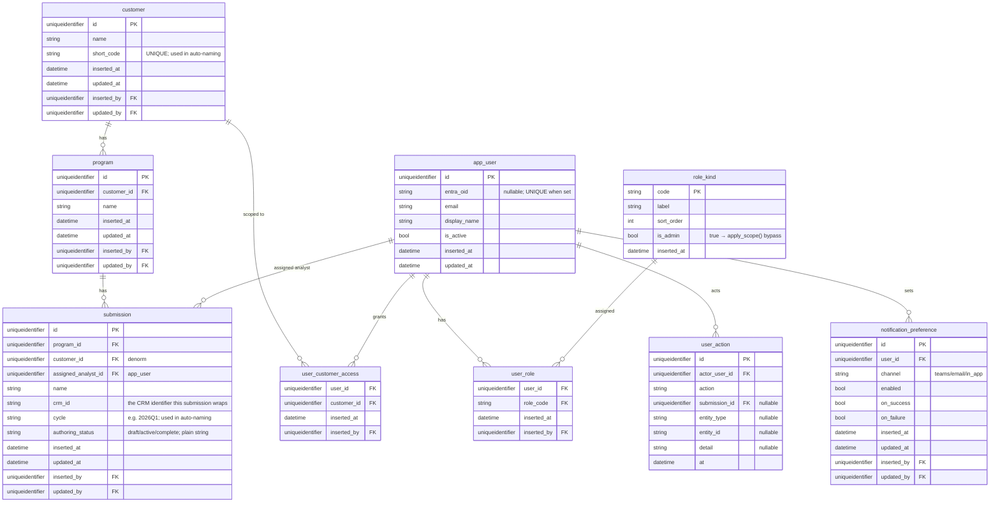
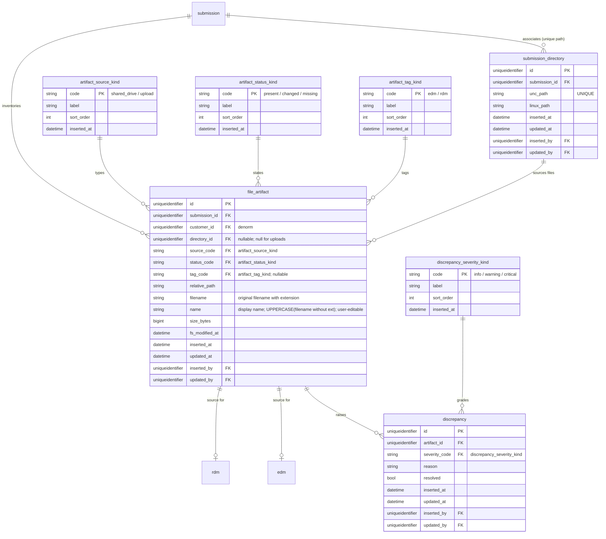
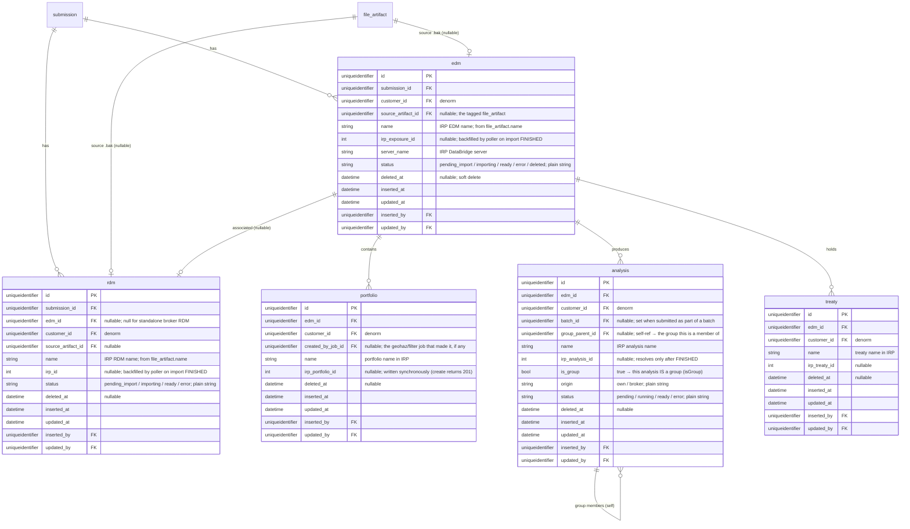
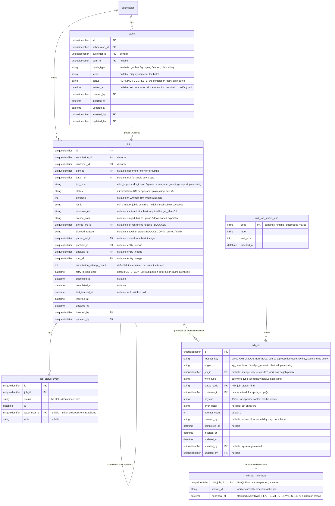
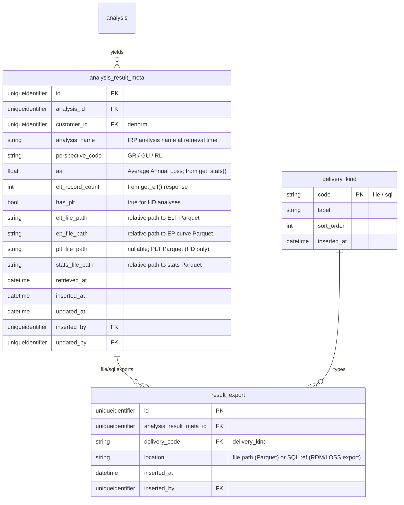
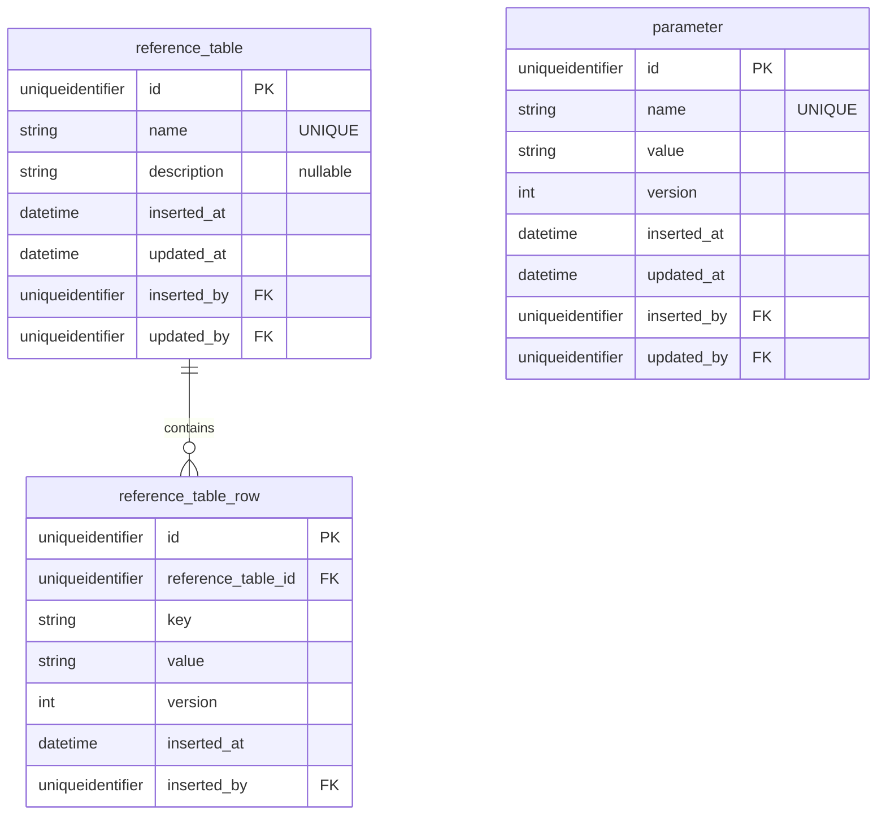

# Data Model — Risk Workbench

The migration-ready schema reference for the **lean metamodel**. Companion to
`PRD.md`; the concrete counterpart of `metamodel-design.md` (which argues *why* these
tables exist). This is what Claude Code turns into migrations.

**This model supersedes the prior workflow-engine data model** (retained in git history).
It keeps the auth spine, file inventory, result cache, and IRP reference cache; it
**replaces** the workflow-engine machinery (the `workflow_definition` / `stage` /
`task_template` / `port_template` / `handle_type_kind` design + the runtime `workflow` /
`stage_instance` / `task_instance` / `task_input` / `task_output` tables) with a single
`job` table, **collapsing** `task_instance` + `irp_job` into that one `job`. The app-side
work queue is `rwb_job` (CR-001 — decoupled from IRP, `request_key` dedup, heartbeat +
reconciler). See §12 for the full list of what was removed and why, and CR-001
(`docs/CR_01__RWB_JOBS.md`) for the `rwb_job` resilience design carried forward here.

**Design rule (from `metamodel-design.md`):** a construct earns a table only if it answers
*"what has to persist after the HTTP response returns?"* Topology (what-follows-what) lives
in **code**, not as data. Result: ~13 flow-forced tables + supporting caches, vs ~40 + ~10
kind tables in the prior model.

---

## Database connections

All database access goes through the `db/` package (`db/connection.py`). App code calls
`get_connection("WORKBENCH"|"EXPOSURE"|"LOSS"|"DATABRIDGE")`; no URL strings in application
code. Connection pooling, Kerberos renewal, and pool sizing are handled by the package.

| Named connection | Database | Managed by | Env var prefix |
|---|---|---|---|
| `WORKBENCH` | Workbench Metamodel DB | Alembic + app | `MSSQL_WORKBENCH_*` |
| `EXPOSURE` | Exposure Repository | App (bootstrap SQL) | `MSSQL_EXPOSURE_*` |
| `LOSS` | Loss Repository | App (bootstrap SQL) | `MSSQL_LOSS_*` |
| `DATABRIDGE` | DataBridge (Moody's cloud) | Moody's — app never runs DDL | `MSSQL_DATABRIDGE_*` |

Required vars per connection: `MSSQL_{NAME}_SERVER`, `MSSQL_{NAME}_USER`,
`MSSQL_{NAME}_PASSWORD`, `MSSQL_{NAME}_DATABASE`. Optional: `MSSQL_{NAME}_PORT` (default 1433),
`MSSQL_{NAME}_AUTH_TYPE` (default `SQL`). Global pool settings apply across all connections:
`MSSQL_POOL_SIZE` (default 5), `MSSQL_POOL_MAX_OVERFLOW` (default 5), `MSSQL_POOL_RECYCLE`
(default 1800s). **For 30 concurrent users:** `MSSQL_POOL_SIZE=10`, `MSSQL_POOL_MAX_OVERFLOW=20`.

**Dev DB strategy — drop-create-seed.** Until production cutover, the dev workflow is full
drop-and-recreate via a single Alembic revision (`0001_initial.py`) that drops all tables,
creates them fresh, and seeds all kind tables. Before every schema-affecting iteration, the
builder MUST ask the analyst to choose per app-managed DB (`WORKBENCH`/`EXPOSURE`/`LOSS`):
**Rebuild** (drop/recreate/re-seed — data lost; dev default), **Refresh** (additive only), or
**Skip**. `DATABRIDGE` is Moody's-managed and is **never** touched by any migration/bootstrap.

**EXPOSURE and LOSS schema bootstrap.** Not managed by Alembic (which targets `WORKBENCH`
only); their schemas live in `db/bootstrap/exposure_schema.sql` / `loss_schema.sql`, applied
via `python -m app.cli bootstrap-exposure` / `bootstrap-loss` (idempotent). Columns are TBD
with the reporting / downstream teams (§14).

**Redis:** `REDIS_URL` (default `redis://localhost:6379/0`); the Dramatiq broker. Runs
**durable (AOF: `appendonly yes`, `appendfsync everysec`)** per CR-001 so a broker crash is
not a data-loss point — an acknowledged enqueue survives restart. SQL Server is the durable
truth; Redis is dispatch + concurrency control. See CR-001 §5 for the full resilience model.

**`apply_scope()` WORKBENCH-only guard:** `scoped_execute()` in `db/scope.py` defaults to
`connection="WORKBENCH"` and MUST only be used against `WORKBENCH`. `EXPOSURE`/`LOSS` hold
flat schemas with no `customer_id`; calling `apply_scope()` on them raises immediately.

---

## Conventions (apply to every table)

- **Kind tables** (`*_kind`) hold categorical values: `code` (PK), `label`, `sort_order`,
  optional `icon`/`color`/`is_active`. Categorical columns are FKs to kind tables — never
  DB enums. **But `job`/`batch` lifecycle vocabularies are plain string columns, not
  kind tables** (see below) — they mirror Moody's or are Python enums that must never
  require a seed migration to accept a new value. `rwb_job.status` is the exception that
  proves the rule: it is a **kind table** (`rwb_job_status_kind`) because its values
  (`pending`/`running`/`succeeded`/`failed`) are **ours**, internal and stable — not an
  external mirror (per CR-001 and constitution Article 3).
- **RLS:** `customer_id` is **denormalized** onto every major entity (set once at creation,
  immutable) so `apply_scope()` is a single-column predicate.
- **Audit fields on every table:** `inserted_at`, `updated_at`, `inserted_by`
  (FK → `app_user`, nullable for system rows), `updated_by`. Kind tables have only
  `inserted_at`.
- **Naming:** singular `snake_case`; `id` surrogate PK (UNIQUEIDENTIFIER) unless noted;
  `*_code` FK → matching `*_kind`; `*_id` FK → entity.
- **Status is event-sourced (insert-only) with a cached current** — but only where it earns
  it. In this model that is **`job.status`**: a status change inserts a `job_status_event`
  row and, in the *same transaction*, stamps the cached `job.status` column. Use
  `get_connection("WORKBENCH")` as a context manager with an explicit `conn.begin()` for
  these two-DML writes — never split them across two `execute_command()` calls. `batch` is
  a single latch (`settled_at`) and needs no event stream; entity `status` columns
  (`edm`, `rdm`, …) are simple lifecycle flags stamped in place.
- **`file_artifact` is append-only** — a changed file inserts a new row; the old is
  retained.
- **Plain-string lifecycle columns (NOT kind tables, NOT DB enums):** `job.job_type`,
  `job.status`, `batch.batch_type`, `batch.status`, `rwb_job.work_type`,
  `rwb_job.origin`, `edm.status`, `rdm.status`, `analysis.status`,
  `analysis.origin`, `submission.authoring_status`. Vocabularies live in Python enums
  (§13) and are documented in code, not constrained in the DB. **`rwb_job.status` is
  the one lifecycle vocabulary that stays a kind table** (`rwb_job_status_kind`) — its
  values are internal and stable (CR-001), so Article 3's "external-mirror" carve-out
  does not apply.

---

## 1. Auth & business spine

Ours — Risk Modeler has no concept of a submission, program, or customer. This anchors
all work and is the RLS root.



**Notes:**
- `submission.crm_id` + `name` are the workbench-only wrapper Risk Modeler has no notion of.
- `user_action` is the single audit log (renamed from `audit_log`). **Synchronous ops that
  create no job** — `create_subportfolio`, treaty CRUD — record their occurrence here plus a
  UI toast; they never appear in the job monitor.
- "My submissions" = `WHERE assigned_analyst_id = current_user.id`.
- `notification_preference.on_success`/`on_failure` drive the batch-settle notification (§4).

---

## 2. File inventory

The shared-drive staging that feeds EDM/RDM creation. Orthogonal to the IRP job model;
carried over unchanged from the prior model.



**`file_artifact` identity:** `UNIQUE(submission_id, relative_path, size_bytes,
fs_modified_at)`. A differing tuple is a new version; the constraint stops the scanner
double-inserting.

**`file_artifact.name`:** initialized as `UPPERCASE(filename without ext)`, user-editable.
On tag as `edm`/`rdm` and on rename, the app calls `search_edms()`/`search_rdms()` to warn
(non-blocking) if the name already exists in IRP. This name seeds `edm.name` / `rdm.name`.

> **Note — `workflow_output` source removed.** The `artifact_source_kind` `workflow_output`
> value existed because the old engine emitted files into the inventory as workflow outputs.
> There is no workflow engine here; only `shared_drive` and `upload` remain.

---

## 3. Entity refs (pointers into Moody's)

The five things we create in Risk Modeler and must be able to list, name, and track. Each
holds the **name** (what we submitted, available immediately) and a **backfilled IRP id**
(available only once the creating job is `FINISHED`, except `portfolio` which returns 201
synchronously). **A submission wraps EDMs; the EDM is the modeling anchor** — portfolios,
analyses, groups, and treaties all belong to one EDM.



**Notes:**
- **A group is an analysis** (`is_group=true`), not a separate entity — `group_results.md`:
  a group is read/viewed/exported identically to any analysis. `group_parent_id` is the
  optional self-reference for "this analysis is a member of that group." (Group-of-groups
  works the same way.)
- **`rdm.edm_id` is nullable** — a broker RDM imported on its own has no EDM. It is
  non-null when the RDM was produced from / uploaded alongside a specific EDM.
- **`portfolio.irp_portfolio_id` is written on the request path** — `create_portfolio()`
  returns `(portfolio_id, request_body)` with HTTP 201; the id is stamped in the same
  transaction as the `portfolio` insert. The poller is not involved for the *empty*-create
  path. (The create-by-filter LOB path may return a job instead — open, §14.)
- **Names are mutable in RM** and can drift from our copy — once the `irp_*_id` is
  backfilled, prefer it as the resolution key and treat the stored `name` as a refreshable
  label. Reconciliation aggressiveness is open (§14).

---

## 4. In-flight tracking — job, batch, rwb_job

The heart of the model, and the collapse of the old `task_instance` + `irp_job` pair into
**one `job`**. A `job` is the single unit that must be tracked *after* the response
returns — every async IRP op (import, GeoHaz, analysis, grouping, export). A `batch` is the
**notification unit** for jobs submitted together. An `rwb_job` is a general
queued-work unit — the heavy post-terminal tail (download → load-to-LOSS; retrieve-results)
**and** analyst-requested or chained work — **decoupled from IRP** per CR-001 (its `job_id`
lineage FK is nullable; a source-agnostic `request_key` is the dedup key).



**`job` notes:**
- **One row per IRP op.** No separate `task_instance`. The poller mirrors `status` from RM;
  a heavy submit (multi-GB `.bak` to S3) runs on a Dramatiq worker and flips
  `SUBMITTING → QUEUED` + `irp_id` on success.
- **`prereq_job_id`** is the *only* stored dependency edge — the instance edge, not a
  topology. The dependency *rule* ("RDM import waits on its EDM import") lives in code; the
  poller's on-terminal handler reads this pointer to release (prereq `FINISHED`) or
  `BLOCKED` (prereq `FAILED`) the dependent. See §3.1 of `metamodel-design.md`.
- **`parent_job_id`** is resubmit lineage: a resubmit is a **new** job pointing at the
  original; the original flips to `SUPERSEDED`.
- **`submission_attempt_count` + `retry_locked_until`** carry the `ERROR` retry mechanics
  from the prior model: the `submission_retry` actor claims via
  `UPDATE … SET retry_locked_until = DATEADD(minute, 15, GETUTCDATE()),
  submission_attempt_count += 1 WHERE id = :id AND retry_locked_until < GETUTCDATE() AND
  submission_attempt_count < :max`. One actor wins; losers skip silently. Stops after
  `IRP_SUBMISSION_MAX_RETRIES` (default 3).
- **`resource_uri`** must be captured at submit time — it is not in the completion response;
  `retrieve_analysis_results` needs it for `get_elt(analysis_id, perspective_code,
  exposure_resource_id)`.
- Denormalized `submission_id` / `customer_id` / `edm_id` so the job monitor filters and
  groups without joins.

**`batch` notes — the notification unit:**
- Its one load-bearing job is **notification granularity**: notify once when a
  150-analysis run settles ("147 ok, 3 failed"), not 150 pings.
- **Stored = the latch only.** `status` is `RUNNING` until all members are terminal, then
  `COMPLETE`; `settled_at` is stamped once, in the same guarded transaction that enqueues
  the single `notify` — so the notification fires **exactly once**.
- **Breakdown is derived, never stored:** counts by member status, clean-vs-partial, all
  from `GROUP BY batch_id` over `job` (trivial at ~150 rows). No `PARTIAL`/`CANCELED`
  columns to reconcile.
- **`SUPERSEDED` members are excluded** from the completion check and the breakdown.
- **Not monotonic:** resubmitting failed members reopens `COMPLETE → RUNNING`; it
  re-settles and re-notifies when the re-runs finish.
- **No batch-of-one:** a single async op notifies on its own terminal (a `notify_analyst`
  rwb_job / handler); a `batch` row exists only when >1 job is submitted together.

**`rwb_job` notes** — the **app-side job** (CR-001; formerly `result_work_item`): work *we*
perform on a Dramatiq worker — the heavy post-terminal tail after an RM `job` (download →
load-to-LOSS; retrieve-results), plus **non-IRP work** (an analyst-requested export push; a
chained tail). Distinct from `job` (which RM performs and we poll). **Which table holds
what** is the bright-line rule in `metamodel-design.md §2.4`; the short version: a thing gets
a row only if its outcome is tracked/retried on its own — app work that merely *submits* an
RM job is that job's `SUBMITTING` phase, not an `rwb_job`.
- **Decoupled from IRP (CR-001).** `job_id` is a **nullable** lineage-only FK — analyst-request
  and chained rows have no `job` parent. The idempotency key is a **source-agnostic
  `request_key`** (`UNIQUE NOT NULL`), *not* `UNIQUE(job_id, work_type)` — SQL Server permits
  only one NULL in a UNIQUE index, so a job-scoped key can't dedup the non-IRP rows. `origin`
  (`irp_completion`/`analyst_request`/`chained`) records provenance for observability.
- **Idempotent creation:** `INSERT ... WHERE NOT EXISTS (request_key)`. **Atomic claim:**
  `UPDATE rwb_job SET status_code='running', claimed_by=:wid WHERE id=:id AND
  status_code='pending'` — rowcount is the arbiter; 0 ⇒ already claimed ⇒ ack and drop. No
  owner token, no lease.
- **Chaining lives in code:** the poller writes only the **head** row on a job's terminal
  status; each worker writes the **next** on success (`download_export_file` →
  `push_results_to_loss_repo`), by idempotent insert on the chained `request_key`. The order
  is the worker registry, not a DB DAG.
- **It can fail independently of the RM job** (analysis `FINISHED`, but our LOSS load
  failed) and it **defines the real "done"** — the derived `LOADING` state (§5) is "job
  `FINISHED` but an `rwb_job` still `pending`/`running`."
- **Resilience (CR-001), not a duration sweep.** The `rwb_job` row is written **before** the
  Dramatiq message, and **Redis runs durable (AOF)** — so an acknowledged enqueue survives a
  broker crash and *pending-lost stops being a case we must detect*. Progress is proven by a
  per-job **`rwb_job_heartbeat`** (a daemon thread stamps `heartbeat_at` every
  `RWB_HEARTBEAT_INTERVAL_SECS`, independent of the blocking work). A **single-instance
  reconciler** re-enqueues only rows stuck **`running`** with a stale heartbeat (older than
  `RWB_HEARTBEAT_STALE_SECS`, a constant multiple of the interval — **never** a function of
  job/data size); it **never scans `pending`**. Dramatiq already covers worker-death
  redelivery, task-failure retries, and graceful-shutdown requeue.

**`rwb_job.request_key` scheme** (source-agnostic; same logical work → same key, different
work → different key):

| `origin` | `request_key` |
|---|---|
| `irp_completion` | `irp:{job_id}:{work_type}` |
| `analyst_request` | `analyst:{entity_type}:{entity_id}:{work_type}` |
| `chained` | `chain:{parent_rwb_job_id}:{work_type}` |

**`rwb_job.work_type` vocabulary** (plain string; documented in the worker registry, not the
DB): `backfill_edm`, `backfill_rdm`, `retrieve_analysis_results`, `push_results_to_loss_repo`,
`push_rdm_to_loss_repo`, `download_export_file`, `notify_analyst`. *(v1's
`push_exposure_summary` is dropped — the Exposure Repository is out of MVP, `mvp-scope.md
§6`.)*

---

## 5. State model

### 5.1 `job.status` (plain string)

**Mirrored from Moody's** — stored verbatim; a new RM status never crashes the poller.
Order is Moody's own; spellings are one-`L`.

| Status | Meaning | Terminal? |
|---|---|---|
| `PENDING` | RM has the job; precedes `QUEUED`. | no |
| `QUEUED` | On RM's queue; precedes `RUNNING`. | no |
| `RUNNING` | RM is processing it. | no |
| `FINISHED` | Done. **The only success** — terminal ≠ success; always inspect. | **yes** |
| `FAILED` | RM ran it and it failed (has `irp_id`). | **yes** |
| `CANCEL_REQUESTED` / `CANCELING` / `CANCELED` | The cancel lane. | `CANCELED` yes |

**App-local** — the states RM knows nothing about (no `irp_id`, except `SUPERSEDED`):

| Status | Meaning | Has `irp_id`? | Terminal? |
|---|---|---|---|
| `UNSUBMITTED` | Created; prereqs met/none **or still ongoing** — ready/waiting. **Normal.** | no | no |
| `SUBMITTING` | A worker is uploading + submitting right now. Meaningful for heavy jobs. | no | no |
| `BLOCKED` | A prerequisite **failed** — needs rectifying. The **only** "needs attention" pre-submit state. | no | no (recoverable) |
| `ERROR` | Submission itself failed — never reached Moody's. Auto-retried to a max, then terminal. | no | **yes** (when exhausted) |
| `SUPERSEDED` | Replaced by a resubmit. Excluded from batch recon. | had one | **yes** |

```
   BLOCKED ◀─prereq failed─ UNSUBMITTED ─claimed─▶ SUBMITTING ─ok─▶ PENDING ─▶ QUEUED ─▶ RUNNING ─▶ FINISHED
      │     ─prereq fixed─▶      ▲                     │                                         ├─▶ FAILED
      │      (auto-release)      └── submit fails, retries exhausted ──▶ ERROR                   └─ cancel lane
      └─cancel before submit─▶ CANCELED

   FAILED / ERROR ─resubmit─▶ [new job];  original ─▶ SUPERSEDED
```

- **`ERROR` vs `FAILED` is load-bearing:** `ERROR` = never reached Moody's (submission-side,
  no `irp_id`); `FAILED` = Moody's ran it and it failed (has `irp_id`). Different cause,
  different retry.
- **`LOADING` is derived, not stored:** `FINISHED` **and** an `rwb_job` still
  `pending`/`running`. "Export done" = loaded into LOSS, not merely RM-`FINISHED`.

### 5.2 `batch.status` (plain string) — `RUNNING` | `COMPLETE`

The completion latch only (§4). Everything else about a batch is a derived `GROUP BY`.
Partial retry: `resubmit WHERE batch_id = :id AND status IN ('FAILED','ERROR')`.

### 5.3 `rwb_job.status_code` (kind table `rwb_job_status_kind`) — `pending` → `running` → `succeeded` | `failed`

The one lifecycle vocabulary kept as a kind table (internal, stable — CR-001). "Abandoned" is
not a status: it is a `running` row whose `rwb_job_heartbeat.heartbeat_at` is older than
`RWB_HEARTBEAT_STALE_SECS`. The **single-instance reconciler** atomically resets such rows
`running → pending` (`WHERE status_code='running'`) and re-enqueues the Dramatiq message. It
**never scans `pending`** (durable-AOF Redis covers pending-lost), so no duration-based
window enters the design.

---

## 6. Analysis results (hybrid: SQL metadata + Parquet)

Results are **immutable once the analysis exists**, so we cache them (this is safe caching,
not a sync risk). Retrieval is the `retrieve_analysis_results` rwb_job fired on analysis
`FINISHED`. Row-level data (ELT / EP / PLT) goes to Parquet; SQL holds only summary
metadata for list views. Re-pointed from the old `task_instance_id` to **`analysis_id`**
(the entity), since there is no `task_instance`.



**Parquet location:** `{submission_outputs_dir}/{analysis_id}/{perspective_code}/{result_type}.parquet`,
`result_type ∈ elt | ep | plt | stats`. Exact column schemas come from the live
`get_elt()`/`get_ep()`/`get_stats()`/`get_plt()` DataFrames — confirmed when the worker is
built, never guessed. SQL stores only `aal`, `elt_record_count`, `has_plt`, and paths.

---

## 7. IRP reference cache (metadata sync)

**Slow-changing reference data**, cached with a manual "Sync IRP Metadata" refresh so
pick-lists resolve locally, not per-submit. Carried over unchanged from the prior model. The
app never writes these outside the sync action.

```mermaid
erDiagram
  irp_model_profile {
    uniqueidentifier id PK
    string irp_id
    string name
    string software_version_code "contains 'HD' → HD, else DLM"
    string description "nullable"
    datetime synced_at
    datetime inserted_at
    datetime updated_at
  }
  irp_output_profile {
    uniqueidentifier id PK
    string irp_id
    string name
    datetime synced_at
    datetime inserted_at
    datetime updated_at
  }
  irp_event_rate_scheme {
    uniqueidentifier id PK
    string irp_id
    string name
    string peril_code "nullable"
    string model_region_code "nullable"
    datetime synced_at
    datetime inserted_at
    datetime updated_at
  }
  irp_database_server {
    uniqueidentifier id PK
    string name
    datetime synced_at
    datetime inserted_at
    datetime updated_at
  }
  irp_tag {
    uniqueidentifier id PK
    string irp_tag_id
    string name
    datetime synced_at
    datetime inserted_at
    datetime updated_at
  }
  irp_currency {
    uniqueidentifier id PK
    string code "ISO 4217"
    string name
    datetime synced_at
    datetime inserted_at
    datetime updated_at
  }
  irp_simulation_set {
    uniqueidentifier id PK
    string irp_id
    string name
    string description "nullable"
    datetime synced_at
    datetime inserted_at
    datetime updated_at
  }
```



`irp_edm_cache` (from the prior model) is **dropped** — EDMs we care about are in the `edm`
table; the "skip upload" path resolves live via `search_edms()` by name.

---

## 8. Reference data & parameters (global)

Carried over unchanged from the prior model. Optional in v1; include if reference lists /
global parameters are actually used.



---

## 9. Chaining without a DAG (how the tables cooperate)

No `stage_instance`, no `current_step`, no ports. "What happens next" is one of two
mechanisms (full detail in `metamodel-design.md §3`):

- **Poller-driven auto follow-up (Mechanism A):** on a job's terminal status the poller runs
  a fixed on-terminal handler keyed by `job_type` — backfill the entity id, then **release**
  a waiting dependent (its `prereq_job_id` is now `FINISHED`), **`BLOCKED`** it (prereq
  `FAILED`), or **write a head `rwb_job`**. If the job is in a batch, check whether
  all members are terminal → settle + notify once.
- **Analyst-gated next step (Mechanism B):** judgment steps (which portfolios, which
  analyses, which settings) never auto-run — the UI lights/greys each action from a pure
  function of entity state (the prerequisite table in `metamodel-design.md §3.1`).

Mechanical follow-up auto-fires; anything requiring judgment waits for a click.

---

## 10. Table manifest

### 10.1 Auth & business spine
| Table | Purpose | Key constraints |
|---|---|---|
| `customer` | RLS root. | `short_code` UNIQUE |
| `program` | Program within a customer. | FK → customer |
| `submission` | Broker package (Name + CRM ID); anchors all work. | FK → program, customer (denorm), analyst |
| `app_user` | Provisioned user. | `entra_oid` UNIQUE when set |
| `role_kind` | Role vocabulary. | `is_admin=true` → scope bypass |
| `user_role` | User↔role. | PK `(user_id, role_code)` |
| `user_customer_access` | RLS grant. | PK `(user_id, customer_id)` |
| `user_action` | Append-only audit (incl. synchronous ops). | Insert-only |
| `notification_preference` | Per-user channel prefs. | FK → app_user |

### 10.2 File inventory
| Table | Purpose | Notes |
|---|---|---|
| `submission_directory` | Shared-drive folder for a submission. | `unc_path` UNIQUE |
| `file_artifact` | One immutable file version. Append-only. | Identity `(submission_id, relative_path, size_bytes, fs_modified_at)` |
| `artifact_source_kind` | `shared_drive` / `upload`. | `workflow_output` removed |
| `artifact_status_kind` | `present` / `changed` / `missing`. | — |
| `artifact_tag_kind` | `edm` / `rdm`. | Exactly two |
| `discrepancy` | Flagged change/missing. | — |
| `discrepancy_severity_kind` | `info` / `warning` / `critical`. | `sort_order` = escalation |

### 10.3 Entity refs
| Table | Purpose | Notes |
|---|---|---|
| `edm` | EDM as it exists in IRP. | `irp_exposure_id` backfilled on import FINISHED; soft delete |
| `rdm` | RDM in IRP. | `edm_id` nullable (standalone broker RDM); `irp_id` backfilled |
| `portfolio` | Portfolio within an EDM. | `irp_portfolio_id` written synchronously (201) |
| `analysis` | Analysis **or group** (`is_group`). | `group_parent_id` self-ref; `irp_analysis_id` after FINISHED |
| `treaty` | Treaty in an EDM. | Referenced by analyses by name |

### 10.4 In-flight tracking
| Table | Purpose | Notes |
|---|---|---|
| `job` | The single async-op mirror (was `task_instance` + `irp_job`). | `job_type`/`status` plain strings; `prereq_job_id` (release/BLOCKED), `parent_job_id` (resubmit), `submission_attempt_count`+`retry_locked_until` (ERROR retry). `resource_uri` captured at submit. |
| `job_status_event` | Append-only status log for `job`. | Event + cached stamp in one transaction |
| `batch` | The notification unit for jobs submitted together. | `status` = `RUNNING`/`COMPLETE` latch; `settled_at` = exactly-once notify guard; breakdown derived; no batch-of-one |
| `rwb_job` | App-side queued work (CR-001): post-terminal tail (download → load-to-LOSS; retrieve-results) + analyst-request + chained. | `UNIQUE(request_key)`; `job_id` nullable (lineage only); `origin`; head by poller, tail by workers; defines `LOADING` |
| `rwb_job_heartbeat` | Per-job progress heartbeat (one row per job). | UNIQUE on `rwb_job_id`; daemon-thread upsert; read by the reconciler to find stale `running` rows |

### 10.5 Results & caches
| Table | Purpose | Notes |
|---|---|---|
| `analysis_result_meta` | SQL metadata per (analysis, perspective). | Re-pointed to `analysis_id`. Row data in Parquet. |
| `result_export` | Exported deliverable. | `file` (Parquet) or `sql` (LOSS/RDM) |
| `delivery_kind` | `file` / `sql`. | — |
| `irp_model_profile` … `irp_simulation_set` | Slow-changing reference cache. | Manual "Sync IRP Metadata"; `irp_edm_cache` dropped |
| `reference_table` / `reference_table_row` / `parameter` | Global reference data. | Optional in v1 |

---

## 11. Kind-table seed checklist

| Kind table | Seeds |
|---|---|
| `role_kind` | `analyst`, `admin` (`admin` → `is_admin=true`) |
| `artifact_source_kind` | `shared_drive`, `upload` |
| `artifact_status_kind` | `present`, `changed`, `missing` |
| `artifact_tag_kind` | `edm`, `rdm` |
| `discrepancy_severity_kind` | `info`, `warning`, `critical` |
| `delivery_kind` | `file`, `sql` |
| `rwb_job_status_kind` | `pending`, `running`, `succeeded`, `failed` (CR-001; internal, stable) |

That is the **entire** kind-table set (7). Every workflow/stage/task/handle kind table from
the prior model is gone — those vocabularies are now plain-string columns backed by Python
enums (§13). The one status vocabulary that stays a kind table is `rwb_job_status_kind`
(internal and stable, so Article 3's external-mirror carve-out doesn't apply).

---

## 12. Removed from the prior workflow-engine model (and why)

| Removed | Was for | Why gone |
|---|---|---|
| `workflow_type_kind`, `workflow_definition`, `definition_stage`, `task_template`, `port_template`, `handle_type_kind` | Describing arbitrary authored DAG topology as data + manifest projection | Topology is fixed and lives in code. This is a workbench, not a workflow engine. |
| `stage_kind`, `stage_mode_kind`, `stage_comp_status_kind`, `stage_exec_status_kind` | Stage machine | No stages. "What's next" is a prerequisite gate computed from entity state (§9). |
| `workflow`, `workflow_status_event`, `workflow_authoring_status_kind`, `workflow_execution_status_kind` | Runtime workflow instance + its two status streams | No workflow instance. "Submission ready" is a derived rollup over jobs. |
| `stage_instance`, `stage_comp_event`, `stage_exec_event` | Runtime stage instance + 2 event streams | Removed with stages. |
| `task_instance`, `task_comp_event`, `task_exec_event`, `task_status_kind` | Executable unit + 2 event streams | Collapsed into `job` (one row per IRP op) + `job_status_event`. |
| `task_input`, `task_output`, `input_source_kind` | Typed data-passing between tasks + staleness | Inputs resolve **live from RM by name** at call time — nothing to pass or go stale. |
| `irp_job` (separate from `task_instance`) | IRP async mirror alongside the task | Merged into `job`. |
| `result_work_item` / `result_work_item_status_kind` (v1 names) | Work-queue table + status kind | **Renamed** (CR-001), not dropped: `result_work_item` → `rwb_job` (decoupled from IRP; `request_key` dedup; `+ rwb_job_heartbeat`); `result_work_item_status_kind` → `rwb_job_status_kind` (kept as a kind table — internal, stable values). |
| `analysis_template`, `analysis_template_tag`, `template_suite`, `template_suite_item` | Saved analysis config + suites | `submit_analyses.md`: **manual config, no suite** — hand-pick each setting from live pick-lists. Deferred; not MVP. Revisit if analysts ask for saved templates. |
| `validation_run`, `validation_result` | Phase-A DataBridge validation | No validation flow in the current sequence set. Deferred until a validation flow is specified. |
| `irp_edm_cache` | "EDMs already in IRP" for skip-upload | `edm` table + live `search_edms()` cover it. |
| `irp_portfolio` (renamed) | Portfolio entity | Renamed to `portfolio` (it's ours to track, not an RM cache). |
| `audit_log` (renamed) | Audit | Renamed to `user_action`. |

Net: ~40 tables + ~17 kind tables → ~27 tables + 7 kind tables (13 of them the flow-forced
core; the rest are auth, file inventory, results, the `rwb_job` queue + its heartbeat, and
caches).

---

## 13. Plain-string lifecycle vocabularies (Python enums, not DB)

Documented in code (an enum module + a worker registry), never seeded or constrained:

- `job.job_type`: `edm_import`, `rdm_import`, `geohaz`, `analysis`, `grouping`, `export` (the
  MVP spine). Non-spine EDM entity-management ops (create / upgrade / delete — `PRD.md §9.1`,
  out of the MVP spine per `mvp-scope.md`) would add their own `job_type` strings **when
  built**; because `job_type` is a plain string, that is a code-only addition, no migration.
- `job.status`: mirrored (`PENDING`, `QUEUED`, `RUNNING`, `FINISHED`, `FAILED`,
  `CANCEL_REQUESTED`, `CANCELING`, `CANCELED`) + app-local (`UNSUBMITTED`, `SUBMITTING`,
  `BLOCKED`, `ERROR`, `SUPERSEDED`)
- `batch.batch_type`: `analysis`, `geohaz`, `grouping`, `export`
- `batch.status`: `RUNNING`, `COMPLETE`
- `rwb_job.work_type`: `backfill_edm`, `backfill_rdm`, `retrieve_analysis_results`,
  `push_results_to_loss_repo`, `push_rdm_to_loss_repo`, `download_export_file`,
  `notify_analyst`
- `rwb_job.origin`: `irp_completion`, `analyst_request`, `chained`
- `rwb_job.status_code`: **kind table** (`rwb_job_status_kind`), *not* a plain string —
  `pending`, `running`, `succeeded`, `failed`
- `edm.status` / `rdm.status`: `pending_import`, `importing`, `ready`, `error` (`edm` also
  `deleted`)
- `analysis.status`: `pending`, `running`, `ready`, `error`
- `analysis.origin`: `own`, `broker`
- `submission.authoring_status`: `draft`, `active`, `complete`

---

## 14. Open decisions

1. **`create_subportfolios_by_lob`: sync or job?** — the integration package doesn't yet
   expose create-portfolio-by-filter; the answer (and whether `portfolio.irp_portfolio_id`
   is stamped synchronously or backfilled by a job) depends on the real endpoint. Implement +
   test, then decide. Doesn't change the table set.
2. **Name reconciliation strategy** — entity names are mutable in RM and can drift. Resolve
   by `irp_*_id` once backfilled and never trust the stored name? Refresh on access? Periodic
   light re-sync? Pick a policy when detailing the resolve-by-name paths.
3. **`rdm.edm_id` nullability** — confirm broker RDMs imported standalone (no EDM) is a real
   case; if every RDM is always EDM-associated, make it non-null.
4. **Saved analysis templates** — deferred (manual config per `submit_analyses.md`). Revisit
   `analysis_template` / `template_suite` only if analysts request reusable saved configs.
5. **DataBridge validation** — deferred until a validation sequence flow is specified; if
   revived, restores `validation_run` / `validation_result` (results to Parquet).
6. **`IRP_SUBMISSION_MAX_RETRIES`** — confirm default (3); env-configurable.
7. **EXPOSURE / LOSS schemas** — defined in this project via bootstrap SQL; columns TBD with
   the reporting / downstream teams.
8. **Currency assignment point in RM; RDM write-back** — whether new analyses write back to
   on-DB RDMs (open in `mvp-scope.md §7`).
9. **Exact IRP result column schemas** (ELT / EP / PLT / stats) — confirmed against the live
   library when `retrieve_analysis_results` is built; never guessed.
