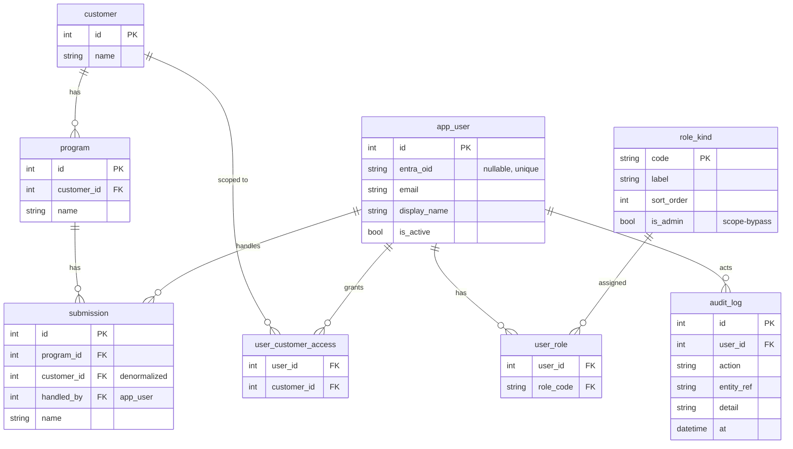
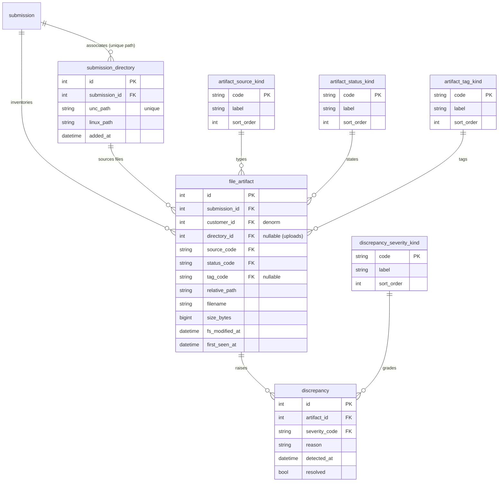
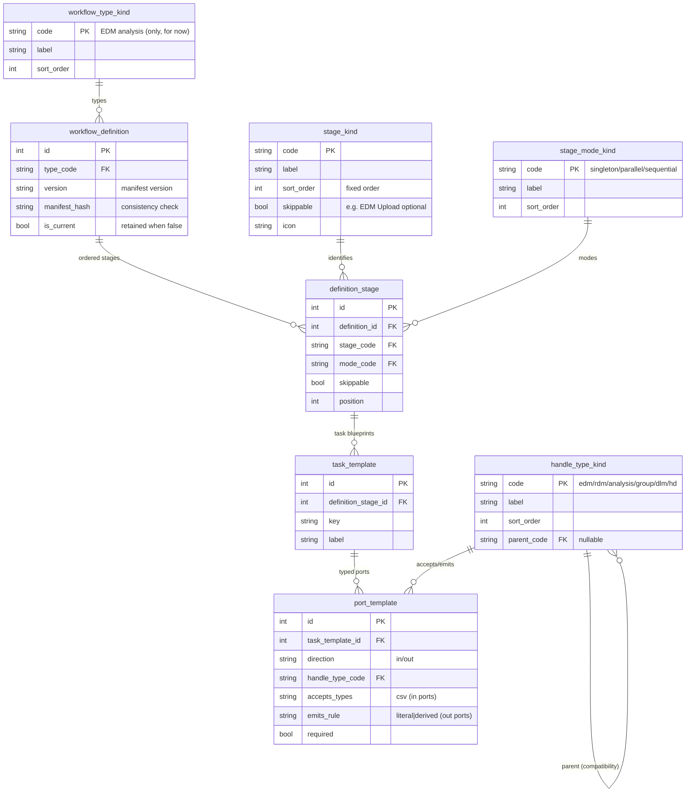
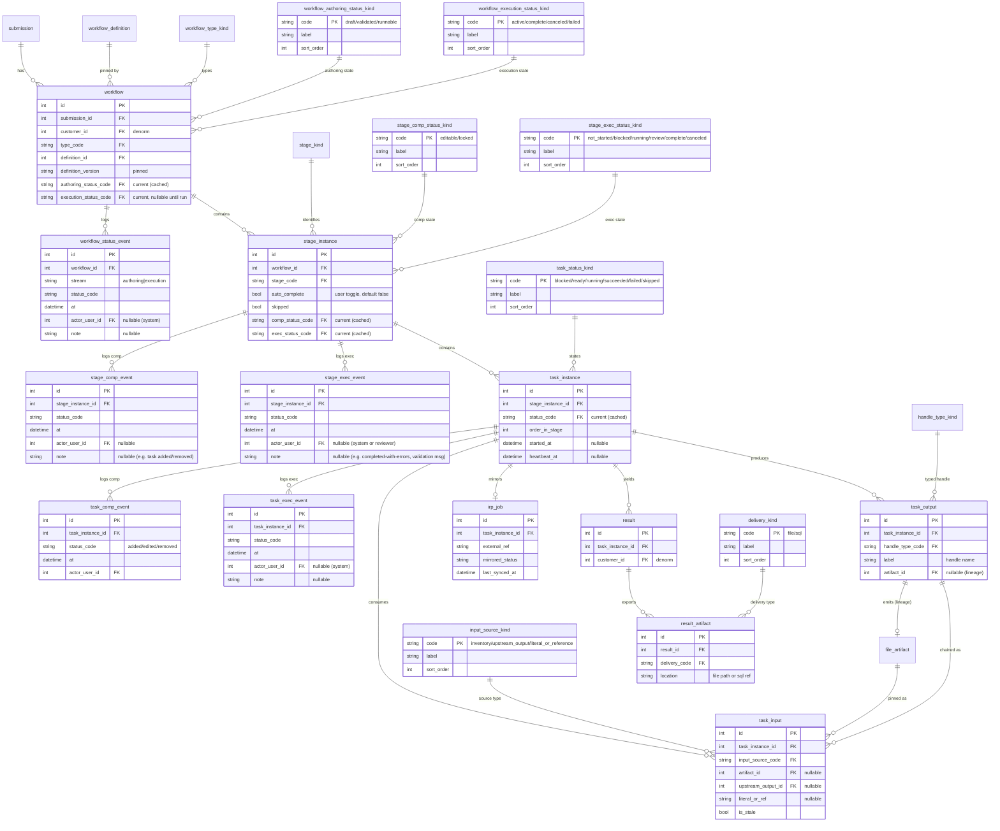
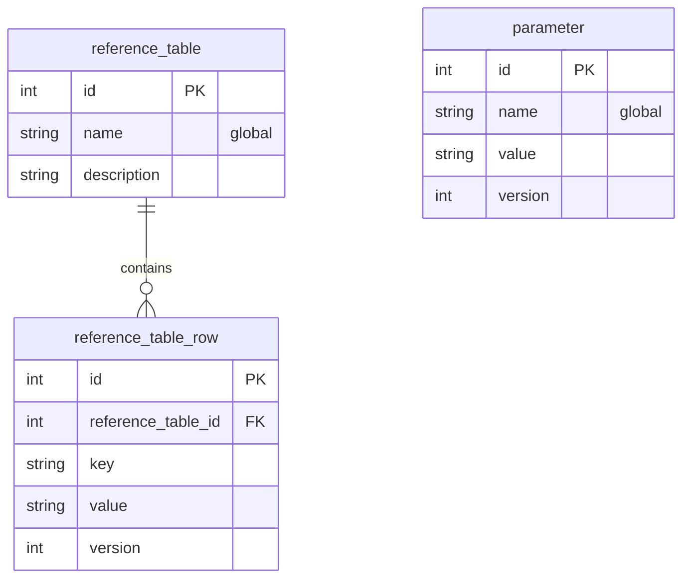

# Data Model — Reinsurance Cat-Modeling Workflow Tool

Companion to `PRD.md`. This is the schema reference Claude Code turns into migrations.

**Conventions (apply to every table):**
- **Kind tables** (`*_kind`) hold categorical values. Every kind table has: `code` (PK, stable string), `label` (display), `sort_order` (int), and optional `icon`, `color`, `is_active`. Categorical columns are **FKs to kind tables — never enums.** DB is the single source of truth for values/labels/ordering; the validator's *behavior* for semantic kinds (stage mode, handle type) lives in the code manifest and is **seeded into** these tables.
- **RLS:** `customer_id` is **denormalized** onto every major entity (set once at creation, immutable) so `apply_scope()` is a one-column predicate.
- **Naming:** singular `snake_case` table names; `id` surrogate PK unless noted; `*_code` columns are FKs to the matching `*_kind` table; `*_id` are FKs to entities.
- **Projected tables are generated, never hand-edited.** Tables marked **projected** (the workflow-definition graph) are a derived build artifact of the canonical **code manifest**, written only by the projection generator and guarded by a fail-fast startup content-hash check; projection is append-only and version-retained while instances pin (§2.3, PRD §9.1a). Same canonical-source-plus-cache discipline as event-sourced status.
- **Artifacts are append-only:** a changed file inserts a new `file_artifact` row; the prior row is retained.
- **Status is event-sourced (insert-only) with a cached current.** Lifecycle/status changes on `submission`, `workflow`, `stage_instance`, and `task_instance` are **never `UPDATE`-d in place.** Each transition **inserts** a row into the relevant `*_event` table (`who`, `what`, `when`, optional `note`), and **in the same transaction** stamps the denormalized `current_*_status` column on the parent. The event tables are the full history + audit trail; the cached column gives O(1) reads (list/detail pages read the column, never a recompute-on-read view). A single repository method (or trigger) owns "append event + update current" so the two can't drift. Reporting/history screens may read the event tables directly. **Stages and tasks keep two independent event streams** — *composition* (editing) and *execution* (runtime) — so editability and run-state never entangle.

---

## 1. Mermaid ER source

### 1.1 Auth & business spine

### 1.2 File inventory subsystem

### 1.3 Workflow — definition side (manifest-projected, seed/reference)

### 1.4 Workflow — instance side (runtime) + IRP + results

### 1.5 Reference data & parameters (global)

---

## 2. Table manifest

Legend — **Type:** entity (transactional) · kind (categorical lookup) · projected (seeded from code manifest) · link (junction).

### 2.1 Auth & business spine

| Table | Type | Purpose | Key columns / FKs | Review notes |
|---|---|---|---|---|
| `customer` | entity | Top of the business hierarchy; RLS root. | `id` | All `customer_id` denorm values originate here. |
| `program` | entity | Program within a customer. | `customer_id`→customer | — |
| `submission` | entity | Broker package handled by a user; anchors directories, artifacts, workflows. | `program_id`, `customer_id` (denorm), `handled_by`→app_user | Carries `customer_id` directly for scope. |
| `app_user` | entity | Provisioned user (Entra `oid` or backdoor — both real users). | `entra_oid` (nullable, unique) | Identity only; **no roles stored here**. |
| `role_kind` | kind | Global role vocabulary. | `code`, `is_admin` | `is_admin=true` row(s) drive the `apply_scope()` bypass. Confirm which codes. |
| `user_role` | link | User↔role assignment. | `user_id`, `role_code` | Global roles in v1. |
| `user_customer_access` | link | RLS: customers a user may access. | `user_id`, `customer_id` | Maintained in admin screens; read live per request. |
| `audit_log` | entity | Who did what, when. | `user_id`, `action`, `entity_ref` | Mandatory for backdoor + state-changing actions. |

### 2.2 File inventory

| Table | Type | Purpose | Key columns / FKs | Review notes |
|---|---|---|---|---|
| `submission_directory` | entity | Shared-drive folder linked to a submission. | `submission_id`, `unc_path` **unique**, `linux_path` | UNIQUE(path) ⇒ a directory can't belong to two submissions. Read-only mount. |
| `file_artifact` | entity | One **immutable version** of a file (shared-drive / upload / workflow output). | `source_code`, `status_code`, `tag_code` (nullable), `directory_id` (nullable), `customer_id` (denorm), `relative_path`, `size_bytes`, `fs_modified_at` | **Append-only.** Identity = **cheap metadata signature** `(relative_path, size_bytes, fs_modified_at)` — **no content hash** (dropped: too expensive; identity is best-effort, PRD §8.2). A detected change retains the old row and inserts a new one. |
| `artifact_source_kind` | kind | `shared_drive` / `upload` / `workflow_output`. | `code` | One artifact store, three sources. |
| `artifact_status_kind` | kind | `present` / `changed` / `missing`. | `code` | — |
| `artifact_tag_kind` | kind | `edm` / `rdm` (none = no row). | `code` | User-applied; tagged artifacts are workflow-selectable. |
| `discrepancy` | entity | Flagged change/missing on a tracked file. | `artifact_id`, `severity_code` | Severity escalates if tagged / workflow-referenced. |
| `discrepancy_severity_kind` | kind | `info` / `warning` / `critical`. | `code`, `sort_order` | Ordering is meaningful (escalation). |

### 2.3 Workflow — definition (manifest-projected)

> **Projection rule (PRD §9.1a).** The tables marked **projected** below are a *generated build artifact* of the canonical **code manifest**, written **only** by the projection generator — **never hand-edited**. A fail-fast **startup consistency check** compares a content-hash of the live manifest against the hash the projection was built from and refuses to start on mismatch. Projection is **append-only / version-retained**: a new manifest version **inserts** new `(definition_id, version)` rows and never deletes prior ones; old versions are kept while **any `workflow` instance pins them** (GC only when unreferenced), so a pinned in-flight/historical instance is never orphaned.

| Table | Type | Purpose | Key columns / FKs | Review notes |
|---|---|---|---|---|
| `workflow_type_kind` | kind | Workflow types. **Seeded with `EDM analysis` only.** Type drives the stage set and the allowed input(s), resolved in code per the definition manifest (no dynamic stage creation). | `code` | More types later = manifest + seed, no schema change. |
| `workflow_definition` | projected | A versioned definition. | `type_code`, `version`, `is_current`, `manifest_hash` | **Generated from the code manifest; never hand-edited.** `manifest_hash` is the content-hash checked at startup. `is_current` flags the live version for *new* instances; **non-current rows are retained** while any instance pins their `version`. Instances pin `version`. |
| `stage_kind` | kind | EDM Upload (skippable) / Portfolio Summary Extract / Sub-Portfolio Creation / Geo-coding / Hazard lookup / Analysis / Grouping / Export. | `code`, `sort_order` (**fixed order**), `skippable`, `icon` | **No HITL kind** — any stage can require review via `stage_instance.auto_complete`. Skippable (e.g. EDM Upload) but never reorderable. |
| `stage_mode_kind` | kind+behavior | `singleton`/`parallel`/`sequential`. | `code` | Values in DB; **mode behavior in manifest** (drives validator). |
| `definition_stage` | projected | Stages within a definition (order, mode, skippable). | `definition_id`, `stage_code`, `mode_code`, `skippable`, `position` | Generated; retained per definition version (keyed by `definition_id` → its `version`). |
| `task_template` | projected | Task blueprint within a definition stage. | `definition_stage_id`, `key` | Generated; retained with its definition version. |
| `port_template` | projected | Typed input/output ports of a task template. | `direction`, `handle_type_code`, `accepts_types`, `emits_rule`, `required` | `emits_rule` = `literal`/`derived` (type propagation). Generated; retained with its definition version. |
| `handle_type_kind` | kind+registry | Handle type registry. | `code`, `parent_code` (self-FK) | edm/rdm/analysis/group/dlm/hd seeded; **no enum in code**; single-parent compatibility only. |

### 2.4 Workflow — instance (runtime)

| Table | Type | Purpose | Key columns / FKs | Review notes |
|---|---|---|---|---|
| `workflow` | entity | A workflow instance under a submission. | `definition_id`, `definition_version` (**pinned**), `type_code`, `authoring_status_code`, `execution_status_code` (nullable), `customer_id` (denorm) | **Two status columns** (authoring vs execution), each a **cached "current"** of the latest `workflow_status_event` row, written in the same transaction. |
| `workflow_status_event` | event | Append-only lifecycle log (authoring + execution streams). | `workflow_id`, `stream`, `status_code`, `at`, `actor_user_id` (nullable), `note` | **Insert-only**; current status on `workflow` is the latest event. History/audit lives here — never `UPDATE` status in place. |
| `workflow_authoring_status_kind` | kind | `draft`/`validated`/`runnable`. | `code`, `sort_order` | External/IRP checks gate `validated`. |
| `workflow_execution_status_kind` | kind | `active`/`complete`/`canceled`/`failed`. | `code`, `sort_order` | `canceled` = a reviewer canceled a stage (≠ technical `failed`). |
| `stage_instance` | entity | A stage within a workflow instance. | `workflow_id`, `stage_code`, `auto_complete` (bool, default false), `skipped`, `comp_status_code`, `exec_status_code` | **No HITL kind** — review is generic. Two cached current statuses (composition + execution), each the latest of its event stream. `exec` ∈ not_started/blocked/running/review/complete/canceled. **`ERROR` is a dynamic rollup** (any task failed), not a stored status — so a `complete`/`canceled` stage can also read "with errors". When work finishes: `auto_complete=false` ⇒ `review`, else `complete`. |
| `stage_comp_status_kind` | kind | `editable`/`locked`. | `code`, `sort_order` | `editable` while `exec=not_started` ⇒ task CRUD allowed (per-stage). |
| `stage_exec_status_kind` | kind | `not_started`/`blocked`/`running`/`review`/`complete`/`canceled`. | `code`, `sort_order` | `blocked` is a gate carrying a validation result (slot only for now — checks are future). `review` + `blocked` are the **active gates** counted by the Review queue; `canceled` halts the workflow. |
| `stage_comp_event` / `stage_exec_event` | event | Append-only per-stage logs (composition, execution). | `stage_instance_id`, `status_code`, `at`, `actor_user_id` (nullable), `note` | Insert-only. `note` captures e.g. *completed-with-errors* (audited), validation message, task add/remove. |
| `task_instance` | entity | Executable unit = **the queue/job row**. | `stage_instance_id`, `status_code` (cached current), `order_in_stage`, `started_at`, `heartbeat_at` | Single-worker plain dequeue; `order_in_stage` + sequential mode enforce intra-stage chaining. |
| `task_comp_event` / `task_exec_event` | event | Append-only per-task logs (composition: added/edited/removed; execution: status). | `task_instance_id`, `status_code`, `at`, `actor_user_id` | Insert-only; task `status_code` is the latest exec event. |
| `task_status_kind` | kind | `blocked`/`ready`/`running`/`succeeded`/`failed`/`skipped`. | `code` | `blocked→ready` computed from input resolution. |
| `task_input` | entity | A bound input port → its resolved source (one of three). | `input_source_code`, `artifact_id` (nullable), `upstream_output_id` (nullable), `literal_or_ref` (nullable), `is_stale` | Exactly one source populated. `is_stale` = upstream re-run (A1). |
| `input_source_kind` | kind | `inventory`/`upstream_output`/`literal_or_reference`. | `code` | — |
| `task_output` | entity | A produced output port = a typed **handle** + a lineage artifact. | `handle_type_code`, `label`, `artifact_id` (nullable) | Double duty: chaining handle + emitted `file_artifact`. |

### 2.5 IRP & results

| Table | Type | Purpose | Key columns / FKs | Review notes |
|---|---|---|---|---|
| `irp_job` | entity | Local mirror of an IRP-side job. | `task_instance_id`, `external_ref`, `mirrored_status`, `last_synced_at` | Worker submit-then-poll; IRP owns execution, this mirrors state. |
| `result` | entity | Output of a job, hung off a task. | `task_instance_id`, `customer_id` (denorm) | Provenance traces to pinned input artifacts. |
| `result_artifact` | entity | Exported result deliverable. | `result_id`, `delivery_code`, `location` | Supports both paths: staged file(s)→consolidated deliverable, or load-to-SQL. |
| `delivery_kind` | kind | `file` / `sql`. | `code` | Both required for business users. |

### 2.6 Reference data & parameters

| Table | Type | Purpose | Key columns / FKs | Review notes |
|---|---|---|---|---|
| `reference_table` | entity | A named reference list (**global**). | `id`, `name` | Global for access; client-specific values modeled as separate parameters for now. |
| `reference_table_row` | entity | Rows/values in a reference table. | `reference_table_id`, `key`, `value`, `version` | `version` for pin-on-use as a workflow input. |
| `parameter` | entity | Named parameter value (**global**). | `name`, `value`, `version` | Pinnable version when used as input source #3. |

---

## 3. Kind-table seed checklist
Every `*_kind` ships seeded (code/label/sort_order, + icon/color where useful):
`role_kind`, `artifact_source_kind`, `artifact_status_kind`, `artifact_tag_kind`, `discrepancy_severity_kind`, `workflow_type_kind` (**seed: `EDM analysis` only**), `stage_kind` (with `skippable`), `stage_comp_status_kind`, `stage_exec_status_kind`, `stage_mode_kind`, `handle_type_kind`, `workflow_authoring_status_kind`, `workflow_execution_status_kind` (incl. `canceled`), `task_status_kind`, `input_source_kind`, `delivery_kind`.

Semantic kinds (`stage_mode_kind`, `handle_type_kind`) and the projected definition tables are **seeded from the code manifest** so DB values and engine behavior never drift.

---

## 4. Open data-model decisions (mirror of PRD §18)
- Concrete `role_kind` codes + which is `is_admin`.
- `reference_table` / `parameter` — confirmed **global** for access; revisit if client-specific scoping becomes structural rather than separate-parameter.
- Whether `irp_sync_log` is worth a dedicated table (debugging the mirror) or folds into `audit_log`.
- Nested directory paths across submissions: `UNIQUE(unc_path)` allows `/a` and `/a/b` on different submissions (accepted v1 limitation).
