# Data Model — Risk Workbench

Companion to `PRD.md`. This is the schema reference Claude Code turns into migrations.

---

## Database connections

**All database access goes through the `db/` package** (`db/connection.py`). App code calls `get_connection("WORKBENCH")`, `get_connection("EXPOSURE")`, `get_connection("LOSS")`, `get_connection("DATABRIDGE")`. No URL strings in application code. Connection pooling, Kerberos renewal, and pool sizing are handled by the package.

Each named connection is configured via `MSSQL_{NAME}_*` env vars:

| Named connection | Database | Managed by | Env var prefix |
|---|---|---|---|
| `WORKBENCH` | Workbench Metamodel DB | Alembic + app | `MSSQL_WORKBENCH_*` |
| `EXPOSURE` | Exposure Repository | App (schema defined in this project) | `MSSQL_EXPOSURE_*` |
| `LOSS` | Loss Repository | App (schema defined in this project) | `MSSQL_LOSS_*` |
| `DATABRIDGE` | DataBridge (Moody's cloud) | Moody's — app never runs DDL | `MSSQL_DATABRIDGE_*` |

Required vars per connection: `MSSQL_{NAME}_SERVER`, `MSSQL_{NAME}_USER`, `MSSQL_{NAME}_PASSWORD`, `MSSQL_{NAME}_DATABASE`. Optional: `MSSQL_{NAME}_PORT` (default 1433), `MSSQL_{NAME}_AUTH_TYPE` (default `SQL`).

Global pool settings (apply across all connections): `MSSQL_POOL_SIZE` (default 5), `MSSQL_POOL_MAX_OVERFLOW` (default 5), `MSSQL_POOL_RECYCLE` (default 1800s). **For 30 concurrent users:** set `MSSQL_POOL_SIZE=10`, `MSSQL_POOL_MAX_OVERFLOW=20`.

**Local dev:** One SQL Server Docker container (`docker run mcr.microsoft.com/mssql/server`) hosts three databases (`rwb_workbench`, `rwb_exposure`, `rwb_loss`). The three named connections point to the same server with different `MSSQL_{NAME}_DATABASE` values. All other processes (app, nginx, Redis, poller, Dramatiq workers) run natively on Linux — not in Docker.

**Dev DB strategy — drop-create-seed.** Until production cutover (or significant data risk in dev), the dev workflow is full drop-and-recreate via a single Alembic revision (`0001_initial.py`) that drops all tables, creates them fresh, and seeds all kind tables. No accumulation of migration versions in dev. Migration history starts at production cutover.

**Per-iteration DB lifecycle prompt.** Before every iteration that touches schema or seeds, the builder MUST ask the analyst to choose for each affected app-managed database (`WORKBENCH`, `EXPOSURE`, `LOSS`):
- **Rebuild** — drop all tables, recreate schema, re-seed. All data lost. Recommended default in dev.
- **Refresh** — apply only additive changes (new tables, columns, seeds). Existing data preserved where possible.
- **Skip** — no schema changes for this DB in this iteration.

`DATABRIDGE` is Moody's managed schema and is **never** touched by this prompt or by any app-managed migration/bootstrap script.

**Redis:** `REDIS_URL` env var (default `redis://localhost:6379/0`). Dramatiq broker. Runs natively on Linux (`redis-server`); not in Docker. Stateless — losing it loses in-flight work items, not written results.

---

## Conventions (apply to every table)

- **Kind tables** (`*_kind`) hold categorical values: `code` (PK, stable string), `label`, `sort_order`, optional `icon`/`color`/`is_active`. Categorical columns are FKs to kind tables — never DB enums.
- **RLS:** `customer_id` is **denormalized** onto every major entity (set once at creation, immutable) so `apply_scope()` is a single-column predicate.
- **Audit fields on every table:** `inserted_at` (DATETIME, server default), `updated_at` (DATETIME, bumped on every flush), `inserted_by` (FK → `app_user`, nullable for system-generated rows), `updated_by` (FK → `app_user`, nullable). Kind tables and projected tables are exempt — they have only `inserted_at`.
- **Naming:** singular `snake_case` table names; `id` surrogate PK (UNIQUEIDENTIFIER) unless noted; `*_code` FK to matching `*_kind`; `*_id` FK to entity.
- **Projected tables are generated, never hand-edited.** Tables marked **projected** are a build artifact of the canonical code manifest, written only by the projection generator and guarded by a fail-fast startup content-hash check. Projection is append-only and version-retained while any workflow instance pins a prior version.
- **Artifacts are append-only.** A changed file inserts a new `file_artifact` row; the old row is retained.
- **Status is event-sourced (insert-only) with a cached current.** Status changes on `submission`, `workflow`, `stage_instance`, and `task_instance` insert a row into the matching `*_event` table and in the same transaction stamp the cached `current_*_status` column. Stages and tasks keep two independent event streams — composition and execution.
- **Multi-statement transactions for event-sourced status.** `execute_command()` in `db/execute.py` uses `engine.begin()` — it commits one statement and is not usable for two-DML operations. Event-sourced writes (append event row + stamp cached status) **must** use `get_connection("WORKBENCH")` as a context manager with an explicit transaction: `with get_connection("WORKBENCH") as conn: with conn.begin(): conn.execute(insert_event); conn.execute(update_cached_status)`. Never split these two writes across separate `execute_command()` calls — a crash between them leaves the event log and cached status inconsistent.
- **EXPOSURE and LOSS schema bootstrap.** These databases are not managed by Alembic (which targets `WORKBENCH` only). Their schemas are defined in `db/bootstrap/exposure_schema.sql` and `db/bootstrap/loss_schema.sql`. Bootstrap via: `python -m app.cli bootstrap-exposure` and `python -m app.cli bootstrap-loss`. These commands are idempotent (`CREATE TABLE IF NOT EXISTS`). Run once per environment before starting the app. Local dev: run after `docker compose up` creates the SQL Server container.

---

## 1. Auth & business spine

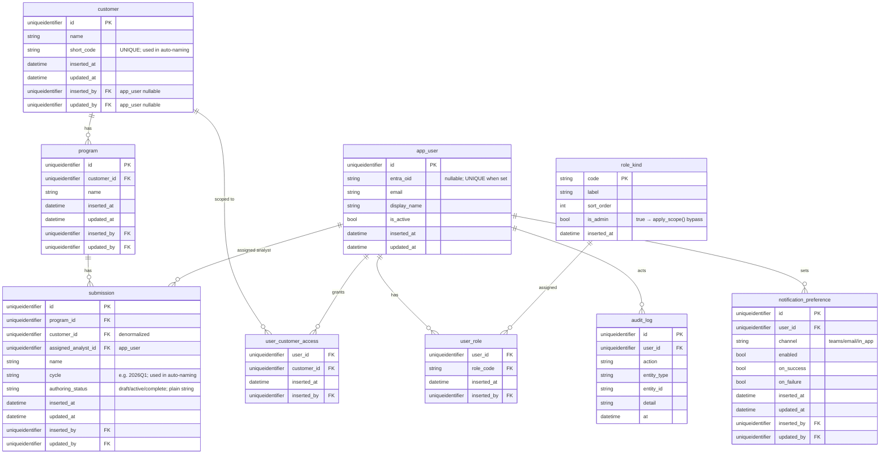

**Notes:**
- `customer.short_code` has a UNIQUE constraint. Used in auto-naming patterns (e.g. `{{ customer.short_code }}-{{ submission.cycle }}-{{ template.region_label }}`).
- "My submissions" view = `WHERE assigned_analyst_id = current_user.id`.
- `submission.authoring_status` is a plain string column (not a kind table FK) — it is simple enough that a lookup table adds no value.

---

## 2. File inventory

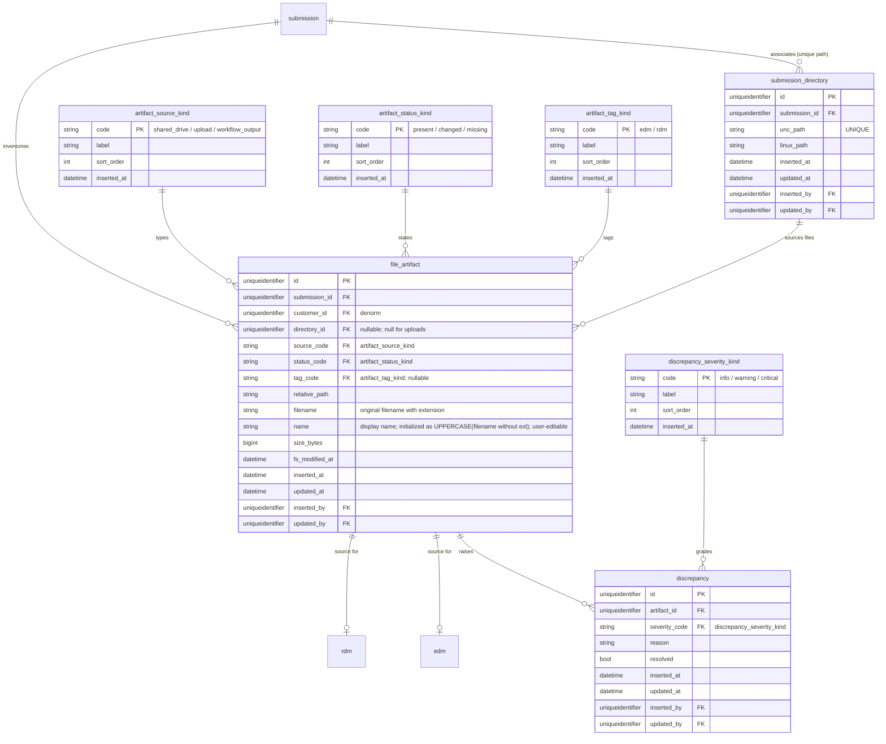

**`file_artifact` identity triple:** `UNIQUE(submission_id, relative_path, size_bytes, fs_modified_at)`. A file is considered a new version when any of these four values differs from all existing rows for the same `(submission_id, relative_path)`. The UNIQUE constraint prevents duplicate rows if the scanner runs twice before a status flip. Note: `submission_id` is included because the same relative path can appear in different submissions.

**`file_artifact.name` behavior:**
- Initialized as `filename` with extension stripped, converted to UPPERCASE (e.g. `XYZ_EDM_2026.bak` → `XYZ_EDM_2026`).
- User can edit this name at any time.
- When a file is tagged as `edm` or `rdm` (on tag action), and when `name` is changed: the app calls `client.edm.search_edms()` / `client.rdm.search_rdms()` to check whether that name already exists in IRP. If it does, the user is warned before proceeding. This check is non-blocking (user can override) but is always performed.
- `file_artifact.name` becomes the initial `edm.name` or `rdm.name` when the EDM/RDM entity is created from this artifact.

---

## 3. EDM & RDM entities

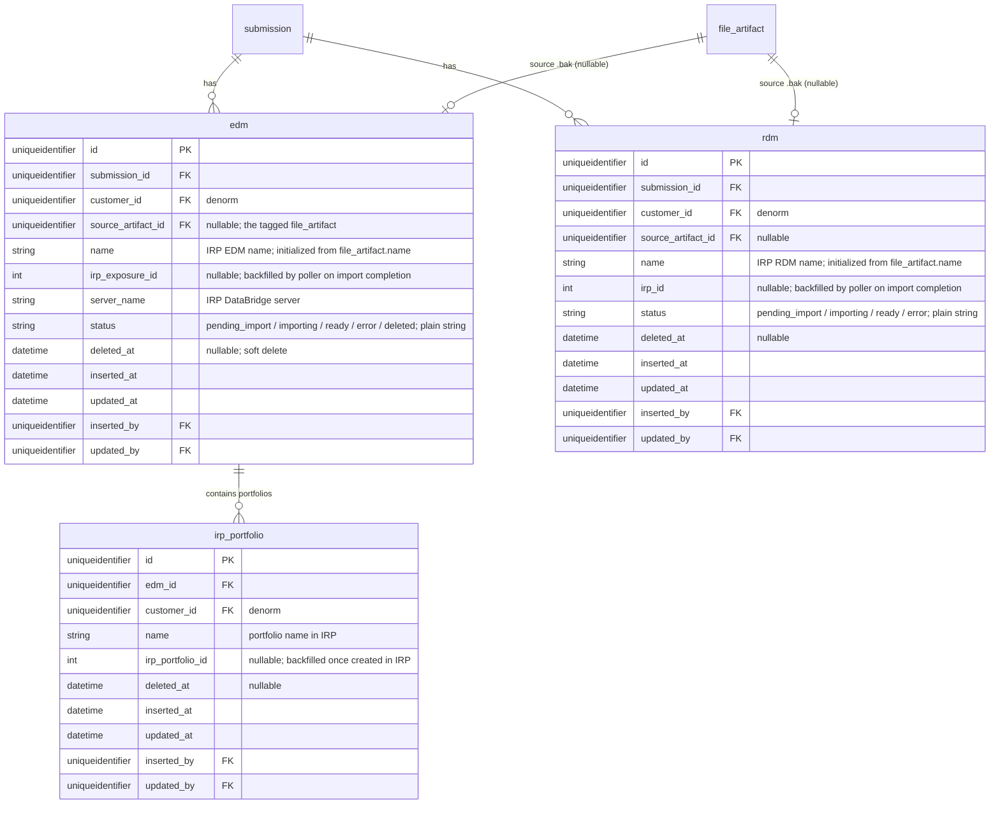

**EDM/RDM name initialization:**
- When an analyst tags a `file_artifact` as `edm` or `rdm`, the app creates an `edm` or `rdm` row with `name = file_artifact.name`.
- This name is what gets submitted to IRP. If the name already exists in IRP (checked on tagging), the analyst is warned and can rename before import.

**`irp_portfolio`:**
- Created when the Portfolio Creation stage runs (via `client.portfolio.create_portfolio()`).
- `name` is the portfolio name as it exists in IRP (e.g. `All Accounts`, `EQ Only`).
- `irp_portfolio_id` is written **synchronously on the request path** — `create_portfolio()` returns `(portfolio_id, request_body)` immediately (IRP responds with HTTP 201 + Location header). The service writes `irp_portfolio_id` in the same transaction as the `irp_portfolio` insert. The poller is not involved.
- Analyst picks a portfolio from a dropdown (populated from this table filtered by `edm_id`) when configuring an analysis task.

---

## 4. Analysis templates & suites

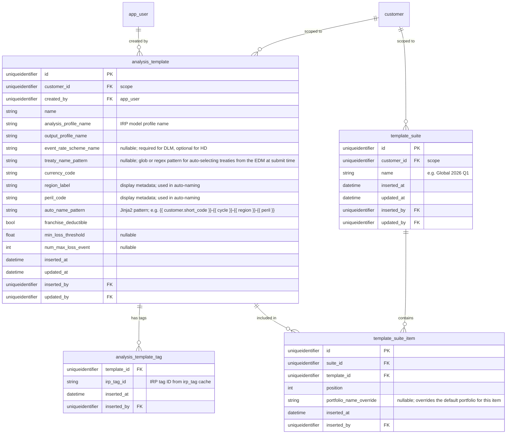

**`analysis_template` design basis:**
- `analysis_profile_name`, `output_profile_name`, `event_rate_scheme_name` come directly from `client.analysis.submit_portfolio_analysis_job()` parameters in irp-integration.
- `event_rate_scheme_name` is required for DLM analysis, optional for HD. DLM vs HD is detected at batch-apply time from `irp_model_profile.software_version_code` (`"HD" in code → HD, else DLM`).
- `treaty_name_pattern` is an optional glob or regex pattern used at submit time to auto-select treaty names from the EDM via `client.treaty.search_treaties()`. Matching treaty names are resolved to IRP treaty IDs and included in the analysis job request. Null means no treaties are auto-selected (analyst may configure manually or use template tags instead).
- `auto_name_pattern` is evaluated at batch-apply time against submission context to generate the `job_name` for each submitted analysis. Without this, analysts must manually name 50–150+ jobs.
- Tags are stored in `analysis_template_tag` (junction table, not inline). The `irp_tag_id` references the IRP tag as synced into `irp_tag` cache.

---

## 5. Phase A — DataBridge validation results

Validation queries run via `client.databridge` against an imported EDM. Results can be thousands of rows — too large for a SQL column. Metadata is stored in SQL; row-level output is written to Parquet files under the submission's output directory.

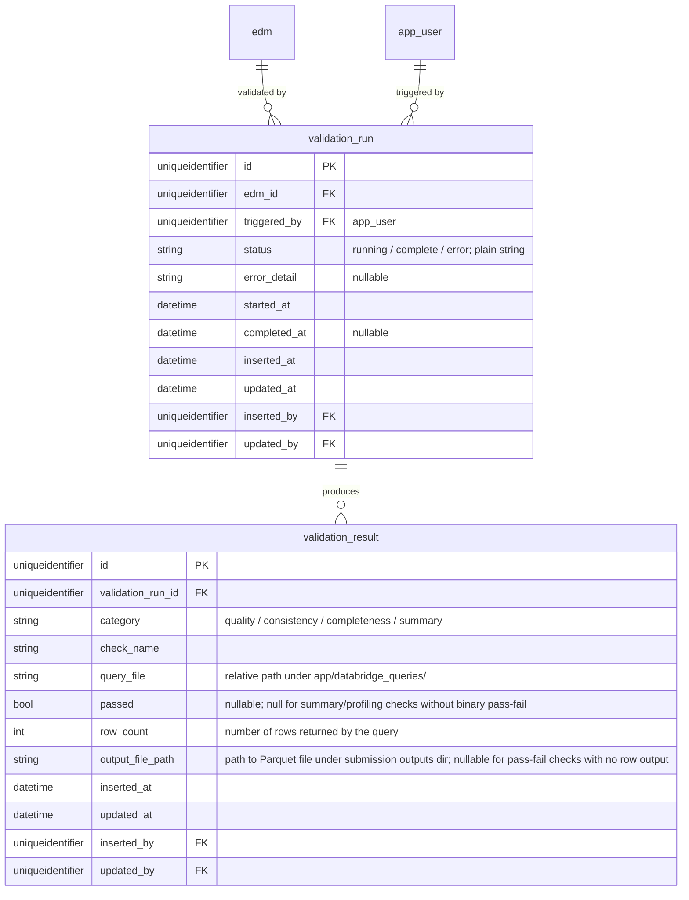

**Parquet file location:** `{submission_outputs_dir}/{validation_run.id}/{check_name}.parquet`

The `output_file_path` stores the relative path from the submission outputs root. The UI reads the Parquet file for detailed drill-down; the SQL row is used for the summary/pass-fail display.

---

## 6. Workflow — definition (manifest-projected)

> **Projection rule (PRD §12.1a).** These tables are generated from the code manifest and never hand-edited. A fail-fast startup consistency check (manifest content-hash vs. stored hash) refuses to start on mismatch. Projection is append-only and version-retained while any instance pins a prior version.

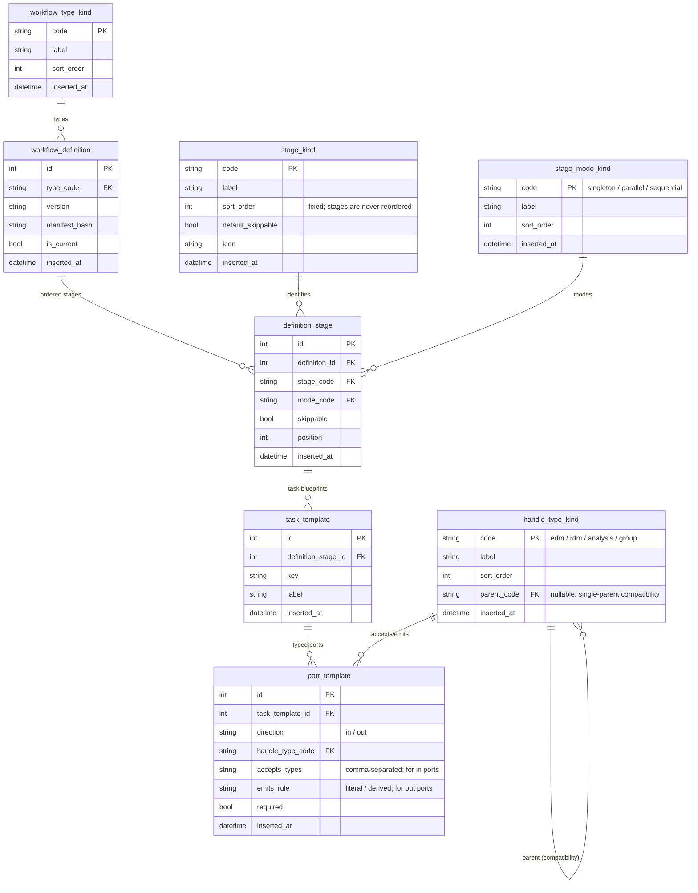

**`workflow_type_kind` seeds:**

| code | label | Notes |
|---|---|---|
| `edm_analysis` | EDM Analysis | Phase A → B → C: data setup, analysis, results |
| `rdm_import` | RDM Import | Standalone broker RDM import (outside the full EDM analysis flow) |
| `edm_import_only` | EDM Import Only | Import and validate an EDM without proceeding to analysis |

The three-phase full workflow is `edm_analysis`. `rdm_import` and `edm_import_only` are lighter-weight workflows for analysts who need just one step. Additional types are a manifest + seed change, no schema change.

**`stage_kind` seeds (fixed order):**

| code | position | default_skippable | mode |
|---|---|---|---|
| `edm_upload` | 1 | true | singleton |
| `data_validation_profiling` | 2 | true | sequential |
| `exposure_modification` | 3 | true | sequential |
| `portfolio_creation` | 4 | false | sequential |
| `geocoding_hazard` | 5 | true | parallel |
| `analysis` | 6 | false | parallel |
| `grouping` | 7 | true | sequential |
| `export` | 8 | true | parallel |

**`handle_type_kind` seeds:** `edm`, `rdm`, `analysis`, `group`. **`dlm` and `hd` are NOT handle types** — DLM vs HD is an analysis-profile property (`software_version_code`), not a file or handle attribute.

---

## 7. Workflow — instance (runtime)

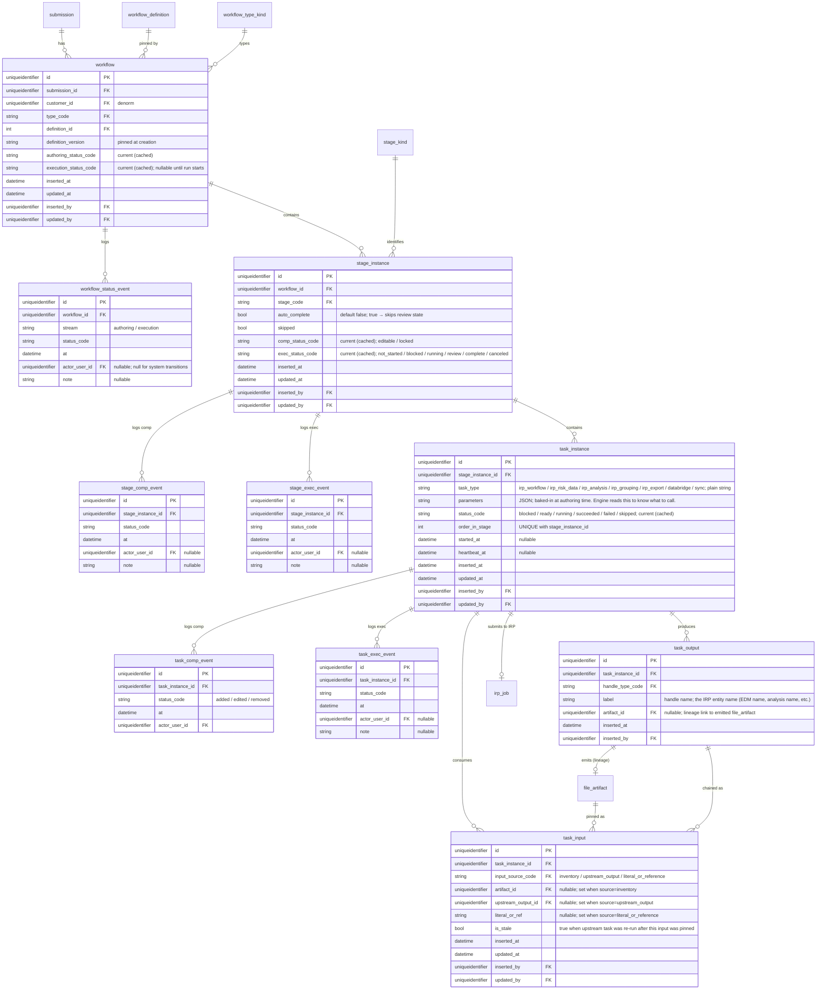

**`task_instance.task_type`** tells the engine what to execute. Values:

| `task_type` | What the engine does |
|---|---|
| `irp_workflow` | Calls the `workflow` IRP submit function; creates an `irp_job` row |
| `irp_risk_data` | Calls the `risk_data_job` IRP submit function; creates an `irp_job` row |
| `irp_analysis` | Calls `submit_portfolio_analysis_job(s)` (single or batch); creates `irp_job` row(s) |
| `irp_grouping` | Calls `submit_analysis_grouping_job`; creates an `irp_job` row |
| `irp_export` | Calls `submit_analysis_export_job`; creates an `irp_job` row |
| `databridge` | Executes a DataBridge SQL query via `client.databridge`; no IRP job. Marks task `succeeded`/`failed` on request path. |
| `sync` | Calls a synchronous IRP library method (e.g. `create_portfolio`); no IRP job. Marks task `succeeded`/`failed` on request path. |

**`task_instance.parameters`** is a JSON object baked in at workflow-authoring time. The engine is a dumb executor — it reads `task_type`, deserializes `parameters`, calls the right function with those arguments. No reconstruction from `task_input` rows needed for dispatch. Example for an `irp_analysis` task: `{"edm_name": "XYZ_EDM_2026", "portfolio_name": "All Accounts", "job_name": "XYZ-2026Q1-NA-EQ", "analysis_profile_name": "DLM_NA_EQ_v5", ...}`.

**UNIQUE constraint:** `UNIQUE(stage_instance_id, order_in_stage)`. Enforces unambiguous positional mapping for batch analysis submission — `order_in_stage` is the index into the `List[int]` returned by `submit_portfolio_analysis_jobs()`.

---

## 8. IRP jobs & RWB jobs

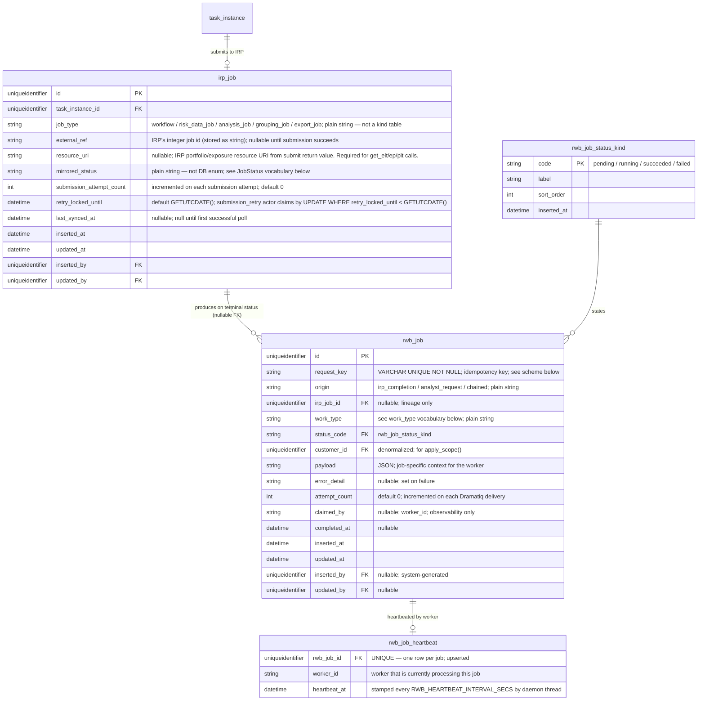

**`irp_job.job_type`** is a plain string column, not a FK to a kind table. New IRP job types never require a seed migration to unblock the poller.

**`irp_job.resource_uri`** is the portfolio/exposure resource URI returned by `submit_portfolio_analysis_job()` in `request_body["resourceUri"]`. Must be stored at submission time — it is not returned in the job completion response. The `retrieve_analysis_results` worker reads this to call `get_elt(analysis_id, perspective_code, exposure_resource_id)`.

**`irp_job.retry_locked_until`** defaults to `GETUTCDATE()` (immediately claimable). The `submission_retry` actor claims by: `UPDATE irp_job SET retry_locked_until = DATEADD(minute, 15, GETUTCDATE()), submission_attempt_count = submission_attempt_count + 1 WHERE id = :id AND retry_locked_until < GETUTCDATE() AND submission_attempt_count < :max`. Only one actor wins; concurrent actors that lose the race skip silently.

**`irp_job.mirrored_status`** is a plain string, not a DB enum. Full vocabulary:
- Non-terminal (from IRP): `QUEUED`, `PENDING`, `RUNNING`, `CANCEL_REQUESTED`, `CANCELLING`
- Terminal (from IRP): `FINISHED`, `FAILED`, `CANCELLED`
- App-local: `submission_failed` — IRP API call failed; `external_ref` is null; poller skips these rows; `submission_retry` Dramatiq actor handles re-attempts
- Terminal ≠ success. Callers must check `status == 'FINISHED'` explicitly.

**`rwb_job.request_key`** is a VARCHAR UNIQUE NOT NULL idempotency key. Computed by the producer from lineage:
- `origin=irp_completion`: `irp:{irp_job_id}:{work_type}`
- `origin=analyst_request`: `analyst:{entity_type}:{entity_id}:{work_type}`
- `origin=chained`: `chain:{parent_rwb_job_id}:{work_type}`

**`rwb_job` creation:** idempotent `INSERT ... WHERE NOT EXISTS (request_key)`. `irp_job_id` is nullable — non-IRP rows (analyst-request, chained) have no `irp_job` parent. `UNIQUE(request_key)` is the dedup constraint; the old `UNIQUE(irp_job_id, work_type)` is dropped.

**`rwb_job_heartbeat`** has a UNIQUE constraint on `rwb_job_id` (one row per job). Upserted by the daemon heartbeat thread every `RWB_HEARTBEAT_INTERVAL_SECS`. Kept in a child table to isolate heartbeat churn from the main `rwb_job` row and from any event stream.

**Atomic claim:** `UPDATE rwb_job SET status='running', claimed_by=:worker_id WHERE id=:id AND status='pending'`. Rowcount 0 = already claimed → ack and drop silently. No owner token or lease; `claimed_by` is observability only.

**`rwb_job.work_type` vocabulary** (plain string — not a kind table; document in worker registry, not in the DB):

| `work_type` | Written by | Chains to |
|---|---|---|
| `backfill_edm` | Poller on `FINISHED` for EDM import job | — |
| `backfill_rdm` | Poller on `FINISHED` for RDM import job | — |
| `retrieve_analysis_results` | Poller on `FINISHED` for analysis job | → `push_results_to_loss_repo` |
| `push_results_to_loss_repo` | `retrieve_analysis_results` worker on success | — |
| `push_rdm_to_loss_repo` | Poller on `FINISHED` for RDM export job | — |
| `push_exposure_summary` | Poller on explicit analyst request (`origin=analyst_request`) | — |
| `notify_analyst` | Poller on any terminal status | — |
| `download_export_file` | Poller on `FINISHED` for export job | — |

**RWB job chaining:** The poller writes only **head** rows. Workers create tail rows on success via idempotent insert on the chained `request_key`. `push_results_to_loss_repo` is never created by the poller — it is created by the `retrieve_analysis_results` worker after it successfully writes Parquet files. If `retrieve_analysis_results` fails after all Dramatiq retries, the chain stops there; `push_results_to_loss_repo` is never enqueued.

**Submission flow:** request path calls IRP API → on success writes `irp_job` with `external_ref` set, `resource_uri` set, `mirrored_status='QUEUED'`, `submission_attempt_count=1` → on failure writes `irp_job` with `external_ref=null`, `resource_uri=null`, `mirrored_status='submission_failed'`, `submission_attempt_count=1` → `submission_retry` actor claims with atomic UPDATE and retries up to `IRP_SUBMISSION_MAX_RETRIES` (default 3).

**Poller → Dramatiq flow:** Poller detects terminal `mirrored_status` → creates head `rwb_job` row(s) (`status=pending`) via idempotent insert on `request_key` → Dramatiq worker picks it up → claims atomically → starts heartbeat daemon thread → does work inside `with heartbeating(job_id, worker_id):` context → stops heartbeat → sets `status=succeeded` or `status=failed`; creates tail rows on success. Workers are idempotent; Dramatiq handles retry with backoff. Stale `running` rows (heartbeat older than `RWB_HEARTBEAT_STALE_SECS`) are recovered by the reconciler (folded into the poller) — not by a sweep timer tied to job duration.

**Event-sourcing transactions:** Status changes that append to a `*_event` table AND stamp the cached `current_*_status` column require two DML statements and must run in a single transaction. `execute_command()` (which uses `engine.begin()`) only handles a single statement. Use `get_connection("WORKBENCH")` as a context manager with manual `conn.begin()` / `conn.commit()` / `conn.rollback()` for all event-sourced status updates. Never split an event insert and a status stamp across two separate calls.

---

## 9. Analysis results (hybrid: SQL metadata + Parquet files)

Analysis results (ELT, EP curves, PLT, AAL) are retrieved from IRP via REST API after job completion by the `retrieve_analysis_results` Dramatiq worker. Row-level data (ELT events, EP curve points, PLT events) is written to Parquet files. SQL stores only the metadata needed for list views and summaries.

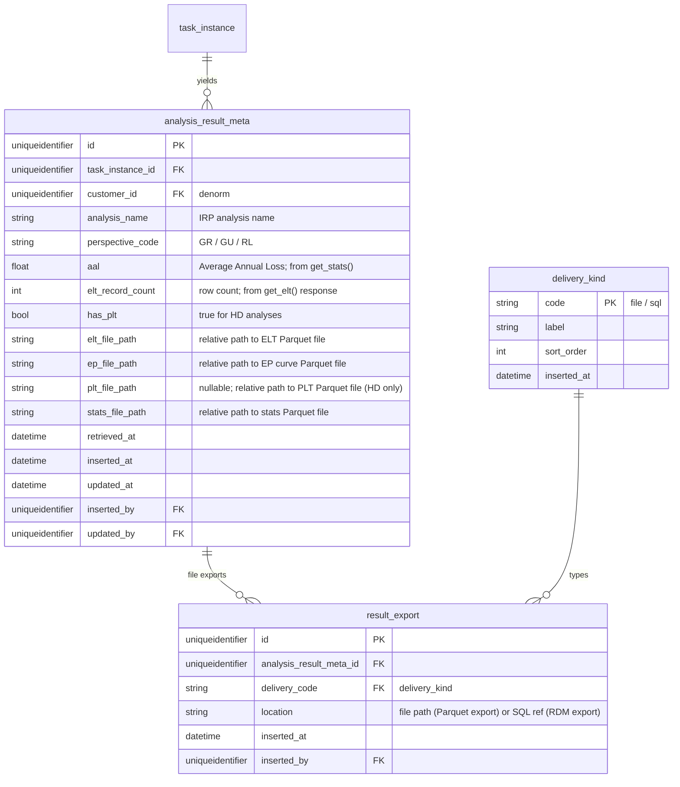

**Parquet file location convention:** `{submission_outputs_dir}/{task_instance_id}/{perspective_code}/{result_type}.parquet`

Where `result_type` ∈ `elt`, `ep`, `plt`, `stats`.

**What the Parquet files contain:** The exact column schema comes from the DataFrames returned by `client.analysis.get_elt()`, `client.analysis.get_ep()`, `client.analysis.get_stats()`, `client.analysis.get_plt()`. These columns must be confirmed against the live irp-integration library response shapes when the `retrieve_analysis_results` worker is implemented. The SQL metadata row does not attempt to replicate or pre-parse the column schema — it stores only the summary fields needed for UI list views (`aal`, `elt_record_count`, `has_plt`).

---

## 10. IRP reference cache (metadata sync)

Populated by the "Sync IRP Metadata" action. The app never writes to these tables outside of that action.

```mermaid
erDiagram
  irp_model_profile {
    uniqueidentifier id PK
    string irp_id "IRP's profile ID"
    string name
    string software_version_code "contains 'HD' → HD profile, else DLM"
    string description "nullable"
    datetime synced_at
    datetime inserted_at
    datetime updated_at
  }
  irp_output_profile {
    uniqueidentifier id PK
    string irp_id
    string name
    datetime synced_at
    datetime inserted_at
    datetime updated_at
  }
  irp_event_rate_scheme {
    uniqueidentifier id PK
    string irp_id
    string name
    string peril_code "nullable"
    string model_region_code "nullable"
    datetime synced_at
    datetime inserted_at
    datetime updated_at
  }
  irp_database_server {
    uniqueidentifier id PK
    string name "IRP server name"
    datetime synced_at
    datetime inserted_at
    datetime updated_at
  }
  irp_tag {
    uniqueidentifier id PK
    string irp_tag_id "IRP's tag ID"
    string name
    datetime synced_at
    datetime inserted_at
    datetime updated_at
  }
  irp_edm_cache {
    uniqueidentifier id PK
    string irp_exposure_id
    string name "EDM name in IRP"
    string server_name
    datetime synced_at
    datetime inserted_at
    datetime updated_at
  }
  irp_simulation_set {
    uniqueidentifier id PK
    string irp_id "IRP's simulation set ID"
    string name
    string description "nullable"
    datetime synced_at
    datetime inserted_at
    datetime updated_at
  }
  irp_currency {
    uniqueidentifier id PK
    string code "ISO 4217 currency code (e.g. USD, GBP)"
    string name
    datetime synced_at
    datetime inserted_at
    datetime updated_at
  }
```

---

## 11. Reference data & parameters (global)

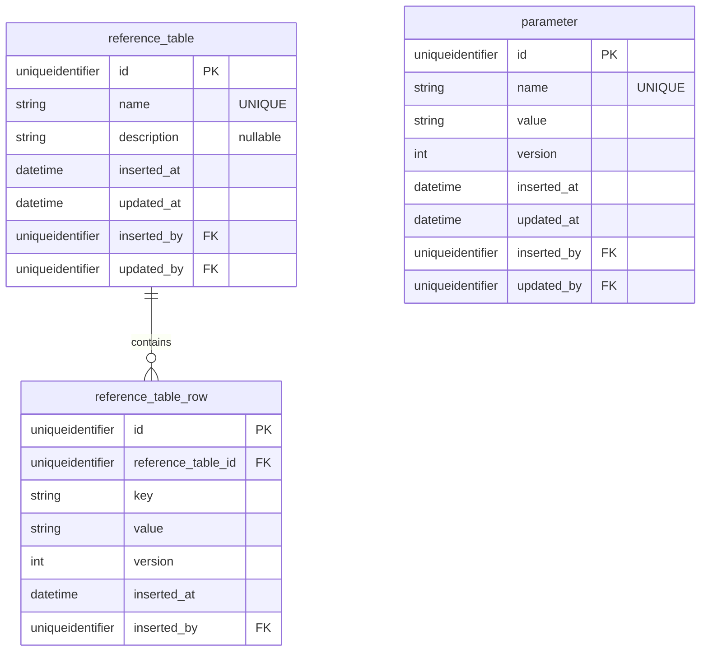

---

## 12. Table manifest

### 12.1 Auth & business spine

| Table | Purpose | Key constraints |
|---|---|---|
| `customer` | Top of business hierarchy; RLS root. | `short_code` UNIQUE |
| `program` | Program within a customer. | FK → customer |
| `submission` | Broker package; anchors all work. | FK → program, customer (denorm), assigned analyst |
| `app_user` | Provisioned user (Entra OID or dev stub). | `entra_oid` UNIQUE when set |
| `role_kind` | Global role vocabulary. | `is_admin=true` drives `apply_scope()` bypass |
| `user_role` | User↔role assignment. | Composite PK `(user_id, role_code)` |
| `user_customer_access` | RLS: customers a user may access. | Composite PK `(user_id, customer_id)` |
| `audit_log` | Append-only: who did what, when. | No update; insert-only |
| `notification_preference` | Per-user notification channel preferences. | FK → app_user |

### 12.2 File inventory

| Table | Purpose | Key constraints / notes |
|---|---|---|
| `submission_directory` | Shared-drive folder linked to a submission. | `unc_path` UNIQUE |
| `file_artifact` | One immutable version of a file. Append-only. | Identity = `(relative_path, size_bytes, fs_modified_at)`. `name` initialized as `UPPERCASE(filename without ext)`, user-editable. IRP name check on tag or rename. |
| `artifact_source_kind` | `shared_drive` / `upload` / `workflow_output` | — |
| `artifact_status_kind` | `present` / `changed` / `missing` | — |
| `artifact_tag_kind` | `edm` / `rdm` only | — |
| `discrepancy` | Flagged change/missing on a tracked artifact. | Severity escalates if tagged, further if workflow-referenced |
| `discrepancy_severity_kind` | `info` / `warning` / `critical` | `sort_order` is meaningful (escalation) |

### 12.3 EDM & RDM entities

| Table | Purpose | Key constraints / notes |
|---|---|---|
| `edm` | An EDM as it exists in IRP. Distinct from the .bak artifact. | `name` initialized from `file_artifact.name`. `irp_exposure_id` nullable, backfilled. Soft delete via `deleted_at`. Status is plain string. |
| `rdm` | A broker RDM as it exists in IRP. | `name` initialized from `file_artifact.name`. `irp_id` nullable, backfilled. |
| `irp_portfolio` | Portfolio created within an EDM in IRP. | FK → edm. `irp_portfolio_id` nullable, backfilled. Analyst picks from dropdown by edm_id. |

### 12.4 Analysis templates & suites

| Table | Purpose | Key constraints / notes |
|---|---|---|
| `analysis_template` | Saved analysis job configuration. | Customer-scoped. `auto_name_pattern` evaluated at batch-apply time. `event_rate_scheme_name` required for DLM, checked via `irp_model_profile.software_version_code`. |
| `analysis_template_tag` | Tags on a template (junction). | FK → template + IRP tag id |
| `template_suite` | Named collection of templates for batch submission. | Customer-scoped |
| `template_suite_item` | Ordered item in a suite. | `position` drives submission order |

### 12.5 Phase A validation

| Table | Purpose | Key constraints / notes |
|---|---|---|
| `validation_run` | A triggered DataBridge validation query set execution. | FK → edm. Multiple runs per EDM supported. |
| `validation_result` | Metadata for one validation query result. | Row-level output in Parquet (`output_file_path`). `passed` nullable for summary checks. |

### 12.6 Workflow definition (manifest-projected)

| Table | Purpose | Notes |
|---|---|---|
| `workflow_type_kind` | Workflow type vocabulary. | Seeds: `edm_analysis`, `rdm_import`, `edm_import_only` |
| `workflow_definition` | Versioned definition. | Generated; never hand-edited. `manifest_hash` checked at startup. |
| `stage_kind` | Stage vocabulary with fixed order. | 8 seeds; `sort_order` is authoritative |
| `stage_mode_kind` | `singleton` / `parallel` / `sequential` | — |
| `definition_stage` | Stages within a definition (order, mode, skippable). | Projected; retained per version |
| `task_template` | Task blueprint within a stage. | Projected |
| `port_template` | Typed ports of a task template. | Projected |
| `handle_type_kind` | Handle type registry. | Seeds: `edm`, `rdm`, `analysis`, `group`. NOT `dlm`/`hd`. |

### 12.7 Workflow instance (runtime)

| Table | Purpose | Notes |
|---|---|---|
| `workflow` | Workflow instance. | Pins `definition_version`. Two cached status columns. |
| `workflow_status_event` | Append-only lifecycle log (authoring + execution streams). | Insert-only |
| `workflow_authoring_status_kind` | `draft` / `validated` / `runnable` | — |
| `workflow_execution_status_kind` | `active` / `complete` / `canceled` | `failed` seed removed — no defined transition reaches it; `ERROR` overlay handles task-level failures. |
| `stage_instance` | Stage within a workflow instance. | Two cached statuses (comp + exec). `ERROR` is a dynamic rollup, never stored. |
| `stage_comp_status_kind` | `editable` / `locked` | — |
| `stage_exec_status_kind` | `not_started` / `blocked` / `running` / `review` / `complete` / `canceled` | `review` + `blocked` counted in Review queue |
| `stage_comp_event` / `stage_exec_event` | Append-only per-stage logs. | Insert-only; two separate streams |
| `task_instance` | Executable unit = job queue row. | `task_type` + `parameters` JSON baked in at authoring time; engine dispatches from these. `UNIQUE(stage_instance_id, order_in_stage)`. SQL table is the queue. Single-worker plain dequeue; documented upgrade to concurrent with `READPAST`/`UPDLOCK`. |
| `task_comp_event` / `task_exec_event` | Append-only per-task logs. | Insert-only |
| `task_status_kind` | `blocked` / `ready` / `running` / `succeeded` / `failed` / `skipped` | `blocked→ready` computed from input resolution |
| `task_input` | Bound input port → resolved source. | Exactly one of `artifact_id`, `upstream_output_id`, `literal_or_ref` populated. `is_stale` = upstream re-run. |
| `input_source_kind` | `inventory` / `upstream_output` / `literal_or_reference` | — |
| `task_output` | Produced output handle + lineage. | `label` = the IRP entity name (e.g. EDM name, analysis name). |

### 12.8 IRP jobs & RWB jobs

| Table | Purpose | Notes |
|---|---|---|
| `irp_job` | Local mirror of an IRP async job. | `job_type` and `mirrored_status` are plain strings (not kind tables, not DB enums). `external_ref` nullable until submission succeeds. `resource_uri` stores IRP portfolio resource URI captured at submission time — required for result retrieval. `retry_locked_until` enables atomic claim by `submission_retry` actor. `submission_attempt_count` tracks retry attempts; stops after `IRP_SUBMISSION_MAX_RETRIES`. |
| `rwb_job` | General queued-work table. Head rows written by poller (`origin=irp_completion`); analyst-request rows (`origin=analyst_request`); chained tail rows (`origin=chained`). | `UNIQUE(request_key)` is the dedup constraint. `irp_job_id` is nullable — non-IRP work has no `irp_job` parent. `work_type` is plain string. `customer_id` denormalized for `apply_scope()`. Atomic claim: `UPDATE ... WHERE status='pending'`. `claimed_by` is observability only. |
| `rwb_job_heartbeat` | Per-job progress heartbeat. One row per job (UNIQUE on `rwb_job_id`); upserted every `RWB_HEARTBEAT_INTERVAL_SECS` by a daemon thread. | Kept in a child table to isolate heartbeat churn. The reconciler reads `heartbeat_at` to detect stale `running` rows and reset them to `pending`. |
| `rwb_job_status_kind` | `pending` / `running` / `succeeded` / `failed` | Stale `running` rows (heartbeat older than `RWB_HEARTBEAT_STALE_SECS`) are recovered by the single-instance reconciler in the poller. No duration-based sweep. |

### 12.9 Analysis results

| Table | Purpose | Notes |
|---|---|---|
| `analysis_result_meta` | SQL metadata for one (analysis, perspective_code) result set. | Stores `aal`, `elt_record_count`, `has_plt`, and file paths to Parquet files. Row-level ELT/EP/PLT data lives in Parquet only. |
| `result_export` | Exported result deliverable. | `delivery_code=file` for Parquet exports; `delivery_code=sql` for RDM exports. |
| `delivery_kind` | `file` / `sql` | — |

### 12.10 IRP reference cache

| Table | Purpose | Notes |
|---|---|---|
| `irp_model_profile` | Cached model profiles. | `software_version_code`: `"HD" in value → HD, else DLM`. |
| `irp_output_profile` | Cached output profiles. | — |
| `irp_event_rate_scheme` | Cached event rate schemes. | Required for DLM; validated at `draft→validated`. |
| `irp_simulation_set` | Cached simulation sets. | Populated by `client.reference_data.get_all_simulation_sets()`. |
| `irp_currency` | Cached ISO 4217 currencies. | Populated by `client.reference_data.search_currencies()`. |
| `irp_database_server` | Cached IRP DataBridge server names. | — |
| `irp_tag` | Cached IRP tags. | Referenced by `analysis_template_tag.irp_tag_id`. |
| `irp_edm_cache` | EDMs already in IRP (not necessarily from this app). | Used for "skip upload" path. |

### 12.11 Reference data & parameters

| Table | Purpose | Notes |
|---|---|---|
| `reference_table` | Named reference list (global). | `name` UNIQUE |
| `reference_table_row` | Rows/values in a reference table. | Versionable for pin-on-use |
| `parameter` | Named parameter value (global). | `name` UNIQUE; versionable |

---

## 13. Kind-table seed checklist

| Kind table | Seeds |
|---|---|
| `role_kind` | `analyst`, `admin` (at minimum; codes confirmed with team). `admin` has `is_admin=true`. |
| `artifact_source_kind` | `shared_drive`, `upload`, `workflow_output` |
| `artifact_status_kind` | `present`, `changed`, `missing` |
| `artifact_tag_kind` | `edm`, `rdm` — exactly these two |
| `discrepancy_severity_kind` | `info`, `warning`, `critical` |
| `workflow_type_kind` | `edm_analysis`, `rdm_import`, `edm_import_only` |
| `stage_kind` | 8 rows per §6 table above |
| `stage_mode_kind` | `singleton`, `parallel`, `sequential` |
| `stage_comp_status_kind` | `editable`, `locked` |
| `stage_exec_status_kind` | `not_started`, `blocked`, `running`, `review`, `complete`, `canceled` |
| `handle_type_kind` | `edm`, `rdm`, `analysis`, `group` — NOT `dlm`/`hd` |
| `workflow_authoring_status_kind` | `draft`, `validated`, `runnable` |
| `workflow_execution_status_kind` | `active`, `complete`, `canceled`, `failed` |
| `task_status_kind` | `blocked`, `ready`, `running`, `succeeded`, `failed`, `skipped` |
| `input_source_kind` | `inventory`, `upstream_output`, `literal_or_reference` |
| `delivery_kind` | `file`, `sql` |
| `rwb_job_status_kind` | `pending`, `running`, `succeeded`, `failed` |

**Not kind tables (plain string columns):** `irp_job.job_type`, `irp_job.mirrored_status`, `rwb_job.work_type`, `rwb_job.origin`, `task_instance.task_type`, `edm.status`, `rdm.status`, `submission.authoring_status`, `validation_run.status`.

**`workflow_execution_status_kind` — `failed` seed note:** `failed` is seeded as a valid status code but there is no defined state transition that puts a workflow into `failed` — workflows reach `canceled` when any stage is canceled, and individual task failures are surfaced via the `ERROR` dynamic overlay, not a workflow-level `failed` status. Remove `failed` from this kind table unless a specific transition is defined for it. Keeping an unreachable seed creates confusion. **Decision needed:** define the transition or remove the seed.

**`rwb_job.work_type` values (plain string — not a kind table):** `backfill_edm`, `backfill_rdm`, `retrieve_analysis_results`, `push_results_to_loss_repo`, `push_rdm_to_loss_repo`, `push_exposure_summary`, `notify_analyst`, `download_export_file`. Document these in code (worker registry), not in the DB.

**`rwb_job.origin` values (plain string):** `irp_completion`, `analyst_request`, `chained`. For observability and debugging; the reconciler does not branch on `origin`.

**`apply_scope()` guard:** `scoped_execute()` in `db/scope.py` defaults to `connection="WORKBENCH"` and must only be used against the `WORKBENCH` connection. The `EXPOSURE` and `LOSS` connections hold flat schemas with no `customer_id` scoping — calling `apply_scope()` on them is a bug. `db/scope.py` should assert `connection == "WORKBENCH"` (or a configurable allowlist) and raise immediately if called with any other connection name.

---

## 14. Open decisions

- Confirm `role_kind` codes with team (`analyst`, `admin` — any others?).
- Exposure Repository schema: defined in this project (separate SQL script or Alembic env targeting `MSSQL_EXPOSURE_*`). Columns TBD with reporting team.
- Loss Repository schema: same — defined in this project, separate SQL script or Alembic env targeting `MSSQL_LOSS_*`. Schema coordinated with downstream consumers.
- `IRP_SUBMISSION_MAX_RETRIES` — confirm default (currently 3). Configure via env var.
- Exact column names of IRP REST API responses for ELT, EP, PLT, stats — must be confirmed against live irp-integration library when `retrieve_analysis_results` worker is implemented. Do not guess column names in advance.
- `irp_reference_cache` staleness: manual "Sync IRP Metadata" only, or TTL-based warning if cache older than N days?
- Whether `analysis_result_meta` should carry a FK to `irp_portfolio` (to know which portfolio the result was run against) or whether `task_input` lineage is sufficient.
- Nested directory paths across submissions: `UNIQUE(unc_path)` allows `/a` and `/a/b` on different submissions — accepted v1 limitation.
