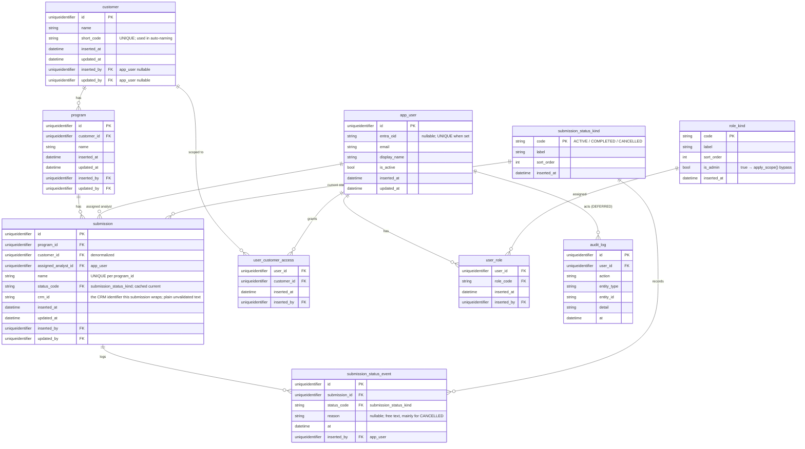
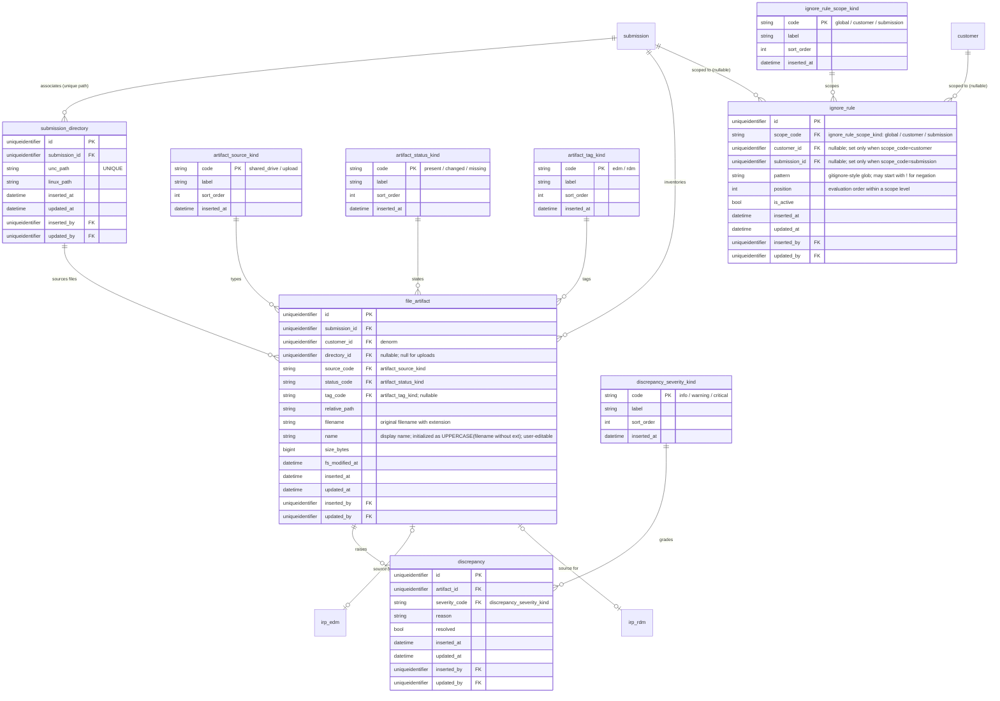
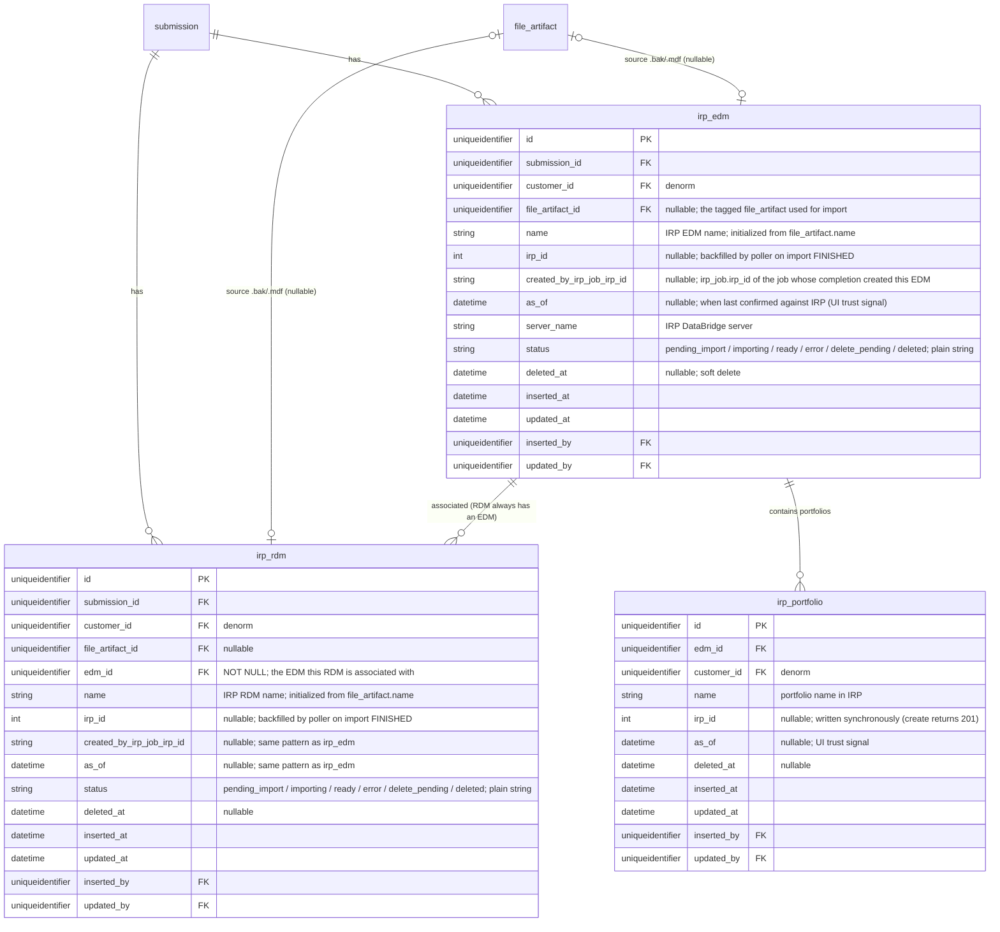
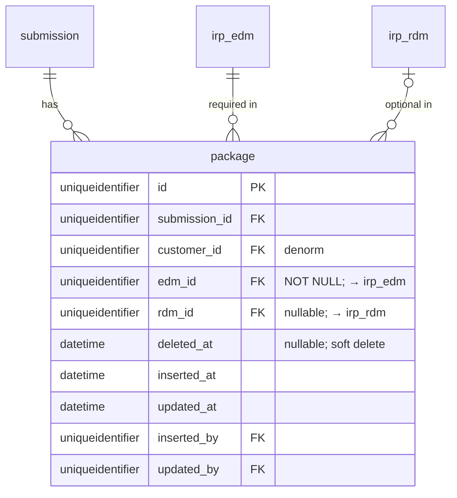
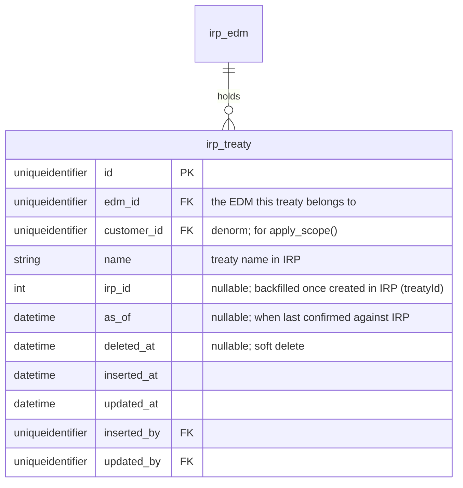
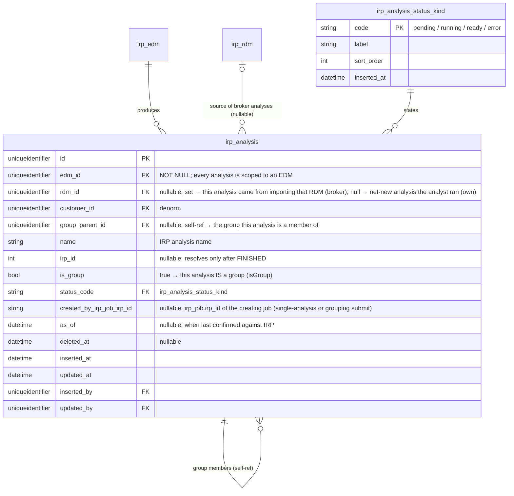
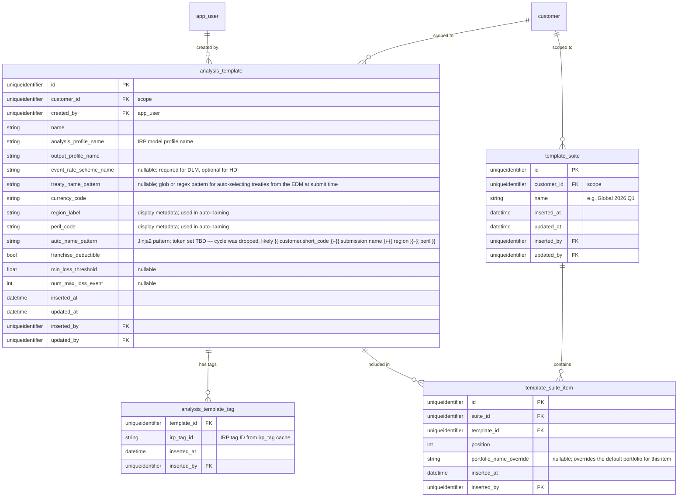
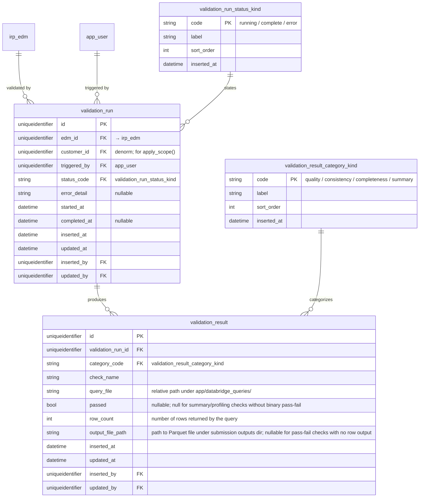
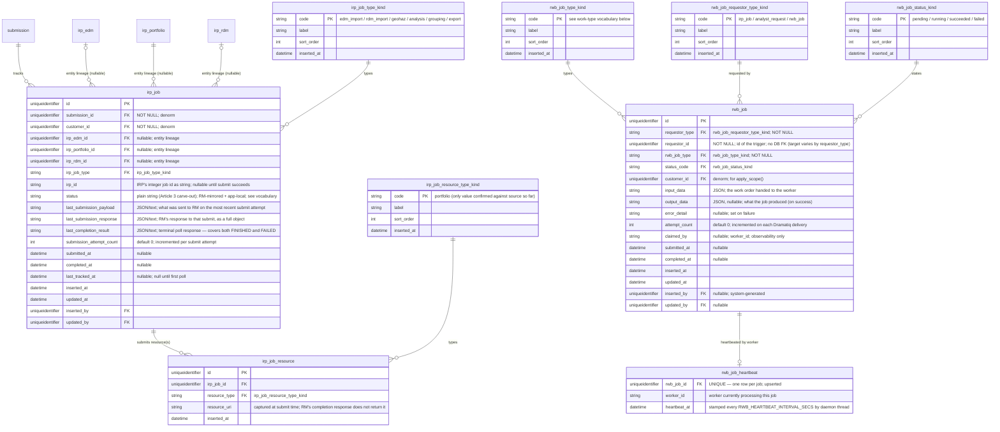
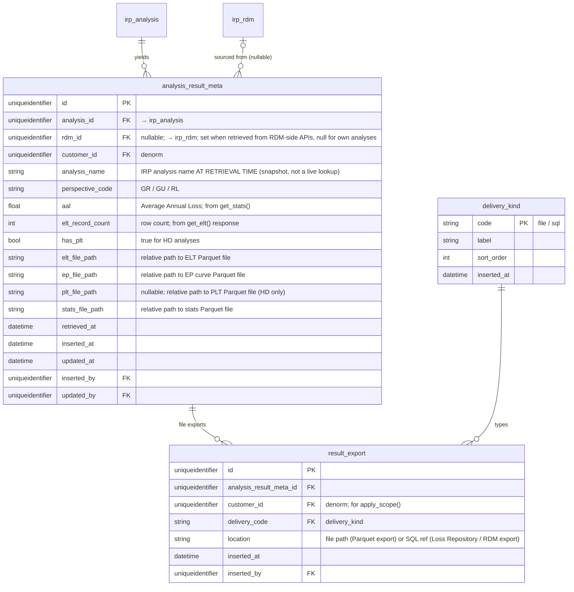

# Data Model — Risk Workbench

Companion to `PRD.md`. This is the schema reference Claude Code turns into migrations.

---

## Database connections

**All database access goes through the `db/` package** (`db/connection.py`). App code calls `get_connection("WORKBENCH")`, `get_connection("EXPOSURE")`, `get_connection("LOSS")`, `get_connection("DATABRIDGE")`. No URL strings in application code. Connection pooling, Kerberos renewal, and pool sizing are handled by the package.

Each named connection is configured via `MSSQL_{NAME}_*` env vars:

| Named connection | Database | Managed by | Env var prefix |
|---|---|---|---|
| `WORKBENCH` | Workbench Metamodel DB | Alembic + app | `MSSQL_WORKBENCH_*` |
| `EXPOSURE` | Exposure Repository | App (schema defined in this project) | `MSSQL_EXPOSURE_*` |
| `LOSS` | Loss Repository | App (schema defined in this project) | `MSSQL_LOSS_*` |
| `DATABRIDGE` | DataBridge (Moody's cloud) | Moody's — app never runs DDL | `MSSQL_DATABRIDGE_*` |

Required vars per connection: `MSSQL_{NAME}_SERVER`, `MSSQL_{NAME}_USER`, `MSSQL_{NAME}_PASSWORD`, `MSSQL_{NAME}_DATABASE`. Optional: `MSSQL_{NAME}_PORT` (default 1433), `MSSQL_{NAME}_AUTH_TYPE` (default `SQL`).

Global pool settings (apply across all connections): `MSSQL_POOL_SIZE` (default 5), `MSSQL_POOL_MAX_OVERFLOW` (default 5), `MSSQL_POOL_RECYCLE` (default 1800s). **For 30 concurrent users:** set `MSSQL_POOL_SIZE=10`, `MSSQL_POOL_MAX_OVERFLOW=20`.

**Local dev:** One SQL Server Docker container (`docker run mcr.microsoft.com/mssql/server`) hosts three databases (`rwb_workbench`, `rwb_exposure`, `rwb_loss`). The three named connections point to the same server with different `MSSQL_{NAME}_DATABASE` values. All other processes (app, nginx, Redis, poller, Dramatiq workers) run natively on Linux — not in Docker.

**Dev DB strategy — drop-create-seed.** Until production cutover (or significant data risk in dev), the dev workflow is full drop-and-recreate via a single Alembic revision (`0001_initial.py`) that drops all tables, creates them fresh, and seeds all kind tables. No accumulation of migration versions in dev. Migration history starts at production cutover.

**Per-iteration DB lifecycle prompt.** Before every iteration that touches schema or seeds, the builder MUST ask the analyst to choose for each affected app-managed database (`WORKBENCH`, `EXPOSURE`, `LOSS`):
- **Rebuild** — drop all tables, recreate schema, re-seed. All data lost. Recommended default in dev.
- **Refresh** — apply only additive changes (new tables, columns, seeds). Existing data preserved where possible.
- **Skip** — no schema changes for this DB in this iteration.

`DATABRIDGE` is Moody's managed schema and is **never** touched by this prompt or by any app-managed migration/bootstrap script.

**Redis:** `REDIS_URL` env var (default `redis://localhost:6379/0`). Dramatiq broker. Runs natively on Linux (`redis-server`); not in Docker. Stateless — losing it loses in-flight work items, not written results.

---

## Conventions (apply to every table)

- **Kind tables** (`*_kind`) hold categorical values: `code` (PK, stable string), `label`, `sort_order`, optional `icon`/`color`/`is_active`. Categorical columns are FKs to kind tables — never DB enums.
- **RLS:** `customer_id` is **denormalized** onto every major entity (set once at creation, immutable) so `apply_scope()` is a single-column predicate.
- **Audit fields on every table:** `inserted_at` (DATETIME, server default), `updated_at` (DATETIME, bumped on every flush), `inserted_by` (FK → `app_user`, nullable for system-generated rows), `updated_by` (FK → `app_user`, nullable). Kind tables and projected tables are exempt — they have only `inserted_at`.
- **Optimistic concurrency on analyst-editable rows.** `updated_at` doubles as the version marker for lost-update protection (spec 002 FR-045/046). A user-initiated update reads `updated_at` at edit time and writes back with `WHERE id = :id AND updated_at = :updated_at_read`; a rowcount of 0 means another write (or a scan) intervened, so the write is rejected and the conflict is surfaced to the user rather than silently overwriting. This applies to the rows two actors can touch at once — `submission` (e.g. two users changing status) and `file_artifact` (a user edit racing a reconciliation scan) — and to any other analyst-editable row. Append-only inserts (`file_artifact` new versions, `submission_status_event`) and single-threaded machinery (the `submission_retry` batch job, the poller) do not need it.
- **Naming:** singular `snake_case` table names; `id` surrogate PK (UNIQUEIDENTIFIER) unless noted; `*_code` FK to matching `*_kind`; `*_id` FK to entity. Every `irp_*` table's own Risk Modeler identifier column is named `irp_id` (not `irp_exposure_id`/`irp_portfolio_id`/etc.) for a single consistent convention.
- **`as_of` on every `irp_*` table.** A nullable `as_of` datetime signals when the row was last confirmed against Risk Modeler — because there can be drift between RM and the local copy. Stamped automatically on app-driven writes (poller backfill) and by a manual "Sync"/"Refresh"; it is a UI trust signal only and carries no weight on the submit path.
- **Artifacts are append-only.** A changed file inserts a new `file_artifact` row; the old row is retained.
- **Status is event-sourced (insert-only) with a cached current — where it earns it.** In this model that is `submission.status_code`: a status change inserts a `submission_status_event` row and, in the same transaction, stamps the cached `submission.status_code` column. No other table is event-sourced — `irp_job.status`/`rwb_job.status_code`/`irp_edm.status`/etc. are updated in place (a per-transition audit trail is part of the deferred auditing capability, not built this release).
- **Multi-statement transactions for event-sourced status.** `execute_command()` in `db/execute.py` uses `engine.begin()` — it commits one statement and is not usable for two-DML operations. Event-sourced writes (append event row + stamp cached status) **must** use `get_connection("WORKBENCH")` as a context manager with an explicit transaction: `with get_connection("WORKBENCH") as conn: with conn.begin(): conn.execute(insert_event); conn.execute(update_cached_status)`. Never split these two writes across separate `execute_command()` calls — a crash between them leaves the event log and cached status inconsistent.
- **EXPOSURE and LOSS schema bootstrap.** These databases are not managed by Alembic (which targets `WORKBENCH` only). Their schemas are defined in `db/bootstrap/exposure_schema.sql` and `db/bootstrap/loss_schema.sql`. Bootstrap via: `python -m app.cli bootstrap-exposure` and `python -m app.cli bootstrap-loss`. These commands are idempotent (`CREATE TABLE IF NOT EXISTS`). Run once per environment before starting the app. Local dev: run after `docker compose up` creates the SQL Server container.

---

## 1. Auth & business spine

```mermaid
erDiagram
  customer ||--o{ program : has
  program ||--o{ submission : has
  customer ||--o{ user_customer_access : "scoped to"
  app_user ||--o{ user_customer_access : grants
  app_user ||--o{ user_role : has
  role_kind ||--o{ user_role : assigned
  app_user ||--o{ audit_log : "acts (DEFERRED)"
  app_user ||--o{ submission : "assigned analyst"
  submission ||--o{ submission_status_event : logs
  submission_status_kind ||--o{ submission : "current status"
  submission_status_kind ||--o{ submission_status_event : records

  customer {
    uniqueidentifier id PK
    string name
    string short_code "UNIQUE; used in auto-naming"
    datetime inserted_at
    datetime updated_at
    uniqueidentifier inserted_by FK "app_user nullable"
    uniqueidentifier updated_by FK "app_user nullable"
  }
  program {
    uniqueidentifier id PK
    uniqueidentifier customer_id FK
    string name
    datetime inserted_at
    datetime updated_at
    uniqueidentifier inserted_by FK
    uniqueidentifier updated_by FK
  }
  submission {
    uniqueidentifier id PK
    uniqueidentifier program_id FK
    uniqueidentifier customer_id FK "denormalized"
    uniqueidentifier assigned_analyst_id FK "app_user"
    string name "UNIQUE per program_id"
    string status_code FK "submission_status_kind; cached current"
    string crm_id "the CRM identifier this submission wraps; plain unvalidated text"
    datetime inserted_at
    datetime updated_at
    uniqueidentifier inserted_by FK
    uniqueidentifier updated_by FK
  }
  submission_status_kind {
    string code PK "ACTIVE / COMPLETED / CANCELLED"
    string label
    int sort_order
    datetime inserted_at
  }
  submission_status_event {
    uniqueidentifier id PK
    uniqueidentifier submission_id FK
    string status_code FK "submission_status_kind"
    string reason "nullable; free text, mainly for CANCELLED"
    datetime at
    uniqueidentifier inserted_by FK "app_user"
  }
  app_user {
    uniqueidentifier id PK
    string entra_oid "nullable; UNIQUE when set"
    string email
    string display_name
    bool is_active
    datetime inserted_at
    datetime updated_at
  }
  role_kind {
    string code PK
    string label
    int sort_order
    bool is_admin "true → apply_scope() bypass"
    datetime inserted_at
  }
  user_role {
    uniqueidentifier user_id FK
    string role_code FK
    datetime inserted_at
    uniqueidentifier inserted_by FK
  }
  user_customer_access {
    uniqueidentifier user_id FK
    uniqueidentifier customer_id FK
    datetime inserted_at
    uniqueidentifier inserted_by FK
  }
  audit_log {
    uniqueidentifier id PK
    uniqueidentifier user_id FK
    string action
    string entity_type
    string entity_id
    string detail
    datetime at
  }
```

**Notes:**
- **`submission.crm_id` (new, CR-002).** The CRM identifier this submission wraps — plain, unvalidated text, manually copy-pasted from Salesforce (no SF API integration yet). No click-through. A forward-compatible reference field only.
- **`audit_log` is DEFERRED (CR-002).** Full auditing (this table and the once-proposed `user_action` spine) is out of scope for the no-workflow-engine release — not designed, not built. The table is kept documented, not deleted; final placement is TBD when an audit mechanism is actually picked up. See §13 Open decisions for the auth-audit gap this leaves.
- **`notification_preference` is DROPPED (CR-002).** Notifications will be re-added in a future version; the per-user channel-preference table is not carried forward now.
- `customer.short_code` has a UNIQUE constraint. Used in auto-naming patterns (exact pattern TBD in Iteration 5 — see correction below on `submission.cycle`).
- **Customer seeding is upsert-by-`short_code`, never delete (spec 002 FR-001–004).** The admin bulk-load reads a minimal CSV — `short_code` and `name` columns only, no contact/address/metadata fields this iteration. Each row inserts a new `customer` when its `short_code` is new, or updates the existing row's `name` when the `short_code` already exists. A `customer` absent from the CSV is **never** deleted or deactivated by a seed run, and re-running the same CSV is idempotent (no duplicates, no change past the first run). A malformed or in-file-duplicate `short_code` is reported and skipped without aborting the valid rows.
- "My submissions" view = `WHERE assigned_analyst_id = current_user.id`.
- **`submission.name` is UNIQUE per `program_id`.** Two submissions under the same program cannot share a name. Enforced at the DB level (`UNIQUE(program_id, name)`), not just in the UI.
- `submission.status_code` is event-sourced per the standard convention (top of this doc): every status change inserts a `submission_status_event` row and stamps `submission.status_code` in the same transaction. Three values only — `ACTIVE`, `COMPLETED`, `CANCELLED`. `COMPLETED → ACTIVE` (reopening) is allowed; there is no system-enforced precondition on any transition — the analyst decides when a submission is done, consistent with "the analyst is always in the driver's seat" (PRD §1.1). **There is no delete.** A submission can carry Risk Modeler assets (EDMs, RDMs) with real IRP-side identity, so removing the row is never safe. `CANCELLED` is the terminal/withdrawal state instead of a delete.

> **Correction (outside Iteration 1/2 scope, but changed here because it directly touches `submission`):** the prior schema had `submission.cycle` ("e.g. 2026Q1; used in auto-naming") and `submission.authoring_status` ("draft/active/complete; plain string"). Both are removed:
> - **`cycle` is gone.** It described a renewal-cycle concept that doesn't apply to how this team works — broker submissions, not cyclical renewals. It was only ever consumed by the auto-naming pattern example in §11.2 of the PRD, which is Iteration 5 (not yet built) — removing it now has no code impact, only a documentation one. Iteration 5's auto-naming section will need a replacement token set when that iteration is actually planned; this is called out there as an open item, not resolved here.
> - **`authoring_status` is replaced by `status_code`** (above). The prior three-state guess (`draft/active/complete`) assumed a workflow-authoring lifecycle that no longer applies now that Workflow/Stage/Task is being redesigned separately (out of scope for this update). The new `ACTIVE/COMPLETED/CANCELLED` vocabulary describes the submission itself — is the analyst still working it — independent of whatever job/workflow machinery eventually runs underneath it.

---

## 2. File inventory

```mermaid
erDiagram
  submission ||--o{ submission_directory : "associates (unique path)"
  submission ||--o{ file_artifact : inventories
  submission_directory ||--o{ file_artifact : "sources files"
  artifact_source_kind ||--o{ file_artifact : types
  artifact_status_kind ||--o{ file_artifact : states
  artifact_tag_kind ||--o{ file_artifact : tags
  file_artifact ||--o{ discrepancy : raises
  discrepancy_severity_kind ||--o{ discrepancy : grades
  file_artifact |o--o| irp_edm : "source for"
  file_artifact |o--o| irp_rdm : "source for"
  ignore_rule_scope_kind ||--o{ ignore_rule : scopes
  customer ||--o{ ignore_rule : "scoped to (nullable)"
  submission ||--o{ ignore_rule : "scoped to (nullable)"

  submission_directory {
    uniqueidentifier id PK
    uniqueidentifier submission_id FK
    string unc_path "UNIQUE"
    string linux_path
    datetime inserted_at
    datetime updated_at
    uniqueidentifier inserted_by FK
    uniqueidentifier updated_by FK
  }
  file_artifact {
    uniqueidentifier id PK
    uniqueidentifier submission_id FK
    uniqueidentifier customer_id FK "denorm"
    uniqueidentifier directory_id FK "nullable; null for uploads"
    string source_code FK "artifact_source_kind"
    string status_code FK "artifact_status_kind"
    string tag_code FK "artifact_tag_kind; nullable"
    string relative_path
    string filename "original filename with extension"
    string name "display name; initialized as UPPERCASE(filename without ext); user-editable"
    bigint size_bytes
    datetime fs_modified_at
    datetime inserted_at
    datetime updated_at
    uniqueidentifier inserted_by FK
    uniqueidentifier updated_by FK
  }
  artifact_source_kind {
    string code PK "shared_drive / upload"
    string label
    int sort_order
    datetime inserted_at
  }
  artifact_status_kind {
    string code PK "present / changed / missing"
    string label
    int sort_order
    datetime inserted_at
  }
  artifact_tag_kind {
    string code PK "edm / rdm"
    string label
    int sort_order
    datetime inserted_at
  }
  discrepancy {
    uniqueidentifier id PK
    uniqueidentifier artifact_id FK
    string severity_code FK "discrepancy_severity_kind"
    string reason
    bool resolved
    datetime inserted_at
    datetime updated_at
    uniqueidentifier inserted_by FK
    uniqueidentifier updated_by FK
  }
  discrepancy_severity_kind {
    string code PK "info / warning / critical"
    string label
    int sort_order
    datetime inserted_at
  }
  ignore_rule {
    uniqueidentifier id PK
    string scope_code FK "ignore_rule_scope_kind: global / customer / submission"
    uniqueidentifier customer_id FK "nullable; set only when scope_code=customer"
    uniqueidentifier submission_id FK "nullable; set only when scope_code=submission"
    string pattern "gitignore-style glob; may start with ! for negation"
    int position "evaluation order within a scope level"
    bool is_active
    datetime inserted_at
    datetime updated_at
    uniqueidentifier inserted_by FK
    uniqueidentifier updated_by FK
  }
  ignore_rule_scope_kind {
    string code PK "global / customer / submission"
    string label
    int sort_order
    datetime inserted_at
  }
```

**CR-002 changes to file inventory:**
- **`artifact_source_kind` loses `workflow_output`** (shrinks to `shared_drive` / `upload`). Both surviving values describe files whose content originates *outside* the app, which is what `file_artifact`'s drift-detection machinery exists to reconcile. A job-produced file (e.g. a downloaded export) is written into the same submission directory and picked up by the next reconciliation scan as an ordinary `shared_drive` file — no special source needed.
- **`discrepancy` escalation rule (behavior only, no schema change).** The second-tier escalation, previously "referenced/pinned by a workflow," now keys off **package membership** — a discrepancy escalates further when the file artifact is used in a `package` (i.e. it is the `file_artifact_id` behind an `irp_edm`/`irp_rdm` that a `package` row references). Same intent (provenance in question once something downstream depends on the file), traced through a construct that still exists.

**`file_artifact` identity key:** `UNIQUE(submission_id, relative_path, size_bytes, fs_modified_at)`. A file is considered a new version when any of these four values differs from all existing rows for the same `(submission_id, relative_path)`. The UNIQUE constraint prevents duplicate rows if the scanner runs twice before a status flip. Note: `submission_id` is included because the same relative path can appear in different submissions.

**`file_artifact.name` behavior:**
- Initialized as `filename` with extension stripped, converted to UPPERCASE (e.g. `XYZ_EDM_2026.bak` → `XYZ_EDM_2026`).
- User can edit this name at any time.
- When a file is tagged as `edm` or `rdm` (on tag action), and when `name` is changed: the app calls `client.edm.search_edms()` / `client.rdm.search_rdms()` to check whether that name already exists in IRP. If it does, the user is warned before proceeding. This check is non-blocking (user can override) but is always performed.
- `file_artifact.name` becomes the initial `irp_edm.name` or `irp_rdm.name` when the EDM/RDM entity is created from this artifact **in a later iteration** — tagging here only sets `tag_code` (see §3, "Tagging marks; it does not create the entity").

**Scanner & storage behavior (spec 002 FR-029–036, FR-044):**
- **Identity is metadata, not content.** A file's version is keyed off `(relative_path, size_bytes, fs_modified_at)` — cheap `stat`-level metadata — not a content hash (FR-029). The accepted trade-off: a same-size, same-mtime content edit can be missed. This is a documented limitation, not a defect.
- **Settle window before fingerprinting.** A file whose `fs_modified_at` is within a short settle window (an operational tuning value, not a user setting) is treated as still mid-copy and is not recorded as a new stable version until it stops changing (FR-032).
- **Uploads live off the read-only mount.** `source_code='upload'` rows have `directory_id = null`; their bytes are stored under an app-managed **writable** upload store, kept physically separate from the read-only shared-drive mount. `relative_path` for an upload is relative to that store. Uploaded files are immutable once stored — a replacement is a new `file_artifact` row, never an in-place overwrite (FR-034/035).
- **The shared drive is never mutated.** No scan or file operation ever writes to, moves, renames, or deletes a file on the read-only mount — the app only reads it (FR-036).
- **A failed scan is not a missing file.** When a directory is unreachable (share down) the scan does not flip its previously-tracked artifacts to `missing`; `missing` is recorded only on a *successful* scan that confirms the file is gone (FR-044). The submission-detail error/warning state (no directory / unreachable vs. reachable-but-empty) is UI behavior; see PRD.

**`ignore_rule` (new — visibility ruleset, PRD §8.7; Iteration 2, out of scope for the file-inventory iteration):**
- Admin-authored at application level (`scope_code = global`). Optionally overridden per customer (`scope_code = customer`, `customer_id` set) or per submission (`scope_code = submission`, `submission_id` set).
- **Cascade is cumulative, not replacing:** when the reconciliation scanner (§8.3) evaluates a discovered file, it applies `global` patterns, then `customer` patterns for that file's customer, then `submission` patterns for that file's submission, in that order — same evaluation model as nested `.gitignore` files. A pattern prefixed with `!` negates (un-ignores) a match from an earlier, broader level. The last matching pattern across all three levels wins, standard gitignore semantics.
- A matched, non-negated file is excluded from becoming a `file_artifact` row at scan time — it never enters the inventory at all (not a hidden/soft-deleted row; it's simply never inserted).
- `position` orders rules within one scope level (e.g. all `global` rules), since negation order matters within a level, not just across levels.
- Matching uses standard gitignore glob semantics (`*`, `**`, directory anchors, `!negation`) — implemented via a library (e.g. `pathspec`), not hand-rolled.

---

## 3. EDM & RDM entities (`irp_edm`, `irp_rdm`, `irp_portfolio`)

`irp_edm`, `irp_rdm`, and `irp_portfolio` are the entities the app creates in Risk Modeler and must list, name, and track — the EDM is the modeling anchor (portfolios, analyses, treaties all belong to one EDM). *(Renamed from `edm`/`rdm`/`irp_portfolio` by CR-002; the field-level rename map is in `docs/CR_02__NO_WORKFLOW_ENGINE.md`.)*

```mermaid
erDiagram
  submission ||--o{ irp_edm : has
  submission ||--o{ irp_rdm : has
  file_artifact |o--o| irp_edm : "source .bak/.mdf (nullable)"
  file_artifact |o--o| irp_rdm : "source .bak/.mdf (nullable)"
  irp_edm ||--o{ irp_rdm : "associated (RDM always has an EDM)"
  irp_edm ||--o{ irp_portfolio : "contains portfolios"

  irp_edm {
    uniqueidentifier id PK
    uniqueidentifier submission_id FK
    uniqueidentifier customer_id FK "denorm"
    uniqueidentifier file_artifact_id FK "nullable; the tagged file_artifact used for import"
    string name "IRP EDM name; initialized from file_artifact.name"
    int irp_id "nullable; backfilled by poller on import FINISHED"
    string created_by_irp_job_irp_id "nullable; irp_job.irp_id of the job whose completion created this EDM"
    datetime as_of "nullable; when last confirmed against IRP (UI trust signal)"
    string server_name "IRP DataBridge server"
    string status "pending_import / importing / ready / error / delete_pending / deleted; plain string"
    datetime deleted_at "nullable; soft delete"
    datetime inserted_at
    datetime updated_at
    uniqueidentifier inserted_by FK
    uniqueidentifier updated_by FK
  }
  irp_rdm {
    uniqueidentifier id PK
    uniqueidentifier submission_id FK
    uniqueidentifier customer_id FK "denorm"
    uniqueidentifier file_artifact_id FK "nullable"
    uniqueidentifier edm_id FK "NOT NULL; the EDM this RDM is associated with"
    string name "IRP RDM name; initialized from file_artifact.name"
    int irp_id "nullable; backfilled by poller on import FINISHED"
    string created_by_irp_job_irp_id "nullable; same pattern as irp_edm"
    datetime as_of "nullable; same pattern as irp_edm"
    string status "pending_import / importing / ready / error / delete_pending / deleted; plain string"
    datetime deleted_at "nullable"
    datetime inserted_at
    datetime updated_at
    uniqueidentifier inserted_by FK
    uniqueidentifier updated_by FK
  }
  irp_portfolio {
    uniqueidentifier id PK
    uniqueidentifier edm_id FK
    uniqueidentifier customer_id FK "denorm"
    string name "portfolio name in IRP"
    int irp_id "nullable; written synchronously (create returns 201)"
    datetime as_of "nullable; UI trust signal"
    datetime deleted_at "nullable"
    datetime inserted_at
    datetime updated_at
    uniqueidentifier inserted_by FK
    uniqueidentifier updated_by FK
  }
```

**Tagging marks; it does not create the entity (spec 002 FR-033).** In the file-inventory iteration, tagging a `file_artifact` as `edm`/`rdm` only sets `file_artifact.tag_code` — no `irp_edm`/`irp_rdm` row is written. The first-class `irp_edm`/`irp_rdm` tracked entity is created later (Iteration 3, at Package "Save and Sync" / import time), from the tagged artifact. This split is intentional: the inventory iteration ships tagging without depending on the EDM/RDM entity layer that lands later.

**EDM/RDM name initialization (when the entity is created, later iteration):**
- The `irp_edm`/`irp_rdm` row is created with `name = file_artifact.name` (the possibly-edited display name captured at tag/rename time).
- This name is what gets submitted to IRP. The IRP name-collision check (`client.edm.search_edms()` / `search_rdms()`) is a REST search that needs no local entity, so it can — and does — run at tag/rename time (non-blocking warning, §2); if the name already exists in IRP the analyst is warned and can rename before import.

**`irp_rdm.edm_id` is NOT NULL (CR-002, practice-lead call).** There is no scenario where an RDM exists without an EDM — an RDM's analysis results are meaningless unless they can be linked to exposures in an EDM. Every `irp_rdm` therefore references exactly one `irp_edm`, and (like every entity here) is always scoped to a `submission`. This is a change from the CR's earlier draft, which had `edm_id` nullable for a "standalone broker RDM"; the practice lead ruled that case out.

**Creation lineage (`created_by_irp_job_irp_id`):** `irp_edm` and `irp_rdm` are created by async import jobs, so they carry the `irp_job.irp_id` of the job whose completion created them. `irp_portfolio` does **not** — portfolio creation is synchronous (no `irp_job` row), so there is no creating job to reference.

**`irp_portfolio`:**
- Created via `client.portfolio.create_portfolio()`.
- `name` is the portfolio name as it exists in IRP (e.g. `All Accounts`, `EQ Only`).
- `irp_id` is written **synchronously on the request path** — `create_portfolio()` returns `(portfolio_id, request_body)` immediately (IRP responds with HTTP 201 + Location header). The service writes `irp_id` in the same transaction as the `irp_portfolio` insert. The poller is not involved.
- Analyst picks a portfolio from a dropdown (populated from this table filtered by `edm_id`) when configuring an analysis.

---

## 3a. Package (new — PRD §9.4)

A **package** is an EDM/RDM pairing — the unit an analyst saves and syncs to Risk Modeler together. Most packages pair one EDM with one RDM, but the RDM side may be absent (**EDM-only packages are valid; RDM-only packages are not** — an RDM is meaningless without the EDM whose exposures its results link to, §3). Every package therefore has an EDM.

```mermaid
erDiagram
  submission ||--o{ package : has
  irp_edm ||--o{ package : "required in"
  irp_rdm |o--o{ package : "optional in"

  package {
    uniqueidentifier id PK
    uniqueidentifier submission_id FK
    uniqueidentifier customer_id FK "denorm"
    uniqueidentifier edm_id FK "NOT NULL; → irp_edm"
    uniqueidentifier rdm_id FK "nullable; → irp_rdm"
    datetime deleted_at "nullable; soft delete"
    datetime inserted_at
    datetime updated_at
    uniqueidentifier inserted_by FK
    uniqueidentifier updated_by FK
  }
```

**`package.edm_id` is NOT NULL; `package.rdm_id` is nullable — and neither is redundant with `irp_rdm.edm_id`.** Every package has an EDM (RDM-only packages are invalid, above); the RDM is optional (EDM-only packages are valid). `package` keeps its own `edm_id`/`rdm_id` rather than deriving the pairing from `irp_rdm.edm_id`, because an EDM-only package has no `irp_rdm` row to read an `edm_id` off of. The two relationships serve different purposes and both stay.

**`package` has no independent status column.** This is a deliberate departure from the event-sourced-status convention used elsewhere in this doc. A package is a join between an EDM and an RDM, and each of those already carries its own `status` (`pending_import / importing / ready / error / delete_pending / deleted`) plus its own IRP jobs with their own job status. Rolling those up into a third, package-level status would create a value that has to be kept in sync with two independently-changing sources of truth for no real benefit. The UI reads and displays the EDM's status and the RDM's status side by side inside the package card — it never computes or caches an aggregate.

**Package actions** (references the redesigned `rwb_job`, §8):
- **Cancel** — discard the in-progress modal; no DB write.
- **Save** — persists `package` (and the `irp_edm`/`irp_rdm` name fields, if edited) with `status` left at whatever the EDM/RDM already had (typically `pending_import` for newly tagged artifacts). The IRP name-collision check (`client.edm.search_edms()` / `client.rdm.search_rdms()`, same non-blocking-warning pattern as `file_artifact.name` in §2) runs on every Save where a name was entered or changed. No job is submitted.
- **Save and Sync** — Save, then enqueues stub `rwb_job` row(s) per PRD §9.4. **EDM and RDM sync are separate `rwb_job` rows, sequenced, not one combined job** — Risk Modeler requires the EDM to exist before an RDM can be linked to it. Every package has an EDM, so an `edm_upload` job (`requestor_type='analyst_request'`, `requestor_id=` the analyst-action id) is always the head job. If the package also has an RDM: `rdm_upload` is created as a **chained tail job** (`requestor_type='rwb_job'`, `requestor_id=` the parent `edm_upload` `rwb_job.id`) once `edm_upload` succeeds — it is never enqueued up front, so it cannot race ahead of the EDM job. Dedup is the composite `UNIQUE(requestor_type, requestor_id, rwb_job_type)` (replacing the old `request_key` string). **This iteration's stubs do no real IRP work** — each claims, heartbeats every `RWB_HEARTBEAT_INTERVAL_SECS` for 60 seconds, then succeeds. They exist to prove the `rwb_job` claim/heartbeat/chaining/completion plumbing end-to-end before real IRP import calls are wired in a later iteration.
- **Delete** — the deletion dependency runs **one way only: an EDM delete depends on its RDMs being deleted first, never the reverse.** RDMs can be deleted independently of their EDM; an EDM cannot be deleted while an RDM is still linked to it (Risk Modeler requires the RDM unlinked first). So:
  - **Deleting just an RDM** (leaving the EDM in place) enqueues a single `rdm_delete` head job; on success it soft-deletes the `irp_rdm` row. **No `edm_delete` is ever created** — removing an RDM must not cascade into removing its EDM.
  - **Deleting the EDM (or the whole package)** is what *drives* the RDM cleanup: `edm_delete` depends on `rdm_delete` completing first. If the package has an RDM, `rdm_delete` runs first and, once it succeeds, `edm_delete` follows; if the package is EDM-only, `edm_delete` runs directly. The prerequisite ordering is owned by the EDM-delete intent, not by `rdm_delete` — this is the correction to an earlier draft that had `rdm_delete` unconditionally chain into `edm_delete`.

  Once the last delete job for the package succeeds, the `package` row itself is stamped `deleted_at` (soft delete — kept for audit, consistent with the no-hard-delete stance taken for `submission`). In a later iteration, the real version of these workers will call the actual IRP EDM/RDM delete endpoints before soft-deleting the local rows.

> **Open TBD (pre-existing, not resolved by CR-002):** how a stub/real `edm_upload` `rwb_job` triggers the chained `rdm_upload` once the *IRP* job it submits reaches a terminal status — the trigger is the **poller** noticing IRP-job completion, which crosses from RWB-job space into IRP-job space. The existing "worker succeeds → worker creates next `rwb_job`" pattern doesn't cover this. `rwb_job`'s CR-002 redesign (`requestor_type`/`requestor_id`) may make it easier — e.g. the poller, on seeing an EDM's `irp_job` reach `FINISHED`, could look up any `package` with a matching `edm_id` and enqueue `rdm_upload` directly — but this is a direction, not a decision. See §8 and PRD §14.5.

---

## 3b. Treaty (`irp_treaty` — new, CR-002)

A reinsurance treaty as it exists in IRP, **belonging to one EDM**. Referenced by analyses **by name** (name-based coupling), not by id. Treaty create/edit is always **synchronous** (`treaty.search_treaties` / `create_treaty` / `create_treaty_lob`) and creates **no `irp_job`** — so there is no creating job to reference (no `created_by_irp_job_irp_id`).

```mermaid
erDiagram
  irp_edm ||--o{ irp_treaty : holds

  irp_treaty {
    uniqueidentifier id PK
    uniqueidentifier edm_id FK "the EDM this treaty belongs to"
    uniqueidentifier customer_id FK "denorm; for apply_scope()"
    string name "treaty name in IRP"
    int irp_id "nullable; backfilled once created in IRP (treatyId)"
    datetime as_of "nullable; when last confirmed against IRP"
    datetime deleted_at "nullable; soft delete"
    datetime inserted_at
    datetime updated_at
    uniqueidentifier inserted_by FK
    uniqueidentifier updated_by FK
  }
```

**Notes:**
- Creating a treaty with its lines of business is a **1 + N** call pattern and is **non-atomic** — a partial failure can leave a treaty with some LOBs missing; the UI surfaces this and lets the analyst retry the remaining LOBs.
- Scope is **edit-only** creation within the UI (add/edit treaty + LOBs for the main types). Cedant-ID checks, treaty-accuracy validation, and location-detail checks are out of MVP.

---

## 3c. Analysis (`irp_analysis` — new, CR-002)

An analysis (or, when `is_group=true`, a **group** — a group *is* an analysis in Risk Modeler, viewed/exported identically) belonging to an EDM. Analysis creation (single-analysis submit or grouping submit) is always async (`irp_job`), so this table carries creation lineage like `irp_edm`/`irp_rdm`.

```mermaid
erDiagram
  irp_edm ||--o{ irp_analysis : produces
  irp_rdm |o--o{ irp_analysis : "source of broker analyses (nullable)"
  irp_analysis ||--o{ irp_analysis : "group members (self-ref)"
  irp_analysis_status_kind ||--o{ irp_analysis : states

  irp_analysis {
    uniqueidentifier id PK
    uniqueidentifier edm_id FK "NOT NULL; every analysis is scoped to an EDM"
    uniqueidentifier rdm_id FK "nullable; set → this analysis came from importing that RDM (broker); null → net-new analysis the analyst ran (own)"
    uniqueidentifier customer_id FK "denorm"
    uniqueidentifier group_parent_id FK "nullable; self-ref → the group this analysis is a member of"
    string name "IRP analysis name"
    int irp_id "nullable; resolves only after FINISHED"
    bool is_group "true → this analysis IS a group (isGroup)"
    string status_code FK "irp_analysis_status_kind"
    string created_by_irp_job_irp_id "nullable; irp_job.irp_id of the creating job (single-analysis or grouping submit)"
    datetime as_of "nullable; when last confirmed against IRP"
    datetime deleted_at "nullable"
    datetime inserted_at
    datetime updated_at
    uniqueidentifier inserted_by FK
    uniqueidentifier updated_by FK
  }
  irp_analysis_status_kind {
    string code PK "pending / running / ready / error"
    string label
    int sort_order
    datetime inserted_at
  }
```

**Key decisions:**
- **`edm_id` NOT NULL, `rdm_id` nullable (practice-lead call).** Every analysis is scoped to an EDM (the installed `irp_integration` library's `search_analyses`/`get_analysis_by_name` filter on `exposureName`, never `rdmName`). `rdm_id` carries the broker/own distinction: **set** → the analysis entered the app as a result of importing that RDM (a broker analysis); **null** → a net-new analysis an analyst executed. This resolves the item the CR marked BLOCKED pending practice-lead review.
- **No stored `origin` column — own vs. broker is derived from `rdm_id`.** `rdm_id IS NULL` → `own` (a net-new analysis the analyst ran); `rdm_id` set → `broker` (entered the model by importing that RDM). An earlier draft carried a denormalized `origin` string alongside `rdm_id`; it was dropped because it duplicates `rdm_id` and can drift from it. The `own`/`broker` label is computed in the query/view layer where a list needs it — there is no second source of truth to keep in sync.
- **`status_code` is a kind table** (`irp_analysis_status_kind`), not a plain string — this is an app-defined vocabulary (`pending`/`running`/`ready`/`error`), so the "always kind table" default applies. (Contrast `irp_edm.status`/`irp_rdm.status`, which stay plain strings under Article 3's carve-out because they mirror IRP's own EDM/RDM lifecycle.) *Note: the CR specified a kind table for this field but omitted it from its own table count — created here to honor the rule.*
- **A group is an `irp_analysis` with `is_group=true`** — not a separate entity. Group members point back via `group_parent_id`.

---

## 4. Analysis templates & suites — **IN MVP**

> **In scope for the MVP** (practice-lead call, 2026-07-06 — reverses the CR-002 deferral). Batch submission from saved templates is the #1 analyst pain point: a worldwide contract can need 50–150+ model/region/peril/treaty combinations, and no analyst should hand-name them. Templates feed `submit_portfolio_analysis_job()` parameters directly and stay orthogonal to the workflow-removal pivot. **Open item:** the `auto_name_pattern` example below references `{{ cycle }}`, a `submission` field that was dropped — the token set must be re-derived (likely `customer.short_code` + `submission.name` + `region` + `peril`) when this is built.

```mermaid
erDiagram
  customer ||--o{ analysis_template : "scoped to"
  app_user ||--o{ analysis_template : "created by"
  analysis_template ||--o{ analysis_template_tag : "has tags"
  customer ||--o{ template_suite : "scoped to"
  template_suite ||--o{ template_suite_item : contains
  analysis_template ||--o{ template_suite_item : "included in"

  analysis_template {
    uniqueidentifier id PK
    uniqueidentifier customer_id FK "scope"
    uniqueidentifier created_by FK "app_user"
    string name
    string analysis_profile_name "IRP model profile name"
    string output_profile_name
    string event_rate_scheme_name "nullable; required for DLM, optional for HD"
    string treaty_name_pattern "nullable; glob or regex pattern for auto-selecting treaties from the EDM at submit time"
    string currency_code
    string region_label "display metadata; used in auto-naming"
    string peril_code "display metadata; used in auto-naming"
    string auto_name_pattern "Jinja2 pattern; token set TBD — cycle was dropped, likely {{ customer.short_code }}-{{ submission.name }}-{{ region }}-{{ peril }}"
    bool franchise_deductible
    float min_loss_threshold "nullable"
    int num_max_loss_event "nullable"
    datetime inserted_at
    datetime updated_at
    uniqueidentifier inserted_by FK
    uniqueidentifier updated_by FK
  }
  analysis_template_tag {
    uniqueidentifier template_id FK
    string irp_tag_id "IRP tag ID from irp_tag cache"
    datetime inserted_at
    uniqueidentifier inserted_by FK
  }
  template_suite {
    uniqueidentifier id PK
    uniqueidentifier customer_id FK "scope"
    string name "e.g. Global 2026 Q1"
    datetime inserted_at
    datetime updated_at
    uniqueidentifier inserted_by FK
    uniqueidentifier updated_by FK
  }
  template_suite_item {
    uniqueidentifier id PK
    uniqueidentifier suite_id FK
    uniqueidentifier template_id FK
    int position
    string portfolio_name_override "nullable; overrides the default portfolio for this item"
    datetime inserted_at
    uniqueidentifier inserted_by FK
  }
```

**`analysis_template` design basis:**
- `analysis_profile_name`, `output_profile_name`, `event_rate_scheme_name` come directly from `client.analysis.submit_portfolio_analysis_job()` parameters in irp-integration.
- `event_rate_scheme_name` is required for DLM analysis, optional for HD. DLM vs HD is detected at batch-apply time from `irp_model_profile.software_version_code` (`"HD" in code → HD, else DLM`).
- `treaty_name_pattern` is an optional glob or regex pattern used at submit time to auto-select treaty names from the EDM via `client.treaty.search_treaties()`. Matching treaty names are resolved to IRP treaty IDs and included in the analysis job request. Null means no treaties are auto-selected (analyst may configure manually or use template tags instead).
- `auto_name_pattern` is evaluated at batch-apply time against submission context to generate the `job_name` for each submitted analysis. Without this, analysts must manually name 50–150+ jobs.
- Tags are stored in `analysis_template_tag` (junction table, not inline). The `irp_tag_id` references the IRP tag as synced into `irp_tag` cache.

---

## 5. Phase A — DataBridge validation results — **DEFERRED (CR-002)**

> Deferred, not deleted — revisit if/when Phase A validation is picked up (also out of MVP per `mvp-scope.md §6`). Documented with standardization fixes applied: `status`/`category` converted to kind tables, `customer_id` denorm added to `validation_run`, `edm_id` FK re-pointed to `irp_edm`. This is unrelated to the `irp_job` validation columns in §8 — that is job-level prereq validation; this is DataBridge data-quality validation.

Validation queries run via `client.databridge` against an imported EDM. Results can be thousands of rows — too large for a SQL column. Metadata is stored in SQL; row-level output is written to Parquet files under the submission's output directory.

```mermaid
erDiagram
  irp_edm ||--o{ validation_run : "validated by"
  app_user ||--o{ validation_run : "triggered by"
  validation_run ||--o{ validation_result : produces
  validation_run_status_kind ||--o{ validation_run : states
  validation_result_category_kind ||--o{ validation_result : categorizes

  validation_run {
    uniqueidentifier id PK
    uniqueidentifier edm_id FK "→ irp_edm"
    uniqueidentifier customer_id FK "denorm; for apply_scope()"
    uniqueidentifier triggered_by FK "app_user"
    string status_code FK "validation_run_status_kind"
    string error_detail "nullable"
    datetime started_at
    datetime completed_at "nullable"
    datetime inserted_at
    datetime updated_at
    uniqueidentifier inserted_by FK
    uniqueidentifier updated_by FK
  }
  validation_result {
    uniqueidentifier id PK
    uniqueidentifier validation_run_id FK
    string category_code FK "validation_result_category_kind"
    string check_name
    string query_file "relative path under app/databridge_queries/"
    bool passed "nullable; null for summary/profiling checks without binary pass-fail"
    int row_count "number of rows returned by the query"
    string output_file_path "path to Parquet file under submission outputs dir; nullable for pass-fail checks with no row output"
    datetime inserted_at
    datetime updated_at
    uniqueidentifier inserted_by FK
    uniqueidentifier updated_by FK
  }
  validation_run_status_kind {
    string code PK "running / complete / error"
    string label
    int sort_order
    datetime inserted_at
  }
  validation_result_category_kind {
    string code PK "quality / consistency / completeness / summary"
    string label
    int sort_order
    datetime inserted_at
  }
```

**Parquet file location:** `{submission_outputs_dir}/{validation_run.id}/{check_name}.parquet`

The `output_file_path` stores the relative path from the submission outputs root. The UI reads the Parquet file for detailed drill-down; the SQL row is used for the summary/pass-fail display.

---

## 6. Workflow model — **REMOVED (CR-002)**

The entire Workflow / Stage / Task construct is removed. This app is a
**workbench, not a workflow engine**: there is no `workflow`,
`stage_instance`, `task_instance`, typed-port, or handle-type-registry
object, and no manifest-projection subsystem. A submission's progress is
derived live from its `irp_job` rows and entity state; "what's next" is the
prerequisite gate (computed in code, see PRD §14.2), not a stored stage
machine. Execution tracking is `irp_job` (one row per real IRP op) and
`rwb_job` (§8); input coupling is name-based — every op resolves its inputs
live from Risk Modeler by name at submit time, so there is no typed handle to
chain or invalidate.

> The full list of dropped tables and where each responsibility moved is recorded in `docs/CR_02__NO_WORKFLOW_ENGINE.md`.

---

## 7. Workflow instance — **REMOVED (CR-002)**

Removed together with §6. Runtime workflow/stage/task state no longer exists;
`irp_job` (§8) and `rwb_job` (§8) are the only execution-tracking tables.

---

## 8. IRP jobs & RWB jobs

**`irp_job`** tracks one IRP async operation running remotely in Moody's SaaS — one row per real IRP op (the executable unit that replaces `task_instance`). **`rwb_job`** tracks app-side work **this app itself executes** in-process (a Dramatiq worker doing the work), as distinct from a job running remotely in Moody's. The two are **fully decoupled — no FK between them** (CR-002, going beyond CR-001's nullable-FK "soft lineage").

```mermaid
erDiagram
  submission ||--o{ irp_job : tracks
  irp_edm |o--o{ irp_job : "entity lineage (nullable)"
  irp_portfolio ||--o{ irp_job : "entity lineage (nullable)"
  irp_rdm |o--o{ irp_job : "entity lineage (nullable)"
  irp_job_type_kind ||--o{ irp_job : types
  irp_job ||--o{ irp_job_resource : "submits resource(s)"
  irp_job_resource_type_kind ||--o{ irp_job_resource : types
  rwb_job_type_kind ||--o{ rwb_job : types
  rwb_job_requestor_type_kind ||--o{ rwb_job : "requested by"
  rwb_job_status_kind ||--o{ rwb_job : states
  rwb_job ||--o| rwb_job_heartbeat : "heartbeated by worker"

  irp_job {
    uniqueidentifier id PK
    uniqueidentifier submission_id FK "NOT NULL; denorm"
    uniqueidentifier customer_id FK "NOT NULL; denorm"
    uniqueidentifier irp_edm_id FK "nullable; entity lineage"
    uniqueidentifier irp_portfolio_id FK "nullable; entity lineage"
    uniqueidentifier irp_rdm_id FK "nullable; entity lineage"
    string irp_job_type FK "irp_job_type_kind"
    string irp_id "IRP's integer job id as string; nullable until submit succeeds"
    string status "plain string (Article 3 carve-out); RM-mirrored + app-local; see vocabulary"
    string last_submission_payload "JSON/text; what was sent to RM on the most recent submit attempt"
    string last_submission_response "JSON/text; RM's response to that submit, as a full object"
    string last_completion_result "JSON/text; terminal poll response — covers both FINISHED and FAILED"
    int submission_attempt_count "default 0; incremented per submit attempt"
    datetime submitted_at "nullable"
    datetime completed_at "nullable"
    datetime last_tracked_at "nullable; null until first poll"
    datetime inserted_at
    datetime updated_at
    uniqueidentifier inserted_by FK
    uniqueidentifier updated_by FK
  }
  irp_job_resource {
    uniqueidentifier id PK
    uniqueidentifier irp_job_id FK
    string resource_type FK "irp_job_resource_type_kind"
    string resource_uri "captured at submit time; RM's completion response does not return it"
    datetime inserted_at
  }
  irp_job_type_kind {
    string code PK "edm_import / rdm_import / geohaz / analysis / grouping / export"
    string label
    int sort_order
    datetime inserted_at
  }
  irp_job_resource_type_kind {
    string code PK "portfolio (only value confirmed against source so far)"
    string label
    int sort_order
    datetime inserted_at
  }
  rwb_job {
    uniqueidentifier id PK
    string requestor_type FK "rwb_job_requestor_type_kind; NOT NULL"
    uniqueidentifier requestor_id "NOT NULL; id of the trigger; no DB FK (target varies by requestor_type)"
    string rwb_job_type FK "rwb_job_type_kind; NOT NULL"
    string status_code FK "rwb_job_status_kind"
    uniqueidentifier customer_id FK "denorm; for apply_scope()"
    string input_data "JSON; the work order handed to the worker"
    string output_data "JSON, nullable; what the job produced (on success)"
    string error_detail "nullable; set on failure"
    int attempt_count "default 0; incremented on each Dramatiq delivery"
    string claimed_by "nullable; worker_id; observability only"
    datetime submitted_at "nullable"
    datetime completed_at "nullable"
    datetime inserted_at
    datetime updated_at
    uniqueidentifier inserted_by FK "nullable; system-generated"
    uniqueidentifier updated_by FK "nullable"
  }
  rwb_job_requestor_type_kind {
    string code PK "irp_job / analyst_request / rwb_job"
    string label
    int sort_order
    datetime inserted_at
  }
  rwb_job_type_kind {
    string code PK "see work-type vocabulary below"
    string label
    int sort_order
    datetime inserted_at
  }
  rwb_job_heartbeat {
    uniqueidentifier rwb_job_id FK "UNIQUE — one row per job; upserted"
    string worker_id "worker currently processing this job"
    datetime heartbeat_at "stamped every RWB_HEARTBEAT_INTERVAL_SECS by daemon thread"
  }
  rwb_job_status_kind {
    string code PK "pending / running / succeeded / failed"
    string label
    int sort_order
    datetime inserted_at
  }
```

### `irp_job`

**Entity-lineage FKs (`irp_edm_id` / `irp_portfolio_id` / `irp_rdm_id`, all nullable)** are populated per job type: an EDM import sets `irp_edm_id`; an RDM import sets `irp_rdm_id` (+ its `irp_edm_id`, since an RDM always has an EDM); a portfolio op incl. GeoHaz sets `irp_portfolio_id` (+ `irp_edm_id`). These typed columns replace the abandoned `irp_job_reference` key-value design. Analysis lineage is deliberately **not** on the job row — a grouping job's member analyses are recoverable from `last_submission_payload` (requested `analysis_names`) and `last_submission_response` (`included_items`/`skipped_items`).

**`irp_job_type` is a kind table (`irp_job_type_kind`); `irp_job.status` is a plain string.** These look contradictory but the line is deliberate: RM can add a new *status* value at any time (external, open-ended → Article 3 carve-out, a kind table would need a seed migration and crash the poller on an unrecognized value), whereas the set of job *types* the app poller dispatches on is closed and app-defined (six today; changes only when the app adds support for a new op), so it gets the "always kind table" default.

**`irp_job.status` vocabulary** (plain string, not a DB enum):
- RM-mirrored, non-terminal: `PENDING`, `QUEUED`, `RUNNING`, `CANCEL_REQUESTED`, `CANCELING`
- RM-mirrored, terminal: `FINISHED` (the only success), `FAILED`, `CANCELED` (one-L spellings, per RM)
- App-local, non-terminal: `UNSUBMITTED`, `SUBMITTING`, `BLOCKED` (a prerequisite failed — the only "needs attention" pre-submit state)
- App-local, terminal: `SUBMISSION FAILED` (submission never reached RM — no `irp_id`)
- `SUBMISSION FAILED` vs `FAILED` is load-bearing: submission-side vs RM-ran-it-and-it-failed — different cause, different retry. `ERROR` is retired; every failure must say which side failed. Terminal ≠ success — callers must check `status == 'FINISHED'` explicitly.

**The `last_*` columns each hold only the latest value.** `last_completion_result` covers **both** `FINISHED` and `FAILED`, since RM's poll endpoint returns the identical shape either way (just a different `status` inside); a separate failure column would only duplicate it. A full per-transition audit trail is part of the deferred auditing capability.

**`irp_job_resource`** replaces the single `irp_job.resource_uri` column with a typed `(resource_type, resource_uri)` pair — matching RM's own submit payload, which is literally `{"resourceUri": ..., "resourceType": "portfolio", ...}`. The URI (e.g. a portfolio's) **must be captured at submit time** — RM's completion response never returns it, so it is otherwise unrecoverable without a separate search call. *Open (flagged for future review): whether this is always exactly one row per job (only `portfolio` exists today) or genuinely multi-resource — proceed on one-per-job for now.*

*(Column-level changes to `irp_job` from the pre-CR-002 schema — renames and the `irp_job_resource` split — are recorded in `docs/CR_02__NO_WORKFLOW_ENGINE.md`.)*

### `rwb_job`

**`requestor_type` + `requestor_id` replace `origin` + `irp_job_id`.** `requestor_type` (a kind table — "necessary for governance") discriminates how to read `requestor_id`: an `irp_job` completion (`requestor_id = irp_job.id`), an analyst-initiated action (`requestor_id =` the action id), or a chained parent (`requestor_type='rwb_job'`, `requestor_id =` the parent `rwb_job.id`). `requestor_id` has **no DB-level FK** (the target table varies by type); integrity is enforced in app code.

**Composite `UNIQUE(requestor_type, requestor_id, rwb_job_type)` replaces `request_key`.** Three concrete, indexable, joinable columns replace one opaque templated idempotency string. Chaining becomes self-referential through the same general mechanism, not a `chain:{parent_id}:{work_type}` template.

**`input_data` / `output_data` / `error_detail` are NOT modeled after `irp_job`'s `last_*` columns.** `irp_job` needs submit/response/poll-result columns because it tracks a *remote* system's job from outside; `rwb_job` is work the app's own worker runs in-process, so the natural shape is simply input → output (+ error on failure). No `as_of` (nothing external to be a cache of) and no `retry_locked_until` (Dramatiq handles retry/redelivery per CR-001).

**`rwb_job_type` vocabulary** (now a kind table, `rwb_job_type_kind` — was a plain string documented only in the worker registry):

| `rwb_job_type` | Worker responsibility | Chains to |
|---|---|---|
| `edm_upload` | Package "Save and Sync" — EDM sync (stubbed this iteration) | → `rdm_upload` (chained) |
| `rdm_upload` | Package "Save and Sync" — RDM sync | → `retrieve_analysis_results` (chained) |
| `retrieve_analysis_results` | Call `get_elt/ep/stats/plt()` per perspective; write Parquet + `analysis_result_meta` row | → `download_export_file` (chained) |
| `download_export_file` | Download Parquet export via `download_export_results()`; write to submission output dir | — |
| `push_results_to_loss_repo` | Read Parquet result files; write to LOSS DB via `get_connection("LOSS")` | — |
| `push_rdm_to_loss_repo` | Query broker RDM via DataBridge; write to LOSS DB | — |
| `notify_analyst` | Post Teams webhook and/or email on completion/failure | — |
| `rdm_delete` | Package "Delete" — RDM unlink/delete; runs standalone (deleting an RDM leaves its EDM intact) | — |
| `edm_delete` | Package "Delete" — EDM delete; depends on the EDM's RDMs being deleted first (§3a) | — |

*(`push_exposure_summary` and `backfill_edm`/`backfill_rdm` from the pre-CR-002 list are dropped: Exposure Repository load is out of MVP (`mvp-scope.md §6`), and entity `irp_id` backfill is done by the poller directly on import `FINISHED`, not via a separate job.)*

### Flows

**Submission (request path).** Call IRP submit → on success write `irp_job` with `irp_id` set, `status='QUEUED'`, `submission_attempt_count=1`, and any `irp_job_resource` rows; on failure write `irp_job` with `irp_id=null`, `status='SUBMISSION FAILED'`, `submission_attempt_count=1`. A **single-threaded `submission_retry` batch job** re-attempts eligible rows (`status='SUBMISSION FAILED' AND submission_attempt_count < IRP_SUBMISSION_MAX_RETRIES`, default 3) with backoff; a single thread never races itself, so no lock column is needed. After max retries the row stays `SUBMISSION FAILED` (now terminal).

**The poller.** Query non-terminal jobs — `WHERE status NOT IN ('FINISHED','FAILED','CANCELED','SUBMISSION FAILED')`, grouped by `irp_job_type` — and poll each via the **single-status-check** `get_*_job` method per type (`edm_import`/`rdm_import` → `import_job.get_import_job`; `geohaz` → `portfolio.get_geohaz_job`; `analysis` → `analysis.get_analysis_job`; `grouping` → `analysis.get_analysis_grouping_job`; `export` → `export_job.get_export_job`). **Never** `poll_*_to_completion` (blocking loops that freeze the poller). App-local rows with no `irp_id` are skipped. On terminal status the poller creates head `rwb_job` row(s) and backfills entity `irp_id`s directly.

**Poller → Dramatiq.** Poller detects terminal status → creates head `rwb_job` row(s) (`status_code=pending`) via idempotent insert on the composite key → worker claims atomically (`UPDATE rwb_job SET status_code='running', claimed_by=:w WHERE id=:id AND status_code='pending'`; rowcount 0 = already claimed → ack and drop) → starts heartbeat daemon → does work inside `with heartbeating(job_id, worker_id):` → sets `succeeded`/`failed`; creates chained tail rows on success. Stale `running` rows (heartbeat older than `RWB_HEARTBEAT_STALE_SECS`) are recovered by the reconciler folded into the poller (CR-001, unchanged).

**Event-sourcing note.** Only `submission.status_code` is event-sourced (§1). `irp_job.status` and `rwb_job.status_code` are updated in place; `irp_job.last_tracked_at` (not an event log) records that a job is still being actively tracked.

## 9. Analysis results (hybrid: SQL metadata + Parquet files)

Analysis results (ELT, EP curves, PLT, AAL) are retrieved from IRP via REST API after job completion by the `retrieve_analysis_results` Dramatiq worker. Row-level data (ELT events, EP curve points, PLT events) is written to Parquet files. SQL stores only the metadata needed for list views and summaries.

```mermaid
erDiagram
  irp_analysis ||--o{ analysis_result_meta : yields
  irp_rdm |o--o{ analysis_result_meta : "sourced from (nullable)"
  analysis_result_meta ||--o{ result_export : "file exports"
  delivery_kind ||--o{ result_export : types

  analysis_result_meta {
    uniqueidentifier id PK
    uniqueidentifier analysis_id FK "→ irp_analysis"
    uniqueidentifier rdm_id FK "nullable; → irp_rdm; set when retrieved from RDM-side APIs, null for own analyses"
    uniqueidentifier customer_id FK "denorm"
    string analysis_name "IRP analysis name AT RETRIEVAL TIME (snapshot, not a live lookup)"
    string perspective_code "GR / GU / RL"
    float aal "Average Annual Loss; from get_stats()"
    int elt_record_count "row count; from get_elt() response"
    bool has_plt "true for HD analyses"
    string elt_file_path "relative path to ELT Parquet file"
    string ep_file_path "relative path to EP curve Parquet file"
    string plt_file_path "nullable; relative path to PLT Parquet file (HD only)"
    string stats_file_path "relative path to stats Parquet file"
    datetime retrieved_at
    datetime inserted_at
    datetime updated_at
    uniqueidentifier inserted_by FK
    uniqueidentifier updated_by FK
  }
  result_export {
    uniqueidentifier id PK
    uniqueidentifier analysis_result_meta_id FK
    uniqueidentifier customer_id FK "denorm; for apply_scope()"
    string delivery_code FK "delivery_kind"
    string location "file path (Parquet export) or SQL ref (Loss Repository / RDM export)"
    datetime inserted_at
    uniqueidentifier inserted_by FK
  }
  delivery_kind {
    string code PK "file / sql"
    string label
    int sort_order
    datetime inserted_at
  }
```

**CR-002 changes:**
- **`analysis_result_meta.analysis_id`** re-points from the dropped `task_instance_id` to `irp_analysis` — the entity the result belongs to.
- **`analysis_result_meta.rdm_id` (new, nullable)** records where a result-retrieval populated its data from — set when sourced via RDM-side APIs, null for the analyst's own analyses. This is a plain factual "populated-from" link, distinct from `irp_analysis.rdm_id` (which records how a broker analysis *entity* entered the model); together they back a unified list of own + broker analyses.
- **`analysis_result_meta` has no `as_of`** — unlike every `irp_*` entity table. A finished analysis result is immutable once retrieved, so there is no drift to signal.
- **`result_export.customer_id` (new)** — denorm for `apply_scope()`, consistent with every other entity table.
- **`analysis_name` is a deliberate snapshot** at retrieval time — duplicates `irp_analysis.name` on purpose so a later rename doesn't retroactively change what this row says it was called when retrieved.

**Parquet file location convention:** `{submission_outputs_dir}/{analysis_id}/{perspective_code}/{result_type}.parquet`

Where `result_type` ∈ `elt`, `ep`, `plt`, `stats`.

**What the Parquet files contain:** The exact column schema comes from the DataFrames returned by `client.analysis.get_elt()`, `client.analysis.get_ep()`, `client.analysis.get_stats()`, `client.analysis.get_plt()`. These columns must be confirmed against the live irp-integration library response shapes when the `retrieve_analysis_results` worker is implemented. The SQL metadata row does not attempt to replicate or pre-parse the column schema — it stores only the summary fields needed for UI list views (`aal`, `elt_record_count`, `has_plt`).

---

## 10. IRP reference cache (metadata sync)

Populated by the "Sync IRP Metadata" action. The app never writes to these tables outside of that action.

```mermaid
erDiagram
  irp_model_profile {
    uniqueidentifier id PK
    string irp_id "IRP's profile ID"
    string name
    string software_version_code "contains 'HD' → HD profile, else DLM"
    string description "nullable"
    datetime as_of
    datetime inserted_at
    datetime updated_at
  }
  irp_output_profile {
    uniqueidentifier id PK
    string irp_id
    string name
    datetime as_of
    datetime inserted_at
    datetime updated_at
  }
  irp_event_rate_scheme {
    uniqueidentifier id PK
    string irp_id
    string name
    string peril_code "nullable"
    string model_region_code "nullable"
    datetime as_of
    datetime inserted_at
    datetime updated_at
  }
  irp_database_server {
    uniqueidentifier id PK
    string name "IRP server name"
    datetime as_of
    datetime inserted_at
    datetime updated_at
  }
  irp_tag {
    uniqueidentifier id PK
    string irp_id "IRP's tag ID"
    string name
    datetime as_of
    datetime inserted_at
    datetime updated_at
  }
  irp_simulation_set {
    uniqueidentifier id PK
    string irp_id "IRP's simulation set ID"
    string name
    string description "nullable"
    datetime as_of
    datetime inserted_at
    datetime updated_at
  }
  irp_currency {
    uniqueidentifier id PK
    string code "ISO 4217 currency code (e.g. USD, GBP)"
    string name
    datetime as_of
    datetime inserted_at
    datetime updated_at
  }
```

**CR-002 changes:**
- **`synced_at` → `as_of`** on every surviving table — same concept as the entity tables' `as_of` (when this locally-cached row was last confirmed against IRP), even though the population mechanism differs (bulk "Sync IRP Metadata" here vs. per-row auto-stamp elsewhere).
- **`irp_tag.irp_tag_id` → `irp_id`** — the `irp_id`-everywhere convention. `irp_database_server.name` and `irp_currency.code` are correctly *not* renamed: neither has a Moody's-assigned surrogate id (a server is identified by name, a currency by its ISO code).
- **`irp_edm_cache` is DROPPED.** It cached EDMs already in IRP (not necessarily created via this app) for a "skip upload / link existing" path. Caching those properly would require `irp_edm`/`irp_rdm` to tolerate a null `submission_id`/no `package` and a missing local-file association — governance questions this release does not solve. Deferred as a real product question (how the app handles EDMs/RDMs in Risk Modeler that were never imported through it), not dropped for simplicity's sake.

---

## 11. Reference data & parameters — **REMOVED (CR-002)**

`reference_table`, `reference_table_row`, and `parameter` are removed outright — generic global config/reference-value infrastructure never wired to anything else in the schema (no inbound FKs). Full removal, not a deferral: re-add from scratch if a concrete need arises.

---

## 12. Table manifest

### 12.1 Auth & business spine

| Table | Purpose | Key constraints |
|---|---|---|
| `customer` | Top of business hierarchy; RLS root. | `short_code` UNIQUE |
| `program` | Program within a customer. | FK → customer |
| `submission` | Broker package; anchors all work. | FK → program, customer (denorm), assigned analyst. `crm_id` plain text (new, CR-002). Optimistic concurrency on `updated_at` (spec 002). |
| `app_user` | Provisioned user (Entra OID or dev stub). | `entra_oid` UNIQUE when set |
| `role_kind` | Global role vocabulary. | `is_admin=true` drives `apply_scope()` bypass |
| `user_role` | User↔role assignment. | Composite PK `(user_id, role_code)` |
| `user_customer_access` | RLS: customers a user may access. | Composite PK `(user_id, customer_id)` |
| `audit_log` | Append-only: who did what, when. | **DEFERRED (CR-002)** — documented, not built |
| ~~`notification_preference`~~ | Per-user notification channel preferences. | **DROPPED (CR-002)** — notifications re-added later |

### 12.2 File inventory

| Table | Purpose | Key constraints / notes |
|---|---|---|
| `submission_directory` | Shared-drive folder linked to a submission. | `unc_path` UNIQUE |
| `file_artifact` | One immutable version of a file. Append-only. | Identity = `(submission_id, relative_path, size_bytes, fs_modified_at)`. `name` initialized as `UPPERCASE(filename without ext)`, user-editable. IRP name check on tag or rename. Tag sets `tag_code` only — entity created later (spec 002). Optimistic concurrency on `updated_at`. |
| `artifact_source_kind` | `shared_drive` / `upload` | `workflow_output` dropped (CR-002) |
| `artifact_status_kind` | `present` / `changed` / `missing` | — |
| `artifact_tag_kind` | `edm` / `rdm` only | — |
| `discrepancy` | Flagged change/missing on a tracked artifact. | Severity escalates if tagged, further if used in a `package` (CR-002; was "workflow-referenced") |
| `discrepancy_severity_kind` | `info` / `warning` / `critical` | `sort_order` is meaningful (escalation) |
| `ignore_rule` | Gitignore-style visibility ruleset. | Cumulative cascade `global`/`customer`/`submission` |
| `ignore_rule_scope_kind` | `global` / `customer` / `submission` | — |

### 12.3 EDM & RDM entities

| Table | Purpose | Key constraints / notes |
|---|---|---|
| `irp_edm` | An EDM as it exists in IRP (was `edm`). | `file_artifact_id` (was `source_artifact_id`); `irp_id` (was `irp_exposure_id`), backfilled on import `FINISHED`; `created_by_irp_job_irp_id`, `as_of` (new). Status plain string. |
| `irp_rdm` | A broker RDM as it exists in IRP (was `rdm`). | Same rename pattern. **`edm_id` NOT NULL** (new) — no RDM without an EDM. |
| `irp_portfolio` | Portfolio created within an EDM. | FK → `irp_edm`. `irp_id` (was `irp_portfolio_id`) written synchronously. `as_of` (new). No creation-lineage column (synchronous). |

### 12.3b Treaty (new, CR-002)

| Table | Purpose | Key constraints / notes |
|---|---|---|
| `irp_treaty` | A reinsurance treaty in IRP, belonging to one EDM. | FK → `irp_edm`; `customer_id` denorm; `irp_id`, `as_of`. Synchronous create (no `irp_job`, no creation-lineage column). Referenced by analyses by name. |

### 12.3c Analysis (new, CR-002)

| Table | Purpose | Key constraints / notes |
|---|---|---|
| `irp_analysis` | An analysis (or group, `is_group=true`) belonging to an EDM. | `edm_id` **NOT NULL**; `rdm_id` nullable (set → broker-from-RDM, null → own); `group_parent_id` self-ref; `status_code` FK → `irp_analysis_status_kind`; `created_by_irp_job_irp_id`, `as_of`; no `origin` column (own/broker derived from `rdm_id`). |
| `irp_analysis_status_kind` | Kind table for `irp_analysis.status_code`. | Seeds: `pending` / `running` / `ready` / `error` |

### 12.4 Analysis templates & suites — **IN MVP**

| Table | Purpose | Key constraints / notes |
|---|---|---|
| `analysis_template` | Saved analysis job configuration. | Customer-scoped. |
| `analysis_template_tag` | Tags on a template (junction). | FK → template + IRP tag id. |
| `template_suite` | Named collection of templates for batch submission. | Customer-scoped. |
| `template_suite_item` | Ordered item in a suite. | `position` drives submission order. |

### 12.5 Phase A validation — **DEFERRED (CR-002)**

| Table | Purpose | Key constraints / notes |
|---|---|---|
| `validation_run` | A triggered DataBridge validation query set execution. | FK → `irp_edm`; `customer_id` denorm (new); `status_code` FK → `validation_run_status_kind` (was plain string). Deferred. |
| `validation_run_status_kind` | Kind table (new). | `running` / `complete` / `error` |
| `validation_result` | Metadata for one validation query result. | `category_code` FK → `validation_result_category_kind` (was plain string). Row-level output in Parquet. Deferred. |
| `validation_result_category_kind` | Kind table (new). | `quality` / `consistency` / `completeness` / `summary` |

### 12.6–12.7 Workflow / Stage / Task — **REMOVED (CR-002)**

All Workflow/Stage/Task tables dropped (see §6). No replacement rows in this manifest.

### 12.8 IRP jobs & RWB jobs

| Table | Purpose | Notes |
|---|---|---|
| `irp_job` | Local record of one IRP async op (was, in part, `task_instance`). | `submission_id`/`customer_id` NOT NULL. Entity-lineage FKs `irp_edm_id`/`irp_portfolio_id`/`irp_rdm_id` (nullable). `irp_job_type` FK → `irp_job_type_kind`. `irp_id` (was `external_ref`), `status` (was `mirrored_status`) plain string. `last_submission_payload`/`last_submission_response`/`last_completion_result` (new). `submitted_at`/`completed_at`/`last_tracked_at`. No `resource_uri` (→ `irp_job_resource`), no `retry_locked_until`. |
| `irp_job_type_kind` | Kind table (new). | `edm_import`/`rdm_import`/`geohaz`/`analysis`/`grouping`/`export` |
| `irp_job_resource` | Resource(s) submitted with a job (typed `(resource_type, resource_uri)`). | FK → `irp_job`. Replaces `irp_job.resource_uri`. Captured at submit time. |
| `irp_job_resource_type_kind` | Kind table (new). | `portfolio` (only value confirmed today) |
| `rwb_job` | App-side queued work this app executes. | Fully decoupled from `irp_job` (no FK). `requestor_type` FK → `rwb_job_requestor_type_kind` + `requestor_id` (both NOT NULL) replace `origin`/`irp_job_id`. `rwb_job_type` FK → `rwb_job_type_kind` (was plain string). Composite `UNIQUE(requestor_type, requestor_id, rwb_job_type)` replaces `request_key`. `input_data`/`output_data`/`error_detail`. `submitted_at` (new). `customer_id` denorm. |
| `rwb_job_requestor_type_kind` | Kind table (new). | `irp_job`/`analyst_request`/`rwb_job` |
| `rwb_job_type_kind` | Kind table (new). | See §13 seed list |
| `rwb_job_heartbeat` | Per-job progress heartbeat. | One row per job (UNIQUE on `rwb_job_id`); upserted. Unchanged (CR-001). |
| `rwb_job_status_kind` | `pending`/`running`/`succeeded`/`failed` | Stale `running` rows recovered by the reconciler in the poller. |

### 12.9 Analysis results

| Table | Purpose | Notes |
|---|---|---|
| `analysis_result_meta` | SQL metadata for one (analysis, perspective) result set. | `analysis_id` FK → `irp_analysis` (was `task_instance_id`). `rdm_id` FK → `irp_rdm` (new, nullable). No `as_of` (results immutable). |
| `result_export` | Exported result deliverable. | `delivery_code=file` for Parquet, `=sql` for Loss Repo / RDM. `customer_id` denorm (new). |
| `delivery_kind` | `file` / `sql` | — |

### 12.10 IRP reference cache

| Table | Purpose | Notes |
|---|---|---|
| `irp_model_profile` | Cached model profiles. | `software_version_code`: `"HD" in value → HD, else DLM`. `as_of` (was `synced_at`). |
| `irp_output_profile` | Cached output profiles. | `as_of` (was `synced_at`). |
| `irp_event_rate_scheme` | Cached event rate schemes. | Required for DLM. `as_of`. |
| `irp_simulation_set` | Cached simulation sets. | `as_of`. |
| `irp_currency` | Cached ISO 4217 currencies. | `code` is the natural key (not renamed). `as_of`. |
| `irp_database_server` | Cached IRP DataBridge server names. | `name` is the natural key (not renamed). `as_of`. |
| `irp_tag` | Cached IRP tags. | `irp_id` (was `irp_tag_id`). `as_of`. |
| ~~`irp_edm_cache`~~ | EDMs already in IRP. | **DROPPED (CR-002)** — orphan-EDM governance deferred |

### 12.11 Reference data & parameters — **REMOVED (CR-002)**

`reference_table`, `reference_table_row`, `parameter` dropped outright.

---

## 13. Kind-table seed checklist

| Kind table | Seeds |
|---|---|
| `role_kind` | `analyst`, `admin` (at minimum; codes confirmed with team). `admin` has `is_admin=true`. |
| `submission_status_kind` | `ACTIVE`, `COMPLETED`, `CANCELLED` — exactly these three (§1) |
| `ignore_rule_scope_kind` | `global`, `customer`, `submission` (§2) |
| `artifact_source_kind` | `shared_drive`, `upload` (`workflow_output` dropped, CR-002) |
| `artifact_status_kind` | `present`, `changed`, `missing` |
| `artifact_tag_kind` | `edm`, `rdm` — exactly these two |
| `discrepancy_severity_kind` | `info`, `warning`, `critical` |
| `irp_analysis_status_kind` | `pending`, `running`, `ready`, `error` (new, CR-002) |
| `irp_job_type_kind` | `edm_import`, `rdm_import`, `geohaz`, `analysis`, `grouping`, `export` (new, CR-002) |
| `irp_job_resource_type_kind` | `portfolio` (new, CR-002; only value confirmed today) |
| `rwb_job_requestor_type_kind` | `irp_job`, `analyst_request`, `rwb_job` (new, CR-002) |
| `rwb_job_type_kind` | `retrieve_analysis_results`, `push_results_to_loss_repo`, `push_rdm_to_loss_repo`, `notify_analyst`, `download_export_file`, `edm_upload`, `rdm_upload`, `rdm_delete`, `edm_delete` (new kind table, CR-002) |
| `rwb_job_status_kind` | `pending`, `running`, `succeeded`, `failed` |
| `delivery_kind` | `file`, `sql` |
| `validation_run_status_kind` *(deferred)* | `running`, `complete`, `error` |
| `validation_result_category_kind` *(deferred)* | `quality`, `consistency`, `completeness`, `summary` |

**Not kind tables (plain string columns), CR-002:** `irp_job.status` (mirrors IRP's JobStatus vocabulary + app-local states — Article 3 carve-out), `irp_edm.status`, `irp_rdm.status` (mirror IRP's EDM/RDM lifecycle — carve-out). (`irp_analysis` has no `origin` column at all — own vs. broker is derived from `rdm_id`, §3c.) **Note the reversal:** `irp_job.job_type` → now a kind table (`irp_job_type_kind`); `rwb_job.work_type` → now a kind table (`rwb_job_type_kind`). The line: an external system's *status* vocabulary can grow unpredictably (carve-out applies), but the app's own set of job/work *types* is closed and app-defined (kind table).

**`apply_scope()` guard:** `scoped_execute()` in `db/scope.py` defaults to `connection="WORKBENCH"` and must only be used against the `WORKBENCH` connection. The `EXPOSURE` and `LOSS` connections hold flat schemas with no `customer_id` scoping — calling `apply_scope()` on them is a bug. `db/scope.py` asserts `connection == "WORKBENCH"` and raises immediately on any other connection name.

---

## 14. Open decisions

- Confirm `role_kind` codes with team (`analyst`, `admin` — any others?).
- Exposure Repository schema: defined in this project (separate SQL script or Alembic env targeting `MSSQL_EXPOSURE_*`). Columns TBD with reporting team.
- Loss Repository schema: same — defined in this project, separate SQL script or Alembic env targeting `MSSQL_LOSS_*`. Schema coordinated with downstream consumers.
- `IRP_SUBMISSION_MAX_RETRIES` — confirm default (currently 3). Configure via env var.
- Exact column names of IRP REST API responses for ELT, EP, PLT, stats — must be confirmed against live irp-integration library when `retrieve_analysis_results` worker is implemented. Do not guess column names in advance.
- `irp_reference_cache` staleness: manual "Sync IRP Metadata" only, or TTL-based warning if cache older than N days?
- Whether `analysis_result_meta` should carry a FK to `irp_portfolio` (to know which portfolio the result was run against), now that `task_input` lineage no longer exists.
- Nested directory paths across submissions: `UNIQUE(unc_path)` allows `/a` and `/a/b` on different submissions — accepted v1 limitation.
- **(CR-002) `irp_job_resource` multiplicity** — is it always exactly one row per job (`portfolio` only today) or genuinely multi-resource? Proceed one-per-job; revisit as more job types are designed.
- **(CR-002) Auth-audit gap** — with `audit_log` and the proposed `user_action` deferred, PRD §5.1.6's "every state-changing action inserts an `audit_log` row" has no backing table. Decide whether auth logging needs its own narrow, separately-scoped mechanism carved out of the general auditing deferral, or accepts no trail for now.
- **(CR-002) Package job chaining across the IRP-job/RWB-job boundary** — how a poller-observed IRP-job completion triggers the next chained `rwb_job` (§3a, §8). Not resolved.

---

## Change log

### 2026-07-06 — Practice-lead review: derivations, delete ordering, MDF support, templates back in MVP

Data-model review pass. **No table count change** except that four already-documented template tables return to MVP scope.

- **`irp_analysis.origin` column dropped (§3c).** Own vs. broker is fully derivable from `rdm_id` (`null` → own, set → broker) and the stored string could drift; the label is now computed in the query/view layer. Removed from the table, the §13 plain-string list, and Open decisions.
- **Analysis templates & suites returned to MVP (§4, §12.4).** Reverses the CR-002 deferral (practice-lead call) — batch submission from saved templates is the top analyst pain point. `analysis_template`, `analysis_template_tag`, `template_suite`, `template_suite_item` are in scope; the `auto_name_pattern` token set is the one open item (references dropped `cycle`).
- **EDM/RDM import accepts `.mdf` as well as `.bak` (§3).** Source-file references generalized to `.bak/.mdf`; matches `mvp-scope.md` ("upload EDM MDF/BAK").
- **RDM-only packages are now invalid; `package.edm_id` is NOT NULL (§3a).** Every package has an EDM (an RDM is meaningless without one, consistent with `irp_rdm.edm_id` NOT NULL). EDM-only packages remain valid; `rdm_id` stays nullable. `edm_upload` is therefore always the head sync job.
- **Package delete dependency corrected — one-way (§3a, §13 `rwb_job_type`).** `rdm_delete` no longer chains into `edm_delete`. RDMs delete independently (no cascade to the EDM); an **EDM delete** depends on its RDMs being deleted first and drives that cleanup. The prerequisite ordering is owned by the EDM-delete intent.

### 2026-07-06 — PR #5 / spec 002: domain, file inventory & RLS (Iteration 1)

Reconciles the data model with the approved spec `specs/002-domain-file-inventory-rls/spec.md` (PR #5). Most of this iteration's domain (`customer`/`program`/`submission`, `submission_status_*`, `submission_directory`, `file_artifact`, `discrepancy`, `user_customer_access`) was already laid down during CR-002 pre-planning; this entry records what the spec **added or clarified** on top of that. **No new tables.**

- **Optimistic concurrency (FR-045/046, new convention).** `updated_at` is now documented as the version marker for lost-update protection on analyst-editable rows — chiefly `submission` (two users changing status) and `file_artifact` (a user edit racing a scan). Update writes carry `WHERE id = :id AND updated_at = :read_value`; rowcount 0 → reject and surface the conflict. Append-only inserts and single-threaded machinery (poller, `submission_retry`) are exempt. Added to Conventions.
- **Customer seeding semantics (FR-001–004).** Documented in §1: upsert by `short_code`, minimal CSV (`short_code` + `name` only), never delete a customer absent from the CSV, idempotent re-run, bad/duplicate rows skipped without aborting the run.
- **Tagging ≠ entity creation (FR-033).** Corrected the §3 note that said tagging a `file_artifact` *creates* an `irp_edm`/`irp_rdm` row. Per the spec, Iteration-1 tagging only sets `file_artifact.tag_code`; the first-class EDM/RDM entity is created in a later iteration (Package/import). The IRP name-collision check stays at tag/rename time (it is a REST search needing no local entity).
- **File-inventory guarantees (FR-029–036, FR-044).** Added a scanner/storage block in §2: metadata-only identity (no content hash), settle window before fingerprinting, uploads stored off the read-only mount in an app-managed writable store and immutable once stored, the shared drive is never mutated, and a failed/unreachable scan never flips artifacts to `missing`.
- **No "Batch" entity.** PR #5 also removed the *Batch* metamodel concept from the sequence diagrams; the data model never had a `batch` table, so nothing changed here — confirmed a batch is a submit-time convenience (N independent jobs), not a persisted unit.

### 2026-07-06 — CR-002: no workflow engine; build directly on IRP jobs + RWB jobs

Applies CR-002 (`docs/CR_02__NO_WORKFLOW_ENGINE.md`) — the workbench is not a workflow engine. The Workflow/Stage/Task construct is removed and the model is rebuilt on IRP jobs + RWB jobs. See the CR for full per-table rationale.

**Removed:** the entire Workflow/Stage/Task construct (§6–§7, now tombstones); `notification_preference`; `irp_edm_cache`; `reference_table`; `reference_table_row`; `parameter` (§11, tombstone). `audit_log`, analysis templates/suites (§4), and Phase A validation (§5) were **DEFERRED** here — documented, not deleted. *(Analysis templates/suites were later returned to MVP scope — see the 2026-07-06 practice-lead review entry above.)*

**Renamed:** `edm` → `irp_edm`, `rdm` → `irp_rdm` (`source_artifact_id` → `file_artifact_id`; `irp_exposure_id` → `irp_id`; + `created_by_irp_job_irp_id`, `as_of`). `irp_portfolio.irp_portfolio_id` → `irp_id`. `irp_tag.irp_tag_id` → `irp_id`. All reference-cache `synced_at` → `as_of`. `irp_job.external_ref` → `irp_id`, `.mirrored_status` → `.status`, `.last_synced_at` → `.last_tracked_at`. `rwb_job.work_type` → `.rwb_job_type`, `.payload` → `.input_data`.

**Added:** `irp_treaty` (§3b), `irp_analysis` + `irp_analysis_status_kind` (§3c), `irp_job_type_kind`, `irp_job_resource`, `irp_job_resource_type_kind`, `rwb_job_requestor_type_kind`, `rwb_job_type_kind`, `validation_run_status_kind`, `validation_result_category_kind`.

**Redesigned:** `irp_job` — typed entity-lineage FKs (`irp_edm_id`/`irp_portfolio_id`/`irp_rdm_id`); `irp_job_type` is a kind table but `status` stays plain string (Article 3 carve-out); three `last_*` columns replace five once-proposed satellite tables; `resource_uri` → `irp_job_resource`; `retry_locked_until` removed (single-threaded retry). `rwb_job` — decoupled from `irp_job` (no FK); `requestor_type`/`requestor_id` + composite `UNIQUE(requestor_type, requestor_id, rwb_job_type)` replace `origin`/`irp_job_id`/`request_key`.

**Practice-lead resolutions folded in (beyond the CR's settled §2a):**
- `irp_analysis.rdm_id` — **unblocked**: nullable; set → analysis came from importing that RDM (broker), null → net-new analysis the analyst ran (own).
- `irp_rdm.edm_id` — **NOT NULL** (was nullable in the CR draft): there is no RDM without an EDM.
- Everything lives under a `submission`; `irp_analysis.edm_id` made NOT NULL (analyses are always scoped to an EDM per the installed library).
- `submission.crm_id` added (§1).
- `audit_log`/auth-audit and `execution-design.md` handling per §14 open decisions.

### 2026-07-02 — Pre-Iteration 2 planning: customer seeding, submission, ignore rules, Package

Companion entry to `PRD.md` §24 — schema-level detail for the same change. See there for the full feature rationale; this entry covers what moved at the table level.

**§1 Auth & business spine**
- `submission.cycle` removed.
- `submission.authoring_status` (plain string) removed → `submission.status_code` (FK to new `submission_status_kind`: `ACTIVE` / `COMPLETED` / `CANCELLED`) + new `submission_status_event` table, following the standard event-sourced-status convention used elsewhere in this doc.
- `submission.name` documented as `UNIQUE(program_id, name)`.
- This is the one status field in the workbench that *moved into* a kind table rather than staying a plain string — called out explicitly in §13, since `edm.status`/`rdm.status` stay plain strings (they mirror an external, IRP-controlled vocabulary that can drift) while `submission` status is fully app-owned and closed.

**§2 File inventory**
- New `ignore_rule` + `ignore_rule_scope_kind` tables. Scope levels `global` / `customer` / `submission`, cumulative cascade (not replacement), `position` orders rules within a level, `!`-prefixed patterns negate.

**§3 EDM & RDM entities**
- `edm.status` / `rdm.status` vocabulary extended with `delete_pending` (both tables), needed for Package delete sequencing.

**§3a (new section) Package**
- New `package` table: `submission_id`, `customer_id` (denorm), `edm_id` (nullable), `rdm_id` (nullable), `deleted_at` (soft delete). Deliberately **no status column** — see rationale inline in §3a.
- New `rwb_job.work_type` values: `edm_upload`, `rdm_upload`, `rdm_delete`, `edm_delete` — four separate, ordered work types rather than one combined `package_sync`/`package_delete`, because Risk Modeler requires the EDM to exist before an RDM can link to it (and the reverse on teardown). This correction was made after an initial draft used two combined work types and was caught as wrong before being finalized.
- All four are heartbeat-only stubs this iteration (60s sleep, no real IRP call) — real implementation lands in Iteration 3.
- **Left open, not resolved:** how a stub (and later, real) `edm_upload` RWB job triggers the chained `rdm_upload` once the *IRP* job it submits reaches a terminal status. The existing "worker succeeds → worker creates next `rwb_job`" chaining pattern doesn't cover this, since the trigger here is the **poller** observing IRP job completion, not RWB worker success. Flagged inline in §3a and cross-referenced from PRD.md §22 (A21) for a dedicated design pass before Iteration 3.

**Checklist / vocabulary tables updated for consistency**
- §13 kind-table seed checklist: added `submission_status_kind`, `ignore_rule_scope_kind`.
- §13 "not kind tables" list: removed stale `submission.authoring_status` reference.
- `rwb_job.work_type` plain-value list: added the four package work types.
