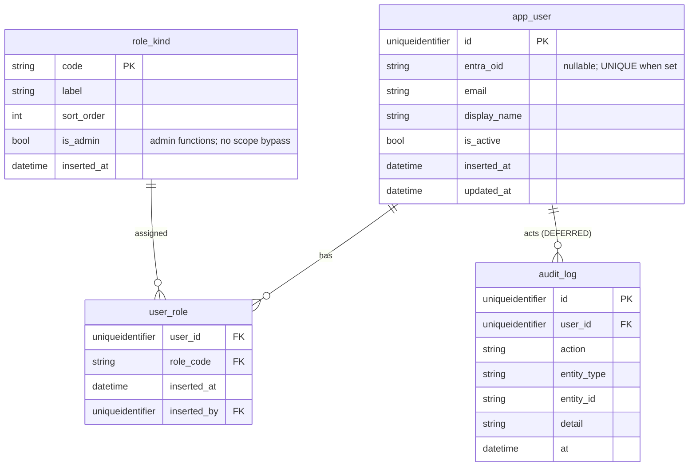
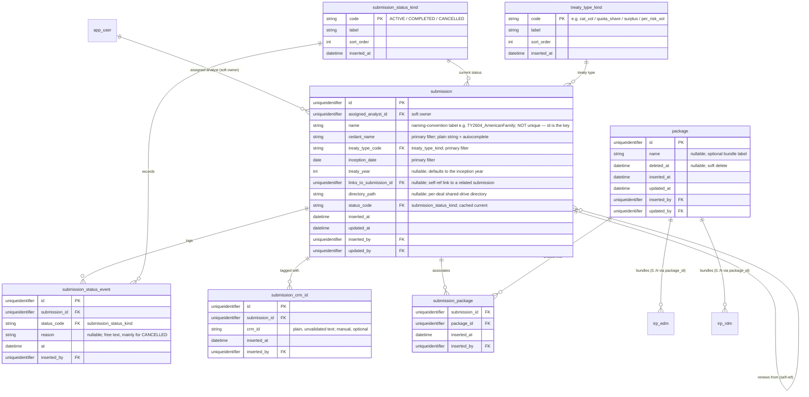
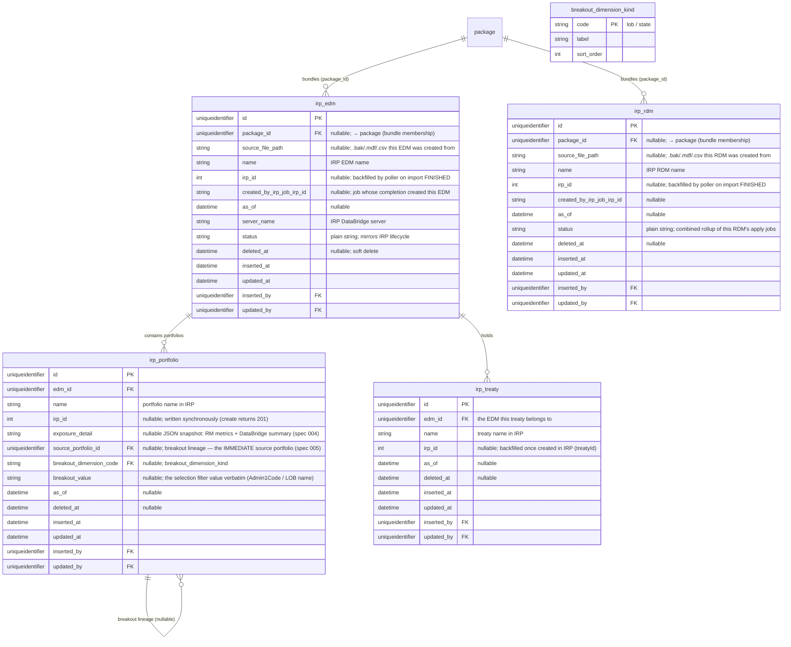
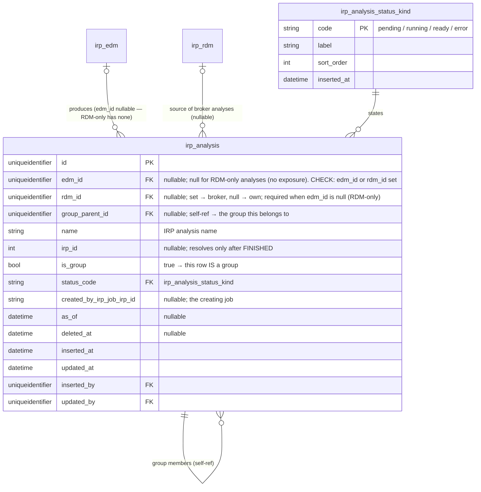
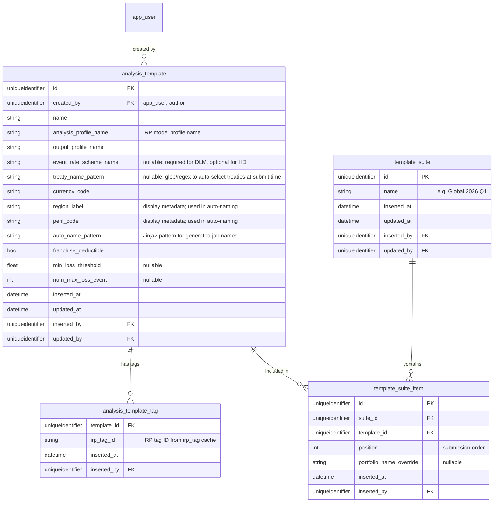
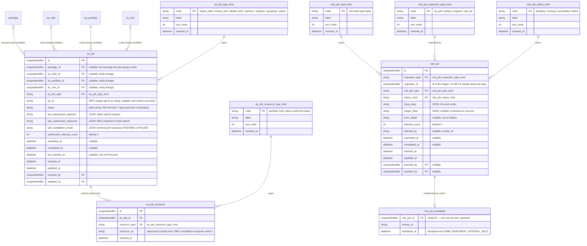
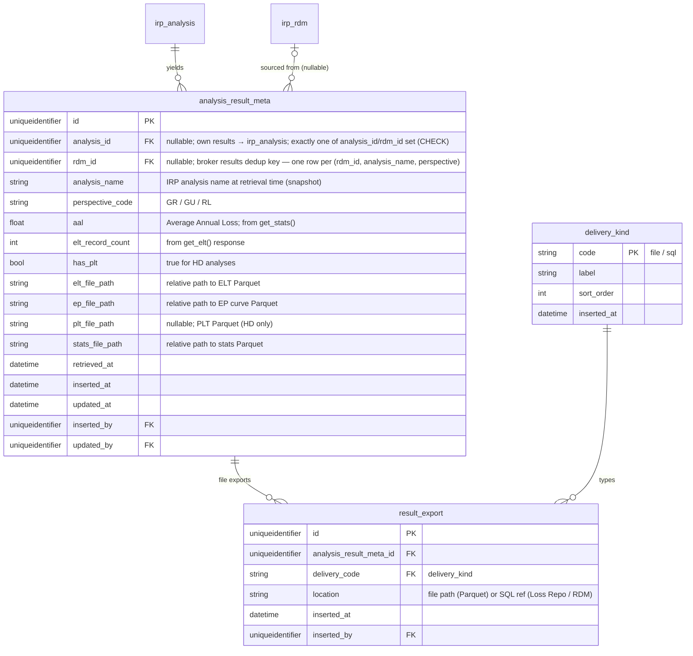
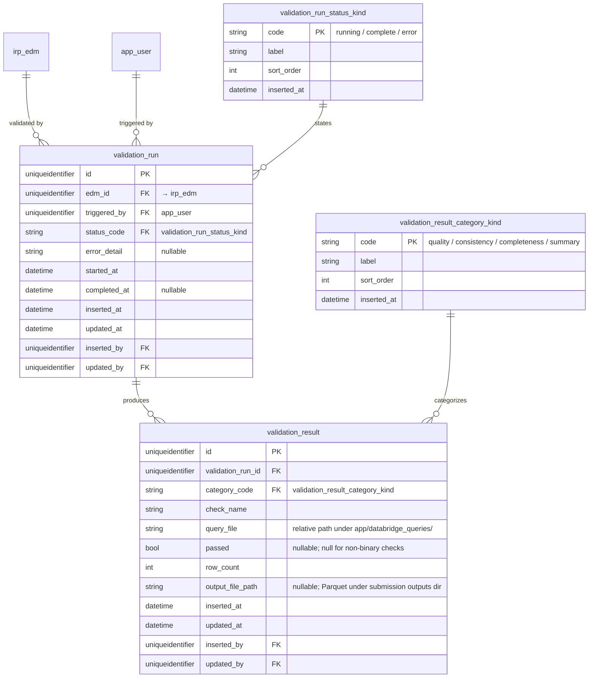

# Data Model — Risk Workbench

Companion to `PRD.md`. This is the schema reference Claude Code turns into migrations. Change rationale and history live in `docs/CR/`.

---

## 1. Database connections

All database access goes through the `db/` package. App code calls `get_connection("WORKBENCH" | "EXPOSURE" | "LOSS" | "DATABRIDGE")` — no URL strings in application code. Each named connection is configured via `MSSQL_{NAME}_*` env vars (`SERVER`, `USER`, `PASSWORD`, `DATABASE`; optional `PORT` default 1433, `AUTH_TYPE` default `SQL`).

| Named connection | Database | Managed by |
|---|---|---|
| `WORKBENCH` | Workbench metamodel (this schema) | Alembic + app |
| `EXPOSURE` | Exposure repository | App — `db/bootstrap/exposure_schema.sql` |
| `LOSS` | Loss repository | App — `db/bootstrap/loss_schema.sql` |
| `DATABRIDGE` | DataBridge (Moody's cloud) | Moody's — read-only; app code never sends SQL (reads go through irp-integration methods, worker-side; constitution Art. 11 v3.1.0); never DDL |

- **Pooling:** `MSSQL_POOL_SIZE` (default 5), `MSSQL_POOL_MAX_OVERFLOW` (default 5), `MSSQL_POOL_RECYCLE` (default 1800s). For 30 concurrent users: `POOL_SIZE=10`, `MAX_OVERFLOW=20`.
- **Dev DB strategy:** drop-create-seed via a single Alembic revision (`0001_initial.py`) until production cutover. `EXPOSURE`/`LOSS` are bootstrapped by idempotent SQL scripts (`python -m app.cli bootstrap-exposure` / `bootstrap-loss`); they are not under Alembic. `DATABRIDGE` is never migrated or bootstrapped; the app reads it only through irp-integration client methods (worker-side, constitution Art. 11 v3.1.0), never raw SQL.
- **Redis:** `REDIS_URL` (default `redis://localhost:6379/0`). Dramatiq broker; stateless.

---

## 2. Conventions

- **Kind tables** (`*_kind`) hold categorical values: `code` (PK), `label`, `sort_order`, optional `icon`/`color`/`is_active`. Categorical columns are FKs to kind tables — never DB enums. External-mirror status columns are the exception (see below).
- **No row-level security.** There is no `customer_id` scoping key, no `apply_scope()`, no per-row access model. Every authenticated analyst can read every submission and everything under it. `submission.assigned_analyst_id` is a soft owner for the "my submissions" filter, not an access gate.
- **Audit fields.** Entity tables carry `inserted_at`, `updated_at`, `inserted_by` (FK → `app_user`, nullable for system rows), `updated_by` (FK → `app_user`, nullable). Kind tables, junction/event/append-only tables carry `inserted_at` (and `inserted_by` where a user is responsible) only.
- **Optimistic concurrency.** On analyst-editable rows (chiefly `submission`), `updated_at` is the version marker: updates write `WHERE id = :id AND updated_at = :read_value`; rowcount 0 → reject and surface the conflict. Append-only inserts and single-threaded machinery are exempt.
- **Naming.** Singular `snake_case` tables; `id` UUID surrogate PK unless noted; `*_code` FK → matching `*_kind`; `*_id` FK → entity. Every `irp_*` table's own Risk Modeler identifier column is `irp_id`.
- **`as_of`** (nullable datetime) on every `irp_*` entity and reference-cache table signals when the row was last confirmed against Risk Modeler. UI trust signal only. `analysis_result_meta` is the exception — results are immutable, so no drift to signal.
- **Event-sourced status** applies to `submission.status_code` only: a change inserts a `submission_status_event` row and stamps the cached `submission.status_code` in the same transaction (use `get_connection("WORKBENCH")` as a context manager with an explicit `conn.begin()`; never split the two writes). All other status columns are updated in place.
- **File handling is a stored path.** Each EDM/RDM records the shared-drive path it was created from (`source_file_path`); a submission optionally records its staging directory (`directory_path`). No file inventory, versioning, or drift detection.

---

## 3. Auth & users

```mermaid
erDiagram
  app_user ||--o{ user_role : has
  role_kind ||--o{ user_role : assigned
  app_user ||--o{ audit_log : "acts (DEFERRED)"

  app_user {
    uniqueidentifier id PK
    string entra_oid "nullable; UNIQUE when set"
    string email
    string display_name
    bool is_active
    datetime inserted_at
    datetime updated_at
  }
  role_kind {
    string code PK
    string label
    int sort_order
    bool is_admin "admin functions; no scope bypass"
    datetime inserted_at
  }
  user_role {
    uniqueidentifier user_id FK
    string role_code FK
    datetime inserted_at
    uniqueidentifier inserted_by FK
  }
  audit_log {
    uniqueidentifier id PK
    uniqueidentifier user_id FK
    string action
    string entity_type
    string entity_id
    string detail
    datetime at
  }
```

- **`app_user`** is a provisioned user (Entra OID in production, dev stub otherwise). `entra_oid` is `UNIQUE` when set.
- **Roles** are a kind table plus a `user_role` junction. `is_admin` grants admin functions only — there is no scope to bypass.
- **`audit_log` is DEFERRED** — documented, not built.

---

## 4. Submission & Package

The **submission** is the top-level entity — a **deal**: a specific cedant's specific treaty at a specific inception. It carries the deal's identity and filter attributes, is tagged with 0..N CRM IDs, and has one soft-owner analyst. A **package** is a *bundle* of one or more EDMs and/or RDMs — the set of databases that arrive and are worked together (≈ one "RMS" subfolder on the file share); members carry a `package_id`, and any combination is valid (several of each, EDM-only, RDM-only). Submission ↔ package is many-to-many: a deal holds multiple packages, and one package can be reused across deals.

> **Provisional — not yet ratified by CIC.** The July 9 CIC session reopened the top-level organization (design note 03 §2–§3): whether the organizing object is "submission," a looser "project," or nothing (attributes-on-package), and whether a tier sits *above* per-CRM-ID submissions, are **open** (OQ-1/OQ-2, §14). This schema commits to **submission-as-deal with CRM IDs as flat tags** as the shape to *build and react to* — the best-supported option (the file share already has this shape) and low-regret (a "project" tier can be layered above later; CRM-as-tag can be promoted to a level later). Read §4 as a build-to-learn proposal pending the wireframe review, not a closed decision.

```mermaid
erDiagram
  app_user ||--o{ submission : "assigned analyst (soft owner)"
  submission ||--o{ submission_status_event : logs
  submission ||--o{ submission_crm_id : "tagged with"
  submission_status_kind ||--o{ submission : "current status"
  submission_status_kind ||--o{ submission_status_event : records
  treaty_type_kind ||--o{ submission : "treaty type"
  submission ||--o{ submission : "renews from (self-ref)"
  submission ||--o{ submission_package : associates
  package ||--o{ submission_package : "shared into"
  package ||--o{ irp_edm : "bundles (0..N via package_id)"
  package ||--o{ irp_rdm : "bundles (0..N via package_id)"

  submission {
    uniqueidentifier id PK
    uniqueidentifier assigned_analyst_id FK "soft owner"
    string name "naming-convention label e.g. TY2604_AmericanFamily; NOT unique — id is the key"
    string cedant_name "primary filter; plain string + autocomplete"
    string treaty_type_code FK "treaty_type_kind; primary filter"
    date inception_date "primary filter"
    int treaty_year "nullable; defaults to the inception year"
    uniqueidentifier links_to_submission_id FK "nullable; self-ref link to a related submission"
    string directory_path "nullable; per-deal shared-drive directory"
    string status_code FK "submission_status_kind; cached current"
    datetime inserted_at
    datetime updated_at
    uniqueidentifier inserted_by FK
    uniqueidentifier updated_by FK
  }
  submission_crm_id {
    uniqueidentifier id PK
    uniqueidentifier submission_id FK
    string crm_id "plain, unvalidated text; manual, optional"
    datetime inserted_at
    uniqueidentifier inserted_by FK
  }
  treaty_type_kind {
    string code PK "e.g. cat_xol / quota_share / surplus / per_risk_xol"
    string label
    int sort_order
    datetime inserted_at
  }
  submission_status_kind {
    string code PK "ACTIVE / COMPLETED / CANCELLED"
    string label
    int sort_order
    datetime inserted_at
  }
  submission_status_event {
    uniqueidentifier id PK
    uniqueidentifier submission_id FK
    string status_code FK "submission_status_kind"
    string reason "nullable; free text, mainly for CANCELLED"
    datetime at
    uniqueidentifier inserted_by FK
  }
  submission_package {
    uniqueidentifier submission_id FK
    uniqueidentifier package_id FK
    datetime inserted_at
    uniqueidentifier inserted_by FK
  }
  package {
    uniqueidentifier id PK
    string name "nullable; optional bundle label"
    datetime deleted_at "nullable; soft delete"
    datetime inserted_at
    datetime updated_at
    uniqueidentifier inserted_by FK
    uniqueidentifier updated_by FK
  }
```

**Submission:**
- **`submission` is the root.** No hierarchy above it. `cedant_name`, `treaty_type_code`, and `inception_date` are the primary filters; `treaty_year` defaults to the inception year and supports renewal-year grouping. These are the system of record — there is no CRM/treaty-system integration to derive them from.
- **`cedant_name` is a plain string**, kept consistent by autocomplete over existing values — deliberately not its own table.
- **`submission_crm_id`** holds 0..N CRM-ID tags at the submission level. A package's effective CRM IDs derive from the submission it is viewed under.
- **`links_to_submission_id`** is a manual, nullable self-reference to a related submission — usually last year's deal for the same cedant and treaty type, but not necessarily a renewal (design note 08 CR8, superseding the earlier `renews_from_submission_id`). Most deals have none. The analyst picks the related deal by name; a submission cannot link to itself (`ck_submission_no_self_link`).
- **`submission.name` is NOT unique.** Two genuinely distinct deals can share every naming-convention attribute (same cedant, inception, treaty type) and differ only by the manual/optional CRM ID (design note 03 §4). The UUID `id` is the key; create/rename runs a **non-blocking** "a similar deal already exists" warning, never a hard reject. *(Unlike the EDM/RDM name-collision check, which is **blocking** as of 2026-07-27 — issue #17, §5.)*
- **Status** is `ACTIVE` / `COMPLETED` / `CANCELLED`, event-sourced, no system-enforced transition preconditions (`COMPLETED → ACTIVE` allowed). **There is no delete** — a submission can carry real Risk Modeler assets; `CANCELLED` is the withdrawal state.

**Package:**
- **A package is a bundle, not a pair.** It holds **any combination** of EDMs and RDMs — several of each, EDM-only, or RDM-only (design note 03 §6.1, correcting the earlier one-EDM-one-RDM assumption). Membership lives on the child rows: `irp_edm.package_id` and `irp_rdm.package_id` (both nullable FKs → `package`). There is **no** `edm_id`/`rdm_id` on `package`.
- **The ≥1-member rule is an app-enforced invariant, not a column CHECK.** A package must have at least one EDM or RDM pointing at it; the creation flow requires selecting ≥1 file, and a package left with no members is treated as empty (soft-deleted / ignored). A single two-column CHECK can no longer express this once membership spans two child tables.
- **EDM vs RDM are asymmetric (design note 03 / July 9).** An EDM is a **DataBridge SQL database** (persistent, storage-limited, never duplicated). An RDM is a broker results *file* we track — importing it is **not** a DataBridge asset; it creates analyses — on an EDM when one is supplied, or with **no EDM** for a review-only RDM-only import (the analyses exist, they just have no exposure). An RDM in a bundle is applied to **every** EDM in that bundle (full grid, derived from membership); the EDM↔RDM associations live in the apply jobs (§8) and the resulting `irp_analysis` rows (§6), never as a stored pair table.
- **Many-to-many with submission via `submission_package`** (composite PK `(submission_id, package_id)`). EDM/RDM entities reach `submission` transitively through `package` → `submission_package`. Reuse across deals is reuse of the *package* (the bundle attaches to multiple submissions), not the same EDM placed in two packages.
- **No status column.** Each EDM and RDM carries its own `status`; the UI displays the members' status chips rather than caching an aggregate.
- **Soft delete** via `deleted_at`, consistent with `submission`.

**Package actions** (enqueue `rwb_job` rows, §8):
- **Save** — persist the package and any edited EDM/RDM names (runs the **blocking** name-collision check — a hit rejects the save, issue #17). No job.
- **Save and Sync** — one `upload_edm` job per EDM plus one `upload_rdm` (apply) job **per (EDM × RDM) pair** in the bundle (full grid). Ordering is **per-pair, not global**: each `upload_rdm(R→E)` waits only for `E`'s `upload_edm` to succeed, so applications fan out in parallel as each EDM lands. The old "EDM is always *the* single head job / all EDMs before all RDMs" rule is gone. A review-only RDM (no EDM in the bundle) submits a single `upload_rdm` with no EDM.
- **Delete** — the two sides are now independent (no shared DataBridge asset): deleting an **EDM** drops its DataBridge database and cascades to the analyses on it (own + broker); deleting an **RDM** removes only the broker analyses it created across EDMs. When the last member-delete job succeeds, the `package` row is stamped `deleted_at`.

---

## 5. EDM, RDM, Portfolio & Treaty

`irp_edm`, `irp_rdm`, `irp_portfolio`, and `irp_treaty` are the entities the app creates in Risk Modeler and must list, name, and track. The EDM is the modeling anchor — portfolios, treaties, and analyses all belong to one EDM.

```mermaid
erDiagram
  package ||--o{ irp_edm : "bundles (package_id)"
  package ||--o{ irp_rdm : "bundles (package_id)"
  irp_edm ||--o{ irp_portfolio : "contains portfolios"
  irp_portfolio ||--o{ irp_portfolio : "breakout lineage (nullable)"
  irp_edm ||--o{ irp_treaty : holds

  irp_edm {
    uniqueidentifier id PK
    uniqueidentifier package_id FK "nullable; → package (bundle membership)"
    string source_file_path "nullable; .bak/.mdf/.csv this EDM was created from"
    string name "IRP EDM name"
    int irp_id "nullable; backfilled by poller on import FINISHED"
    string created_by_irp_job_irp_id "nullable; job whose completion created this EDM"
    datetime as_of "nullable"
    string server_name "IRP DataBridge server"
    string status "plain string; mirrors IRP lifecycle"
    datetime deleted_at "nullable; soft delete"
    datetime inserted_at
    datetime updated_at
    uniqueidentifier inserted_by FK
    uniqueidentifier updated_by FK
  }
  irp_rdm {
    uniqueidentifier id PK
    uniqueidentifier package_id FK "nullable; → package (bundle membership)"
    string source_file_path "nullable; .bak/.mdf/.csv this RDM was created from"
    string name "IRP RDM name"
    int irp_id "nullable; backfilled by poller on import FINISHED"
    string created_by_irp_job_irp_id "nullable"
    datetime as_of "nullable"
    string status "plain string; combined rollup of this RDM's apply jobs"
    datetime deleted_at "nullable"
    datetime inserted_at
    datetime updated_at
    uniqueidentifier inserted_by FK
    uniqueidentifier updated_by FK
  }
  irp_portfolio {
    uniqueidentifier id PK
    uniqueidentifier edm_id FK
    string name "portfolio name in IRP"
    int irp_id "nullable; written synchronously (create returns 201)"
    string exposure_detail "nullable JSON snapshot: RM metrics + DataBridge summary (spec 004)"
    uniqueidentifier source_portfolio_id FK "nullable; breakout lineage — the IMMEDIATE source portfolio (spec 005)"
    string breakout_dimension_code FK "nullable; breakout_dimension_kind"
    string breakout_value "nullable; the selection filter value verbatim (Admin1Code / LOB name)"
    datetime as_of "nullable"
    datetime deleted_at "nullable"
    datetime inserted_at
    datetime updated_at
    uniqueidentifier inserted_by FK
    uniqueidentifier updated_by FK
  }
  breakout_dimension_kind {
    string code PK "lob / state"
    string label
    int sort_order
  }
  irp_treaty {
    uniqueidentifier id PK
    uniqueidentifier edm_id FK "the EDM this treaty belongs to"
    string name "treaty name in IRP"
    int irp_id "nullable; backfilled once created in IRP (treatyId)"
    datetime as_of "nullable"
    datetime deleted_at "nullable"
    datetime inserted_at
    datetime updated_at
    uniqueidentifier inserted_by FK
    uniqueidentifier updated_by FK
  }
```

- **`source_file_path`** is the whole file-handling model (no `file_artifact`, no versioning). It may point to a `.bak`, `.mdf`, or `.csv`; CSV-sourced results are handled the same way (the IRP integration differs under the hood).
- **`irp_rdm` has no `edm_id`.** An RDM is applied to *every* EDM in its package (full grid), so it has no single owning EDM; the EDM associations live in the apply jobs (§8) and the resulting `irp_analysis` rows (§6). A review-only RDM (imported with no EDM) still creates analyses — they simply have no `edm_id` (§6). `irp_rdm.status` is a **combined rollup** of its apply jobs.
- **`status`** on EDM/RDM is a plain string (mirrors IRP's own EDM/RDM lifecycle vocabulary, which can drift): `pending_import` / `importing` / `ready` / `error` / `delete_pending` / `deleted`.
- **`created_by_irp_job_irp_id`** links EDM/RDM back to the async import job that created the entity. `irp_portfolio` and `irp_treaty` have none — their creation is synchronous.
- **Name-collision check.** Setting or renaming an EDM/RDM name runs `client.edm.search_edms()` / `search_rdms()` — **blocking** since 2026-07-27 (issue #17, spec 003 FR-012 as amended): a hit rejects the save/sync (irp-integration ≥ 0.2.1 would fail the submit anyway). When Risk Modeler is unreachable the check fails open with a visible warning and the worker-side submit validation is the backstop.
- **Treaty** is referenced by analyses **by name**; create/edit is synchronous (`search_treaties` / `create_treaty` / `create_treaty_lob`). Creating a treaty with its lines of business is a **1 + N** call pattern and is **non-atomic** — a partial failure leaves some LOBs missing; the UI lets the analyst retry the remainder.
- **Breakout lineage (spec 005).** The three lineage columns are set together for breakout-generated portfolios and all NULL for broker-arrived ones. `source_portfolio_id` records the **immediate source only** — a portfolio generated from a generated portfolio points at its direct parent, and chained lineage is read by walking the chain, never rendered as one. `breakout_value` is the selection filter value verbatim: the state code (`Admin1Code`) for geography, the LOB name for line of business — display resolves the value's label (`Admin1Name`) at read time from the source portfolio's stored summary, and no label is stored on the row (P-12 as revised 2026-08-05). The filtered unique index `uq_irp_portfolio_breakout (source_portfolio_id, breakout_dimension_code, breakout_value) WHERE source_portfolio_id IS NOT NULL AND deleted_at IS NULL` is the idempotency key — one live generated portfolio per (source, dimension, value).
- **`irp_portfolio.inserted_by` is populated for breakout-generated portfolios** (the confirming analyst, carried in the breakout job's `input_data.actor_id`) — the first writer to use that column on this table.
- **`exposure_detail`** (spec 004) is the per-portfolio JSON snapshot the `backfill_edm_detail` worker stores: RM's `/metrics` payload plus the DataBridge exposure summary, read defensively by the web layer. Spec 005 extends the summary with `breakout_values` (per-dimension value lists keyed by `breakout_dimension_kind.code`, each value carrying an account count and a nullable display label), `account_total`, and `breakout_coverage` (per dimension: the accounts carrying at least one value and the accounts carrying more than one, counted per account for the breakout preview's overlap statement), captures the portfolio's RM `stampDate` alongside it, and switches the summary's `states` list to state codes (`Admin1Code`).

---

## 6. Analysis (`irp_analysis`)

An analysis belonging to an EDM — or, for an RDM-only import, to an RDM with no EDM (`edm_id` null). When `is_group = true`, the row *is* a group (a group is an analysis in Risk Modeler, viewed/exported identically). Creation is async, so the table carries creation lineage.

```mermaid
erDiagram
  irp_edm |o--o{ irp_analysis : "produces (edm_id nullable — RDM-only has none)"
  irp_rdm |o--o{ irp_analysis : "source of broker analyses (nullable)"
  irp_analysis ||--o{ irp_analysis : "group members (self-ref)"
  irp_analysis_status_kind ||--o{ irp_analysis : states

  irp_analysis {
    uniqueidentifier id PK
    uniqueidentifier edm_id FK "nullable; null for RDM-only analyses (no exposure). CHECK: edm_id or rdm_id set"
    uniqueidentifier rdm_id FK "nullable; set → broker, null → own; required when edm_id is null (RDM-only)"
    uniqueidentifier group_parent_id FK "nullable; self-ref → the group this belongs to"
    string name "IRP analysis name"
    int irp_id "nullable; resolves only after FINISHED"
    bool is_group "true → this row IS a group"
    string status_code FK "irp_analysis_status_kind"
    string created_by_irp_job_irp_id "nullable; the creating job"
    datetime as_of "nullable"
    datetime deleted_at "nullable"
    datetime inserted_at
    datetime updated_at
    uniqueidentifier inserted_by FK
    uniqueidentifier updated_by FK
  }
  irp_analysis_status_kind {
    string code PK "pending / running / ready / error"
    string label
    int sort_order
    datetime inserted_at
  }
```

- **`edm_id` and `rdm_id` are both nullable, with a CHECK that ≥1 is set.** Three cases: **own** (edm_id set, rdm_id null — analyst-run on an EDM); **broker applied to an EDM** (both set); **broker RDM-only** (edm_id null, rdm_id set — the RDM was imported with no EDM, so its analyses have no exposure). Retrieval works for all three: analyses can be **searched independently and filtered by `sourceRdmName`** (the RDM name supplied at import) together with `exposureName`, via `search_analyses` — so RDM-only analyses with no EDM are enumerable, which is what lets `edm_id` be nullable (reversing the earlier "edm_id NOT NULL because IRP lists only by exposureName" assumption, which was incorrect). *(Confirmed vs `irp-integration` 0.2.0, 2026-07-14: the filter field is `sourceRdmName`, not `rdmName`; spec 003 captures these into a local `irp_analysis` row at import for delete-enumeration.)*
- **Own vs. broker is derived from `rdm_id`** (`null` → own, set → broker), computed in the view layer — no stored `origin` column.
- **A broker RDM applied across M EDMs yields M `irp_analysis` rows** — one per Moody's analysis object (distinct `edm_id`, own `irp_id`, independently editable name), all sharing one `rdm_id`. The full-grid apply (every RDM × every EDM in the package) is derived from `package_id` membership, not stored as pairs. Display groups these by `rdm_id` ("1 broker analysis across 4 EDMs"); the result **data** is deduped by `rdm_id` (§9), so the M rows are handles — not M copies of the broker's static numbers. Never key on name (Moody's allows duplicates and lets them be edited); key on `irp_id`. (An **RDM-only** import has no EDMs, so its analyses are the RDM's own — `edm_id` null, `rdm_id` set.)
- **`status_code` is a kind table** (app-defined vocabulary), unlike the plain-string EDM/RDM `status`.

---

## 7. Analysis templates & suites

Saved analysis-job configurations for batch submission — a worldwide contract can need 50–150+ model/region/peril/treaty combinations. Templates and suites are **global** (visible to all analysts); `created_by` records authorship only.

```mermaid
erDiagram
  app_user ||--o{ analysis_template : "created by"
  analysis_template ||--o{ analysis_template_tag : "has tags"
  template_suite ||--o{ template_suite_item : contains
  analysis_template ||--o{ template_suite_item : "included in"

  analysis_template {
    uniqueidentifier id PK
    uniqueidentifier created_by FK "app_user; author"
    string name
    string analysis_profile_name "IRP model profile name"
    string output_profile_name
    string event_rate_scheme_name "nullable; required for DLM, optional for HD"
    string treaty_name_pattern "nullable; glob/regex to auto-select treaties at submit time"
    string currency_code
    string region_label "display metadata; used in auto-naming"
    string peril_code "display metadata; used in auto-naming"
    string auto_name_pattern "Jinja2 pattern for generated job names"
    bool franchise_deductible
    float min_loss_threshold "nullable"
    int num_max_loss_event "nullable"
    datetime inserted_at
    datetime updated_at
    uniqueidentifier inserted_by FK
    uniqueidentifier updated_by FK
  }
  analysis_template_tag {
    uniqueidentifier template_id FK
    string irp_tag_id "IRP tag ID from irp_tag cache"
    datetime inserted_at
    uniqueidentifier inserted_by FK
  }
  template_suite {
    uniqueidentifier id PK
    string name "e.g. Global 2026 Q1"
    datetime inserted_at
    datetime updated_at
    uniqueidentifier inserted_by FK
    uniqueidentifier updated_by FK
  }
  template_suite_item {
    uniqueidentifier id PK
    uniqueidentifier suite_id FK
    uniqueidentifier template_id FK
    int position "submission order"
    string portfolio_name_override "nullable"
    datetime inserted_at
    uniqueidentifier inserted_by FK
  }
```

- Profile/scheme fields map directly to `client.analysis.submit_portfolio_analysis_job()` parameters. `event_rate_scheme_name` is required for DLM, optional for HD (detected from `irp_model_profile.software_version_code`: `"HD" in code` → HD, else DLM).
- `treaty_name_pattern` auto-selects treaty names from the EDM at submit time; `auto_name_pattern` generates each job's name, evaluated against submission context.

---

## 8. IRP jobs & RWB jobs

**`irp_job`** tracks one IRP async operation running remotely in Moody's SaaS (one row per real IRP op). **`rwb_job`** tracks app-side work this app executes in-process (a Dramatiq worker). The two are fully decoupled — no FK between them.

```mermaid
erDiagram
  package |o--o{ irp_job : "grouped under (nullable)"
  irp_edm |o--o{ irp_job : "entity lineage (nullable)"
  irp_portfolio ||--o{ irp_job : "entity lineage (nullable)"
  irp_rdm |o--o{ irp_job : "entity lineage (nullable)"
  irp_job_type_kind ||--o{ irp_job : types
  irp_job ||--o{ irp_job_resource : "submits resource(s)"
  irp_job_resource_type_kind ||--o{ irp_job_resource : types
  rwb_job_type_kind ||--o{ rwb_job : types
  rwb_job_requestor_type_kind ||--o{ rwb_job : "requested by"
  rwb_job_status_kind ||--o{ rwb_job : states
  rwb_job ||--o| rwb_job_heartbeat : "heartbeated by worker"

  irp_job {
    uniqueidentifier id PK
    uniqueidentifier package_id FK "nullable; the package this job groups under"
    uniqueidentifier irp_edm_id FK "nullable; entity lineage"
    uniqueidentifier irp_portfolio_id FK "nullable; entity lineage"
    uniqueidentifier irp_rdm_id FK "nullable; entity lineage"
    string irp_job_type FK "irp_job_type_kind"
    string irp_id "IRP's integer job id as string; nullable until submit succeeds"
    string status "plain string; RM-mirrored + app-local (see vocabulary)"
    string last_submission_payload "JSON; latest submit request"
    string last_submission_response "JSON; RM's response to that submit"
    string last_completion_result "JSON; terminal poll response (FINISHED or FAILED)"
    int submission_attempt_count "default 0"
    datetime submitted_at "nullable"
    datetime completed_at "nullable"
    datetime last_tracked_at "nullable; null until first poll"
    datetime inserted_at
    datetime updated_at
    uniqueidentifier inserted_by FK
    uniqueidentifier updated_by FK
  }
  irp_job_resource {
    uniqueidentifier id PK
    uniqueidentifier irp_job_id FK
    string resource_type FK "irp_job_resource_type_kind"
    string resource_uri "captured at submit time; RM's completion response omits it"
    datetime inserted_at
  }
  irp_job_type_kind {
    string code PK "import_edm / import_rdm / delete_edm / geohaz / analysis / grouping / export"
    string label
    int sort_order
    datetime inserted_at
  }
  irp_job_resource_type_kind {
    string code PK "portfolio (only value confirmed today)"
    string label
    int sort_order
    datetime inserted_at
  }
  rwb_job {
    uniqueidentifier id PK
    string requestor_type FK "rwb_job_requestor_type_kind"
    uniqueidentifier requestor_id "id of the trigger; no DB FK (target varies by type)"
    string rwb_job_type FK "rwb_job_type_kind"
    string status_code FK "rwb_job_status_kind"
    string input_data "JSON; the work order"
    string output_data "JSON, nullable; produced on success"
    string error_detail "nullable; set on failure"
    int attempt_count "default 0"
    string claimed_by "nullable; worker_id"
    datetime submitted_at "nullable"
    datetime completed_at "nullable"
    datetime inserted_at
    datetime updated_at
    uniqueidentifier inserted_by FK "nullable"
    uniqueidentifier updated_by FK "nullable"
  }
  rwb_job_requestor_type_kind {
    string code PK "irp_job / analyst_request / rwb_job"
    string label
    int sort_order
    datetime inserted_at
  }
  rwb_job_type_kind {
    string code PK "see work-type table"
    string label
    int sort_order
    datetime inserted_at
  }
  rwb_job_heartbeat {
    uniqueidentifier rwb_job_id FK "UNIQUE — one row per job; upserted"
    string worker_id
    datetime heartbeat_at "stamped every RWB_HEARTBEAT_INTERVAL_SECS"
  }
  rwb_job_status_kind {
    string code PK "pending / running / succeeded / failed"
    string label
    int sort_order
    datetime inserted_at
  }
```

**`irp_job`:**
- **Grain is the package** (nullable `package_id`), not the submission. Entity-lineage FKs are populated per job type: EDM import → `irp_edm_id`; **RDM import/apply → `irp_rdm_id` + `irp_edm_id`, one job per EDM the RDM is applied to** (full grid = every RDM × every EDM in the package; a review-only RDM import omits `irp_edm_id`); portfolio/GeoHaz → `irp_portfolio_id` (+ `irp_edm_id`).
- **`irp_job_type` is a kind table** (closed, app-defined) but **`status` is a plain string** — RM can add status values at any time, and an unknown value must not crash the poller.
- **`status` vocabulary:** RM non-terminal `PENDING`/`QUEUED`/`RUNNING`/`CANCEL_REQUESTED`/`CANCELLING`; RM terminal `FINISHED` (only success)/`FAILED`/`CANCELLED`; app-local non-terminal `UNSUBMITTED`/`SUBMITTING`/`BLOCKED`; app-local terminal `SUBMISSION FAILED` (never reached RM — no `irp_id`). `SUBMISSION FAILED` vs `FAILED` distinguishes submit-side failure from RM-ran-it-and-failed.
- **`irp_job_resource`** carries the typed `(resource_type, resource_uri)` submit payload; the URI must be captured at submit time (RM's completion response omits it).

**`rwb_job`:**
- **`requestor_type` + `requestor_id`** discriminate the trigger: `irp_job` completion, an analyst action, or a chained parent `rwb_job`. `requestor_id` has no DB FK (target varies by type). Dedup / chaining key: `UNIQUE(requestor_type, requestor_id, rwb_job_type)`.
- **Worker lifecycle:** claim atomically (`UPDATE ... SET status_code='running' WHERE id=:id AND status_code='pending'`; rowcount 0 → already claimed), heartbeat via a daemon thread, set `succeeded`/`failed`, create chained tail rows on success. Stale `running` rows (heartbeat older than `RWB_HEARTBEAT_STALE_SECS`) are recovered by the reconciler in the poller.

| `rwb_job_type` | Worker responsibility | Chains to |
|---|---|---|
| `upload_edm` | Package sync — submit `import_edm` for one EDM | `upload_rdm` *(poller-mediated on `import_edm` FINISHED)* |
| `upload_rdm` | Package sync — submit `import_rdm` (apply) per RDM onto the just-finished EDM | `retrieve_analysis_results` *(Iteration 6; poller-mediated on `import_rdm` FINISHED)* |
| `retrieve_analysis_results` | `get_elt/ep/stats/plt()` per perspective; write Parquet + `analysis_result_meta` | `download_export_file` |
| `download_export_file` | Download Parquet export | — |
| `push_results_to_loss_repo` | Read Parquet; write to LOSS DB | — |
| `notify_analyst` | Teams webhook and/or email | — |
| `delete_rdm` | Package delete — **synchronously** delete one RDM's analysis entities (no `irp_job`, no polling) | `delete_edm` *(app-side fan-in: when all the package's RDM removals have succeeded)* |
| `delete_edm` | Package delete — submit the asynchronous `delete_edm` Risk Modeler job for one EDM (guarded on all RDM removals) | package soft-delete *(poller-mediated on `delete_edm` FINISHED; when no live members remain)* |

> **Chaining across the IRP-job/RWB-job boundary is poller-mediated for every *asynchronous* op (A21, resolved 2026-07-13).** A package worker that submits an async IRP op (`upload_edm`, `upload_rdm`, `delete_edm`) succeeds once it has **submitted** that op (not when it finishes); the intervening `irp_job` is tracked by the poller, which writes the dependent `rwb_job` head row when it observes that `irp_job` reach `FINISHED`. **RDM delete is the exception:** it is a *synchronous* Risk Modeler operation with no `irp_job`, so `delete_rdm` does its work inline and the RDM→EDM fan-in is detected app-side on worker success (not by the poller). The "Chains to" column above is therefore poller-mediated except for the `delete_rdm` row — see **Package sync/delete chaining** below.

**Flows:**
- **Submit (request path):** on success, write `irp_job` with `irp_id`, `status='QUEUED'`, any `irp_job_resource` rows; on failure, `irp_id=null`, `status='SUBMISSION FAILED'`. A single-threaded `submission_retry` batch job re-attempts `SUBMISSION FAILED` rows (`< IRP_SUBMISSION_MAX_RETRIES`, default 3) with backoff.
- **Poller:** query non-terminal jobs grouped by `irp_job_type`, poll each via the single-status-check `get_*_job` method (never `poll_*_to_completion`). On terminal status, backfill entity `irp_id`s and create head `rwb_job` row(s) via idempotent insert on the composite key.

**Package sync/delete chaining (A21, resolved 2026-07-13).** The one flow where an IRP-job completion must trigger the next Risk Modeler operation — and back — is resolved as **lineage chaining with all member ops run as `rwb_job`s and every Risk Modeler call performed by a worker** (not the request path):

1. **Request path (Save-and-Sync / Delete):** insert the initial head `rwb_job` rows with `requestor_type='analyst_request'`, `requestor_id=package.id` — one `upload_edm` per EDM for sync (a review-only RDM with no EDM inserts one `upload_rdm` directly); one `delete_rdm` per RDM for delete (or `delete_edm` per EDM when the package has no RDMs). Return immediately; **no Risk Modeler call on the request path** (Article 11 permits, but does not require, request-path submit — batch/dependent member operations are deferred to workers).
2. **Worker performs its Risk Modeler call, then succeeds:** each package worker makes the matching Risk Modeler call — `upload_edm`→`submit_edm_import_job`, `upload_rdm`→`submit_rdm_import_job` (per RDM applied to that EDM), `delete_edm`→`submit_delete_edm_job` — writes the resulting `irp_job`, and marks its `rwb_job` succeeded; its unit of work is the *submit*, not the remote completion. **`delete_rdm` is different: it performs a *synchronous* delete of the RDM's analysis entities inline, writes no `irp_job`, and succeeds only once that delete has completed.**
3. **Poller bridges the boundary (async ops only):** when the poller observes an `irp_job` reach `FINISHED`, it writes the dependent head `rwb_job` (`requestor_type='irp_job'`, `requestor_id=` the finished `irp_job.id`) via idempotent insert on the composite key — `import_edm` FINISHED → one `upload_rdm` (fans out to an apply per RDM in the package); `delete_edm` FINISHED → package finalize. (There is no `delete_rdm` `irp_job`; the RDM→EDM step is handled app-side in step 4.)
4. **Fan-in is idempotent, never counted:** the `delete_edm` head rows are enqueued only once **all** the package's `delete_rdm` workers have succeeded — each `delete_rdm` worker, on success, runs the app-side check `NOT EXISTS (SELECT 1 FROM irp_rdm WHERE package_id=:p AND status <> 'deleted')` and, if satisfied, enqueues the `delete_edm` rows (idempotent insert on the composite key). Each `delete_edm` worker then submits its Risk Modeler job under an atomic guard (`UPDATE irp_edm SET status='delete_pending' WHERE id=:e AND status NOT IN ('delete_pending','deleted')`; rowcount 0 → already handled). The `package.deleted_at` stamp is an idempotent `UPDATE … WHERE deleted_at IS NULL AND NOT EXISTS (live members)`. A re-poll, worker redelivery, or reconciler re-enqueue cannot double-submit or advance a fan-in early. Sync-side rollup is the same shape: `irp_rdm.status='ready'` once all its `import_rdm` applies are FINISHED.
5. **Recovery:** Save-and-Sync is **idempotent** — it re-inserts head rows only for members not already `ready`/in-flight (re-submitting `error`/unstarted ones). A **per-member retry** re-inserts a single member's head row. **Replacing a failed member's `source_file_path`** and retrying re-imports against the new file (the expected fix for a bad broker `.bak`). Submit-side failures (`SUBMISSION FAILED`, no `irp_id`) are retried by the single-threaded `submission_retry` batch. **EDM delete is asynchronous** (`edm.submit_delete_edm_job(exposure_id)` → pollable id) and followed by the poller via `risk_data_job.get_risk_data_job` (confirmed vs `irp-integration` 0.2.0, 2026-07-14). **RDM delete is synchronous** — the `delete_rdm` worker loops `analysis.delete_analysis(id)` over the RDM's analyses (enumerated from local `irp_analysis` rows captured at import via `search_analyses('sourceRdmName="…" AND exposureName="…"')`, spec 003 D2), with no `irp_job` and no polling.

---

## 9. Analysis results

Row-level data (ELT events, EP curve points, PLT events) is written to Parquet files; SQL stores only the metadata needed for list views and summaries.

```mermaid
erDiagram
  irp_analysis ||--o{ analysis_result_meta : yields
  irp_rdm |o--o{ analysis_result_meta : "sourced from (nullable)"
  analysis_result_meta ||--o{ result_export : "file exports"
  delivery_kind ||--o{ result_export : types

  analysis_result_meta {
    uniqueidentifier id PK
    uniqueidentifier analysis_id FK "nullable; own results → irp_analysis; exactly one of analysis_id/rdm_id set (CHECK)"
    uniqueidentifier rdm_id FK "nullable; broker results dedup key — one row per (rdm_id, analysis_name, perspective)"
    string analysis_name "IRP analysis name at retrieval time (snapshot)"
    string perspective_code "GR / GU / RL"
    float aal "Average Annual Loss; from get_stats()"
    int elt_record_count "from get_elt() response"
    bool has_plt "true for HD analyses"
    string elt_file_path "relative path to ELT Parquet"
    string ep_file_path "relative path to EP curve Parquet"
    string plt_file_path "nullable; PLT Parquet (HD only)"
    string stats_file_path "relative path to stats Parquet"
    datetime retrieved_at
    datetime inserted_at
    datetime updated_at
    uniqueidentifier inserted_by FK
    uniqueidentifier updated_by FK
  }
  result_export {
    uniqueidentifier id PK
    uniqueidentifier analysis_result_meta_id FK
    string delivery_code FK "delivery_kind"
    string location "file path (Parquet) or SQL ref (Loss Repo / RDM)"
    datetime inserted_at
    uniqueidentifier inserted_by FK
  }
  delivery_kind {
    string code PK "file / sql"
    string label
    int sort_order
    datetime inserted_at
  }
```

- **`analysis_name` is a deliberate snapshot** at retrieval time — a later rename does not change what this row says it was called. Names are never a key (Moody's allows duplicates and lets them be edited).
- **Broker results are deduplicated by `rdm_id`, not stored per EDM.** A broker RDM applied across M EDMs produces M `irp_analysis` rows (§5/§6), but its result data is the broker's *static* numbers — identical across those M copies. So result data is retrieved and stored **once per RDM source analysis + perspective**, keyed on `rdm_id`: broker `analysis_result_meta` sets `rdm_id` and leaves `analysis_id` null; the `retrieve_analysis_results` job fires **once per `rdm_id`**; and an idempotent upsert on `(rdm_id, analysis_name, perspective_code)` collapses the M EDM-copies into one row + one set of Parquet files. The M per-EDM `irp_analysis` rows resolve their results through this shared record. (The exact within-RDM source-analysis discriminator is confirmed against the live library when the Iteration-6 retrieval worker is built — `analysis_name` is the working key.)
- **Exactly one of `analysis_id` / `rdm_id` is set** (DB CHECK): `analysis_id` for **own** results (one meta per analysis + perspective — own analyses have genuinely distinct results, no dedup); `rdm_id` for **broker** results (deduped as above).
- **Parquet location:** own results at `{submission_outputs_dir}/{analysis_id}/{perspective_code}/{result_type}.parquet`; broker results at an RDM-keyed, submission-independent path `{OUTPUTS_BASE_DIR}/rdm/{rdm_id}/{analysis_name}/{perspective_code}/{result_type}.parquet` (a package/RDM can be shared across submissions, so broker result data cannot live under one submission's dir — the precise shared-path scheme is an Iteration-6 detail). `result_type ∈ elt|ep|plt|stats`. Exact column schemas come from the live `get_elt/ep/stats/plt()` DataFrames — confirm against the library when the worker is built.

---

## 10. IRP reference cache

Populated by the "Sync IRP Metadata" action; the app never writes to these tables otherwise.

```mermaid
erDiagram
  irp_model_profile {
    uniqueidentifier id PK
    string irp_id
    string name
    string software_version_code "contains 'HD' → HD, else DLM"
    string description "nullable"
    datetime as_of
    datetime inserted_at
    datetime updated_at
  }
  irp_output_profile {
    uniqueidentifier id PK
    string irp_id
    string name
    datetime as_of
    datetime inserted_at
    datetime updated_at
  }
  irp_event_rate_scheme {
    uniqueidentifier id PK
    string irp_id
    string name
    string peril_code "nullable"
    string model_region_code "nullable"
    datetime as_of
    datetime inserted_at
    datetime updated_at
  }
  irp_simulation_set {
    uniqueidentifier id PK
    string irp_id
    string name
    string description "nullable"
    datetime as_of
    datetime inserted_at
    datetime updated_at
  }
  irp_tag {
    uniqueidentifier id PK
    string irp_id
    string name
    datetime as_of
    datetime inserted_at
    datetime updated_at
  }
  irp_currency {
    uniqueidentifier id PK
    string code "ISO 4217 (natural key)"
    string name
    datetime as_of
    datetime inserted_at
    datetime updated_at
  }
  irp_database_server {
    uniqueidentifier id PK
    string name "IRP server name (natural key)"
    datetime as_of
    datetime inserted_at
    datetime updated_at
  }
```

- `irp_currency.code` and `irp_database_server.name` are natural keys — neither has a Moody's-assigned surrogate id, so neither carries an `irp_id`.

---

## 11. Phase A — DataBridge validation — **DEFERRED**

Designed, not built (out of MVP). Validation queries run via `client.databridge` against an imported EDM; row-level output goes to Parquet, metadata to SQL.

```mermaid
erDiagram
  irp_edm ||--o{ validation_run : "validated by"
  app_user ||--o{ validation_run : "triggered by"
  validation_run ||--o{ validation_result : produces
  validation_run_status_kind ||--o{ validation_run : states
  validation_result_category_kind ||--o{ validation_result : categorizes

  validation_run {
    uniqueidentifier id PK
    uniqueidentifier edm_id FK "→ irp_edm"
    uniqueidentifier triggered_by FK "app_user"
    string status_code FK "validation_run_status_kind"
    string error_detail "nullable"
    datetime started_at
    datetime completed_at "nullable"
    datetime inserted_at
    datetime updated_at
    uniqueidentifier inserted_by FK
    uniqueidentifier updated_by FK
  }
  validation_result {
    uniqueidentifier id PK
    uniqueidentifier validation_run_id FK
    string category_code FK "validation_result_category_kind"
    string check_name
    string query_file "relative path under app/databridge_queries/"
    bool passed "nullable; null for non-binary checks"
    int row_count
    string output_file_path "nullable; Parquet under submission outputs dir"
    datetime inserted_at
    datetime updated_at
    uniqueidentifier inserted_by FK
    uniqueidentifier updated_by FK
  }
  validation_run_status_kind {
    string code PK "running / complete / error"
    string label
    int sort_order
    datetime inserted_at
  }
  validation_result_category_kind {
    string code PK "quality / consistency / completeness / summary"
    string label
    int sort_order
    datetime inserted_at
  }
```

---

## 12. Table manifest

| Table | Purpose |
|---|---|
| `app_user` | Provisioned user (Entra OID or dev stub). |
| `role_kind` / `user_role` | Role vocabulary and assignment. |
| `audit_log` | Who did what, when — **DEFERRED**. |
| `submission` | The deal; top-level entity (provisional — see §4 note). `name` is a non-unique label; `id` is the key. |
| `submission_crm_id` | 0..N CRM-ID tags per submission. |
| `treaty_type_kind` | Deal-level treaty-type vocabulary. |
| `submission_status_kind` | `ACTIVE` / `COMPLETED` / `CANCELLED`. |
| `submission_status_event` | Append-only submission status log. |
| `submission_package` | Deal ↔ package M:N join (composite PK). |
| `package` | Bundle of EDMs/RDMs (any combination). Members carry `package_id`; no `edm_id`/`rdm_id` on the package. ≥1-member rule app-enforced. No status column. |
| `irp_edm` | An EDM in IRP (DataBridge SQL DB). `package_id` (bundle), `source_file_path`; status plain string. |
| `irp_rdm` | Broker results file (one row per file; not a DataBridge asset). `package_id` (bundle); no `edm_id`; status = combined rollup of apply jobs. |
| `irp_portfolio` | Portfolio within an EDM; `irp_id` written synchronously. Carries the `exposure_detail` snapshot (spec 004) and breakout lineage (spec 005). |
| `breakout_dimension_kind` | Breakout dimension vocabulary (`lob` / `state`); also the key inside `exposure_detail.summary.breakout_values`. |
| `irp_treaty` | Treaty in IRP, belonging to one EDM; referenced by name. |
| `irp_analysis` | Analysis/group. `edm_id`/`rdm_id` both nullable, CHECK ≥1 (RDM-only → edm_id null); broker/own via `rdm_id`. |
| `irp_analysis_status_kind` | `pending` / `running` / `ready` / `error`. |
| `analysis_template` | Saved analysis-job config (global). |
| `analysis_template_tag` | Tags on a template (junction). |
| `template_suite` / `template_suite_item` | Named ordered collection of templates. |
| `irp_job` | One IRP async op; grain = package (nullable `package_id`). |
| `irp_job_type_kind` | `import_edm`/`import_rdm`/`geohaz`/`analysis`/`grouping`/`export`. |
| `irp_job_resource` / `irp_job_resource_type_kind` | Typed `(resource_type, resource_uri)` submit payload. |
| `rwb_job` | App-side queued work; decoupled from `irp_job`. |
| `rwb_job_requestor_type_kind` | `irp_job`/`analyst_request`/`rwb_job`. |
| `rwb_job_type_kind` | Work-type vocabulary (§8). |
| `rwb_job_heartbeat` | Per-job progress heartbeat (one row per job). |
| `rwb_job_status_kind` | `pending`/`running`/`succeeded`/`failed`. |
| `analysis_result_meta` | Result-set metadata. Own: per (analysis, perspective). Broker: deduped per (`rdm_id`, analysis_name, perspective). Exactly one of `analysis_id`/`rdm_id`. |
| `result_export` | Exported result deliverable. |
| `delivery_kind` | `file` / `sql`. |
| `irp_model_profile` … `irp_database_server` | IRP reference cache (§10). |
| `validation_run` … `validation_result_category_kind` | Phase A validation — **DEFERRED**. |

---

## 13. Kind-table seed checklist

| Kind table | Seeds |
|---|---|
| `role_kind` | `analyst`, `admin` (confirm with team); `admin` has `is_admin=true`. |
| `submission_status_kind` | `ACTIVE`, `COMPLETED`, `CANCELLED`. |
| `treaty_type_kind` | TBD with team (candidates: `cat_xol`, `quota_share`, `surplus`, `per_risk_xol`, `aggregate_xol`, `stop_loss`). |
| `irp_analysis_status_kind` | `pending`, `running`, `ready`, `error`. |
| `irp_job_type_kind` | `import_edm`, `import_rdm`, `delete_edm`, `geohaz`, `analysis`, `grouping`, `export`. (`delete_edm` added for package delete — async, polled like imports. RDM delete is **synchronous** and creates no `irp_job`, so there is no `delete_rdm` job-type kind; A21.) |
| `irp_job_resource_type_kind` | `portfolio` (only value confirmed today). |
| `rwb_job_requestor_type_kind` | `irp_job`, `analyst_request`, `rwb_job`. |
| `rwb_job_type_kind` | `upload_edm`, `upload_rdm`, `backfill_rdm_analyses`, `backfill_edm_detail`, `run_breakout_lob`, `run_breakout_state`, `retrieve_analysis_results`, `download_export_file`, `push_results_to_loss_repo`, `notify_analyst`, `delete_rdm`, `delete_edm`. (`backfill_rdm_analyses` added by spec 003 — captures `irp_analysis` at RDM-import completion for delete-enumeration; D2. `backfill_edm_detail` added by spec 004; the two `run_breakout_*` codes added by spec 005 — one per dimension so the idempotent-enqueue key gives each dimension its own live-job slot per portfolio.) |
| `breakout_dimension_kind` | `lob` (Line of business), `state` (Geography (state)) — spec 005. |
| `rwb_job_status_kind` | `pending`, `running`, `succeeded`, `failed`. |
| `delivery_kind` | `file`, `sql`. |
| `validation_run_status_kind` *(deferred)* | `running`, `complete`, `error`. |
| `validation_result_category_kind` *(deferred)* | `quality`, `consistency`, `completeness`, `summary`. |

**Plain-string status columns (not kind tables):** `irp_job.status`, `irp_edm.status`, `irp_rdm.status` — all mirror IRP-controlled vocabularies that can drift.

---

## 14. Open decisions

- Confirm `role_kind` codes and the `treaty_type_kind` seed list with the team.
- Exposure and Loss repository schemas — defined in this project (`db/bootstrap/*.sql`); columns coordinated with the reporting/downstream teams.
- Exact IRP REST response columns for ELT/EP/PLT/stats — confirm against the live library when `retrieve_analysis_results` is built.
- `irp_job_resource` multiplicity — one-per-job (`portfolio` only today) or genuinely multi-resource?
- Whether `analysis_result_meta` should carry an `irp_portfolio` FK (which portfolio the result was run against).
- ~~Package job sequencing under the bundle model … how a poller-observed IRP-job completion triggers the chained `rwb_job` across the IRP-job/RWB-job boundary (A21).~~ **Resolved 2026-07-13** (spec 003): lineage chaining, member ops run as `rwb_job`s with workers performing every Risk Modeler call, poller-mediated cross-boundary chaining for the asynchronous ops (imports and EDM delete), **synchronous RDM delete** with app-side fan-in, idempotent fan-in, and idempotent-resync + per-member-retry + source-file-replacement recovery. See §8 → **Package sync/delete chaining**.
- **`irp_analysis.edm_id` is nullable** (corrected 2026-07-10): an RDM-only import (no EDM) **does** create analyses — `rdm_id` set, `edm_id` null. Both columns nullable, CHECK ≥1 set. Retrieval is supported: `search_analyses` filters **by `sourceRdmName`** (the RDM name supplied at import) plus `exposureName` (confirmed vs `irp-integration` 0.2.0, 2026-07-14 — the field is `sourceRdmName`, **not** `rdmName`), so no-EDM analyses are enumerable and the `rdm_id`-keyed result dedup (§9) can pull them by RDM. *(Note: RDM-only **import** is deferred by spec 003 pending a library change; the nullable-`edm_id` model stays for when it lands.)*
- Auth-audit trail — `audit_log` is deferred, so state-changing actions currently have no backing log; decide whether auth logging needs a narrow carve-out.

**Reopened by the July 9 CIC session (design note 03; §4 is provisional until these close at the wireframe review):**
- **OQ-1 — Is there a top-level object, and is it "submission," "project," or nothing?** §4 builds submission-as-deal provisionally.
- **OQ-2 — Two-tier or three-tier?** "submission = deal" with CRM as flat tags (current §4), vs. a grouping tier *above* per-CRM-ID submissions (project → submission ≈ CRM ID → package). Close the terminology collision before ratifying the schema.
- **OQ-3 — Durable identity.** CRM ID is the only guaranteed-unique attribute but is manual/optional; everything else can collide. **Resolved for build:** surrogate `id` key + non-unique `name` + soft duplicate warning (§4).
- **OQ-4 — Treaty-type precedence** ("the cat treaty is always at the top … the one we log things under") — model as an attribute or leave display-only? Not modeled today.
- **Captured for Iteration 2 (behavior, not schema-blocking):** multi-select import; delete-after-transfer checkbox for temporary BAKs; duplicate-and-rename EDM (~15%, M&A / test variants); the fuller EDM/RDM naming convention `TY{yy}{mm}_{cedant}_{inforce}_{modelver}_{ver}_{EDM|RDM}` with collision suffixes; CSV-result import capability (pending Moody's).

---

## Change log

- **2026-07-14 — `irp-integration` 0.2.0 method surface confirmed (spec 003).** Read the committed PyPI wheel end-to-end; the library is **manager-based** (`client.edm` / `.rdm` / `.import_job` / `.risk_data_job` / `.analysis`), not flat. Pinned: EDM import `edm.submit_edm_import_job` (getter `import_job.get_import_job`); RDM import `rdm.submit_rdm_import_job` (same getter); EDM delete `edm.submit_delete_edm_job(exposure_id)` (getter `risk_data_job.get_risk_data_job`); **RDM delete `analysis.delete_analysis(id)` per analysis (synchronous)**; enumeration `analysis.search_analyses(filter='sourceRdmName="…" AND exposureName="…"')` — the field is `sourceRdmName`, **not** `rdmName`. Terminal set `FINISHED/FAILED/CANCELLED`. **Review-only / RDM-only import deferred** (0.2.0 requires a target EDM). Spec 003 captures a minimal local `irp_analysis` at RDM-import completion (via a new `backfill_rdm_analyses` `rwb_job_type`) so synchronous delete can enumerate ids locally. Authoritative matrix: `specs/003-edm-rdm-entity-management/contracts/worker-poller.md`.
- **2026-07-13 — A21 resolved + job-type naming normalized (spec 003 / Iteration 2).** Package sync/delete cross-boundary chaining resolved as lineage chaining: member ops run as `rwb_job`s (`upload_edm`/`upload_rdm`/`delete_edm`/`delete_rdm`) with workers performing every Risk Modeler call (nothing on the request path); poller-mediated dependent-`rwb_job` creation on `irp_job` FINISHED for the **asynchronous** ops (imports, EDM delete), and idempotent status-guarded fan-in for EDM-delete-after-RDMs and package soft-delete. **RDM delete is synchronous** — RDM import creates analysis entities rather than a first-class Risk Modeler object, so removal deletes those entities inline; the `delete_rdm` worker does this synchronously with no `irp_job` and no polling, and the RDM→EDM fan-in is detected app-side on worker success. Added only `delete_edm` to `irp_job_type_kind` (async — `submit_delete_edm_job` returns a pollable id; single-status getter is the import/risk-data job getter). **Job-type codes normalized to `<verb>_<entity>`**: `edm_import`→`import_edm`, `rdm_import`→`import_rdm`, `edm_delete`→`delete_edm`, `edm_upload`→`upload_edm`, `rdm_upload`→`upload_rdm` (`delete_edm`/`delete_rdm` already conformed). Recovery = idempotent Save-and-Sync + per-member retry + replace-source-file-and-retry, atop the `submission_retry` batch. See §8 → **Package sync/delete chaining**; closes the A21 open decision in §14.
- **2026-07-10 — July 9 CIC session findings.** **Package regrained from a one-EDM/one-RDM pair to a bundle:** dropped `package.edm_id`/`package.rdm_id`; membership now on `irp_edm.package_id`/`irp_rdm.package_id` (any combination; ≥1 member app-enforced, no column CHECK). **EDM/RDM asymmetry made explicit:** EDM = DataBridge SQL DB; RDM = tracked file, not a DataBridge asset — an RDM applies to every EDM in its bundle (full grid), yielding one `irp_analysis` per Moody's object (`irp_analysis.edm_id` is now **nullable** with a ≥1-of-(edm_id, rdm_id) CHECK, so RDM-only analyses with no EDM are valid); **`irp_rdm.edm_id` dropped**, `irp_rdm.status` is now a combined rollup of its apply jobs. **Broker result data deduped by `rdm_id`** (one meta + one Parquet set per RDM source analysis, not per EDM; `analysis_result_meta.analysis_id` nullable + CHECK exactly one of `analysis_id`/`rdm_id`). **`submission.name` UNIQUE dropped** — surrogate `id` is the key, `name` is a non-unique label with a soft duplicate warning (OQ-3). §4 retoned to **provisional/build-to-learn** — CIC reopened the top-level organization (OQ-1/OQ-2; §14). A formal CR and the spec-002 (Iteration 1) rewrite follow.

- **2026-07-07 — CR-003.** Consolidated to Submission + Package. Dropped `customer`, `program`, all RLS (`customer_id`, `user_customer_access`, `apply_scope()`), and the file-inventory subsystem (`file_artifact`, `discrepancy`, `ignore_rule`, `submission_directory` + their kinds). `submission` became the deal root (added `cedant_name`, `treaty_type_code`, `inception_date`, `treaty_year`, `renews_from_submission_id`, `directory_path`; `name` globally UNIQUE). Added `submission_crm_id`, `treaty_type_kind`, `submission_package` (M:N). `package.edm_id` and `irp_rdm.edm_id` made nullable — EDM-only and RDM-only both valid. File handling → `source_file_path`. `irp_job` regrained to nullable `package_id`. Templates/suites made global.
- **2026-07-06 — Practice-lead review.** `irp_analysis.origin` dropped (derived from `rdm_id`); templates/suites returned to MVP; `.mdf` accepted alongside `.bak`; package delete ordering fixed to one-way (EDM delete depends on its RDMs).
- **2026-07-06 — CR-002.** Removed the Workflow/Stage/Task engine; rebuilt on `irp_job` + `rwb_job` (decoupled, no FK). Renamed `edm`→`irp_edm`, `rdm`→`irp_rdm`; added `irp_treaty`, `irp_analysis`, and the job kind tables. Removed `notification_preference`, `irp_edm_cache`, `reference_table`/`parameter`.
- **2026-07-02 — Pre-Iteration 2.** Introduced event-sourced `submission` status (kind + event table) and the `package` concept.
