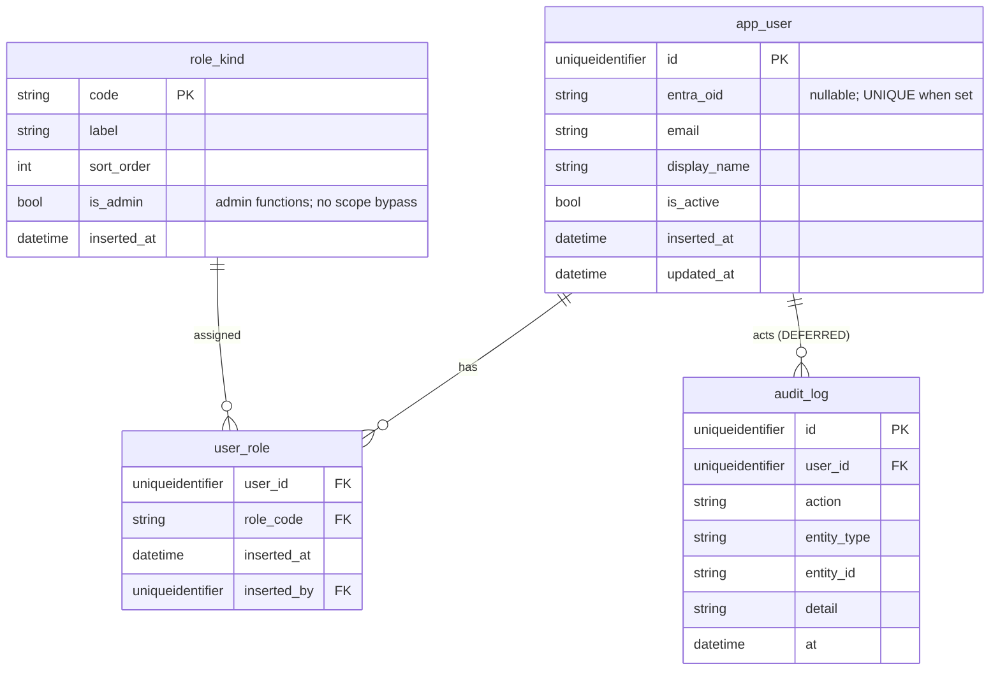
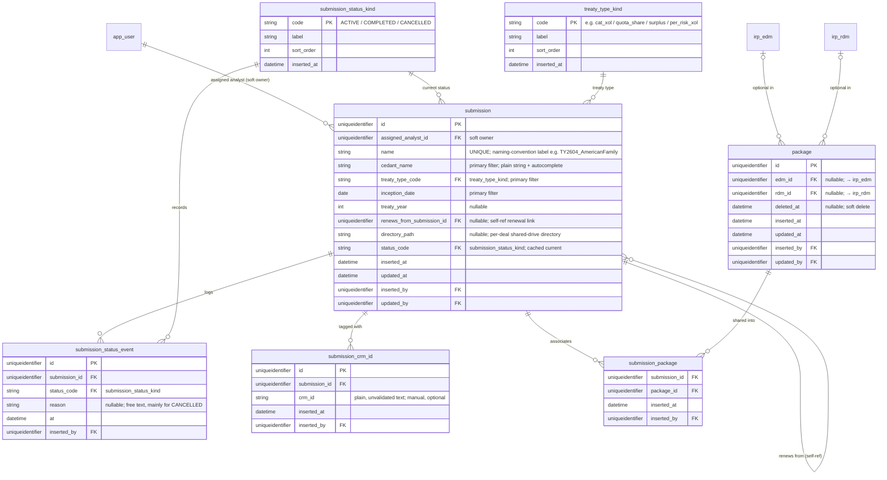
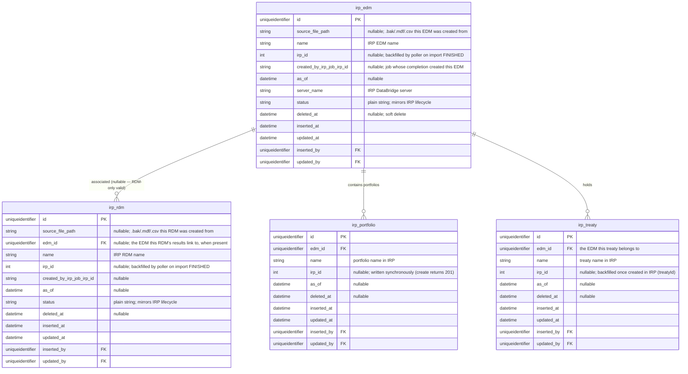
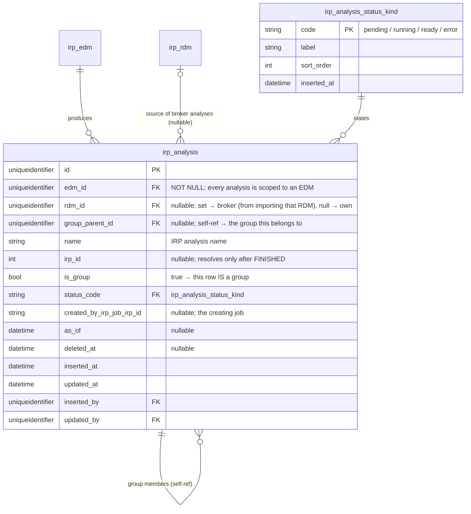
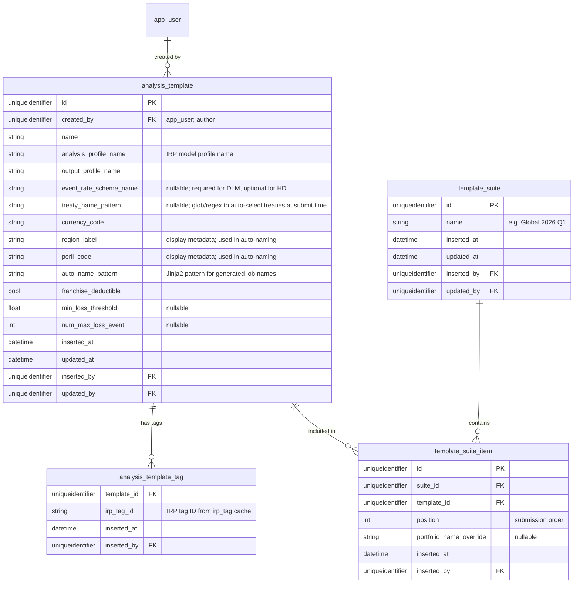
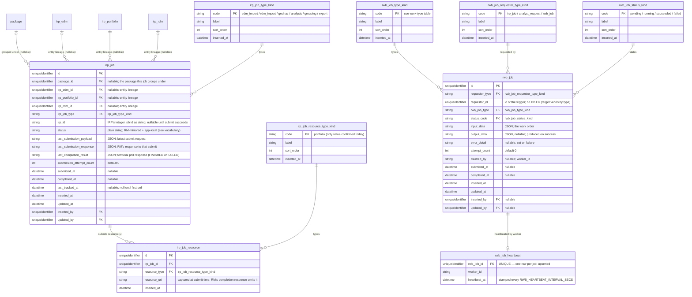
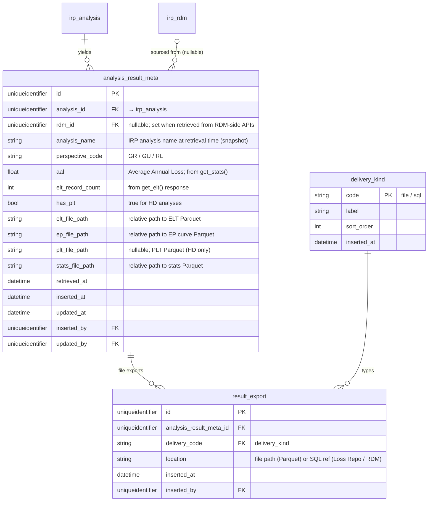
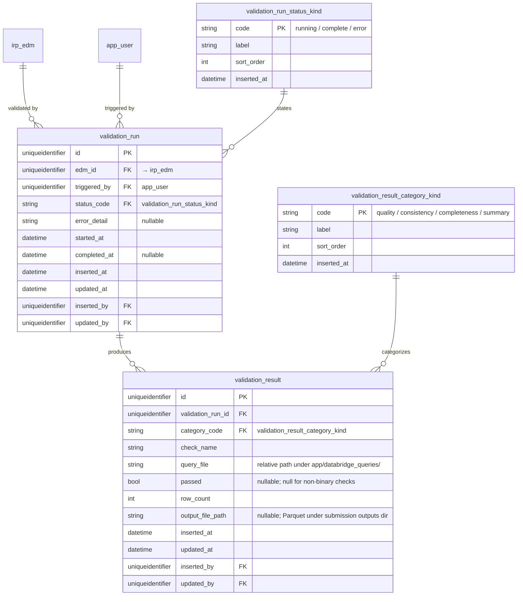

# Data Model — Risk Workbench

Companion to `PRD.md`. This is the schema reference Claude Code turns into migrations. Change rationale and history live in `docs/CR/`.

---

## 1. Database connections

All database access goes through the `db/` package. App code calls `get_connection("WORKBENCH" | "EXPOSURE" | "LOSS" | "DATABRIDGE")` — no URL strings in application code. Each named connection is configured via `MSSQL_{NAME}_*` env vars (`SERVER`, `USER`, `PASSWORD`, `DATABASE`; optional `PORT` default 1433, `AUTH_TYPE` default `SQL`).

| Named connection | Database | Managed by |
|---|---|---|
| `WORKBENCH` | Workbench metamodel (this schema) | Alembic + app |
| `EXPOSURE` | Exposure repository | App — `db/bootstrap/exposure_schema.sql` |
| `LOSS` | Loss repository | App — `db/bootstrap/loss_schema.sql` |
| `DATABRIDGE` | DataBridge (Moody's cloud) | Moody's — read-only, app never runs DDL |

- **Pooling:** `MSSQL_POOL_SIZE` (default 5), `MSSQL_POOL_MAX_OVERFLOW` (default 5), `MSSQL_POOL_RECYCLE` (default 1800s). For 30 concurrent users: `POOL_SIZE=10`, `MAX_OVERFLOW=20`.
- **Dev DB strategy:** drop-create-seed via a single Alembic revision (`0001_initial.py`) until production cutover. `EXPOSURE`/`LOSS` are bootstrapped by idempotent SQL scripts (`python -m app.cli bootstrap-exposure` / `bootstrap-loss`); they are not under Alembic. `DATABRIDGE` is never migrated or bootstrapped.
- **Redis:** `REDIS_URL` (default `redis://localhost:6379/0`). Dramatiq broker; stateless.

---

## 2. Conventions

- **Kind tables** (`*_kind`) hold categorical values: `code` (PK), `label`, `sort_order`, optional `icon`/`color`/`is_active`. Categorical columns are FKs to kind tables — never DB enums. External-mirror status columns are the exception (see below).
- **No row-level security.** There is no `customer_id` scoping key, no `apply_scope()`, no per-row access model. Every authenticated analyst can read every submission and everything under it. `submission.assigned_analyst_id` is a soft owner for the "my submissions" filter, not an access gate.
- **Audit fields.** Entity tables carry `inserted_at`, `updated_at`, `inserted_by` (FK → `app_user`, nullable for system rows), `updated_by` (FK → `app_user`, nullable). Kind tables, junction/event/append-only tables carry `inserted_at` (and `inserted_by` where a user is responsible) only.
- **Optimistic concurrency.** On analyst-editable rows (chiefly `submission`), `updated_at` is the version marker: updates write `WHERE id = :id AND updated_at = :read_value`; rowcount 0 → reject and surface the conflict. Append-only inserts and single-threaded machinery are exempt.
- **Naming.** Singular `snake_case` tables; `id` UUID surrogate PK unless noted; `*_code` FK → matching `*_kind`; `*_id` FK → entity. Every `irp_*` table's own Risk Modeler identifier column is `irp_id`.
- **`as_of`** (nullable datetime) on every `irp_*` entity and reference-cache table signals when the row was last confirmed against Risk Modeler. UI trust signal only. `analysis_result_meta` is the exception — results are immutable, so no drift to signal.
- **Event-sourced status** applies to `submission.status_code` only: a change inserts a `submission_status_event` row and stamps the cached `submission.status_code` in the same transaction (use `get_connection("WORKBENCH")` as a context manager with an explicit `conn.begin()`; never split the two writes). All other status columns are updated in place.
- **File handling is a stored path.** Each EDM/RDM records the shared-drive path it was created from (`source_file_path`); a submission optionally records its staging directory (`directory_path`). No file inventory, versioning, or drift detection.

---

## 3. Auth & users

```mermaid
erDiagram
  app_user ||--o{ user_role : has
  role_kind ||--o{ user_role : assigned
  app_user ||--o{ audit_log : "acts (DEFERRED)"

  app_user {
    uniqueidentifier id PK
    string entra_oid "nullable; UNIQUE when set"
    string email
    string display_name
    bool is_active
    datetime inserted_at
    datetime updated_at
  }
  role_kind {
    string code PK
    string label
    int sort_order
    bool is_admin "admin functions; no scope bypass"
    datetime inserted_at
  }
  user_role {
    uniqueidentifier user_id FK
    string role_code FK
    datetime inserted_at
    uniqueidentifier inserted_by FK
  }
  audit_log {
    uniqueidentifier id PK
    uniqueidentifier user_id FK
    string action
    string entity_type
    string entity_id
    string detail
    datetime at
  }
```

- **`app_user`** is a provisioned user (Entra OID in production, dev stub otherwise). `entra_oid` is `UNIQUE` when set.
- **Roles** are a kind table plus a `user_role` junction. `is_admin` grants admin functions only — there is no scope to bypass.
- **`audit_log` is DEFERRED** — documented, not built.

---

## 4. Submission & Package

The **submission** is the top-level entity — a **deal**: a specific cedant's specific treaty at a specific inception. It carries the deal's identity and filter attributes, is tagged with 0..N CRM IDs, and has one soft-owner analyst. A **package** is an EDM/RDM pairing — the unit an analyst saves and syncs to Risk Modeler together. Submission ↔ package is many-to-many: a deal holds multiple packages, and one package (one exposure base) can be reused across deals.

```mermaid
erDiagram
  app_user ||--o{ submission : "assigned analyst (soft owner)"
  submission ||--o{ submission_status_event : logs
  submission ||--o{ submission_crm_id : "tagged with"
  submission_status_kind ||--o{ submission : "current status"
  submission_status_kind ||--o{ submission_status_event : records
  treaty_type_kind ||--o{ submission : "treaty type"
  submission ||--o{ submission : "renews from (self-ref)"
  submission ||--o{ submission_package : associates
  package ||--o{ submission_package : "shared into"
  irp_edm |o--o{ package : "optional in"
  irp_rdm |o--o{ package : "optional in"

  submission {
    uniqueidentifier id PK
    uniqueidentifier assigned_analyst_id FK "soft owner"
    string name "UNIQUE; naming-convention label e.g. TY2604_AmericanFamily"
    string cedant_name "primary filter; plain string + autocomplete"
    string treaty_type_code FK "treaty_type_kind; primary filter"
    date inception_date "primary filter"
    int treaty_year "nullable"
    uniqueidentifier renews_from_submission_id FK "nullable; self-ref renewal link"
    string directory_path "nullable; per-deal shared-drive directory"
    string status_code FK "submission_status_kind; cached current"
    datetime inserted_at
    datetime updated_at
    uniqueidentifier inserted_by FK
    uniqueidentifier updated_by FK
  }
  submission_crm_id {
    uniqueidentifier id PK
    uniqueidentifier submission_id FK
    string crm_id "plain, unvalidated text; manual, optional"
    datetime inserted_at
    uniqueidentifier inserted_by FK
  }
  treaty_type_kind {
    string code PK "e.g. cat_xol / quota_share / surplus / per_risk_xol"
    string label
    int sort_order
    datetime inserted_at
  }
  submission_status_kind {
    string code PK "ACTIVE / COMPLETED / CANCELLED"
    string label
    int sort_order
    datetime inserted_at
  }
  submission_status_event {
    uniqueidentifier id PK
    uniqueidentifier submission_id FK
    string status_code FK "submission_status_kind"
    string reason "nullable; free text, mainly for CANCELLED"
    datetime at
    uniqueidentifier inserted_by FK
  }
  submission_package {
    uniqueidentifier submission_id FK
    uniqueidentifier package_id FK
    datetime inserted_at
    uniqueidentifier inserted_by FK
  }
  package {
    uniqueidentifier id PK
    uniqueidentifier edm_id FK "nullable; → irp_edm"
    uniqueidentifier rdm_id FK "nullable; → irp_rdm"
    datetime deleted_at "nullable; soft delete"
    datetime inserted_at
    datetime updated_at
    uniqueidentifier inserted_by FK
    uniqueidentifier updated_by FK
  }
```

**Submission:**
- **`submission` is the root.** No hierarchy above it. `cedant_name`, `treaty_type_code`, and `inception_date` are the primary filters; `treaty_year` (parsed from the `TY{YY}` naming convention) supports renewal-year grouping. These are the system of record — there is no CRM/treaty-system integration to derive them from.
- **`cedant_name` is a plain string**, kept consistent by autocomplete over existing values — deliberately not its own table.
- **`submission_crm_id`** holds 0..N CRM-ID tags at the submission level. A package's effective CRM IDs derive from the submission it is viewed under.
- **`renews_from_submission_id`** is a manual, nullable self-reference (match cedant + treaty type across treaty years); most deals have none.
- **`submission.name` is globally `UNIQUE`.**
- **Status** is `ACTIVE` / `COMPLETED` / `CANCELLED`, event-sourced, no system-enforced transition preconditions (`COMPLETED → ACTIVE` allowed). **There is no delete** — a submission can carry real Risk Modeler assets; `CANCELLED` is the withdrawal state.

**Package:**
- **Many-to-many via `submission_package`** (composite PK `(submission_id, package_id)`). EDM/RDM entities reach `submission` transitively through `package` → `submission_package`.
- **Both EDM-only and RDM-only are valid**; a package requires at least one of the two. `edm_id` and `rdm_id` are both nullable, with a DB CHECK that at least one is set. `package` keeps its own slots rather than deriving from `irp_rdm.edm_id`, because EDM-only and RDM-only packages have no reliable `edm_id` to read there.
- **No status column.** A package is a join over an EDM and an RDM, each carrying its own `status`; the UI displays both side by side rather than caching an aggregate.
- **Soft delete** via `deleted_at`, consistent with `submission`.

**Package actions** (enqueue `rwb_job` rows, §8):
- **Save** — persist the package and any edited EDM/RDM names (runs the name-collision check). No job.
- **Save and Sync** — EDM and RDM sync are separate, sequenced jobs (RM requires the EDM before an RDM can link to it). Head job depends on shape: with an EDM present, `edm_upload` is the head and `rdm_upload` (if any) is a chained tail after it succeeds; RDM-only enqueues `rdm_upload` as the head.
- **Delete** — one-way dependency: an RDM deletes independently (`delete_rdm`); an EDM delete depends on its RDMs being deleted first, so `delete_rdm` runs before `delete_edm`. When the last delete job succeeds, the `package` row is stamped `deleted_at`.

---

## 5. EDM, RDM, Portfolio & Treaty

`irp_edm`, `irp_rdm`, `irp_portfolio`, and `irp_treaty` are the entities the app creates in Risk Modeler and must list, name, and track. The EDM is the modeling anchor — portfolios, treaties, and analyses all belong to one EDM.

```mermaid
erDiagram
  irp_edm ||--o{ irp_rdm : "associated (nullable — RDM-only valid)"
  irp_edm ||--o{ irp_portfolio : "contains portfolios"
  irp_edm ||--o{ irp_treaty : holds

  irp_edm {
    uniqueidentifier id PK
    string source_file_path "nullable; .bak/.mdf/.csv this EDM was created from"
    string name "IRP EDM name"
    int irp_id "nullable; backfilled by poller on import FINISHED"
    string created_by_irp_job_irp_id "nullable; job whose completion created this EDM"
    datetime as_of "nullable"
    string server_name "IRP DataBridge server"
    string status "plain string; mirrors IRP lifecycle"
    datetime deleted_at "nullable; soft delete"
    datetime inserted_at
    datetime updated_at
    uniqueidentifier inserted_by FK
    uniqueidentifier updated_by FK
  }
  irp_rdm {
    uniqueidentifier id PK
    string source_file_path "nullable; .bak/.mdf/.csv this RDM was created from"
    uniqueidentifier edm_id FK "nullable; the EDM this RDM's results link to, when present"
    string name "IRP RDM name"
    int irp_id "nullable; backfilled by poller on import FINISHED"
    string created_by_irp_job_irp_id "nullable"
    datetime as_of "nullable"
    string status "plain string; mirrors IRP lifecycle"
    datetime deleted_at "nullable"
    datetime inserted_at
    datetime updated_at
    uniqueidentifier inserted_by FK
    uniqueidentifier updated_by FK
  }
  irp_portfolio {
    uniqueidentifier id PK
    uniqueidentifier edm_id FK
    string name "portfolio name in IRP"
    int irp_id "nullable; written synchronously (create returns 201)"
    datetime as_of "nullable"
    datetime deleted_at "nullable"
    datetime inserted_at
    datetime updated_at
    uniqueidentifier inserted_by FK
    uniqueidentifier updated_by FK
  }
  irp_treaty {
    uniqueidentifier id PK
    uniqueidentifier edm_id FK "the EDM this treaty belongs to"
    string name "treaty name in IRP"
    int irp_id "nullable; backfilled once created in IRP (treatyId)"
    datetime as_of "nullable"
    datetime deleted_at "nullable"
    datetime inserted_at
    datetime updated_at
    uniqueidentifier inserted_by FK
    uniqueidentifier updated_by FK
  }
```

- **`source_file_path`** is the whole file-handling model (no `file_artifact`, no versioning). It may point to a `.bak`, `.mdf`, or `.csv`; CSV-sourced results are handled the same way (the IRP integration differs under the hood).
- **`irp_rdm.edm_id` is nullable** — an RDM-only package has an RDM with no exposure. When present, it means "the EDM this RDM's results link to."
- **`status`** on EDM/RDM is a plain string (mirrors IRP's own EDM/RDM lifecycle vocabulary, which can drift): `pending_import` / `importing` / `ready` / `error` / `delete_pending` / `deleted`.
- **`created_by_irp_job_irp_id`** links EDM/RDM back to the async import job that created the entity. `irp_portfolio` and `irp_treaty` have none — their creation is synchronous.
- **Name-collision check.** Setting or renaming an EDM/RDM name runs `client.edm.search_edms()` / `search_rdms()` — a non-blocking warning if the name already exists in IRP.
- **Treaty** is referenced by analyses **by name**; create/edit is synchronous (`search_treaties` / `create_treaty` / `create_treaty_lob`). Creating a treaty with its lines of business is a **1 + N** call pattern and is **non-atomic** — a partial failure leaves some LOBs missing; the UI lets the analyst retry the remainder.

---

## 6. Analysis (`irp_analysis`)

An analysis belonging to an EDM. When `is_group = true`, the row *is* a group (a group is an analysis in Risk Modeler, viewed/exported identically). Creation is async, so the table carries creation lineage.

```mermaid
erDiagram
  irp_edm ||--o{ irp_analysis : produces
  irp_rdm |o--o{ irp_analysis : "source of broker analyses (nullable)"
  irp_analysis ||--o{ irp_analysis : "group members (self-ref)"
  irp_analysis_status_kind ||--o{ irp_analysis : states

  irp_analysis {
    uniqueidentifier id PK
    uniqueidentifier edm_id FK "NOT NULL; every analysis is scoped to an EDM"
    uniqueidentifier rdm_id FK "nullable; set → broker (from importing that RDM), null → own"
    uniqueidentifier group_parent_id FK "nullable; self-ref → the group this belongs to"
    string name "IRP analysis name"
    int irp_id "nullable; resolves only after FINISHED"
    bool is_group "true → this row IS a group"
    string status_code FK "irp_analysis_status_kind"
    string created_by_irp_job_irp_id "nullable; the creating job"
    datetime as_of "nullable"
    datetime deleted_at "nullable"
    datetime inserted_at
    datetime updated_at
    uniqueidentifier inserted_by FK
    uniqueidentifier updated_by FK
  }
  irp_analysis_status_kind {
    string code PK "pending / running / ready / error"
    string label
    int sort_order
    datetime inserted_at
  }
```

- **`edm_id` is NOT NULL** — the IRP library filters analyses on `exposureName`, never `rdmName`.
- **Own vs. broker is derived from `rdm_id`** (`null` → own, set → broker), computed in the view layer — no stored `origin` column.
- **`status_code` is a kind table** (app-defined vocabulary), unlike the plain-string EDM/RDM `status`.

---

## 7. Analysis templates & suites

Saved analysis-job configurations for batch submission — a worldwide contract can need 50–150+ model/region/peril/treaty combinations. Templates and suites are **global** (visible to all analysts); `created_by` records authorship only.

```mermaid
erDiagram
  app_user ||--o{ analysis_template : "created by"
  analysis_template ||--o{ analysis_template_tag : "has tags"
  template_suite ||--o{ template_suite_item : contains
  analysis_template ||--o{ template_suite_item : "included in"

  analysis_template {
    uniqueidentifier id PK
    uniqueidentifier created_by FK "app_user; author"
    string name
    string analysis_profile_name "IRP model profile name"
    string output_profile_name
    string event_rate_scheme_name "nullable; required for DLM, optional for HD"
    string treaty_name_pattern "nullable; glob/regex to auto-select treaties at submit time"
    string currency_code
    string region_label "display metadata; used in auto-naming"
    string peril_code "display metadata; used in auto-naming"
    string auto_name_pattern "Jinja2 pattern for generated job names"
    bool franchise_deductible
    float min_loss_threshold "nullable"
    int num_max_loss_event "nullable"
    datetime inserted_at
    datetime updated_at
    uniqueidentifier inserted_by FK
    uniqueidentifier updated_by FK
  }
  analysis_template_tag {
    uniqueidentifier template_id FK
    string irp_tag_id "IRP tag ID from irp_tag cache"
    datetime inserted_at
    uniqueidentifier inserted_by FK
  }
  template_suite {
    uniqueidentifier id PK
    string name "e.g. Global 2026 Q1"
    datetime inserted_at
    datetime updated_at
    uniqueidentifier inserted_by FK
    uniqueidentifier updated_by FK
  }
  template_suite_item {
    uniqueidentifier id PK
    uniqueidentifier suite_id FK
    uniqueidentifier template_id FK
    int position "submission order"
    string portfolio_name_override "nullable"
    datetime inserted_at
    uniqueidentifier inserted_by FK
  }
```

- Profile/scheme fields map directly to `client.analysis.submit_portfolio_analysis_job()` parameters. `event_rate_scheme_name` is required for DLM, optional for HD (detected from `irp_model_profile.software_version_code`: `"HD" in code` → HD, else DLM).
- `treaty_name_pattern` auto-selects treaty names from the EDM at submit time; `auto_name_pattern` generates each job's name, evaluated against submission context.

---

## 8. IRP jobs & RWB jobs

**`irp_job`** tracks one IRP async operation running remotely in Moody's SaaS (one row per real IRP op). **`rwb_job`** tracks app-side work this app executes in-process (a Dramatiq worker). The two are fully decoupled — no FK between them.

```mermaid
erDiagram
  package |o--o{ irp_job : "grouped under (nullable)"
  irp_edm |o--o{ irp_job : "entity lineage (nullable)"
  irp_portfolio ||--o{ irp_job : "entity lineage (nullable)"
  irp_rdm |o--o{ irp_job : "entity lineage (nullable)"
  irp_job_type_kind ||--o{ irp_job : types
  irp_job ||--o{ irp_job_resource : "submits resource(s)"
  irp_job_resource_type_kind ||--o{ irp_job_resource : types
  rwb_job_type_kind ||--o{ rwb_job : types
  rwb_job_requestor_type_kind ||--o{ rwb_job : "requested by"
  rwb_job_status_kind ||--o{ rwb_job : states
  rwb_job ||--o| rwb_job_heartbeat : "heartbeated by worker"

  irp_job {
    uniqueidentifier id PK
    uniqueidentifier package_id FK "nullable; the package this job groups under"
    uniqueidentifier irp_edm_id FK "nullable; entity lineage"
    uniqueidentifier irp_portfolio_id FK "nullable; entity lineage"
    uniqueidentifier irp_rdm_id FK "nullable; entity lineage"
    string irp_job_type FK "irp_job_type_kind"
    string irp_id "IRP's integer job id as string; nullable until submit succeeds"
    string status "plain string; RM-mirrored + app-local (see vocabulary)"
    string last_submission_payload "JSON; latest submit request"
    string last_submission_response "JSON; RM's response to that submit"
    string last_completion_result "JSON; terminal poll response (FINISHED or FAILED)"
    int submission_attempt_count "default 0"
    datetime submitted_at "nullable"
    datetime completed_at "nullable"
    datetime last_tracked_at "nullable; null until first poll"
    datetime inserted_at
    datetime updated_at
    uniqueidentifier inserted_by FK
    uniqueidentifier updated_by FK
  }
  irp_job_resource {
    uniqueidentifier id PK
    uniqueidentifier irp_job_id FK
    string resource_type FK "irp_job_resource_type_kind"
    string resource_uri "captured at submit time; RM's completion response omits it"
    datetime inserted_at
  }
  irp_job_type_kind {
    string code PK "edm_import / rdm_import / geohaz / analysis / grouping / export"
    string label
    int sort_order
    datetime inserted_at
  }
  irp_job_resource_type_kind {
    string code PK "portfolio (only value confirmed today)"
    string label
    int sort_order
    datetime inserted_at
  }
  rwb_job {
    uniqueidentifier id PK
    string requestor_type FK "rwb_job_requestor_type_kind"
    uniqueidentifier requestor_id "id of the trigger; no DB FK (target varies by type)"
    string rwb_job_type FK "rwb_job_type_kind"
    string status_code FK "rwb_job_status_kind"
    string input_data "JSON; the work order"
    string output_data "JSON, nullable; produced on success"
    string error_detail "nullable; set on failure"
    int attempt_count "default 0"
    string claimed_by "nullable; worker_id"
    datetime submitted_at "nullable"
    datetime completed_at "nullable"
    datetime inserted_at
    datetime updated_at
    uniqueidentifier inserted_by FK "nullable"
    uniqueidentifier updated_by FK "nullable"
  }
  rwb_job_requestor_type_kind {
    string code PK "irp_job / analyst_request / rwb_job"
    string label
    int sort_order
    datetime inserted_at
  }
  rwb_job_type_kind {
    string code PK "see work-type table"
    string label
    int sort_order
    datetime inserted_at
  }
  rwb_job_heartbeat {
    uniqueidentifier rwb_job_id FK "UNIQUE — one row per job; upserted"
    string worker_id
    datetime heartbeat_at "stamped every RWB_HEARTBEAT_INTERVAL_SECS"
  }
  rwb_job_status_kind {
    string code PK "pending / running / succeeded / failed"
    string label
    int sort_order
    datetime inserted_at
  }
```

**`irp_job`:**
- **Grain is the package** (nullable `package_id`), not the submission. Entity-lineage FKs are populated per job type: EDM import → `irp_edm_id`; RDM import → `irp_rdm_id` (+ `irp_edm_id` when the RDM has one); portfolio/GeoHaz → `irp_portfolio_id` (+ `irp_edm_id`).
- **`irp_job_type` is a kind table** (closed, app-defined) but **`status` is a plain string** — RM can add status values at any time, and an unknown value must not crash the poller.
- **`status` vocabulary:** RM non-terminal `PENDING`/`QUEUED`/`RUNNING`/`CANCEL_REQUESTED`/`CANCELING`; RM terminal `FINISHED` (only success)/`FAILED`/`CANCELED`; app-local non-terminal `UNSUBMITTED`/`SUBMITTING`/`BLOCKED`; app-local terminal `SUBMISSION FAILED` (never reached RM — no `irp_id`). `SUBMISSION FAILED` vs `FAILED` distinguishes submit-side failure from RM-ran-it-and-failed.
- **`irp_job_resource`** carries the typed `(resource_type, resource_uri)` submit payload; the URI must be captured at submit time (RM's completion response omits it).

**`rwb_job`:**
- **`requestor_type` + `requestor_id`** discriminate the trigger: `irp_job` completion, an analyst action, or a chained parent `rwb_job`. `requestor_id` has no DB FK (target varies by type). Dedup / chaining key: `UNIQUE(requestor_type, requestor_id, rwb_job_type)`.
- **Worker lifecycle:** claim atomically (`UPDATE ... SET status_code='running' WHERE id=:id AND status_code='pending'`; rowcount 0 → already claimed), heartbeat via a daemon thread, set `succeeded`/`failed`, create chained tail rows on success. Stale `running` rows (heartbeat older than `RWB_HEARTBEAT_STALE_SECS`) are recovered by the reconciler in the poller.

| `rwb_job_type` | Worker responsibility | Chains to |
|---|---|---|
| `edm_upload` | Package sync — EDM | `rdm_upload` |
| `rdm_upload` | Package sync — RDM | `retrieve_analysis_results` |
| `retrieve_analysis_results` | `get_elt/ep/stats/plt()` per perspective; write Parquet + `analysis_result_meta` | `download_export_file` |
| `download_export_file` | Download Parquet export | — |
| `push_results_to_loss_repo` | Read Parquet; write to LOSS DB | — |
| `notify_analyst` | Teams webhook and/or email | — |
| `delete_rdm` | Package delete — RDM (standalone) | — |
| `delete_edm` | Package delete — EDM (after its RDMs) | — |

**Flows:**
- **Submit (request path):** on success, write `irp_job` with `irp_id`, `status='QUEUED'`, any `irp_job_resource` rows; on failure, `irp_id=null`, `status='SUBMISSION FAILED'`. A single-threaded `submission_retry` batch job re-attempts `SUBMISSION FAILED` rows (`< IRP_SUBMISSION_MAX_RETRIES`, default 3) with backoff.
- **Poller:** query non-terminal jobs grouped by `irp_job_type`, poll each via the single-status-check `get_*_job` method (never `poll_*_to_completion`). On terminal status, backfill entity `irp_id`s and create head `rwb_job` row(s) via idempotent insert on the composite key.

---

## 9. Analysis results

Row-level data (ELT events, EP curve points, PLT events) is written to Parquet files; SQL stores only the metadata needed for list views and summaries.

```mermaid
erDiagram
  irp_analysis ||--o{ analysis_result_meta : yields
  irp_rdm |o--o{ analysis_result_meta : "sourced from (nullable)"
  analysis_result_meta ||--o{ result_export : "file exports"
  delivery_kind ||--o{ result_export : types

  analysis_result_meta {
    uniqueidentifier id PK
    uniqueidentifier analysis_id FK "→ irp_analysis"
    uniqueidentifier rdm_id FK "nullable; set when retrieved from RDM-side APIs"
    string analysis_name "IRP analysis name at retrieval time (snapshot)"
    string perspective_code "GR / GU / RL"
    float aal "Average Annual Loss; from get_stats()"
    int elt_record_count "from get_elt() response"
    bool has_plt "true for HD analyses"
    string elt_file_path "relative path to ELT Parquet"
    string ep_file_path "relative path to EP curve Parquet"
    string plt_file_path "nullable; PLT Parquet (HD only)"
    string stats_file_path "relative path to stats Parquet"
    datetime retrieved_at
    datetime inserted_at
    datetime updated_at
    uniqueidentifier inserted_by FK
    uniqueidentifier updated_by FK
  }
  result_export {
    uniqueidentifier id PK
    uniqueidentifier analysis_result_meta_id FK
    string delivery_code FK "delivery_kind"
    string location "file path (Parquet) or SQL ref (Loss Repo / RDM)"
    datetime inserted_at
    uniqueidentifier inserted_by FK
  }
  delivery_kind {
    string code PK "file / sql"
    string label
    int sort_order
    datetime inserted_at
  }
```

- **`analysis_name` is a deliberate snapshot** at retrieval time — a later rename does not change what this row says it was called.
- **`rdm_id`** records where a retrieval populated its data from (set for RDM-side APIs, null for own analyses).
- **Parquet location:** `{submission_outputs_dir}/{analysis_id}/{perspective_code}/{result_type}.parquet`, `result_type ∈ elt|ep|plt|stats`. Exact column schemas come from the live `get_elt/ep/stats/plt()` DataFrames — confirm against the library when the worker is built.

---

## 10. IRP reference cache

Populated by the "Sync IRP Metadata" action; the app never writes to these tables otherwise.

```mermaid
erDiagram
  irp_model_profile {
    uniqueidentifier id PK
    string irp_id
    string name
    string software_version_code "contains 'HD' → HD, else DLM"
    string description "nullable"
    datetime as_of
    datetime inserted_at
    datetime updated_at
  }
  irp_output_profile {
    uniqueidentifier id PK
    string irp_id
    string name
    datetime as_of
    datetime inserted_at
    datetime updated_at
  }
  irp_event_rate_scheme {
    uniqueidentifier id PK
    string irp_id
    string name
    string peril_code "nullable"
    string model_region_code "nullable"
    datetime as_of
    datetime inserted_at
    datetime updated_at
  }
  irp_simulation_set {
    uniqueidentifier id PK
    string irp_id
    string name
    string description "nullable"
    datetime as_of
    datetime inserted_at
    datetime updated_at
  }
  irp_tag {
    uniqueidentifier id PK
    string irp_id
    string name
    datetime as_of
    datetime inserted_at
    datetime updated_at
  }
  irp_currency {
    uniqueidentifier id PK
    string code "ISO 4217 (natural key)"
    string name
    datetime as_of
    datetime inserted_at
    datetime updated_at
  }
  irp_database_server {
    uniqueidentifier id PK
    string name "IRP server name (natural key)"
    datetime as_of
    datetime inserted_at
    datetime updated_at
  }
```

- `irp_currency.code` and `irp_database_server.name` are natural keys — neither has a Moody's-assigned surrogate id, so neither carries an `irp_id`.

---

## 11. Phase A — DataBridge validation — **DEFERRED**

Designed, not built (out of MVP). Validation queries run via `client.databridge` against an imported EDM; row-level output goes to Parquet, metadata to SQL.

```mermaid
erDiagram
  irp_edm ||--o{ validation_run : "validated by"
  app_user ||--o{ validation_run : "triggered by"
  validation_run ||--o{ validation_result : produces
  validation_run_status_kind ||--o{ validation_run : states
  validation_result_category_kind ||--o{ validation_result : categorizes

  validation_run {
    uniqueidentifier id PK
    uniqueidentifier edm_id FK "→ irp_edm"
    uniqueidentifier triggered_by FK "app_user"
    string status_code FK "validation_run_status_kind"
    string error_detail "nullable"
    datetime started_at
    datetime completed_at "nullable"
    datetime inserted_at
    datetime updated_at
    uniqueidentifier inserted_by FK
    uniqueidentifier updated_by FK
  }
  validation_result {
    uniqueidentifier id PK
    uniqueidentifier validation_run_id FK
    string category_code FK "validation_result_category_kind"
    string check_name
    string query_file "relative path under app/databridge_queries/"
    bool passed "nullable; null for non-binary checks"
    int row_count
    string output_file_path "nullable; Parquet under submission outputs dir"
    datetime inserted_at
    datetime updated_at
    uniqueidentifier inserted_by FK
    uniqueidentifier updated_by FK
  }
  validation_run_status_kind {
    string code PK "running / complete / error"
    string label
    int sort_order
    datetime inserted_at
  }
  validation_result_category_kind {
    string code PK "quality / consistency / completeness / summary"
    string label
    int sort_order
    datetime inserted_at
  }
```

---

## 12. Table manifest

| Table | Purpose |
|---|---|
| `app_user` | Provisioned user (Entra OID or dev stub). |
| `role_kind` / `user_role` | Role vocabulary and assignment. |
| `audit_log` | Who did what, when — **DEFERRED**. |
| `submission` | The deal; top-level entity. `name` globally UNIQUE. |
| `submission_crm_id` | 0..N CRM-ID tags per submission. |
| `treaty_type_kind` | Deal-level treaty-type vocabulary. |
| `submission_status_kind` | `ACTIVE` / `COMPLETED` / `CANCELLED`. |
| `submission_status_event` | Append-only submission status log. |
| `submission_package` | Deal ↔ package M:N join (composite PK). |
| `package` | EDM/RDM pairing; `edm_id`/`rdm_id` both nullable, CHECK ≥1. No status column. |
| `irp_edm` | An EDM in IRP. `source_file_path`; status plain string. |
| `irp_rdm` | An RDM in IRP. `edm_id` nullable (RDM-only valid). |
| `irp_portfolio` | Portfolio within an EDM; `irp_id` written synchronously. |
| `irp_treaty` | Treaty in IRP, belonging to one EDM; referenced by name. |
| `irp_analysis` | Analysis/group belonging to an EDM. `edm_id` NOT NULL; broker/own via `rdm_id`. |
| `irp_analysis_status_kind` | `pending` / `running` / `ready` / `error`. |
| `analysis_template` | Saved analysis-job config (global). |
| `analysis_template_tag` | Tags on a template (junction). |
| `template_suite` / `template_suite_item` | Named ordered collection of templates. |
| `irp_job` | One IRP async op; grain = package (nullable `package_id`). |
| `irp_job_type_kind` | `edm_import`/`rdm_import`/`geohaz`/`analysis`/`grouping`/`export`. |
| `irp_job_resource` / `irp_job_resource_type_kind` | Typed `(resource_type, resource_uri)` submit payload. |
| `rwb_job` | App-side queued work; decoupled from `irp_job`. |
| `rwb_job_requestor_type_kind` | `irp_job`/`analyst_request`/`rwb_job`. |
| `rwb_job_type_kind` | Work-type vocabulary (§8). |
| `rwb_job_heartbeat` | Per-job progress heartbeat (one row per job). |
| `rwb_job_status_kind` | `pending`/`running`/`succeeded`/`failed`. |
| `analysis_result_meta` | SQL metadata for one (analysis, perspective) result set. |
| `result_export` | Exported result deliverable. |
| `delivery_kind` | `file` / `sql`. |
| `irp_model_profile` … `irp_database_server` | IRP reference cache (§10). |
| `validation_run` … `validation_result_category_kind` | Phase A validation — **DEFERRED**. |

---

## 13. Kind-table seed checklist

| Kind table | Seeds |
|---|---|
| `role_kind` | `analyst`, `admin` (confirm with team); `admin` has `is_admin=true`. |
| `submission_status_kind` | `ACTIVE`, `COMPLETED`, `CANCELLED`. |
| `treaty_type_kind` | TBD with team (candidates: `cat_xol`, `quota_share`, `surplus`, `per_risk_xol`, `aggregate_xol`, `stop_loss`). |
| `irp_analysis_status_kind` | `pending`, `running`, `ready`, `error`. |
| `irp_job_type_kind` | `edm_import`, `rdm_import`, `geohaz`, `analysis`, `grouping`, `export`. |
| `irp_job_resource_type_kind` | `portfolio` (only value confirmed today). |
| `rwb_job_requestor_type_kind` | `irp_job`, `analyst_request`, `rwb_job`. |
| `rwb_job_type_kind` | `edm_upload`, `rdm_upload`, `retrieve_analysis_results`, `download_export_file`, `push_results_to_loss_repo`, `notify_analyst`, `delete_rdm`, `delete_edm`. |
| `rwb_job_status_kind` | `pending`, `running`, `succeeded`, `failed`. |
| `delivery_kind` | `file`, `sql`. |
| `validation_run_status_kind` *(deferred)* | `running`, `complete`, `error`. |
| `validation_result_category_kind` *(deferred)* | `quality`, `consistency`, `completeness`, `summary`. |

**Plain-string status columns (not kind tables):** `irp_job.status`, `irp_edm.status`, `irp_rdm.status` — all mirror IRP-controlled vocabularies that can drift.

---

## 14. Open decisions

- Confirm `role_kind` codes and the `treaty_type_kind` seed list with the team.
- Exposure and Loss repository schemas — defined in this project (`db/bootstrap/*.sql`); columns coordinated with the reporting/downstream teams.
- Exact IRP REST response columns for ELT/EP/PLT/stats — confirm against the live library when `retrieve_analysis_results` is built.
- `irp_job_resource` multiplicity — one-per-job (`portfolio` only today) or genuinely multi-resource?
- Whether `analysis_result_meta` should carry an `irp_portfolio` FK (which portfolio the result was run against).
- Package job sequencing for all three shapes (EDM-only, RDM-only, EDM+RDM), including how a poller-observed IRP-job completion triggers the chained `rwb_job` across the IRP-job/RWB-job boundary.
- `irp_analysis.edm_id` for RDM-only imports — the column stays NOT NULL; whether an RDM-only import produces `irp_analysis` rows, and what EDM they scope to, is unresolved.
- Auth-audit trail — `audit_log` is deferred, so state-changing actions currently have no backing log; decide whether auth logging needs a narrow carve-out.

---

## Change log

- **2026-07-07 — CR-003.** Consolidated to Submission + Package. Dropped `customer`, `program`, all RLS (`customer_id`, `user_customer_access`, `apply_scope()`), and the file-inventory subsystem (`file_artifact`, `discrepancy`, `ignore_rule`, `submission_directory` + their kinds). `submission` became the deal root (added `cedant_name`, `treaty_type_code`, `inception_date`, `treaty_year`, `renews_from_submission_id`, `directory_path`; `name` globally UNIQUE). Added `submission_crm_id`, `treaty_type_kind`, `submission_package` (M:N). `package.edm_id` and `irp_rdm.edm_id` made nullable — EDM-only and RDM-only both valid. File handling → `source_file_path`. `irp_job` regrained to nullable `package_id`. Templates/suites made global.
- **2026-07-06 — Practice-lead review.** `irp_analysis.origin` dropped (derived from `rdm_id`); templates/suites returned to MVP; `.mdf` accepted alongside `.bak`; package delete ordering fixed to one-way (EDM delete depends on its RDMs).
- **2026-07-06 — CR-002.** Removed the Workflow/Stage/Task engine; rebuilt on `irp_job` + `rwb_job` (decoupled, no FK). Renamed `edm`→`irp_edm`, `rdm`→`irp_rdm`; added `irp_treaty`, `irp_analysis`, and the job kind tables. Removed `notification_preference`, `irp_edm_cache`, `reference_table`/`parameter`.
- **2026-07-02 — Pre-Iteration 2.** Introduced event-sourced `submission` status (kind + event table) and the `package` concept.
