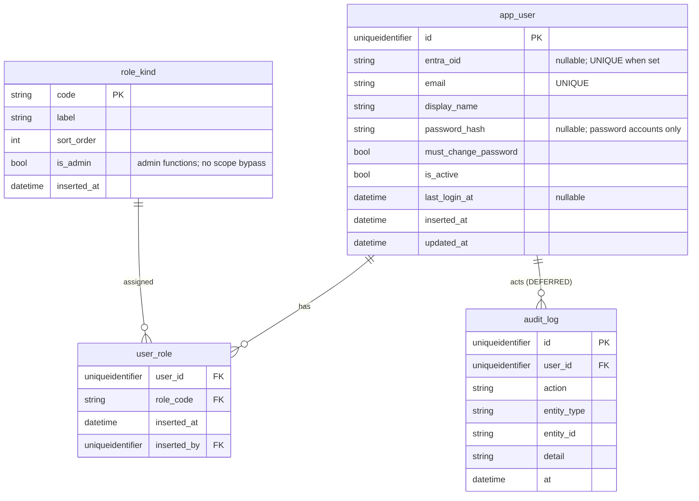
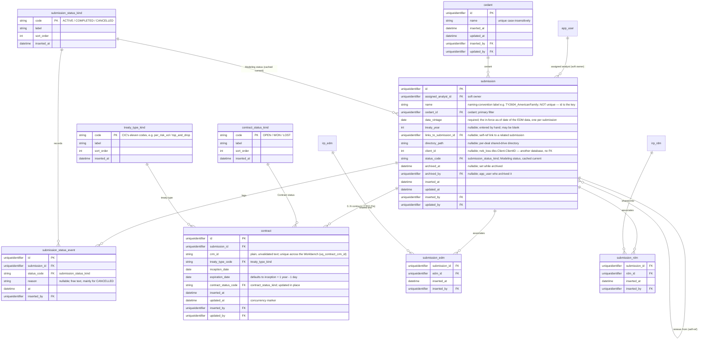
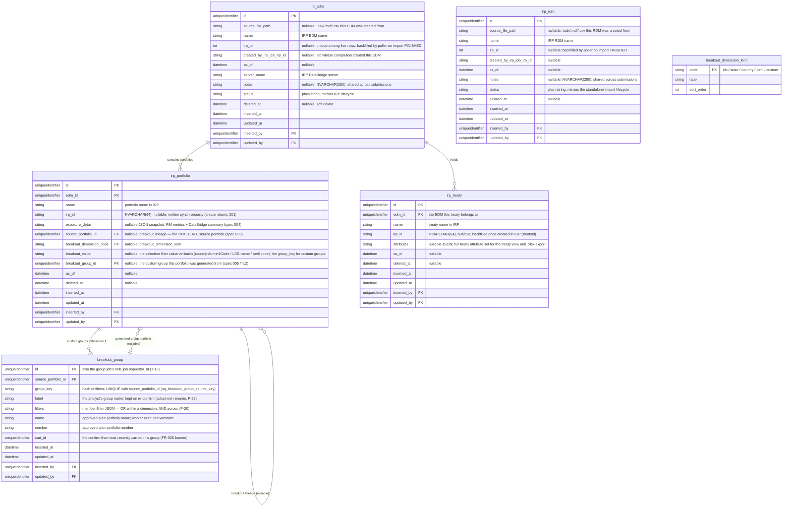
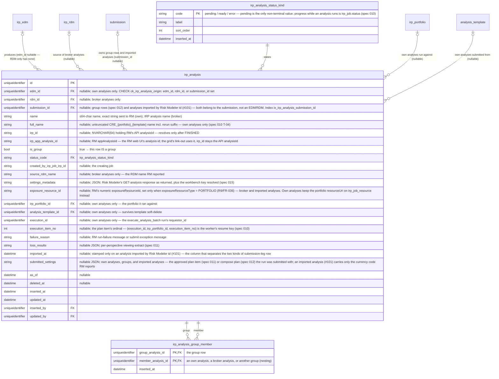
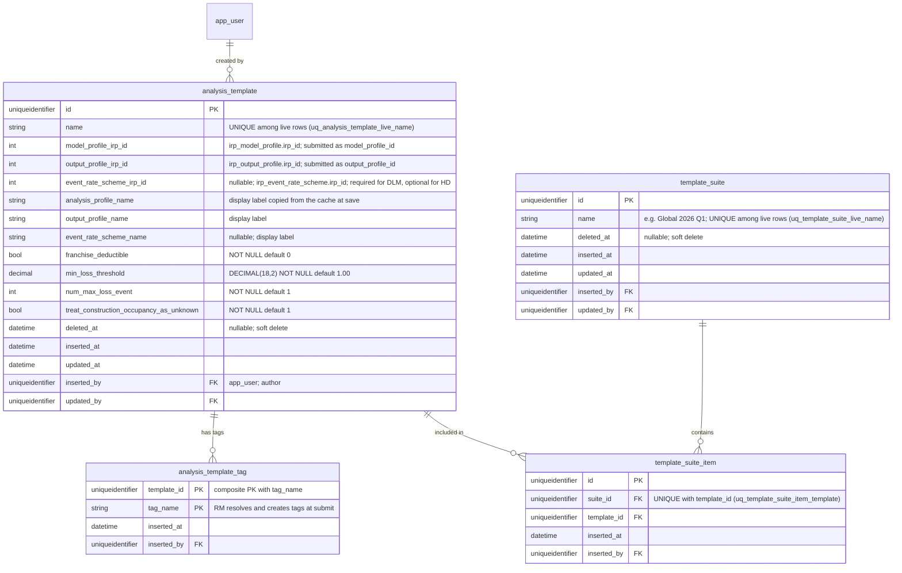
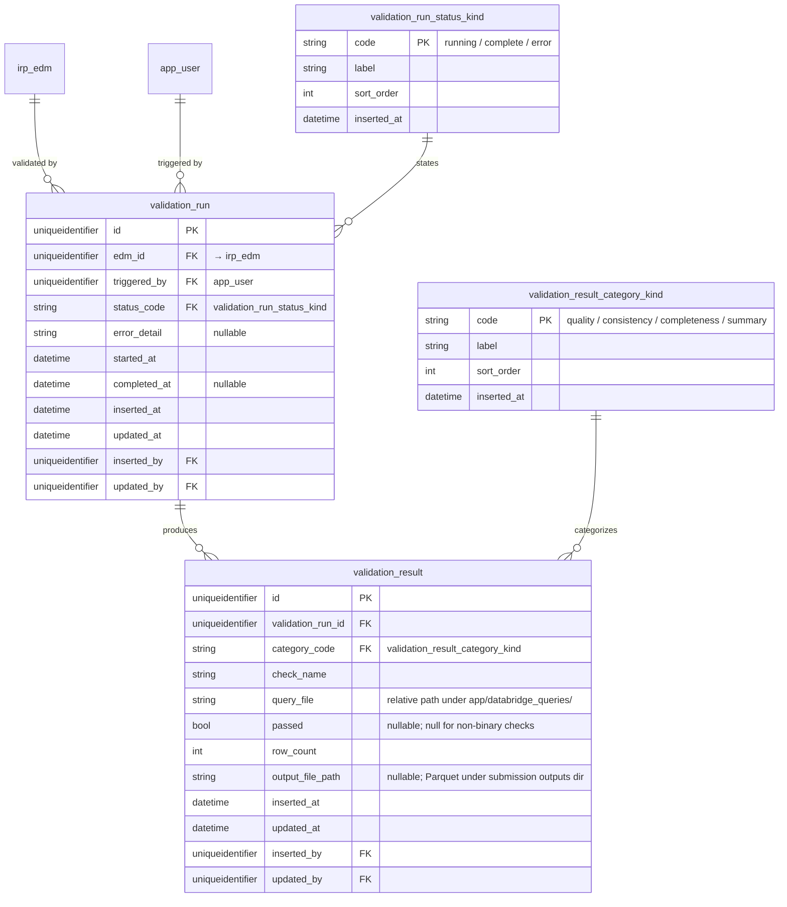

# Data Model — Risk Workbench

Companion to `PRD.md`. This is the schema reference Claude Code turns into migrations. Change rationale and history live in `docs/CR/`.

---

## 1. Database connections

All database access goes through the `db/` package. App code calls `get_connection("WORKBENCH" | "EXPOSURE" | "LOSS" | "DATABRIDGE")` — no URL strings in application code. Each named connection is configured via `MSSQL_{NAME}_*` env vars (`SERVER`, `USER`, `PASSWORD`, `DATABASE`; optional `PORT` default 1433, `AUTH_TYPE` default `SQL`).

| Named connection | Database | Managed by |
|---|---|---|
| `WORKBENCH` | Workbench metamodel (this schema) | Alembic + app |
| `EXPOSURE` | Exposure repository | Created empty by `infra/scripts/bootstrap_db.py`; no tables yet |
| `LOSS` | CIC's loss repository `CRE_Trial_ELT_Repository` (dev mirror `rwb_loss`) | CIC owns the database and its five `dbo` tables. The Workbench's `stage` schema (`db/bootstrap/loss_schema.sql`) is installed by a CIC DBA by hand; the app never runs DDL against it. Schema: `specs/014-results-export/data-model.md` §4 |
| `DATABRIDGE` | DataBridge (Moody's cloud) | Moody's — read-only; app code never opens a connection to it (the Workbench's own SQL files in `sql/databridge/` run through irp-integration's `databridge.execute_query_from_file`, worker-side, plus the one bounded single-row point-of-action check permitted on the request path; constitution Art. 11 v3.2.0); never DDL |

- **Pooling:** `MSSQL_POOL_SIZE` (default 5), `MSSQL_POOL_MAX_OVERFLOW` (default 5), `MSSQL_POOL_RECYCLE` (default 1800s). For 30 concurrent users: `POOL_SIZE=10`, `MAX_OVERFLOW=20`.
- **`WORKBENCH` migrations:** `alembic/versions/0001_initial.py` is the base revision, frozen when spec 017 merged (2026-09-29). Every later schema change is a new Alembic revision applied with `alembic upgrade head` (`make db-migrate`); the process is in `AGENTS.md`, Schema Changes. `EXPOSURE` is created empty by `infra/scripts/bootstrap_db.py`; no script creates tables in it. `LOSS` in dev is `make bootstrap-loss` (`infra/scripts/bootstrap_loss.py`): `loss_dev_mirror.sql` recreates CIC's five loss tables and `dbo.CRMContractStatus` (the CRM status table the January bulk update reads, spec 017 FR-023), `loss_schema.sql` installs the `stage` schema, then `dbo.Client` and `dbo.Lookup_RMS_HistoricalRDS` are seeded. Neither is under Alembic. `DATABRIDGE` is never migrated or bootstrapped; the app reads it only through irp-integration client methods (worker-side, plus the bounded single-row point-of-action check the request path may run — constitution Art. 11 v3.2.0), never raw SQL.
- **Redis:** `REDIS_URL` (default `redis://localhost:6379/0`). Dramatiq broker; stateless.

---

## 2. Conventions

- **Kind tables** (`*_kind`) hold categorical values: `code` (PK), `label`, `sort_order`, optional `icon`/`color`/`is_active`. Categorical columns are FKs to kind tables — never DB enums. External-mirror status columns are the exception (see below).
- **No row-level security.** There is no `customer_id` scoping key, no `apply_scope()`, no per-row access model. Every authenticated analyst can read every submission and everything under it. `submission.assigned_analyst_id` is a soft owner for the "my submissions" filter, not an access gate.
- **Audit fields.** Entity tables carry `inserted_at`, `updated_at`, `inserted_by` (FK → `app_user`, nullable for system rows), `updated_by` (FK → `app_user`, nullable). Kind tables (except `breakout_dimension_kind`), junction/event/append-only tables carry `inserted_at` (and `inserted_by` where a user is responsible) only.
- **Optimistic concurrency.** On analyst-editable rows (chiefly `submission`), `updated_at` is the version marker: updates write `WHERE id = :id AND updated_at = :read_value`; rowcount 0 → reject and surface the conflict. Append-only inserts and single-threaded machinery are exempt.
- **Naming.** Singular `snake_case` tables; `id` UUID surrogate PK unless noted; `*_code` FK → matching `*_kind`; `*_id` FK → entity. Every `irp_*` table's own Risk Modeler identifier column is `irp_id`.
- **`as_of`** (nullable datetime) on every `irp_*` entity and reference-cache table signals when the row was last confirmed against Risk Modeler. UI trust signal only. `analysis_result_meta` is the exception — results are immutable, so no drift to signal.
- **Event-sourced status** applies to `submission.status_code` only: a change inserts a `submission_status_event` row and stamps the cached `submission.status_code` in the same transaction (use `get_connection("WORKBENCH")` as a context manager with an explicit `conn.begin()`; never split the two writes). All other status columns are updated in place.
- **File handling is a stored path.** Each EDM/RDM records the shared-drive path it was created from (`source_file_path`); a submission optionally records its staging directory (`directory_path`). No file inventory, versioning, or drift detection.

---

## 3. Auth & users

```mermaid
erDiagram
  app_user ||--o{ user_role : has
  role_kind ||--o{ user_role : assigned
  app_user ||--o{ audit_log : "acts (DEFERRED)"

  app_user {
    uniqueidentifier id PK
    string entra_oid "nullable; UNIQUE when set"
    string email "UNIQUE"
    string display_name
    string password_hash "nullable; password accounts only"
    bool must_change_password
    bool is_active
    datetime last_login_at "nullable"
    datetime inserted_at
    datetime updated_at
  }
  role_kind {
    string code PK
    string label
    int sort_order
    bool is_admin "admin functions; no scope bypass"
    datetime inserted_at
  }
  user_role {
    uniqueidentifier user_id FK
    string role_code FK
    datetime inserted_at
    uniqueidentifier inserted_by FK
  }
  audit_log {
    uniqueidentifier id PK
    uniqueidentifier user_id FK
    string action
    string entity_type
    string entity_id
    string detail
    datetime at
  }
```

- **`app_user`** is a provisioned user (Entra OID in production, dev stub otherwise). `entra_oid` is `UNIQUE` when set.
- **Roles** are a kind table plus a `user_role` junction. `is_admin` grants admin functions only — there is no scope to bypass.
- **`audit_log` is DEFERRED** — documented, not built.

---

## 4. Submission and data associations

The **submission** is the top-level entity and the only user-facing container for
EDMs and RDMs. The global `irp_edm` and `irp_rdm` resources relate to submissions
through separate many-to-many tables. No association implies an EDM-to-RDM
relationship, resource ownership, or row-level access rule.

```mermaid
erDiagram
  app_user ||--o{ submission : "assigned analyst (soft owner)"
  cedant ||--o{ submission : "cedant"
  submission ||--o{ submission_status_event : logs
  submission ||--o{ contract : "0..N contracts (CRM IDs)"
  submission_status_kind ||--o{ submission : "Modeling status (cached current)"
  submission_status_kind ||--o{ submission_status_event : records
  contract_status_kind ||--o{ contract : "Contract status"
  treaty_type_kind ||--o{ contract : "treaty type"
  submission ||--o{ submission : "renews from (self-ref)"
  submission ||--o{ submission_edm : associates
  irp_edm ||--o{ submission_edm : "shared into"
  submission ||--o{ submission_rdm : associates
  irp_rdm ||--o{ submission_rdm : "shared into"

  submission {
    uniqueidentifier id PK
    uniqueidentifier assigned_analyst_id FK "soft owner"
    string name "naming-convention label e.g. TY2604_AmericanFamily; NOT unique — id is the key"
    uniqueidentifier cedant_id FK "cedant; primary filter"
    date data_vintage "required; the in-force as-of date of the EDM data, one per submission"
    int treaty_year "nullable; entered by hand; may be blank"
    uniqueidentifier links_to_submission_id FK "nullable; self-ref link to a related submission"
    string directory_path "nullable; per-deal shared-drive directory"
    int client_id "nullable; rwb_loss dbo.Client.ClientID — another database, no FK"
    string status_code FK "submission_status_kind; Modeling status, cached current"
    datetime archived_at "nullable; set while archived"
    uniqueidentifier archived_by FK "nullable; app_user who archived it"
    datetime inserted_at
    datetime updated_at
    uniqueidentifier inserted_by FK
    uniqueidentifier updated_by FK
  }
  cedant {
    uniqueidentifier id PK
    string name "unique case-insensitively"
    datetime inserted_at
    datetime updated_at
    uniqueidentifier inserted_by FK
    uniqueidentifier updated_by FK
  }
  contract {
    uniqueidentifier id PK
    uniqueidentifier submission_id FK
    string crm_id "plain, unvalidated text; unique across the Workbench (uq_contract_crm_id)"
    string treaty_type_code FK "treaty_type_kind"
    date inception_date
    date expiration_date "defaults to inception + 1 year - 1 day"
    string contract_status_code FK "contract_status_kind; updated in place"
    datetime inserted_at
    datetime updated_at "concurrency marker"
    uniqueidentifier inserted_by FK
    uniqueidentifier updated_by FK
  }
  treaty_type_kind {
    string code PK "CIC's eleven codes, e.g. per_risk_xol / top_and_drop"
    string label
    int sort_order
    datetime inserted_at
  }
  submission_status_kind {
    string code PK "ACTIVE / COMPLETED / CANCELLED"
    string label
    int sort_order
    datetime inserted_at
  }
  contract_status_kind {
    string code PK "OPEN / WON / LOST"
    string label
    int sort_order
    datetime inserted_at
  }
  submission_status_event {
    uniqueidentifier id PK
    uniqueidentifier submission_id FK
    string status_code FK "submission_status_kind"
    string reason "nullable; free text, mainly for CANCELLED"
    datetime at
    uniqueidentifier inserted_by FK
  }
  submission_edm {
    uniqueidentifier submission_id FK
    uniqueidentifier edm_id FK
    datetime inserted_at
    uniqueidentifier inserted_by FK
  }
  submission_rdm {
    uniqueidentifier submission_id FK
    uniqueidentifier rdm_id FK
    datetime inserted_at
    uniqueidentifier inserted_by FK
  }
```

**Submission:**
- **`submission` is the root.** No hierarchy above it: one cedant's modeling project. `cedant_id` is the primary filter; `treaty_year` is entered by hand and supports renewal-year grouping; `data_vintage` (required) is the in-force as-of date of the EDM data, one per submission by convention, shown on the deal card and pre-filled into the export form's data vintage (spec 017 P-19, note 32 D23, CIC 2026-09-29). These are the system of record — there is no CRM/treaty-system integration to derive them from.
- **`cedant` is a shared list any analyst maintains** (issue #129), at `/cedants` or from the submission form. The form picks from the list and stores `cedant_id`, so a rename shows on every submission. A name typed on the form that matches no cedant is inserted in the same transaction as the submission. A name is unique case-insensitively. A cedant can be deleted only while no submission uses it. `cedant` is user-edited data keyed by UUID, like `app_user`, not a `*_kind` table (Article 3).
- **`contract`** is the CRM ID (spec 017, note 32 D17–D22): 0..N per submission, each with its `crm_id`, `treaty_type_code`, `inception_date`, `expiration_date` and `contract_status_code`. **`crm_id` is unique across the Workbench** (`uq_contract_crm_id`, case-insensitive under the default collation; note 33 D12–D14): a CRM ID names one contract on one submission, whatever either submission's status, and the service refuses a reuse with a link to the submission that holds it. No contract is primary (P-17), but the list row reads one: the first entered by `inserted_at` (staggered by a microsecond per row on a multi-contract save), or, under a contract-level filter, the first that satisfied every contract filter together (note 34 D5). The list's default order is that contract's inception, `COALESCE((SELECT c.inception_date FROM contract c WHERE c.submission_id = s.id AND <the list's contract clauses> ORDER BY c.inserted_at, c.id` capped to one row`), s.inserted_at) DESC, s.name`, so a submission with no contract sorts by its creation date. Contract-level list filters (CRM ID, treaty type, inception, Contract status, in force) share one `EXISTS` over `contract`, so one row must satisfy them together (P-18).
- **`v_contract`** is a view: one row per contract — the contract's columns plus the submission's name, cedant, client, treaty year, data vintage and Modeling status; a submission with no contract emits no row. It is the CRM-ID-grain extract for CIC's linking SQL (spec 017 FR-013); the January bulk status update, `infra/scripts/bulk_update_contract_status.sql`, reads `dbo.CRMContractStatus` in the loss repository and writes `contract` directly (FR-023, note 32 D25, note 34 D11). "In force as of D" is `contract_status_code = 'WON' AND inception_date <= D AND expiration_date >= D`, computed at query time, never stored (P-09).
- **`client_id`** is `dbo.Client.ClientID` in `rwb_loss`, read over the `LOSS` connection and never a foreign key (another database). Optional; the Workbench never writes to the client list (spec 017 P-04).
- **`links_to_submission_id`** is a manual, nullable self-reference to a related submission — usually last year's deal for the same cedant and treaty type, but not necessarily a renewal (design note 08 CR8, superseding the earlier `renews_from_submission_id`). Most deals have none. The analyst picks the related deal by name; a submission cannot link to itself (`ck_submission_no_self_link`).
- **`submission.name` is NOT unique.** Two genuinely distinct deals can share every naming-convention attribute (same cedant, inception, treaty type) and differ only by the manual/optional CRM ID (design note 03 §4). The UUID `id` is the key; create and rename never compare the name with other submissions.
- **Modeling status** (`status_code`) is `ACTIVE` / `COMPLETED` / `CANCELLED`, event-sourced, no system-enforced transition preconditions (`COMPLETED → ACTIVE` allowed). `CANCELLED` is the withdrawal state.
- **`archived_at` / `archived_by`** mark an archived submission (issue #206): hidden from the Submissions list and the "links to" picker. Archiving changes neither `status_code` nor `updated_at`.
- **Delete** rules are in [PRD §7.2a](PRD.md#72a-modeling-status-and-contract-status).
- **Contract status** (`contract.contract_status_code`) is `OPEN` / `WON` / `LOST` from `contract_status_kind`, updated in place with the contract's `updated_at` concurrency check, no reason and no event row, in every Modeling status (spec 017 P-02, P-12). Every other contract write needs Modeling status Active.

**Associations:**
- `submission_edm` has primary key (`submission_id`, `edm_id`) and reverse index (`edm_id`, `submission_id`).
- `submission_rdm` has primary key (`submission_id`, `rdm_id`) and reverse index (`rdm_id`, `submission_id`).
- `inserted_by` is nullable and references `app_user.id`; `inserted_at` defaults to the current UTC time.
- Importing from a Submission writes the entity and association in one transaction before dispatching the upload head.
- Detach deletes only the association. It never changes the entity or starts Risk Modeler deletion.
- Completed and Cancelled submissions reject association writes until reopened.

---

## 5. EDM, RDM, Portfolio & Treaty

`irp_edm`, `irp_rdm`, `irp_portfolio`, and `irp_treaty` are the entities the app creates in Risk Modeler and must list, name, and track. The EDM is the modeling anchor — portfolios, treaties, and analyses all belong to one EDM.

```mermaid
erDiagram
  irp_edm ||--o{ irp_portfolio : "contains portfolios"
  irp_portfolio ||--o{ irp_portfolio : "breakout lineage (nullable)"
  irp_portfolio ||--o{ breakout_group : "custom groups defined on it"
  breakout_group |o--o{ irp_portfolio : "generated group portfolio (nullable)"
  irp_edm ||--o{ irp_treaty : holds

  irp_edm {
    uniqueidentifier id PK
    string source_file_path "nullable; .bak/.mdf/.csv this EDM was created from"
    string name "IRP EDM name"
    int irp_id "nullable; unique among live rows; backfilled by poller on import FINISHED"
    string created_by_irp_job_irp_id "nullable; job whose completion created this EDM"
    datetime as_of "nullable"
    string server_name "IRP DataBridge server"
    string notes "nullable; NVARCHAR(250); shared across submissions"
    string status "plain string; mirrors IRP lifecycle"
    datetime deleted_at "nullable; soft delete"
    datetime inserted_at
    datetime updated_at
    uniqueidentifier inserted_by FK
    uniqueidentifier updated_by FK
  }
  irp_rdm {
    uniqueidentifier id PK
    string source_file_path "nullable; .bak/.mdf/.csv this RDM was created from"
    string name "IRP RDM name"
    int irp_id "nullable; backfilled by poller on import FINISHED"
    string created_by_irp_job_irp_id "nullable"
    datetime as_of "nullable"
    string notes "nullable; NVARCHAR(250); shared across submissions"
    string status "plain string; mirrors the standalone import lifecycle"
    datetime deleted_at "nullable"
    datetime inserted_at
    datetime updated_at
    uniqueidentifier inserted_by FK
    uniqueidentifier updated_by FK
  }
  irp_portfolio {
    uniqueidentifier id PK
    uniqueidentifier edm_id FK
    string name "portfolio name in IRP"
    string irp_id "NVARCHAR(64), nullable; written synchronously (create returns 201)"
    string exposure_detail "nullable JSON snapshot: RM metrics + DataBridge summary (spec 004)"
    uniqueidentifier source_portfolio_id FK "nullable; breakout lineage — the IMMEDIATE source portfolio (spec 005)"
    string breakout_dimension_code FK "nullable; breakout_dimension_kind"
    string breakout_value "nullable; the selection filter value verbatim (country-Admin1Code / LOB name / peril code); the group_key for custom groups"
    uniqueidentifier breakout_group_id FK "nullable; the custom group this portfolio was generated from (spec 005 T-12)"
    datetime as_of "nullable"
    datetime deleted_at "nullable"
    datetime inserted_at
    datetime updated_at
    uniqueidentifier inserted_by FK
    uniqueidentifier updated_by FK
  }
  breakout_dimension_kind {
    string code PK "lob / state / country / peril / custom"
    string label
    int sort_order
  }
  breakout_group {
    uniqueidentifier id PK "also the group job's rwb_job.requestor_id (T-13)"
    uniqueidentifier source_portfolio_id FK
    string group_key "hash of filters; UNIQUE with source_portfolio_id (uq_breakout_group_source_key)"
    string label "the analyst's group name; kept on re-confirm (adopt-not-rename, P-22)"
    string filters "member-filter JSON — OR within a dimension, AND across (P-20)"
    string name "approved-plan portfolio name; worker executes verbatim"
    string number "approved-plan portfolio number"
    uniqueidentifier cart_id "the confirm that most recently carried this group (FR-020 banner)"
    datetime inserted_at
    datetime updated_at
    uniqueidentifier inserted_by FK
    uniqueidentifier updated_by FK
  }
  irp_treaty {
    uniqueidentifier id PK
    uniqueidentifier edm_id FK "the EDM this treaty belongs to"
    string name "treaty name in IRP"
    string irp_id "NVARCHAR(64), nullable; backfilled once created in IRP (treatyId)"
    string attributes "nullable JSON; full treaty attribute set for the treaty view and .xlsx export"
    datetime as_of "nullable"
    datetime deleted_at "nullable"
    datetime inserted_at
    datetime updated_at
    uniqueidentifier inserted_by FK
    uniqueidentifier updated_by FK
  }
```

- **`source_file_path`** is the whole file-handling model (no `file_artifact`, no versioning). It may point to a `.bak`, `.mdf`, or `.csv`; CSV-sourced results are handled the same way (the IRP integration differs under the hood).
- **`irp_rdm` has no `edm_id`.** It imports once against an exposure set with the
  same name. Broker analyses have `rdm_id` set and `edm_id` null (§6).
- **`status`** on EDM/RDM is a plain string (mirrors IRP's own EDM/RDM lifecycle vocabulary, which can drift): `pending_import` / `importing` / `ready` / `error` / `delete_pending` / `deleted`.
- **`created_by_irp_job_irp_id`** links EDM/RDM back to the async import job that created the entity. `irp_portfolio` and `irp_treaty` have none — their creation is synchronous.
- **Name-collision check.** Setting or renaming an EDM/RDM name runs `client.edm.search_edms()` / `search_rdms()` — **blocking** since 2026-07-27 (issue #17, spec 003 FR-012 as amended): a hit rejects the save/sync (irp-integration ≥ 0.2.1 would fail the submit anyway). When Risk Modeler is unreachable the check fails open with a visible warning and the worker-side submit validation is the backstop.
- **Treaty** is referenced by analyses **by name**; create/edit is synchronous (`search_treaties` / `create_treaty` / `create_treaty_lob`). Creating a treaty with its lines of business is a **1 + N** call pattern and is **non-atomic** — a partial failure leaves some LOBs missing; the UI lets the analyst retry the remainder.
- **Breakout lineage (spec 005).** `source_portfolio_id`, `breakout_dimension_code`, and `breakout_value` are set together for breakout-generated portfolios and all NULL for broker-arrived ones; `breakout_group_id` is set only alongside dimension `custom`. `source_portfolio_id` records the **immediate source only** — a portfolio generated from a generated portfolio points at its direct parent, and chained lineage is read by walking the chain, never rendered as one. `breakout_value` is the selection filter value verbatim: `{country}-{Admin1Code}` (`US-TX`, `BE-11`) for geography (P-31); the LOB name for line of business — display resolves the value's label (`Admin1Name`) at read time from the source portfolio's stored summary, and no label is stored on the row (P-12). The filtered unique index `uq_irp_portfolio_breakout (source_portfolio_id, breakout_dimension_code, breakout_value) WHERE source_portfolio_id IS NOT NULL AND deleted_at IS NULL` is the idempotency key — one live generated portfolio per (source, dimension, value).
- **`breakout_group` (spec 005 T-12/T-13)** stores one row per custom group defined on a source portfolio: the analyst's `label`, the canonical member-`filters` JSON (OR within a dimension, AND across dimensions — P-20) with `group_key` as its hash, and the approved-plan `name`/`number` the worker executes verbatim. `UNIQUE(source_portfolio_id, group_key)` makes re-confirming the same member set reuse the row, and the row's UUID doubles as the group job's `rwb_job.requestor_id` (requestor type `breakout_group`), so the job dedup key needs no `rwb_job` change. The generated portfolio points back via `irp_portfolio.breakout_group_id` and carries `breakout_dimension_code = 'custom'` with the `group_key` as `breakout_value`. `cart_id` marks the confirm that most recently carried the group — the completion banner aggregates terminal jobs sharing the newest `cart_id` (FR-020).
- **`irp_portfolio.inserted_by` is populated for breakout-generated portfolios** (the confirming analyst, carried in the breakout job's `input_data.actor_id`) — the first writer to use that column on this table.
- **`exposure_detail`** (spec 004) is the per-portfolio JSON snapshot the `backfill_edm_detail` worker stores: RM's `/metrics` payload plus the DataBridge exposure summary, read defensively by the web layer. Spec 005 extends the summary with `breakout_values` (per-dimension value lists keyed by `breakout_dimension_kind.code`, each value carrying an account count and a nullable display label), `account_total`, and `breakout_coverage` (per dimension: the accounts carrying at least one value and the accounts carrying more than one, counted per account for the breakout preview's overlap statement), and captures the portfolio's RM `stampDate` alongside it. Each `state` breakout value also carries its `country`; the summary has no separate `states` list.

---

## 6. Analysis (`irp_analysis`)

An analysis belongs to an EDM when the analyst runs it, or to an RDM when it is
captured from a broker import. When `is_group = true`, the row is a group. Creation
is async, so the table carries creation lineage.

```mermaid
erDiagram
  irp_edm |o--o{ irp_analysis : "produces (edm_id nullable — RDM-only has none)"
  irp_rdm |o--o{ irp_analysis : "source of broker analyses (nullable)"
  submission |o--o{ irp_analysis : "owns group rows and imported analyses (submission_id nullable)"
  irp_analysis ||--o{ irp_analysis_group_member : "group"
  irp_analysis ||--o{ irp_analysis_group_member : "member"
  irp_analysis_status_kind ||--o{ irp_analysis : states

  irp_portfolio |o--o{ irp_analysis : "own analyses run against (nullable)"
  analysis_template |o--o{ irp_analysis : "own analyses submitted from (nullable)"

  irp_analysis {
    uniqueidentifier id PK
    uniqueidentifier edm_id FK "nullable; own analyses only. CHECK ck_irp_analysis_origin: edm_id, rdm_id, or submission_id set"
    uniqueidentifier rdm_id FK "nullable; broker analyses only"
    uniqueidentifier submission_id FK "nullable; group rows (spec 012) and analyses imported by Risk Modeler id (#101) — both belong to the submission, not an EDM/RDM. Index ix_irp_analysis_submission_id"
    string name "≤64-char name, exact string sent to RM (own); IRP analysis name (broker)"
    string full_name "nullable; untruncated CRE_{portfolio}_{template} name incl. rerun suffix — own analyses only (spec 010 T-04)"
    string irp_id "nullable; NVARCHAR(64) holding RM's API analysisId — resolves only after FINISHED"
    string irp_app_analysis_id "nullable; RM appAnalysisId — the RM web UI's analysis id; the grid's link-out uses it, irp_id stays the API analysisId"
    bool is_group "true → this row IS a group"
    string status_code FK "irp_analysis_status_kind"
    string created_by_irp_job_irp_id "nullable; the creating job"
    string source_rdm_name "nullable; broker analyses only — the RDM name RM reported"
    string settings_metadata "nullable; JSON: Risk Modeler's GET-analysis response as returned, plus the workbench key resolved (spec 015)"
    string exposure_resource_id "nullable; RM's numeric exposureResourceId, set only when exposureResourceType = PORTFOLIO (R9/FR-036) — broker and imported analyses. Own analyses keep the portfolio resourceUri on irp_job_resource instead"
    uniqueidentifier irp_portfolio_id FK "nullable; own analyses only — the portfolio it ran against"
    uniqueidentifier analysis_template_id FK "nullable; own analyses only — survives template soft-delete"
    uniqueidentifier execution_id "nullable; own analyses only — the execute_analysis_batch run's requestor_id"
    int execution_item_no "nullable; the plan item's ordinal — (execution_id, irp_portfolio_id, execution_item_no) is the worker's resume key (spec 010)"
    string failure_reason "nullable; RM run-failure message or submit exception message"
    string loss_results "nullable JSON; per-perspective viewing extract (spec 011)"
    datetime imported_at "nullable; stamped only on an analysis imported by Risk Modeler id (#101) — the column that separates the two kinds of submission-leg row"
    string submitted_settings "nullable JSON; own analyses, groups, and imported analyses — the approved plan item (spec 011) or compose plan (spec 012) the run was submitted with; an imported analysis (#101) carries only the currency code RM reports"
    datetime as_of "nullable"
    datetime deleted_at "nullable"
    datetime inserted_at
    datetime updated_at
    uniqueidentifier inserted_by FK
    uniqueidentifier updated_by FK
  }
  irp_analysis_status_kind {
    string code PK "pending / ready / error — pending is the only non-terminal value; progress while an analysis runs is irp_job.status (spec 010)"
    string label
    int sort_order
    datetime inserted_at
  }
  irp_analysis_group_member {
    uniqueidentifier group_analysis_id PK,FK "the group row"
    uniqueidentifier member_analysis_id PK,FK "an own analysis, a broker analysis, or another group (nesting)"
    datetime inserted_at
  }
```

- **`edm_id`, `rdm_id`, and `submission_id` are all nullable, enforced by CHECK `ck_irp_analysis_origin` that at least one is set.** Own analyses have `edm_id` set. Broker analyses have `rdm_id` set. The submission leg carries two kinds of row: a group row (`is_group = 1`, spec 012 T-04) and an analysis imported by Risk Modeler id (`imported_at` stamped, #101); both have `edm_id`, `rdm_id`, `irp_portfolio_id`, `analysis_template_id`, `execution_id`, and `execution_item_no` null. Index `ix_irp_analysis_irp_id` (filtered `WHERE irp_id IS NOT NULL`) backs the import duplicate check and the delete guard, which look a Risk Modeler `analysisId` up across every origin (#101). Deleting an imported analysis soft-deletes the row and leaves the Risk Modeler analysis alive — it was created in Risk Modeler by someone else, and another deal may hold it too. Broker enumeration filters `search_analyses` by `sourceRdmName` only.
- **Group membership is the `irp_analysis_group_member` table** (spec 012 T-05), PK (`group_analysis_id`, `member_analysis_id`), both FK `irp_analysis.id`. The `submit_grouping` worker writes the rows once at claim, from the approved compose plan, and never updates them. An analysis may be a member of many groups, and a member may itself be a group. Rows are retained on group soft-delete; the group row's `deleted_at` is the visibility gate. There is no `group_parent_id` column: one parent cannot model an analysis that belongs to several groups.
- **Own vs. broker is derived from `rdm_id`** (`null` → own, set → broker), computed in the view layer — no stored `origin` column.
- **Broker analysis identity is (`rdm_id`, `irp_id`)**, backed by a filtered unique index (`uq_irp_analysis_rdm_irp`, `WHERE rdm_id IS NOT NULL AND irp_id IS NOT NULL`) rather than a plain UNIQUE constraint — a plain constraint would treat the many own-analysis rows' NULLs as colliding. Each Risk Modeler analysis
  is captured once for its source RDM. Names are not keys because Risk Modeler
  permits duplicates and edits. Successful enumeration prunes missing analyses by
  `rdm_id`.
- **Own analysis identity is (`edm_id`, `name`) among live rows**, backed by a second filtered unique index (`uq_irp_analysis_live_edm_name`, `WHERE edm_id IS NOT NULL AND deleted_at IS NULL`) — the local rerun-collision check spec 010 T-05 relies on; the run submits with `skip_duplicate_check=True` on the RM side.
- **Group identity is (`submission_id`, `name`) among live rows**, backed by the filtered unique index `uq_irp_analysis_live_submission_name` (`WHERE submission_id IS NOT NULL AND deleted_at IS NULL`) — the mirror of `uq_irp_analysis_live_edm_name`; the `_n` collision suffix on the auto-generated group name (spec 012 O-01) is checked against it.
- **`status_code` is a kind table** (app-defined vocabulary), unlike the plain-string EDM/RDM `status`.
- **`loss_results` is the viewing extract** (spec 011): JSON holding, per financial perspective (GR / RL / WX / QS / GU), the AAL, standard deviation, and OEP/AEP losses at the 11 stored return periods (5 / 10 / 25 / 50 / 100 / 250 / 500 / 1000 / 2000 / 5000 / 10000). Written whole by the `retrieve_analysis_results` worker (§8); a perspective the analysis did not produce is present with an explicitly empty value, distinguishing "fetched, nothing there" from `loss_results IS NULL` ("not fetched yet"). Because broker analyses are single rows keyed (`rdm_id`, `irp_id`), the once-per-RDM storage rule needs no extra machinery. Row-level results (ELT, PLT, full EP curves) are never stored for viewing — see §9.
- **`settings_metadata` is Risk Modeler's GET-analysis response as returned, plus the workbench key `resolved`** (spec 015): what the run resolved on per region and peril — event rate scheme, simulation set and its simulation periods — and the treaties it applied, each with the terms the run applied it under. `finalize_analysis` writes it for own analyses, groups and analyses imported by Risk Modeler id (#101), `backfill_rdm_analyses` for broker analyses; a failed read leaves `resolved` (or its `treaties` half) absent rather than failing the job. Every other key under the column is Risk Modeler's own and is never rewritten. Shape: spec 015 `contracts/settings-metadata-resolved.md`.
- **`submitted_settings` is the run's own record of how it was submitted** (spec 011), in one of three shapes by origin. An own analysis stores the approved plan item — currency (code, scheme, vintage, `asOfDate`), event rate scheme, treaty names, min loss threshold, max loss event count, franchise deductible, unrecognized construction/occupancy — written verbatim by `_claim_analysis` in the INSERT that claims the row. A group stores the compose plan — currency, event rate scheme and simulation set selections, and its members — written the same way by `_claim_group`. An analysis imported by Risk Modeler id (#101) carries only the currency code Risk Modeler reports for it. None is updated afterwards; `NULL` on broker rows, because Risk Modeler returns none of these fields. It is not read back from `analysis_template` or `irp_treaty`: templates and treaties are editable, and a finished run must keep reporting what it actually ran with (Article 8). Currency scheme and vintage exist nowhere else — they are chosen per suite at submit time (spec 009 P-11).

---

## 7. Analysis templates & suites

Saved analysis-job configurations for batch submission — a worldwide contract can need 50–150+ model/region/peril/treaty combinations. Templates and suites are **global** (visible to all analysts); `inserted_by` records authorship only.

```mermaid
erDiagram
  app_user ||--o{ analysis_template : "created by"
  analysis_template ||--o{ analysis_template_tag : "has tags"
  template_suite ||--o{ template_suite_item : contains
  analysis_template ||--o{ template_suite_item : "included in"

  analysis_template {
    uniqueidentifier id PK
    string name "UNIQUE among live rows (uq_analysis_template_live_name)"
    int model_profile_irp_id "irp_model_profile.irp_id; submitted as model_profile_id"
    int output_profile_irp_id "irp_output_profile.irp_id; submitted as output_profile_id"
    int event_rate_scheme_irp_id "nullable; irp_event_rate_scheme.irp_id; required for DLM, optional for HD"
    string analysis_profile_name "display label copied from the cache at save"
    string output_profile_name "display label"
    string event_rate_scheme_name "nullable; display label"
    bool franchise_deductible "NOT NULL default 0"
    decimal min_loss_threshold "DECIMAL(18,2) NOT NULL default 1.00"
    int num_max_loss_event "NOT NULL default 1"
    bool treat_construction_occupancy_as_unknown "NOT NULL default 1"
    datetime deleted_at "nullable; soft delete"
    datetime inserted_at
    datetime updated_at
    uniqueidentifier inserted_by FK "app_user; author"
    uniqueidentifier updated_by FK
  }
  analysis_template_tag {
    uniqueidentifier template_id PK "composite PK with tag_name"
    string tag_name PK "RM resolves and creates tags at submit"
    datetime inserted_at
    uniqueidentifier inserted_by FK
  }
  template_suite {
    uniqueidentifier id PK
    string name "e.g. Global 2026 Q1; UNIQUE among live rows (uq_template_suite_live_name)"
    datetime deleted_at "nullable; soft delete"
    datetime inserted_at
    datetime updated_at
    uniqueidentifier inserted_by FK
    uniqueidentifier updated_by FK
  }
  template_suite_item {
    uniqueidentifier id PK
    uniqueidentifier suite_id FK "UNIQUE with template_id (uq_template_suite_item_template)"
    uniqueidentifier template_id FK
    datetime inserted_at
    uniqueidentifier inserted_by FK
  }
```

- The three `*_irp_id` columns map to the `model_profile_id`, `output_profile_id` and `event_rate_scheme_id` parameters of `client.analysis.submit_portfolio_analysis_job()` (irp-integration 0.11.0, issue 68). The id path skips the wheel's reference-data reads, so the Workbench supplies the `analysis_type` parameter itself: it is not stored on the template but derived from the cached profile's `software_version_code` when the execution plan is composed (spec 010). Accumulation profiles and profiles with no software version cannot be saved in a template (spec 009 P-14). Event rate scheme names repeat across peril/region in Risk Modeler, so the three `*_name` columns are display labels copied from the cache at save, never join keys. `event_rate_scheme_irp_id` is required for DLM, optional for HD.
- **Suites are unordered** (spec 009 P-08): `template_suite_item` is a plain membership row — no `position`, no per-item settings; `UNIQUE(suite_id, template_id)` keeps a template in a suite at most once.
- **Templates store no currency** (spec 009 P-11 / design note 17 D4/D5, 2026-08-20 — reverses P-10): analysis currency, currency scheme, and scheme vintage are chosen in the execution modal at submit time, per chosen suite, pre-filled from pinned env-var defaults (`DEFAULT_ANALYSIS_CURRENCY_*`, §10). The submit-time block is `{code, scheme, vintage, asOfDate}` with `asOfDate` derived from the chosen vintage's effective date; the confirmed values ride the persisted execution plan (spec 010).
- **Dropped in spec 009:** `treaty_name_pattern` (P-09 — treaties are picked explicitly at run time in the execution modal), `region_label`/`peril_code` (P-03 — region/output level conveyed by names), and `auto_name_pattern` (analysis names follow the fixed portfolio + template name rule — PRD §2.6).

---

## 8. IRP jobs & RWB jobs

**`irp_job`** tracks one IRP async operation running remotely in Moody's SaaS (one row per real IRP op). **`rwb_job`** tracks app-side work this app executes in-process (a Dramatiq worker). The two are fully decoupled — no FK between them.

```mermaid
erDiagram
  submission |o--o{ irp_job : "request provenance (nullable)"
  irp_edm |o--o{ irp_job : "entity lineage (nullable)"
  irp_portfolio ||--o{ irp_job : "entity lineage (nullable)"
  irp_rdm |o--o{ irp_job : "entity lineage (nullable)"
  irp_analysis |o--o{ irp_job : "entity lineage (nullable; spec 010)"
  irp_job_type_kind ||--o{ irp_job : types
  irp_job ||--o{ irp_job_resource : "submits resource(s)"
  irp_job_resource_type_kind ||--o{ irp_job_resource : types
  rwb_job_type_kind ||--o{ rwb_job : types
  rwb_job_requestor_type_kind ||--o{ rwb_job : "requested by"
  rwb_job_status_kind ||--o{ rwb_job : states
  rwb_job ||--o| rwb_job_heartbeat : "heartbeated by worker"

  irp_job {
    uniqueidentifier id PK
    uniqueidentifier requested_from_submission_id FK "nullable; request provenance only"
    uniqueidentifier irp_edm_id FK "nullable; entity lineage"
    uniqueidentifier irp_portfolio_id FK "nullable; entity lineage"
    uniqueidentifier irp_rdm_id FK "nullable; entity lineage"
    uniqueidentifier irp_analysis_id FK "nullable; entity lineage + retry key (spec 010)"
    uniqueidentifier export_id "nullable, indexed; the loss results export this job belongs to (spec 014)"
    string irp_job_type FK "irp_job_type_kind"
    string irp_id "IRP's integer job id as string; nullable until submit succeeds"
    string status "plain string; RM-mirrored + app-local (see vocabulary)"
    string correlation_id "nullable; log-trace id inherited from the submitting rwb_job"
    int progress "nullable; Risk Modeler's top-level progress from the latest status check"
    string completion_summary "Risk Modeler task output summary; nullable"
    string last_submission_payload "JSON; latest submit request"
    string last_submission_response "JSON; RM's response to that submit"
    string last_completion_result "JSON; terminal poll response (FINISHED or FAILED)"
    string request_params "JSON; submit kwargs snapshot — submission_retry resubmits from it verbatim (spec 010)"
    int submission_attempt_count "default 0"
    datetime submitted_at "nullable"
    datetime completed_at "nullable; for SUBMISSION FAILED it doubles as the retry backoff clock — cleared by a successful resubmit (spec 010)"
    datetime last_tracked_at "nullable; null until first poll"
    datetime inserted_at
    datetime updated_at
    uniqueidentifier inserted_by FK
    uniqueidentifier updated_by FK
  }
  irp_job_resource {
    uniqueidentifier id PK
    uniqueidentifier irp_job_id FK
    string resource_type FK "irp_job_resource_type_kind"
    string resource_uri "captured at submit time; RM's completion response omits it"
    datetime inserted_at
  }
  irp_job_type_kind {
    string code PK "import_edm / import_rdm / geohaz / analysis / grouping / export"
    string label
    int sort_order
    datetime inserted_at
  }
  irp_job_resource_type_kind {
    string code PK "portfolio (only value confirmed today)"
    string label
    int sort_order
    datetime inserted_at
  }
  rwb_job {
    uniqueidentifier id PK
    string requestor_type FK "rwb_job_requestor_type_kind"
    uniqueidentifier requestor_id "id of the trigger; no DB FK (target varies by type)"
    string link_type FK "rwb_job_link_type_kind"
    uniqueidentifier link_id "nullable; the EDM, RDM or submission the job concerns"
    string context_type FK "nullable; rwb_job_context_type_kind"
    uniqueidentifier context_id "nullable; the row the job acts on"
    string rwb_job_type FK "rwb_job_type_kind"
    string status_code FK "rwb_job_status_kind"
    string input_data "JSON; the work order"
    string output_data "JSON, nullable; produced on success"
    string error_detail "nullable; set on failure"
    int attempt_count "default 0"
    string claimed_by "nullable; worker_id"
    string correlation_id "nullable; log-trace id of the request or chain that caused the job"
    datetime submitted_at "nullable"
    datetime completed_at "nullable"
    datetime inserted_at
    datetime updated_at
    uniqueidentifier inserted_by FK "nullable"
    uniqueidentifier updated_by FK "nullable"
  }
  rwb_job_requestor_type_kind {
    string code PK "irp_job / analyst_request / rwb_job / breakout_group / irp_analysis"
    string label
    int sort_order
    datetime inserted_at
  }
  rwb_job_type_kind {
    string code PK "see work-type table"
    string label
    int sort_order
    datetime inserted_at
  }
  rwb_job_heartbeat {
    uniqueidentifier rwb_job_id FK "UNIQUE — one row per job; upserted"
    string worker_id
    datetime heartbeat_at "stamped every RWB_HEARTBEAT_INTERVAL_SECS"
  }
  rwb_job_status_kind {
    string code PK "pending / running / succeeded / failed / cancelled"
    string label
    int sort_order
    datetime inserted_at
  }
```

**`irp_job`:**
- **Grain is one IRP operation against one physical resource.** EDM import sets
  `irp_edm_id`. RDM import sets `irp_rdm_id` and leaves `irp_edm_id` null.
  Portfolio/GeoHaz sets `irp_portfolio_id` and `irp_edm_id`. An own analysis
  submission (`irp_job_type='analysis'`, spec 010) sets `irp_analysis_id`,
  `irp_portfolio_id`, and `irp_edm_id`, and carries the submit kwargs snapshot in
  `request_params` — the `submission_retry` batch resubmits from it verbatim,
  never recomposed from live template/suite rows.
  `requested_from_submission_id` records which contextual action started the job;
  polling, retry, and worker dispatch never depend on it.
- **`irp_job_type` is a kind table** (closed, app-defined) but **`status` is a plain string** — RM can add status values at any time, and an unknown value must not crash the poller.
- **`status` vocabulary:** RM non-terminal `PENDING`/`QUEUED`/`RUNNING`/`CANCEL_REQUESTED`/`CANCELLING`; RM terminal `FINISHED` (only success)/`FAILED`/`CANCELLED`; app-local non-terminal `UNSUBMITTED`/`SUBMITTING`/`BLOCKED`/`SUBMISSION RETRYING`; app-local terminal `SUBMISSION FAILED` (never reached RM — no `irp_id`). `SUBMISSION FAILED` vs `FAILED` distinguishes submit-side failure from RM-ran-it-and-failed. `SUBMISSION RETRYING` marks a row the `submission_retry` batch has claimed; the status tracker skips it (no `irp_id`), so a poller that dies mid-retry would strand it — a row left there longer than `IRP_SUBMISSION_RETRY_STALE_SECS` is reclaimed to `SUBMISSION FAILED`, spending one attempt.
- **`irp_job_resource`** carries the typed `(resource_type, resource_uri)` submit payload; the URI must be captured at submit time (RM's completion response omits it).

**`rwb_job`:**
- **`requestor_type` + `requestor_id`** name the trigger: a finished `irp_job`, an analyst action, a parent `rwb_job`, a `breakout_group`, or an `irp_analysis`. `requestor_id` has no DB FK (target varies by type). Dedup / chaining key: `UNIQUE(requestor_type, requestor_id, rwb_job_type)`. For `analyst_request`, `requestor_id` is the row the request is about (EDM, RDM, portfolio, execution, grouping request, or export), so the key allows one live job of a type per row; the analyst is `inserted_by`.
- **Worker lifecycle:** claim atomically (`UPDATE ... SET status_code='running' WHERE id=:id AND status_code='pending'`; rowcount 0 → already claimed), heartbeat via a daemon thread, set `succeeded`/`failed`, create chained tail rows on success. Stale `running` rows (heartbeat older than `RWB_HEARTBEAT_STALE_SECS`) are recovered by the reconciler in the poller.

| `rwb_job_type` | Worker responsibility | Chains to |
|---|---|---|
| `upload_edm` | Submit `import_edm` for one EDM | `backfill_edm_detail` on FINISHED |
| `upload_rdm` | Submit one standalone `import_rdm` for one RDM | `backfill_rdm_analyses` on FINISHED |
| `backfill_edm_detail` | Read and store one EDM's portfolios, exposure detail, and treaties | — |
| `backfill_rdm_analyses` | Enumerate and store one RDM's broker analyses | `retrieve_analysis_results` (one per broker analysis) |
| `execute_analysis_batch` | Submit one `irp_analysis` + `irp_job` per portfolio × template in the approved plan (spec 010) | — |
| `submit_grouping` | Claim the group `irp_analysis` row and its `irp_analysis_group_member` rows, then submit one `grouping` `irp_job` from the approved compose plan (spec 012) | — |
| `finalize_analysis` | Take one own analysis, group or imported analysis (#101) to `ready`: fetch its details by the job body's `analysisId`; write `irp_id`/`irp_app_analysis_id`/`settings_metadata`/`status_code` (spec 010) | `retrieve_analysis_results` |
| `retrieve_analysis_results` | `get_stats()`/`get_ep()` per perspective (GR/RL/WX/QS/GU); write the `irp_analysis.loss_results` extract (spec 011) | — |
| `submit_results_export` | Ask Risk Modeler for one loss-table `export` job per manifest row of an export (spec 014) | — (the poller enqueues `stage_results_export` when each export job ends) |
| `stage_results_export` | Download the archive, check it against the manifest, stream its Parquet files into `stage.rwb_loss_result_elt_data` (spec 014) | `load_results_export` |
| `load_results_export` | Run `stage.usp_load_elt_result`, which classifies, corrects, and loads one analysis into CIC's tables (spec 014) | — |
| `notify_analyst` | Teams webhook and/or email | — |

**Flows:**
- **Submit (request path):** on success, write `irp_job` with `irp_id`, `status='QUEUED'`, any `irp_job_resource` rows; on failure, `irp_id=null`, `status='SUBMISSION FAILED'`. A single-threaded `submission_retry` batch job re-attempts `SUBMISSION FAILED` rows (`< IRP_SUBMISSION_MAX_RETRIES`, default 3) with backoff.
- **Poller:** query non-terminal jobs grouped by `irp_job_type`, poll each via the single-status-check `get_*_job` method (never `poll_*_to_completion`). On terminal status, backfill entity `irp_id`s and create head `rwb_job` row(s) via idempotent insert on the composite key.

**Import completion:** the poller enqueues `backfill_edm_detail` when an EDM import
finishes and `backfill_rdm_analyses` when an RDM import finishes. EDM completion
never starts RDM upload work. Association detach is request-path SQL only.

**Context (`rwb_job.context_type` / `context_id`):** the object a job's own operation acts on, typed by `rwb_job_context_type_kind` (`edm` / `rdm` / `irp_analysis` / `portfolio` / `breakout_group` / `execution` / `result_export`). `result_export` names a loss results export by its `export_id`; the export record itself is `stage.rwb_loss_result_manifest` in the loss repository, not a Workbench table (spec 014 T-03).

**Link (`rwb_job.link_type` / `link_id`):** the EDM, RDM, or submission the job concerns, typed by `rwb_job_link_type_kind`; `not_applicable` when none applies. A job about one analysis links to the analysis's owner: `irp_analysis.edm_id`, else `rdm_id`, else `submission_id`.

**`rwb_job.inserted_by`:** the analyst whose action caused the job. A job the poller enqueues takes the finished `irp_job`'s `inserted_by`; a job another job enqueues takes the parent `rwb_job`'s `inserted_by`. An analyst's retry revives the row and leaves `inserted_by` as it was.

**What each job type records.** The RWB Jobs page's Entity column shows the context's name and kind.

| `rwb_job_type` | Requestor (`requestor_type` → `requestor_id`) | Link | Context | Entity | `inserted_by` |
|---|---|---|---|---|---|
| `upload_edm` | `analyst_request` → EDM | EDM | `edm` | EDM | analyst |
| `upload_rdm` | `analyst_request` → RDM | RDM | `rdm` | RDM | analyst |
| `backfill_edm_detail` | `irp_job` → the finished `import_edm` or `geohaz` job; `rwb_job` → the finished `run_breakout_*` job; `analyst_request` → EDM (Sync) | EDM | `edm` | EDM | from the `irp_job` or `rwb_job`; analyst for a Sync |
| `backfill_rdm_analyses` | `irp_job` → the finished `import_rdm` job; `analyst_request` → RDM (Sync) | RDM | `rdm` | RDM | from the `irp_job`; analyst for a Sync |
| `run_geohaz` | `analyst_request` → portfolio | EDM | `portfolio` | Portfolio | analyst |
| `run_breakout_lob`, `_state`, `_country`, `_peril` | `analyst_request` → source portfolio | EDM | `portfolio` | Portfolio | analyst |
| `run_breakout_custom` | `breakout_group` → `breakout_group` row | EDM | `breakout_group` | Breakout group (label) | analyst |
| `execute_analysis_batch` | `analyst_request` → execution id | EDM | `execution` | EDM, from the link (no execution table) | analyst |
| `submit_grouping` | `analyst_request` → grouping request id | submission | `irp_analysis` (the group) | Analysis | analyst |
| `finalize_analysis` | `irp_job` → the finished `analysis` or `grouping` job; `irp_analysis` → the imported analysis | analysis's owner | `irp_analysis` | Analysis | from the `irp_job`; analyst for an import |
| `retrieve_analysis_results` | `irp_analysis` → the analysis | analysis's owner | `irp_analysis` | Analysis | from the parent `finalize_analysis` or `backfill_rdm_analyses`; analyst when a retry finds no earlier row |
| `submit_results_export` | `analyst_request` → export id | submission (`input_data.submission_id`) | `result_export` | Submission, from the link (export record is in the loss repository) | analyst |
| `stage_results_export` | `irp_job` → the finished `export` job | analysis's owner | `irp_analysis` | Analysis | from the `irp_job` |
| `load_results_export` | `rwb_job` → the `stage_results_export` job | analysis's owner | `irp_analysis` | Analysis | from the parent `rwb_job` |
| `sync_irp_metadata` | `analyst_request` → fixed id (`_METADATA_SYNC_REQUESTOR_ID`) | `not_applicable` | none | — | analyst |
| `dummy_wait`, `dummy_fail` | `analyst_request` → new UUID per run | `not_applicable` | none | — | none (CLI) |

`notify_analyst` has no enqueue call site.

---

## 9. Analysis results

Results viewing reads `irp_analysis.loss_results` (§6), the bounded per-perspective extract the `retrieve_analysis_results` worker writes (§8). Row-level loss data exists only for the export to the Loss Repository, and lives in that repository, not in `rwb_workbench`: the export record is `stage.rwb_loss_result_manifest` (one row per analysis per export), the archive's Parquet files are `stage.rwb_loss_result_file`, and every staged event is `stage.rwb_loss_result_elt_data`, all in CIC's `CRE_Trial_ELT_Repository` under the Workbench's `stage` schema. Schema, the load procedure, and the mapping onto CIC's `dbo.Data`, `dbo.RMSELT`, and `dbo.RMS_HistoricalRDS`: [`specs/014-results-export/data-model.md`](../specs/014-results-export/data-model.md). The `analysis_result_meta` / `result_export` / `delivery_kind` design of 2026-07 was never built and is withdrawn.

The loss repository also holds `dbo.CRMContractStatus` (`CRMID NVARCHAR(50)` primary key, `STATUS NVARCHAR(50)`: Open, Won or Lost), a CIC-owned table in `CRE_Trial_ELT_Repository` (a view with the same name and columns over the linked CRM copy once CIC's linked server exists) that the Workbench never writes; `infra/scripts/bulk_update_contract_status.sql` reads it to set `contract.contract_status_code` (spec 017 FR-023, note 34 D11, D12). The development mirror is in `db/bootstrap/loss_dev_mirror.sql`.

---

## 10. IRP reference cache

Populated by the "Sync IRP Metadata" action; the app never writes to these tables otherwise,
with one exception: `irp_event_rate_scheme.workbench_is_active` (spec 009 P-13/FR-022) is a
Workbench-owned curation flag admins toggle on the analysis-metadata screen — Workbench state
about the scheme, not an edit to the synced values, and the sync never writes it.

```mermaid
erDiagram
  irp_model_profile {
    uniqueidentifier id PK
    int irp_id "UNIQUE (uq_irp_model_profile_irp_id)"
    string name
    bool is_accumulation "NOT NULL default 0"
    string software_version_code "nullable; contains 'HD' → HD, else DLM"
    string peril_code "nullable; pairs with event rate schemes"
    string model_region_code "nullable; pairs with event rate schemes"
    string peril "nullable; display"
    string region "nullable; display"
    string analysis_type "nullable; display"
    datetime inserted_at
    datetime updated_at
  }
  irp_output_profile {
    uniqueidentifier id PK
    int irp_id "UNIQUE (uq_irp_output_profile_irp_id)"
    string name
    bool rms_default "NOT NULL default 0"
    datetime inserted_at
    datetime updated_at
  }
  irp_event_rate_scheme {
    uniqueidentifier id PK
    int irp_id "UNIQUE (uq_irp_event_rate_scheme_irp_id)"
    string name
    string peril_code "nullable"
    string model_region_code "nullable"
    string model_version_code "nullable"
    bool is_hd "NOT NULL default 0"
    bit workbench_is_active "Workbench-owned; default 1; sync never writes it"
    datetime inserted_at
    datetime updated_at
  }
  irp_currency {
    uniqueidentifier id PK
    string code "ISO 4217; UNIQUE (uq_irp_currency_code)"
    string name
    string country_name "nullable"
    string symbol "nullable"
    datetime inserted_at
    datetime updated_at
  }
  irp_currency_scheme {
    uniqueidentifier id PK
    int irp_id "UNIQUE (uq_irp_currency_scheme_irp_id)"
    string name
    string code
    string anchor_currency_code "nullable"
    int update_interval_days "nullable"
    datetime inserted_at
    datetime updated_at
  }
  irp_currency_scheme_vintage {
    uniqueidentifier id PK
    string vintage
    string currency_scheme_code
    datetime effective_date
    datetime inserted_at
    datetime updated_at
  }
```

- `irp_currency.code` is a natural key — currencies have no Moody's-assigned surrogate id, so the table carries no `irp_id`.
- **Currency-scheme vintages are versions nested inside a scheme** (design note 17 D2): `irp_currency_scheme_vintage` has no `irp_id` and no unique key — the upstream vintage item carries no id and `(currency_scheme_code, vintage)` is not unique upstream (Risk Modeler allows duplicate vintage names) — so the sync is a raw snapshot, delete-all + insert. The metadata screen and the spec-010 submit-time currency picker read these two tables.
- **Currency defaults are configuration, not a table** (design note 17 D6/D7): `DEFAULT_ANALYSIS_CURRENCY_CODE` / `_SCHEME` / `_VINTAGE` env vars pre-fill the execution modal's pickers; ops edits them, the system never advances them when a newer vintage syncs. No admin UI or RBAC in MVP.

---

## 11. Phase A — DataBridge validation — **DEFERRED**

Designed, not built (out of MVP). Validation queries run via `client.databridge` against an imported EDM; row-level output goes to Parquet, metadata to SQL.

```mermaid
erDiagram
  irp_edm ||--o{ validation_run : "validated by"
  app_user ||--o{ validation_run : "triggered by"
  validation_run ||--o{ validation_result : produces
  validation_run_status_kind ||--o{ validation_run : states
  validation_result_category_kind ||--o{ validation_result : categorizes

  validation_run {
    uniqueidentifier id PK
    uniqueidentifier edm_id FK "→ irp_edm"
    uniqueidentifier triggered_by FK "app_user"
    string status_code FK "validation_run_status_kind"
    string error_detail "nullable"
    datetime started_at
    datetime completed_at "nullable"
    datetime inserted_at
    datetime updated_at
    uniqueidentifier inserted_by FK
    uniqueidentifier updated_by FK
  }
  validation_result {
    uniqueidentifier id PK
    uniqueidentifier validation_run_id FK
    string category_code FK "validation_result_category_kind"
    string check_name
    string query_file "relative path under app/databridge_queries/"
    bool passed "nullable; null for non-binary checks"
    int row_count
    string output_file_path "nullable; Parquet under submission outputs dir"
    datetime inserted_at
    datetime updated_at
    uniqueidentifier inserted_by FK
    uniqueidentifier updated_by FK
  }
  validation_run_status_kind {
    string code PK "running / complete / error"
    string label
    int sort_order
    datetime inserted_at
  }
  validation_result_category_kind {
    string code PK "quality / consistency / completeness / summary"
    string label
    int sort_order
    datetime inserted_at
  }
```

---

## 12. Table manifest

| Table | Purpose |
|---|---|
| `app_user` | Provisioned user (Entra OID or dev stub). |
| `user_session` | Server-side session; the `rwb_session` cookie holds its id. |
| `login_attempt` | One row per sign-in attempt. |
| `role_kind` / `user_role` | Role vocabulary and assignment. |
| `audit_log` | Who did what, when — **DEFERRED**. |
| `submission` | The deal and top-level entity. `name` is a non-unique label; `id` is the key. |
| `cedant` | Shared cedant list; `submission.cedant_id` references it. |
| `contract` | 0..N contracts (CRM IDs) per submission: treaty type, term and Contract status. |
| `contract_status_kind` | `OPEN` / `WON` / `LOST`. |
| `v_contract` | View: one row per contract with its submission's attributes (spec 017 FR-013). |
| `treaty_type_kind` | Contract treaty-type vocabulary. |
| `submission_status_kind` | `ACTIVE` / `COMPLETED` / `CANCELLED`. |
| `submission_status_event` | Append-only submission status log. |
| `submission_edm` | Submission ↔ EDM M:N join (composite PK). |
| `submission_rdm` | Submission ↔ RDM M:N join (composite PK). |
| `irp_edm` | A global EDM in IRP (DataBridge SQL DB); `source_file_path`; status plain string. |
| `irp_rdm` | A global broker-results resource; no `edm_id`; one standalone import lifecycle. |
| `irp_portfolio` | Portfolio within an EDM; `irp_id` written synchronously. Carries the `exposure_detail` snapshot (spec 004) and breakout lineage (spec 005). |
| `breakout_dimension_kind` | Breakout dimension vocabulary (`lob` / `state` / `country` / `peril` / `custom`); also the key inside `exposure_detail.summary.breakout_values`. |
| `breakout_group` | One custom breakout per (source portfolio, canonical member set); owns the analyst's label and the filter set its generated portfolio links back to. |
| `irp_treaty` | Treaty in IRP, belonging to one EDM; referenced by name. |
| `irp_analysis` | Analysis/group. `edm_id`/`rdm_id`/`submission_id` all nullable, CHECK ≥1; own rows set `edm_id`, broker rows set `rdm_id` and use (`rdm_id`, `irp_id`), group rows and imported analyses set `submission_id`. |
| `irp_analysis_group_member` | Group ↔ member analysis M:N join (composite PK); written once by `submit_grouping`. |
| `irp_analysis_status_kind` | `pending` / `ready` / `error`. |
| `analysis_perspective_kind` | Financial perspectives the results views offer: `GR`/`RL`/`WX`/`QS`/`GU`. |
| `analysis_template` | Saved analysis-job config (global). |
| `analysis_template_tag` | Tags on a template (junction). |
| `template_suite` / `template_suite_item` | Named unordered set of templates (P-08). |
| `irp_job` | One IRP async op; entity target plus nullable `requested_from_submission_id` provenance. |
| `irp_job_type_kind` | `import_edm`/`import_rdm`/`geohaz`/`analysis`/`grouping`/`export`. |
| `irp_job_resource` / `irp_job_resource_type_kind` | Typed `(resource_type, resource_uri)` submit payload. |
| `rwb_job` | App-side queued work; decoupled from `irp_job`. |
| `rwb_job_requestor_type_kind` | `irp_job`/`analyst_request`/`rwb_job`/`breakout_group`/`irp_analysis`. |
| `rwb_job_type_kind` | Work-type vocabulary (§8). |
| `rwb_job_heartbeat` | Per-job progress heartbeat (one row per job). |
| `rwb_job_status_kind` | `pending`/`running`/`succeeded`/`failed`/`cancelled`. |
| `rwb_job_link_type_kind` | `edm`/`rdm`/`submission`/`not_applicable`. |
| `rwb_job_context_type_kind` | `edm`/`rdm`/`irp_analysis`/`portfolio`/`breakout_group`/`execution`/`result_export` (§8). |
| `irp_model_profile` / `irp_output_profile` / `irp_event_rate_scheme` / `irp_currency` / `irp_currency_scheme` / `irp_currency_scheme_vintage` | IRP reference cache (§10). |
| `validation_run` … `validation_result_category_kind` | Phase A validation — **DEFERRED**. |

---

## 13. Kind-table seed checklist

| Kind table | Seeds |
|---|---|
| `role_kind` | `analyst`, `admin` (confirm with team); `admin` has `is_admin=true`. |
| `submission_status_kind` | `ACTIVE`, `COMPLETED`, `CANCELLED`. |
| `treaty_type_kind` | CIC's eleven modeling treaty types (spec 017 FR-012): `aggregate_xol`, `aggregate_cat_xol`, `risk_aggregate_xol`, `per_occurrence_xol`, `per_occurrence_cat_xol`, `per_risk_xol`, `stop_loss`, `reinstatement_premium_protection`, `second_third_fourth_event_risk_exposed`, `top_and_drop`, `top_and_aggregate`. |
| `contract_status_kind` | `OPEN`, `WON`, `LOST` (spec 017). |
| `irp_analysis_status_kind` | `pending`, `ready`, `error`. |
| `irp_job_type_kind` | `import_edm`, `import_rdm`, `geohaz`, `analysis`, `grouping`, `export`. |
| `irp_job_resource_type_kind` | `portfolio` (only value confirmed today). |
| `rwb_job_requestor_type_kind` | `irp_job`, `analyst_request`, `rwb_job`, `breakout_group`, `irp_analysis`. |
| `rwb_job_type_kind` | `upload_edm`, `upload_rdm`, `backfill_rdm_analyses`, `backfill_edm_detail`, `run_geohaz`, `run_breakout_lob`, `run_breakout_state`, `run_breakout_country`, `run_breakout_peril`, `run_breakout_custom`, `execute_analysis_batch`, `finalize_analysis`, `sync_irp_metadata`, `retrieve_analysis_results`, `notify_analyst`, `submit_grouping`, `submit_results_export`, `stage_results_export`, `load_results_export`, `dummy_wait`, `dummy_fail`. (`backfill_rdm_analyses` added by spec 003 — captures `irp_analysis` at RDM-import completion for delete-enumeration; D2. `backfill_edm_detail` added by spec 004; `run_geohaz` added by spec 007; the `run_breakout_*` codes added by spec 005 — one per dimension so the idempotent-enqueue key gives each dimension its own live-job slot per portfolio; `sync_irp_metadata` added by spec 009; `execute_analysis_batch`/`finalize_analysis` added by spec 010; `submit_grouping` added by spec 012; the three `*_results_export` codes added by spec 014, which dropped `download_export_file` and `push_results_to_loss_repo`.) |
| `breakout_dimension_kind` | `lob` (Line of business), `state` (Geography - State), `country` (Geography - Country), `peril` (Peril), `custom` (Custom group — the grouping lineage code) — spec 005. |
| `rwb_job_status_kind` | `pending`, `running`, `succeeded`, `failed`, `cancelled`. |
| `rwb_job_link_type_kind` | `edm`, `rdm`, `submission`, `not_applicable`. |
| `analysis_perspective_kind` | `GR` (Gross), `RL` (Pre-Cat Net), `WX` (Working Excess), `QS` (Quota Share), `GU` (Ground Up). |
| `validation_run_status_kind` *(deferred)* | `running`, `complete`, `error`. |
| `validation_result_category_kind` *(deferred)* | `quality`, `consistency`, `completeness`, `summary`. |

**Plain-string status columns (not kind tables):** `irp_job.status`, `irp_edm.status`, `irp_rdm.status` — all mirror IRP-controlled vocabularies that can drift.

---

## 14. Open decisions

- Confirm `role_kind` codes with the team.
- Exposure repository schema — not defined yet; `rwb_exposure` has no tables. Columns to be coordinated with the reporting/downstream teams. (The loss repository is CIC's; only the `stage` schema is ours, §1.)
- `irp_job_resource` multiplicity — one-per-job (`portfolio` only today) or genuinely multi-resource?
- **`irp_analysis.edm_id` is nullable.** Standalone RDM import creates broker
  analyses with `rdm_id` set and `edm_id` null. Enumeration filters
  `search_analyses` by `sourceRdmName` only.
- Auth-audit trail — `audit_log` is deferred, so state-changing actions currently have no backing log; decide whether auth logging needs a narrow carve-out.

**Remaining product questions:**
- **OQ-4 — Treaty-type precedence** ("the cat treaty is always at the top … the one we log things under") — model as an attribute or leave display-only? Not modeled today.
- **Captured for Iteration 2 (behavior, not schema-blocking):** multi-select import; delete-after-transfer checkbox for temporary BAKs; duplicate-and-rename EDM (~15%, M&A / test variants); the fuller EDM/RDM naming convention `TY{yy}{mm}_{cedant}_{inforce}_{modelver}_{ver}_{EDM|RDM}` with collision suffixes; CSV-result import capability (pending Moody's).

---

## Change log

- **2026-10-01 — Cedant seed (issue #129, revision `0005`).** No schema change. `0005` inserts the names in `db/bootstrap/seed/cedants.xlsx` (the client's list, one column headed `Cedant`) that `cedant` does not already hold, case ignored. `infra/scripts/load_cedants.py` (`make load-cedants`) applies the same rule to a later file; neither renames nor deletes a cedant.
- **2026-09-30 — Cedant list (issue #129, revision `0004`).** New `cedant` table (`name` unique via `uq_cedant_name`, audit columns). `submission.cedant_name` is replaced by `cedant_id` (FK, `ix_submission_cedant_id`); the migration creates one cedant per distinct old name. `v_contract` joins `cedant` and still exposes `cedant_name`. Reverses CR-003's "no cedant table".
- **2026-09-29 — Migration files from now on.** `0001_initial.py` is frozen at the spec 017 merge. Every later `WORKBENCH` schema change ships as a new Alembic revision and is applied with `alembic upgrade head`. No schema change.
- **2026-09-25 — Spec 017 data vintage required (note 33 D7, note 35 D13).** `submission.data_vintage` becomes `DATE NOT NULL` in `0001_initial.py` before the last rebuild; the export form no longer pre-fills from it. No other schema change.
- **2026-09-24 — Spec 017 list row and sort read the first-entered contract (note 34 D5, D6).** No schema change. The submissions list sorts on the first-entered contract's inception instead of `MAX(inception_date)`, and a row filtered on a contract attribute shows the first contract that matched.
- **2026-09-23 — Spec 017 Contract status Open and the CRM status table (note 34).** `contract_status_kind` seeds `OPEN` (label Open) in place of `IN_PROCESS`, matching CIC's CRM words; `contract.contract_status_code` defaults to `'OPEN'`. `rwb_loss` gains the mirror of CIC's `dbo.CRMContractStatus`, the source of the January bulk update.
- **2026-09-22 — Spec 017 contract grain (note 32).** `contract` replaces `submission_crm_id`: the CRM ID is the contract and carries `treaty_type_code`, `inception_date`, `expiration_date` and `contract_status_code` (FK `contract_status_kind`, which replaces `deal_status_kind`). `submission` loses `treaty_type_code`, `inception_date`, `expiration_date` and `deal_status_code`, gains nullable `data_vintage`; `ix_submission_list_order` dropped (the sort key is an aggregate over `contract`). `v_contract` replaces `v_submission_crm_id` and emits no row for a submission without a contract. Same day, note 33 D12–D14: `uq_contract_crm_id`, a unique index on `contract.crm_id`; a CRM ID is one contract on one submission across the Workbench.
- **2026-09-16 — Spec 014 loss results export.** `irp_job.export_id` (nullable, indexed). `rwb_job_type_kind`: `submit_results_export`, `stage_results_export`, `load_results_export` added; `download_export_file` and `push_results_to_loss_repo` dropped (neither ever had a worker). `rwb_job_context_type_kind` gains `result_export`. §9's `analysis_result_meta` / `result_export` / `delivery_kind` withdrawn unbuilt: the export record is `stage.rwb_loss_result_manifest` in CIC's loss repository (`specs/014-results-export/data-model.md`). §1: `LOSS` is CIC's `CRE_Trial_ELT_Repository`, mirrored in dev as `rwb_loss`; the `stage` schema is installed by a CIC DBA from `db/bootstrap/loss_schema.sql`.
- **2026-09-16 — Import analyses by Risk Modeler id (#101).** `irp_analysis.imported_at` (nullable `DATETIME2`) separates the two kinds of row on the `submission_id` leg of `ck_irp_analysis_origin`: a group the Workbench composed, and an analysis the analyst pulled in by its `appAnalysisId`. An imported row sets `submission_id`, `irp_id`, `irp_app_analysis_id`, `exposure_resource_id` when Risk Modeler reports a portfolio pointer, and a `submitted_settings` block holding the currency code alone. New filtered index `ix_irp_analysis_irp_id` (`WHERE irp_id IS NOT NULL`) serves the duplicate check and the delete guard.
- **2026-09-09 — Spec 012 grouping execution.** `irp_analysis.submission_id` (nullable, FK `submission.id`, `ix_irp_analysis_submission_id`) marks group rows; `ck_irp_analysis_origin` becomes `edm_id OR rdm_id OR submission_id`; `uq_irp_analysis_live_submission_name` (`submission_id`, `name`, filtered) mirrors the own-analysis index. New `irp_analysis_group_member` table replaces the deferred `group_parent_id` column. `submit_grouping` added to `rwb_job_type_kind`.
- **2026-07-14 — `irp-integration` 0.2.0 method surface confirmed (spec 003).** Read the committed PyPI wheel end-to-end; the library is **manager-based** (`client.edm` / `.rdm` / `.import_job` / `.risk_data_job` / `.analysis`), not flat. Pinned: EDM import `edm.submit_edm_import_job` (getter `import_job.get_import_job`); RDM import `rdm.submit_rdm_import_job` (same getter); EDM delete `edm.submit_delete_edm_job(exposure_id)` (getter `risk_data_job.get_risk_data_job`); **RDM delete `analysis.delete_analysis(id)` per analysis (synchronous)**; enumeration `analysis.search_analyses(filter='sourceRdmName="…" AND exposureName="…"')` — the field is `sourceRdmName`, **not** `rdmName`. Terminal set `FINISHED/FAILED/CANCELLED`. **Review-only / RDM-only import deferred** (0.2.0 requires a target EDM). Spec 003 captures a minimal local `irp_analysis` at RDM-import completion (via a new `backfill_rdm_analyses` `rwb_job_type`) so synchronous delete can enumerate ids locally. Authoritative matrix: `specs/003-edm-rdm-entity-management/contracts/worker-poller.md`.
- **2026-07-13 — A21 resolved + job-type naming normalized (spec 003 / Iteration 2).** Package sync/delete cross-boundary chaining resolved as lineage chaining: member ops run as `rwb_job`s (`upload_edm`/`upload_rdm`/`delete_edm`/`delete_rdm`) with workers performing every Risk Modeler call (nothing on the request path); poller-mediated dependent-`rwb_job` creation on `irp_job` FINISHED for the **asynchronous** ops (imports, EDM delete), and idempotent status-guarded fan-in for EDM-delete-after-RDMs and package soft-delete. **RDM delete is synchronous** — RDM import creates analysis entities rather than a first-class Risk Modeler object, so removal deletes those entities inline; the `delete_rdm` worker does this synchronously with no `irp_job` and no polling, and the RDM→EDM fan-in is detected app-side on worker success. Added only `delete_edm` to `irp_job_type_kind` (async — `submit_delete_edm_job` returns a pollable id; single-status getter is the import/risk-data job getter). **Job-type codes normalized to `<verb>_<entity>`**: `edm_import`→`import_edm`, `rdm_import`→`import_rdm`, `edm_delete`→`delete_edm`, `edm_upload`→`upload_edm`, `rdm_upload`→`upload_rdm` (`delete_edm`/`delete_rdm` already conformed). Recovery = idempotent Save-and-Sync + per-member retry + replace-source-file-and-retry, atop the `submission_retry` batch. See §8 → **Package sync/delete chaining**; closes the A21 open decision in §14.
- **2026-07-10 — July 9 CIC session findings.** **Package regrained from a one-EDM/one-RDM pair to a bundle:** dropped `package.edm_id`/`package.rdm_id`; membership now on `irp_edm.package_id`/`irp_rdm.package_id` (any combination; ≥1 member app-enforced, no column CHECK). **EDM/RDM asymmetry made explicit:** EDM = DataBridge SQL DB; RDM = tracked file, not a DataBridge asset — an RDM applies to every EDM in its bundle (full grid), yielding one `irp_analysis` per Moody's object (`irp_analysis.edm_id` is now **nullable** with a ≥1-of-(edm_id, rdm_id) CHECK, so RDM-only analyses with no EDM are valid); **`irp_rdm.edm_id` dropped**, `irp_rdm.status` is now a combined rollup of its apply jobs. **Broker result data deduped by `rdm_id`** (one meta + one Parquet set per RDM source analysis, not per EDM; `analysis_result_meta.analysis_id` nullable + CHECK exactly one of `analysis_id`/`rdm_id`). **`submission.name` UNIQUE dropped** — surrogate `id` is the key, `name` is a non-unique label with a soft duplicate warning (OQ-3). §4 retoned to **provisional/build-to-learn** — CIC reopened the top-level organization (OQ-1/OQ-2; §14). A formal CR and the spec-002 (Iteration 1) rewrite follow.

- **2026-07-07 — CR-003.** Consolidated to Submission + Package. Dropped `customer`, `program`, all RLS (`customer_id`, `user_customer_access`, `apply_scope()`), and the file-inventory subsystem (`file_artifact`, `discrepancy`, `ignore_rule`, `submission_directory` + their kinds). `submission` became the deal root (added `cedant_name`, `treaty_type_code`, `inception_date`, `treaty_year`, `renews_from_submission_id`, `directory_path`; `name` globally UNIQUE). Added `submission_crm_id`, `treaty_type_kind`, `submission_package` (M:N). `package.edm_id` and `irp_rdm.edm_id` made nullable — EDM-only and RDM-only both valid. File handling → `source_file_path`. `irp_job` regrained to nullable `package_id`. Templates/suites made global.
- **2026-07-06 — Practice-lead review.** `irp_analysis.origin` dropped (derived from `rdm_id`); templates/suites returned to MVP; `.mdf` accepted alongside `.bak`; package delete ordering fixed to one-way (EDM delete depends on its RDMs).
- **2026-07-06 — CR-002.** Removed the Workflow/Stage/Task engine; rebuilt on `irp_job` + `rwb_job` (decoupled, no FK). Renamed `edm`→`irp_edm`, `rdm`→`irp_rdm`; added `irp_treaty`, `irp_analysis`, and the job kind tables. Removed `notification_preference`, `irp_edm_cache`, `reference_table`/`parameter`.
- **2026-07-02 — Pre-Iteration 2.** Introduced event-sourced `submission` status (kind + event table) and the `package` concept.
