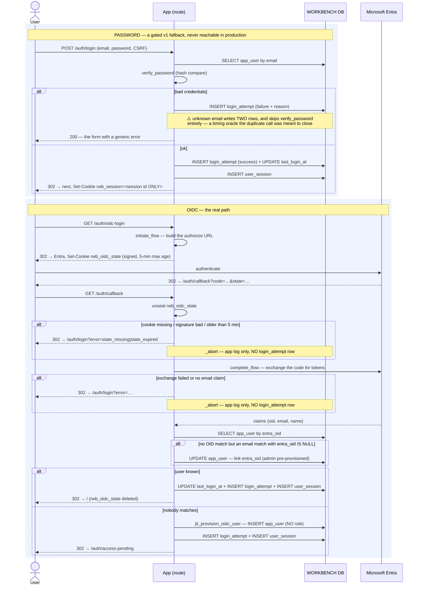
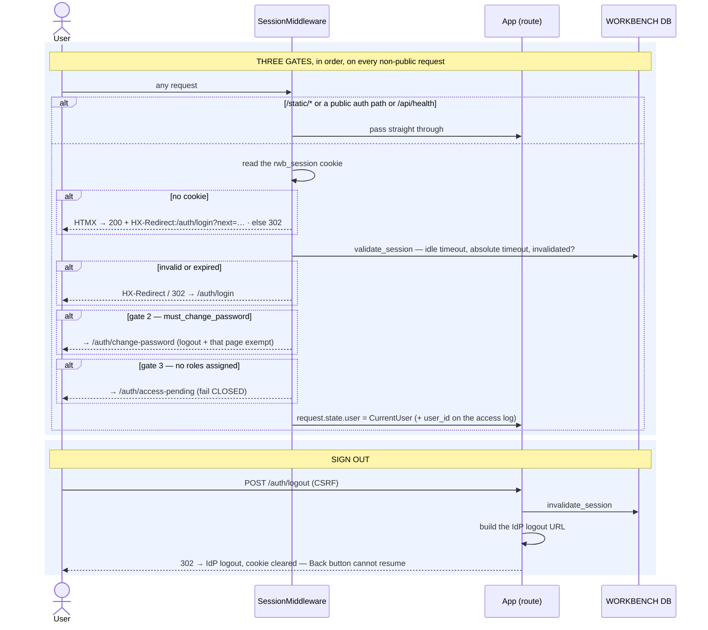

# Execution Flow — Sign In, Stay In, Sign Out (001 US1 / US2 / US5)

Two ways in — **Microsoft (OIDC)** for real deployments and a **password** fallback that is
gated to non-production — and one way out. Once in, every subsequent request is validated by
middleware that knows how to redirect an HTMX request as well as a browser navigation.

**Purely workbench.** The only external system is the identity provider, and only during the
OIDC round trip.

Code: `auth.login_submit` / `oidc_login` / `oidc_callback` / `logout`;
`app.auth.middleware.SessionMiddleware`; `auth_service.create_session` / `validate_session` /
`invalidate_session`.

**Classification:** entirely **sync**. No RM call, no `rwb_job`, no worker, no poller.

## Records written

| Action | # | Table | Row / change | Process |
|---|---|---|---|---|
| Password login | 1 | `login_attempt` | INSERT — email, method, success/failure + reason, IP, user-agent (**every attempt, including failures**) | 🟦 request |
| Password login | 1a | `login_attempt` | ⚠️ INSERT — a *second* failure row when the email is unknown; `login_submit` calls `fail("account_not_found")` twice. Current behaviour, not intent — see the boundary note below | 🟦 request |
| Password login | 2 | `app_user` | UPDATE `last_login_at` | 🟦 request |
| Password login | 3 | `user_session` | INSERT — the session; the cookie carries **only its id** | 🟦 request |
| OIDC callback | 1 | `app_user` | UPDATE — link `entra_oid` to an admin-pre-provisioned record matched by email (only when its `entra_oid` is NULL) | 🟦 request |
| OIDC callback | 2 | `app_user` | INSERT — **JIT provision** when no record matches at all; **`user_role` is deliberately NOT written** — the missing role is what makes gate 3 fail closed (see [user administration](user_administration.md)) | 🟦 request |
| OIDC callback | 3 | `login_attempt` + `app_user.last_login_at` + `user_session` | as above | 🟦 request |
| Logout | 1 | `user_session` | UPDATE — invalidated; the cookie is cleared and the IdP logout URL is built | 🟦 request |

## Sequence — the two ways in

## Sequence — every request after that

---

**Boundaries worth noting**

- **The cookie contains a session id and nothing else** (Article 13). No claims, no roles, no
  user id — so every request re-reads the session and the user's current roles, and an admin's
  role change or force-logout takes effect on the *next* request rather than the next login.
- **HTMX changes how a redirect has to be expressed.** A 302 to an HTMX request would be
  followed by the browser and swapped into a fragment — so the middleware returns **200 with
  `HX-Redirect`** instead, and the client navigates. Every auth redirect in the app goes through
  the one `_redirect_response` helper for exactly this reason (001 US5).
- **The role gate fails closed.** A JIT-provisioned OIDC user is authenticated but has no role,
  so gate 3 pins them to `/auth/access-pending` until an admin assigns one. Being able to sign in
  is not being able to do anything. `jit_provision_oidc_user` writes `app_user` and **nothing
  else** — the absent `user_role` row *is* the mechanism.
- **The unknown-email branch is doubly wrong today.** `login_submit` calls
  `fail("account_not_found")` twice (the first return value is discarded), so an unknown email
  writes two `login_attempt` rows. The comment on that line says the extra call exists to
  prevent a timing oracle, but `fail()` never verifies a hash — so a known email still costs a
  full password verify and an unknown one does not. Documented here as current behaviour, not
  as intent.
- **The gates are ordered, and the exemptions are minimal.** `must_change_password` is checked
  before roles, and the only paths exempt from both are logout, change-password, and
  access-pending — enough to get out or get fixed, nothing else.
- **`AUTH_MODE=password` is a gated v1 fallback and must never be reachable in production.** It
  exists so the app can run without an IdP in dev; the OIDC path is the real one.
- **Every *password* attempt and every *successful* OIDC callback is recorded**, with IP and
  user-agent. That is the audit surface for "who tried to get in" — but it has a hole: the
  `_abort` paths in `oidc_callback` (state missing/expired, token exchange failed, no email
  claim) log to the **application logger only** and write no `login_attempt` row. A failed
  OIDC sign-in therefore leaves no database evidence.
- **The OIDC state cookie is signed and short-lived** (5 minutes, `itsdangerous`), and is deleted
  on every exit from the callback — success, provision, or abort. A replayed or stale callback
  aborts to the login page with a named reason rather than half-completing.
- **Logout invalidates server-side, not just client-side.** Clearing the cookie alone would leave
  a valid session id in the database; `invalidate_session` is what makes the Back button useless
  (001 US1).
