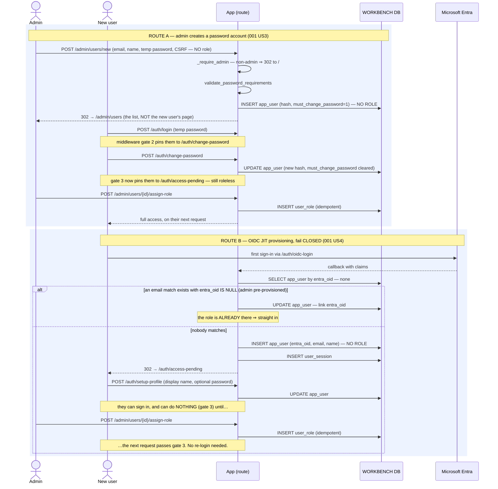

# Execution Flow — Provision & Administer Users (001 US3 / US4)

How someone becomes an analyst. Two routes in — an admin **creating a password account**, or an
Entra user **provisioning themselves on first sign-in** and then waiting for a role — plus the
ongoing admin actions: assign a role, reset a password, force logout, pre-provision an Entra
user.

Everything under `/admin` is gated by `_require_admin`; non-admins are redirected to `/`. That
gate is a **function** gate, not a row gate (Article 6): admins get extra *actions*, never extra
*visibility*.

Code: `admin.create_user` / `assign_role` / `reset_password` / `force_logout` /
`provision_oidc_user`; `auth.setup_profile` / `change_password_submit`;
`app.auth.provisioning.jit_provision_oidc_user`.

**Classification:** entirely **sync**. No RM call, no `rwb_job`, no worker, no poller.

## Records written

| Action | Table | Row / change |
|---|---|---|
| Admin creates a password user | `app_user` | INSERT — hashed temp password, **`must_change_password=1`**, **no role** (the form has no role field) |
| Admin pre-provisions an Entra user | `app_user`, `user_role` | INSERT — email + role, **`entra_oid` NULL**; two separate statements, not one transaction |
| OIDC first sign-in, nobody matches | `app_user` | INSERT — `entra_oid`, email, display name, **no role** |
| OIDC first sign-in, email matches a pre-provisioned row | `app_user` | UPDATE — link `entra_oid` (only when it was NULL) |
| Admin assigns a role | `user_role` | INSERT — idempotent |
| Admin resets a password | `app_user` | UPDATE — new hash (+ `must_change_password`) |
| Admin forces logout | `user_session` | UPDATE — **every** session for that user invalidated |
| User sets up their profile | `app_user` | UPDATE — display name, optional password hash |
| User changes their password | `app_user` | UPDATE — new hash, `must_change_password` cleared |

All 🟦 request path, all in `rwb_workbench`.

## Sequence — the two ways to become a user



## Sequence — ongoing administration

```mermaid
sequenceDiagram
    actor Admin
    participant App as App (route)
    participant DB as WORKBENCH DB

    rect rgb(238,244,255)
        Note over Admin,DB: All /admin routes: _require_admin first, then raw SQL
        Admin->>App: GET /admin/users
        App->>DB: SELECT app_user + roles
        App-->>Admin: the list

        Admin->>App: POST /admin/users/{id}/reset-password
        App->>DB: UPDATE app_user (new hash)
        Note over App: does NOT run validate_password_requirements (unlike create)

        Admin->>App: POST /admin/users/{id}/force-logout
        App->>DB: UPDATE user_session — invalidate ALL sessions for that user
        Note over Admin,DB: takes effect on their very next request (cookie holds only an id)

        Admin->>App: POST /admin/users/provision-oidc (email, role)
        App->>DB: SELECT app_user by email — exists? reuse : INSERT (entra_oid NULL)
        App->>DB: INSERT user_role — idempotent (IF NOT EXISTS)
        Note over App,DB: SELECT-then-INSERT is not one transaction; UNIQUE(email)<br/>turns a concurrent double-submit into a 500, not a duplicate user
        Note over Admin,DB: their first Entra sign-in links the OID and lands them straight in
    end
```

---

**Boundaries worth noting**

- **Roles gate functions, never rows** (Article 6). Being an admin adds `/admin` and a few
  actions; it does not widen what deals or entities you can see, because nothing is scoped.
- **JIT provisioning fails closed, and that is the whole design.** A new Entra user is
  authenticated with **no role**, which middleware gate 3 turns into `/auth/access-pending`.
  Authentication and authorisation are deliberately separate steps with a human in between.
- **Pre-provisioning is the way to avoid the waiting room.** Creating the `app_user` + `user_role`
  ahead of time with `entra_oid` NULL means the first sign-in *links* rather than *provisions*,
  and the user lands straight in. The email is the join key, which is why that INSERT is
  idempotent by email.
- **Role and session changes apply on the next request, not the next login**, because the cookie
  carries only a session id. That is what makes force-logout and role assignment immediate.
- **Creating a password account does *not* grant a role, and the UI does not say so.** The
  create form has no role field and `create_user` writes only `app_user`, so the new account
  behaves exactly like a JIT-provisioned OIDC one: it authenticates, changes its temp password,
  and then sits at `/auth/access-pending` until an admin assigns a role. That is consistent
  fail-closed behaviour — but the route redirects to `/admin/users` rather than to the new
  user's detail page, which is the only place the role can be assigned, so nothing leads the
  admin to the step that is still outstanding.
- **`admin.py` bypasses the service layer** — it writes `app_user` / `user_role` with raw
  `db.execute` / `execute_command` rather than through a service. Still the safe bound-parameter
  path (Article 7), but the validation and logging that a service would centralise isn't there.
- **Neither creation path is transactional.** `provision_oidc_user` does SELECT-then-INSERT on
  `app_user` and a separate `IF NOT EXISTS` INSERT on `user_role` — three autocommit statements,
  no explicit `conn.begin()`. Correctness is carried by `UNIQUE(app_user.email)` and the
  `IF NOT EXISTS` guard rather than by isolation, so the failure mode of a concurrent
  double-submit is an unhandled integrity error, not a duplicate or half-provisioned user.
- **`reset-password` skips `validate_password_requirements`**, which `create_user` runs. An admin
  can therefore set a temp password that the user could not have set themselves. Worth fixing;
  documented here so a reader doesn't assume symmetry.
- **`must_change_password` is enforced by middleware, not by the login route.** The gate sits in
  front of *every* path except logout and change-password, so a temp-password user cannot reach
  anything by deep-linking.
