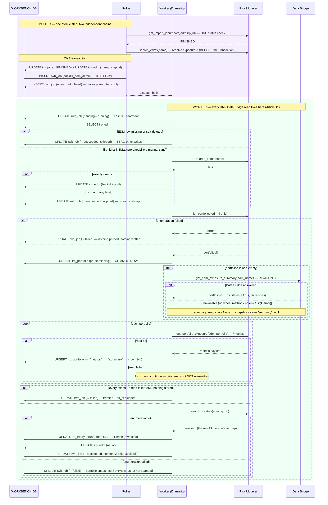

# Execution Flow — Backfill an EDM's Detail (004 US1 / US4)

Nobody clicks this. An EDM that reaches `ready` is still a near-empty record — the analyst
can see it imported, not *what is in it*. So the poller transaction that flips the EDM to
`ready` also enqueues a **`backfill_edm_detail`** job, and a worker goes and fetches the
portfolios, their exposure figures, and the treaty attributes, storing each as a **JSON
snapshot cache** on `irp_portfolio` / `irp_treaty`. The
[EDM detail page](../entities/view_edm_detail.md) then renders entirely from those
snapshots, with no Risk Modeler call on the request path.

The same job is what the manual **Sync** button re-runs — see
[manual sync](manual_sync.md).

Code: `poller.run._handle_import_edm_terminal` → `rwb_job(backfill_edm_detail)` →
`package_jobs._backfill_edm_detail_body` → `portfolio_service.upsert_portfolio_detail` /
`treaty_service.upsert_treaty_detail`.

**Classification:** **async (worker)** throughout. Automatic backfill is **forward-only**
(FR-003) — there is no bulk sweep, so entities that completed before this shipped stay in a
graceful empty state until re-imported or manually synced.

## Two chains leave the same poller transaction

This is the part worth internalising. `_handle_import_edm_terminal` is one atomic step that
can enqueue **two independent** follow-ups:

```
                     ┌── rwb_job(backfill_edm_detail)  → THIS FLOW (detail)
irp_job(import_edm)  │
  FINISHED ──────────┤   irp_edm: importing → ready
                     │
                     └── rwb_job(upload_rdm)  → the package's RDM applies
```

Neither waits for the other, and neither can starve the other — they are separate `rwb_job`
rows claimed by whichever worker is free. The `upload_rdm` half only appears when the EDM is
a package member; see [save & sync](../packages/save_and_sync_package.md).

## Records written (in order)

Everything lands in **`rwb_workbench`** via the `WORKBENCH` connection. Nothing here touches
`rwb_exposure` or `rwb_loss`.

| # | Table | Row / change | Written by | Process |
|---|---|---|---|---|
| 1 | `rwb_job` | INSERT — `backfill_edm_detail`, `pending`, keyed `('irp_job', <finished import_edm irp_job.id>)`, input `{edm_id}` | `enqueue_rwb_job` | 🟪 poller |
| 2 | `rwb_job` | UPDATE — `pending → running`, `claimed_by` (atomic claim) | `claim_rwb_job` | 🟩 worker |
| 3 | `rwb_job_heartbeat` | UPSERT — refreshed on an interval by the heartbeat thread | `upsert_heartbeat` | 🟩 worker |
| 4 | `irp_edm` | UPDATE — `irp_id` backfilled, **only** on the pre-capability path where it was NULL *and* the name search returned exactly one hit | `_backfill_edm_detail_body` | 🟩 worker |
| 5 | `irp_portfolio` | UPDATE — prune: resurrect `deleted_at=NULL` for names RM still returns, then stamp `deleted_at` on live rows it no longer does | `portfolio_service.prune_missing` | 🟩 worker |
| 6 | `irp_portfolio` | **per portfolio** — UPDATE-by-`irp_id`, else UPDATE-by-`name`, else INSERT: `name`, `exposure_detail`, `as_of` | `upsert_portfolio_detail` | 🟩 worker |
| 7 | `irp_treaty` | UPDATE — prune, same shape as 5 | `treaty_service.prune_missing` | 🟩 worker |
| 8 | `irp_treaty` | **per treaty** — same three-step upsert: `name`, `attributes`, `as_of` | `upsert_treaty_detail` | 🟩 worker |
| 9 | `irp_edm` | UPDATE — `as_of` (the FR-052 header trust signal: "detail is current as of …") | `_backfill_edm_detail_body` | 🟩 worker |
| 10 | `rwb_job` | UPDATE — `running → succeeded` + `output_data` (`portfolios`, `treaties`, `summary: ok\|unavailable`) | `complete_rwb_job` | 🟩 worker |

**Steps 5–8 are `N + M + 2` separate short transactions**, not one — deliberately, because
**no transaction may span a gateway round-trip** (`_common._txn`, and the discipline note at
the top of the worker body). Contrast
[`backfill_rdm_analyses`](backfill_rdm_analyses.md), which does all its RM reads up front and
then writes everything in **one** transaction. Both are correct; the difference is that this
flow interleaves a `/metrics` read per portfolio, so it cannot hold a transaction open.

## Sequence



## The snapshot shape

One `exposure_detail` JSON per portfolio, namespaced so the two sources never collide:

```json
{
  "metrics": { "totalLocations": …, "totalAccounts": …, "totalPolicies": …, "perilsExposed": […] },
  "summary": { "total_tiv": …, "states": […], "lines_of_business": […], "currencies": […] }
}
```

`metrics` is RM's `/metrics` payload verbatim; `summary` is the Data Bridge aggregate, or
`null` when Data Bridge was unavailable. `irp_treaty.attributes` is the same idea — the RM
treaty row stored whole.

Storing RM's vocabularies verbatim (perils, geography, currency) is a deliberate Article 3
call: no internal code dispatches on them, so minting a kind table would mean a seed
migration every time Moody's adds a peril. The EDM-level aggregate strip is **derived in the
query layer** from these snapshots and never stored (research R2/R4).

## Data Bridge degradation, precisely

`irp_gateway.get_edm_exposure_summary` **raises on any failure** — database-name resolution,
a missing `databridge` extra, missing env, a SQL error. The graceful handling lives in
exactly one place: the worker's `try/except` around that call. When it raises:

- `summary_map` stays `None`;
- every portfolio snapshot gets `"summary": null` — **never a stale prior value**, because
  `as_of` must not overstate freshness;
- the job still **succeeds**, and records `output_data.summary = "unavailable"`;
- the read side degrades cleanly: `aggregate_exposure` simply contributes no TIV / states /
  LOB / currency, while the `metrics` half still yields locations / accounts / policies /
  perils.

The join back to portfolios is `str(portfolio.irp_id)`, with a `portfolio_name`-equality
fallback for the documented case where Data Bridge's `PORTINFOID` diverges from RM's
`portfolioId`.

---

**Boundaries worth noting**

- **The poller enqueues; the worker reads.** Article 11's line is drawn twice here: the
  poller's loop body does one status check and never a detail fetch, and the web layer reads
  only stored detail. Every RM and Data Bridge read in this flow is worker-side.
- **Data Bridge is read-only and worker-side only** (Article 11's DataBridge clause). It is
  reached through the wheel's own executor against RM's *physical* EDM database, using
  repo-owned scripts under `sql/databridge/` — never through the `db/` package, and never
  written to. It is also the one deliberate exception to the single-item-loop rule: one call
  returns the aggregate for every portfolio at once.
- **A zero-portfolio EDM makes no Data Bridge call at all**, and reports no `summary` key in
  `output_data` — absence of the key is not the same as `"unavailable"`.
- **The upsert is an idempotent overwrite in place.** Re-running the job never adds rows:
  match on `irp_id`, else on `name`, else insert. `irp_portfolio` and `irp_treaty` carry
  **no status column** (Article 4) — only the snapshot and its `as_of`, updated in place.
  That is what makes manual Sync safe to click repeatedly.
- **Pruning is a soft delete, and it commits before the upserts.** That ordering has a real
  edge: if every subsequent `/metrics` read fails, the prune has already committed and rows
  can be soft-deleted with nothing written back. The job correctly reports `failed`, and a
  re-run resurrects them (the prune's first statement clears `deleted_at` for names RM still
  returns) — but the page can look emptier than it should in between.
- **A partial failure keeps what it earned.** A treaty-enumeration failure leaves the
  portfolio snapshots in place and simply doesn't stamp `as_of` — so the page shows real
  data while honestly declining to claim it is current. The EDM's own `ready` status is
  never touched by any failure here (FR-005): a detail-fetch problem must not make a
  successfully imported EDM look broken.
- **This worker refuses to guess an `irp_id`.** Where the poller takes the *newest* of
  several name matches (it knows the one it just created is newest), this worker skips
  unless there is exactly one hit — it has no such knowledge, and writing the wrong
  `exposureId` would attach another EDM's portfolios.
