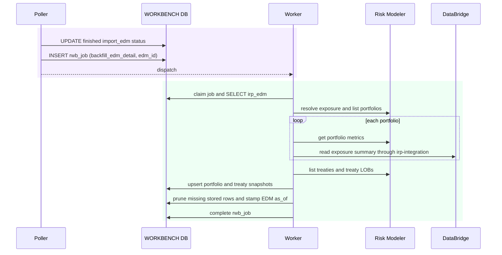

# Execution — Backfill EDM Detail

After an EDM import finishes, the poller enqueues one `backfill_edm_detail` job.
The worker reads the EDM's portfolios, exposure metrics, treaties, and Data Bridge
summary, then replaces the stored portfolio and treaty detail.

EDM completion does not enqueue RDM imports. RDM imports and analysis refreshes are
independent operations.

## Rows written

| Table | Change |
|---|---|
| `rwb_job` | poller enqueues `backfill_edm_detail`; worker claims and completes it |
| `irp_portfolio` | upsert returned portfolios and stored exposure summaries |
| `irp_treaty` | upsert returned treaties and LOB attributes |
| `irp_edm` | fill exposure ID when found and stamp `as_of` after a usable refresh |

Risk Modeler and Data Bridge failures do not run in a page handler. Individual
portfolio enrichment failures leave the affected optional detail empty. A refresh
that stores no usable detail fails without replacing the prior snapshot.
