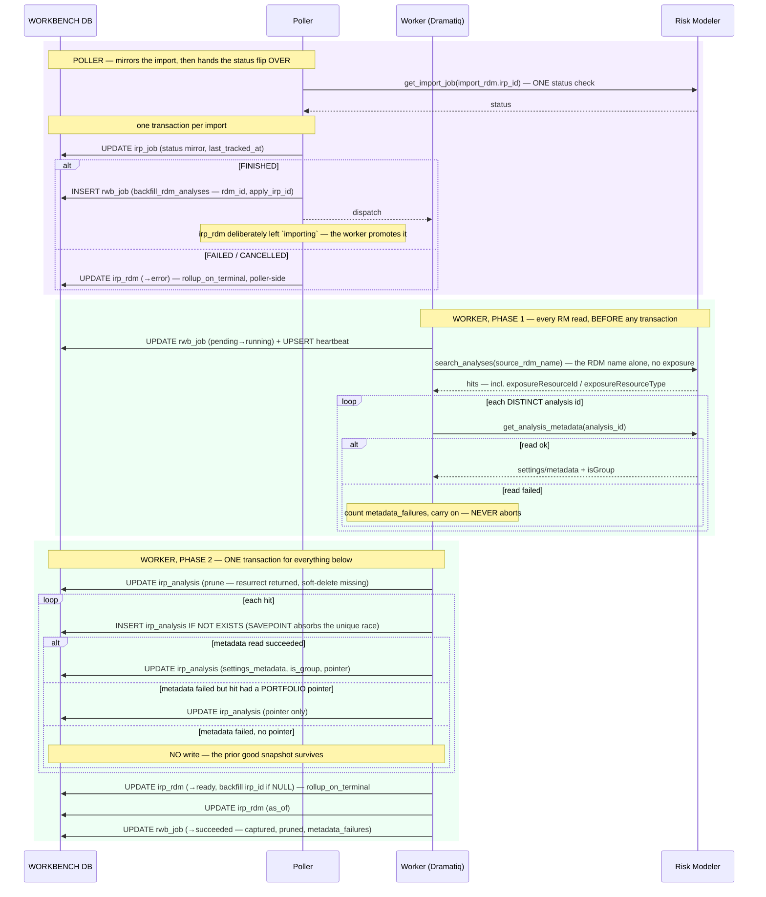

# Execution Flow — Backfill an RDM's Broker Analyses (004 US3)

Nobody clicks this either. When an RDM apply reaches `FINISHED`, the broker's analyses that
rode inside the RDM now exist in Risk Modeler — but the workbench doesn't know their names,
their settings, or which portfolio each one ran against. So the poller enqueues a
**`backfill_rdm_analyses`** job, and a worker discovers them, captures each analysis's
settings/metadata snapshot, resolves the portfolio pointer, **and promotes the RDM to
`ready`** in the same transaction.

That last part is the inversion worth knowing: for every other entity, the **poller** owns
the terminal status flip. Here the **worker** does — so the RDM never reads `ready` with no
analyses under it.

Code: `poller.run._handle_import_rdm_terminal` → `rwb_job(backfill_rdm_analyses)` →
`package_jobs._backfill_rdm_analyses_body` → `rdm_service.rollup_on_terminal`.

**Classification:** **async (worker)**. Every RM read happens **before** the transaction
opens (Article 11); everything then commits atomically.

## One job shape, two enqueue keys

Both paths do the same work — capture one RDM's analyses — and differ only in what they key
on and whether they carry the import's `irp_id`:

| Enqueued by | Key | Input |
|---|---|---|
| poller, on `import_rdm` FINISHED | `('irp_job', <the import's irp_job.id>)` | `rdm_id`, `package_id`, `apply_irp_id` |
| `rdm_service.sync_detail` (manual) | `('analyst_request', rdm_id)` | `rdm_id`, `package_id` |

Because the two keys differ, the unique constraint
`(requestor_type, requestor_id, rwb_job_type)` admits both at once — a manual Sync can run
while a poller-driven backfill is still queued. Without `apply_irp_id`,
`created_by_irp_job_irp_id` is written NULL and the rollup backfills no `irp_id`.

## Records written (in order)

All in **`rwb_workbench`**.

| # | Table | Row / change | Written by | Process |
|---|---|---|---|---|
| 1 | `rwb_job` | INSERT — `backfill_rdm_analyses`, `pending` (see the two keys above) | `enqueue_rwb_job` / `ensure_pending_rwb_job` | 🟪 poller / 🟦 request |
| 2 | `rwb_job` | UPDATE — `pending → running` (atomic claim) | `claim_rwb_job` | 🟩 worker |
| 3 | `rwb_job_heartbeat` | UPSERT | `upsert_heartbeat` | 🟩 worker |
| 4 | `irp_analysis` | prune: resurrect `deleted_at=NULL` for ids RM returned again, then stamp `deleted_at` on live rows it no longer returns | `_prune_rdm_analyses` | 🟩 worker |
| 5 | `irp_analysis` | **per hit** — `INSERT … WHERE NOT EXISTS`: `rdm_id`, `edm_id` (NULL), `package_id`, `irp_id`, `name`, `source_rdm_name`, `status_code='ready'`, `created_by_irp_job_irp_id`, `is_group=0` — inside a `begin_nested()` SAVEPOINT | `_INSERT_ANALYSIS_IF_ABSENT` | 🟩 worker |
| 6 | `irp_analysis` | **per hit** — UPDATE `settings_metadata`, `is_group`, `exposure_resource_id` (metadata read succeeded) — **or** `exposure_resource_id` only (metadata failed but the search hit carried a PORTFOLIO pointer) — **or nothing at all** | `_UPDATE_ANALYSIS_DETAIL` / `_UPDATE_ANALYSIS_POINTER` | 🟩 worker |
| 7 | `irp_rdm` | UPDATE — **the `ready` rollup**, backfilling `irp_id` + `created_by_irp_job_irp_id` only when currently NULL | `rollup_on_terminal` | 🟩 worker |
| 8 | `irp_rdm` | UPDATE — `as_of` | `_backfill_rdm_analyses_body` | 🟩 worker |
| 9 | `rwb_job` | UPDATE — `running → succeeded` + `output_data` (`captured`, `pruned`, `metadata_failures`) | `complete_rwb_job` | 🟩 worker |

**Steps 4–8 commit as ONE transaction.** That is the deliberate opposite of
[`backfill_edm_detail`](backfill_edm_detail.md), which needs `N + M + 2` short ones. It works
here because every RM read is done up front, so nothing holds the transaction open across a
network call.

## Sequence

## Portfolio linkage — the R9 rule

Each analysis gets an `exposure_resource_id` pointer, and the rule is strict:

1. start from the search hit's `(exposure_resource_id, exposure_resource_type)`;
2. if the metadata read returned a non-null `exposure_resource_id`, **metadata wins**;
3. keep the id **only if the type is `PORTFOLIO`** — a `GROUP`- or `ACCOUNT`-typed pointer is
   stored as **NULL**.

No portfolio lookup happens in this worker, and **nothing reads the pointer** (8/4 D8): no
analysis is attributed to a portfolio, because there is no trustworthy way to tie a broker
RDM's analysis to an EDM's portfolio. The column is captured because it is defensible for
analyses CIC runs itself, which is a later iteration.

`is_group` comes from the metadata's first-class `isGroup` boolean, falling back to
`'GROUP'`-literal markers.

## The rollup, precisely

`rollup_on_terminal` writes from the status of the one `import_rdm` the caller is handling:

| Status of the import | Write |
|---|---|
| `FINISHED` | `status = 'ready'`, plus `irp_id` and `created_by_irp_job_irp_id` **only where currently NULL** |
| anything else terminal | `status = 'error'` |

It deliberately does not scan the RDM's `import_rdm` history. Counting rows instead left a
superseded `SUBMISSION FAILED` attempt dragging a successful re-import back to `error`, with
`irp_id` never backfilled (issue #38).

Because it writes the same result each time for the same import, calling it again is
harmless — which is exactly what lets manual Sync reuse it.

---

**Boundaries worth noting**

- **The worker owns the `ready` flip; the poller owns `error`.** The split exists so `ready`
  and the captured analyses commit together. A failed apply needs no capture, so the poller
  handles it in place.
- **Read-then-write, strictly.** Phase 1 is all network, phase 2 is all database, and they
  never interleave. That is what permits the single transaction — and it is the reverse
  trade-off from the EDM detail backfill, which must interleave and therefore uses many small
  transactions.
- **The SAVEPOINT is not decoration.** Two backfills for the same RDM can race — a poller
  enqueue and a manual Sync. `INSERT … WHERE NOT EXISTS` narrows the window; `begin_nested()`
  absorbs the `UNIQUE(rdm_id, edm_id, irp_id)` violation if it loses anyway, without rolling
  back the whole transaction.
- **A metadata failure never destroys data.** The three-way branch in step 6 exists so that a
  transient `GET /analyses/{id}` failure degrades to "keep what we already had" rather than
  overwriting a good snapshot with nulls. `metadata_failures` is reported in `output_data` so
  the loss is visible.
- **Pruning is keyed on the RDM, and it trusts the search.** Anything the search didn't
  return for that RDM is soft-deleted. That has a real consequence for manual Sync: if the
  RDM was renamed in Risk Modeler, `search_analyses` legitimately returns nothing and **every
  captured analysis for it is soft-deleted**. Nothing is lost permanently (soft delete only),
  but the page will empty out.
- **`as_of` advances even when the status does not.** It is stamped in step 8 regardless of
  what the rollup wrote, so freshness can move while status stays put.
- **`group_parent_id` is deferred** (004 T005). The column exists; nothing populates it. So a
  group analysis is identifiable (`is_group`) but its membership is not — the RDM and EDM
  pages both list a group analysis as one row alongside the others.
- **No loss numbers.** This flow captures identity, settings and linkage only. Retrieving
  actual results is Iteration 6 — the `retrieve_analysis_results` `rwb_job_type` is seeded
  with no actor.
