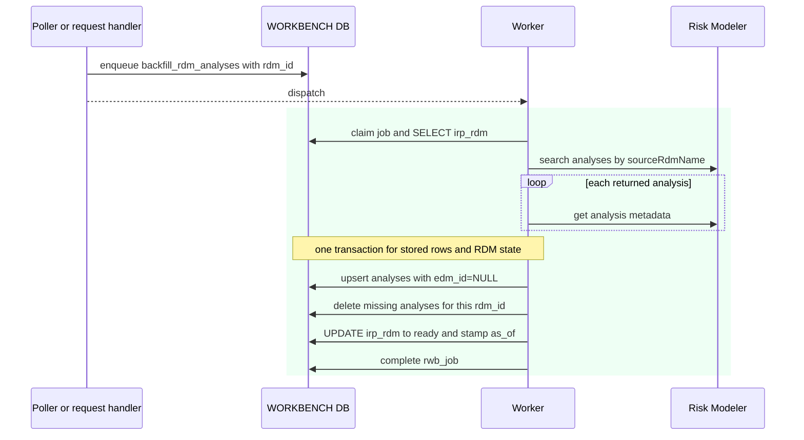

# Execution — Backfill RDM Analyses

The worker stores the analyses returned for one RDM name. The poller enqueues the
job after the standalone RDM import finishes. An analyst can also request the same
refresh from the RDM detail page or a contextual EDM page.

Code: `entity_jobs._backfill_rdm_analyses_body`,
`analysis_service.upsert_broker_analysis`, and `rdm_service.rollup_on_terminal`.

## Rows written

| Table | Change |
|---|---|
| `irp_analysis` | insert or update each Risk Modeler analysis under the RDM; `edm_id` is null |
| `irp_analysis` | remove stored analyses no longer returned for the RDM |
| `irp_rdm` | set `ready`, fill import IDs when absent, and stamp `as_of` |
| `rwb_job` | worker claim, heartbeat, and terminal result |

The worker identifies each analysis by (`rdm_id`, `irp_id`). A failed metadata read
leaves optional metadata blank for the named analysis and does not stop the other
analysis writes. A failed enumeration fails the job and retains the prior snapshot.
