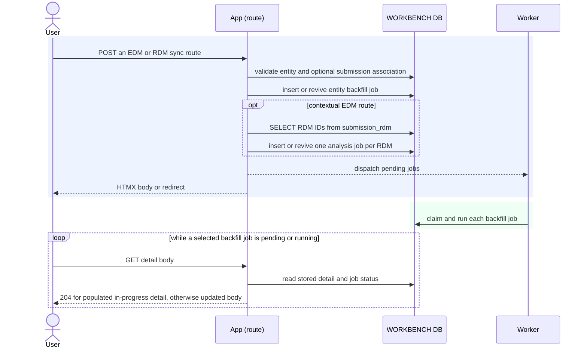

# Execution — Refresh Stored Detail

The Sync action enqueues stored-detail work and returns without waiting for Risk
Modeler. The request handler does not perform polling or result reads.

## Jobs by route

| Route | Jobs |
|---|---|
| `POST /edms/{edm_id}/sync` | one `backfill_edm_detail` job |
| `POST /rdms/{rdm_id}/sync` | one `backfill_rdm_analyses` job |
| `POST /submissions/{submission_id}/edms/{edm_id}/sync` | one EDM detail job plus one analysis job for each RDM in `submission_rdm` |

The contextual route validates `submission_edm` before enqueueing. It selects RDM
IDs only from `submission_rdm` for the named submission. The direct EDM route has no
submission context and does not select RDMs.

An existing pending or running job absorbs a repeated click. A terminal job is
revived for a new analyst request. Once all selected jobs are terminal, the rendered
body omits its HTMX polling trigger.
