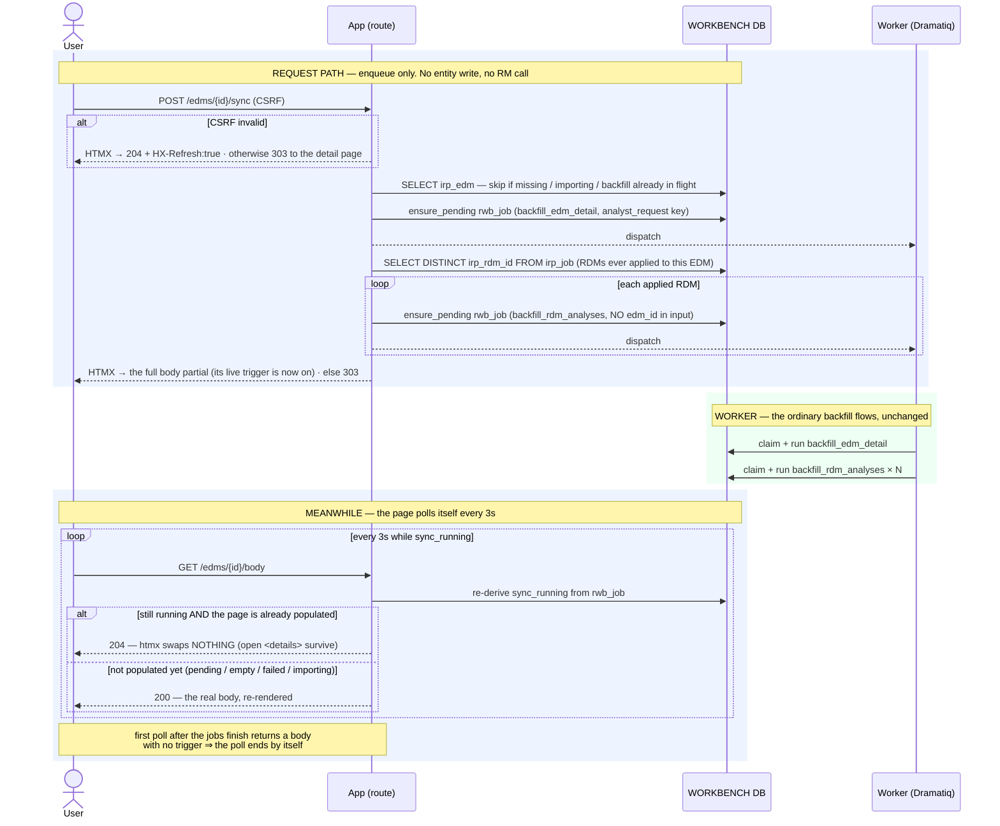

# Execution Flow — Sync an Entity's Detail on Demand (004 T056)

Automatic backfill is **forward-only** — an EDM imported before the detail capability shipped
has no portfolios, and an entity whose backfill failed stays empty. The **Sync** button on
the EDM and RDM detail pages is the manual re-run: it re-enqueues the *same* backfill jobs the
poller would have, and the page stays live until they land.

The whole request path does one thing: **insert or revive a `rwb_job` row**. No entity write,
no Risk Modeler call, nothing waited on.

Code: `POST /edms/{id}/sync` → `edm_service.sync_detail` **+**
`rdm_service.sync_analyses_for_edm`; `POST /rdms/{id}/sync` → `rdm_service.sync_detail`.

**Classification:** request path = **sync**, enqueue-only. All the work is
[backfill EDM detail](backfill_edm_detail.md) and
[backfill RDM analyses](backfill_rdm_analyses.md) — unchanged, same worker bodies.

## What each button enqueues

| Action | Jobs enqueued | Key |
|---|---|---|
| **Sync** on the EDM detail page | one `backfill_edm_detail` for this EDM, **plus** one `backfill_rdm_analyses` for *each* RDM ever applied to it | `('analyst_request', edm_id)` and `('analyst_request', rdm_id)` |
| **Sync** on the RDM detail page | one `backfill_rdm_analyses` for this RDM | `('analyst_request', rdm_id)` |

The applied-RDM fan-out is derived from the job history:
`SELECT DISTINCT irp_rdm_id FROM irp_job WHERE irp_edm_id = :e AND irp_job_type = 'import_rdm'`.
Each of those jobs is enqueued **without** an `edm_id`, which is the switch that makes the
worker re-do *every* applied pair rather than one — see
[backfill RDM analyses](backfill_rdm_analyses.md#one-job-shape-two-enqueue-keys).

## Records written (in order)

| # | Table | Row / change | Written by | Process |
|---|---|---|---|---|
| 1 | `rwb_job` | INSERT — `pending`, `requestor_type='analyst_request'`, `attempt_count=0` — **when no head exists** | `ensure_pending_rwb_job` → `_insert_head` (in a SAVEPOINT) | 🟦 request |
| 1′ | `rwb_job` | UPDATE — terminal head revived: `→ pending`, `claimed_by`/`output_data`/`error_detail`/`completed_at`/`submitted_at` cleared, `input_data` replaced, `attempt_count + 1`, `correlation_id` re-stamped | `ensure_pending_rwb_job` | 🟦 request |
| 1″ | — | **no write** — an existing `pending`/`running` head is left alone (the click is absorbed) | `ensure_pending_rwb_job` | 🟦 request |

That is the complete list. Everything after it is the two backfill flows.

## No-op guards

The service returns without writing anything when:

- the entity is missing or soft-deleted;
- its `status` is `pending_import` or `importing` — an import is already going to backfill it;
- a backfill for it is already `pending` or `running`.

## Sequence



## How "syncing" is represented

**There is no `syncing` status column anywhere.** The state is *derived* at read time from
`rwb_job.status_code`:

```
EdmDetail.sync_running = _latest_backfill_status(edm_id) in ('pending','running')
                         OR _analyses_backfill_running(edm_id)
```

Two things fall out of that:

- **`_latest_backfill_status` has to union both enqueue keys** — the poller's
  `('irp_job', …)` rows (joined through `irp_job.irp_edm_id`) and the analyst's
  `('analyst_request', edm_id)` rows — and order by **`updated_at DESC`, not `inserted_at`**,
  because a revived row keeps its original insert time and would otherwise look stale.
- **An EDM stays "syncing" while its *analyses* backfills are in flight**
  (`_analyses_backfill_running`), which is why one click on the EDM page keeps the page live
  past the portfolios landing, until the broker analyses arrive too.

The RDM page has no cross-entity term: `sync_running` is just its own latest
`backfill_rdm_analyses` status.

## Why the poll returns 204

A `hx-swap="outerHTML"` every 3 seconds would collapse every `<details>` the analyst had
opened. So the body route returns **204 No Content** when *all three* hold:

```
poll=True  AND  sync_running  AND  the page is already populated
```

htmx swaps nothing on a 204, and the trigger still in the DOM from the last real render keeps
ticking; the first poll after the sync completes returns a fresh body whose trigger is gone,
rendering the result exactly once. The self-terminating trigger is emitted only when
`edm.sync_running or edm.status in ('pending_import','importing','delete_pending')`.

Note the asymmetry: on a **not-yet-populated** page (`pending` / `empty` / `unavailable` /
`failed` / `importing`) the poll returns the real body every 3 s. That looks inconsistent but
is deliberate — there are no open `<details>` to protect, and the analyst wants to see the
first rows appear. The RDM page applies the same rule with a different "populated" test:
at least one analysis group has analyses.

---

**Boundaries worth noting**

- **`ensure_pending_rwb_job` is the human half of the enqueue split.** It is the only thing in
  the system that revives a *terminal* `rwb_job`; the poller's `enqueue_rwb_job` deliberately
  never does (that is what makes the automatic chains idempotent). A manual Sync is
  intentionally allowed to override "this already failed".
- **A revived row is re-stamped with the retrying request's `correlation_id`** — a retry is
  treated as a new causal chain rather than a continuation of the failed one.
- **The two enqueue keys coexist by design.** `UNIQUE(requestor_type, requestor_id,
  rwb_job_type)` is per key, so a manual Sync can be queued while a poller-driven backfill for
  the same entity is still pending. Both are idempotent overwrites, so the duplicate work is
  wasteful, not wrong.
- **Clicking Sync twice does nothing the second time** — the `pending`/`running` guard
  absorbs it, and the button's own state comes from the same derived `sync_running`.
- **Sync can move an RDM's status backwards.** It re-runs the unconditional rollup, so an RDM
  with any failed apply goes `ready → error`. And because the RDM prune trusts the RM search,
  a renamed RDM will soft-delete its captured analyses. Neither is a bug in Sync; both are
  properties of the flows it re-runs.
- **The only Risk Modeler contact is in the worker.** The request path performs no read at
  all here — not even the cached name check the import paths do.
