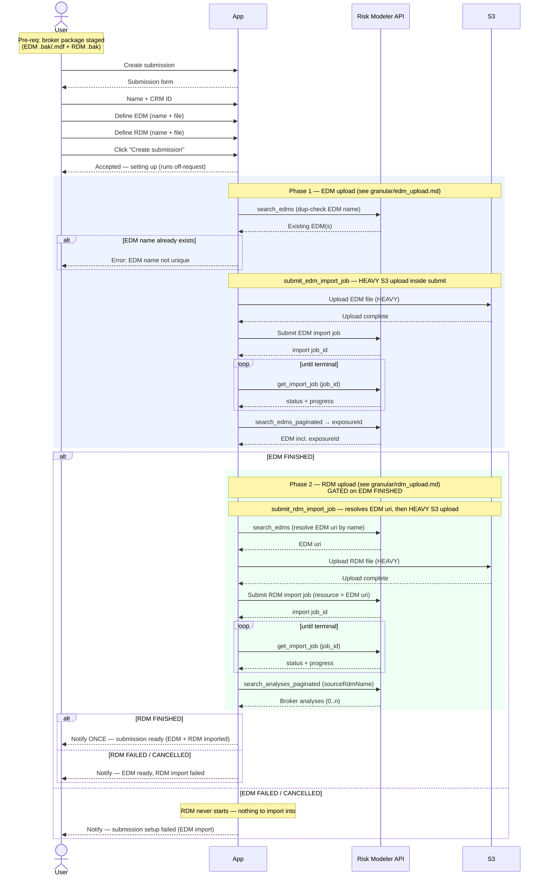

# Composite Flow — Create Submission (EDM + RDM)

The analyst's single UI action for taking in a broker package: enter the submission
details, define one EDM and one RDM, click **Create**, and later get **one**
notification that the submission is ready (both EDM and RDM imported). Under the
hood this composes two granular activities — **EDM upload** then **RDM upload** —
in a strict order, because the RDM cannot be imported until its EDM has *finished*.

**Composed of:**
- `granular/edm_upload.md` — `search_edms` (dup check) → `submit_edm_import_job`
  (heavy) → poll `import_job.get_import_job` → resolve `exposureId`.
- `granular/rdm_upload.md` — `submit_rdm_import_job(rdm, edm, path)` (heavy) → poll
  `import_job.get_import_job` → discover broker analyses (`search_analyses_paginated`).

**Classification:** two async **Jobs**, both **Heavy**, run **in sequence** (not in
parallel — RDM depends on EDM being FINISHED). One user click → a long-running,
off-request orchestration → one terminal "ready" notification.

Pre-requisites:
- A broker package with an EDM `.bak`/`.mdf` and an RDM `.bak` staged where the app
  can read them.
- The submission's EDM name and RDM name chosen (the only two names Risk Modeler
  will actually see).

**Definition:**

1. **Open the form** — User chooses "Create submission". The app presents one form.
2. **Populate submission details** — User enters the submission **Name** and **CRM
   ID**. (These are workbench-level identifiers — Risk Modeler has no concept of a
   "submission"; see boundaries.)
3. **Define the EDM** — User enters the **EDM name** and chooses the EDM upload file.
4. **Define the RDM** — User enters the **RDM name** and chooses the RDM upload file.
   (The RDM will be imported *into* the EDM named in step 3.)
5. **Submit** — User clicks "Create submission". The app now owns the rest; the work
   is off-request and outlives the click.
6. **Phase 1 — EDM upload** (the full `edm_upload.md` granular flow):
   1. Dup-check the EDM name (`search_edms`); stop with a user-facing error if taken.
   2. `submit_edm_import_job(edm_name, edm_file_path, server_name)` — the **heavy S3
      upload happens inside this synchronous submit** — returns an import `job_id`.
   3. Poll `import_job.get_import_job(job_id)` until terminal.
   4. On `FINISHED`, resolve the new `exposureId` (`search_edms_paginated`).
7. **Gate** — Proceed to the RDM only if the EDM reached `FINISHED`. If the EDM
   `FAILED`/`CANCELLED`, the RDM never starts (it has nothing to import into).
8. **Phase 2 — RDM upload** (the full `rdm_upload.md` granular flow):
   1. `submit_rdm_import_job(rdm_name, edm_name, rdm_file_path)` — resolves the EDM's
      URI by name, then does the **heavy S3 upload inside the synchronous submit** —
      returns an import `job_id`.
   2. Poll `import_job.get_import_job(job_id)` until terminal.
   3. On `FINISHED`, discover the broker analyses carried in the RDM
      (`search_analyses_paginated(sourceRdmName=...)`) — 0..n.
9. **Notify** — When both phases are terminal, notify the user **once**: submission
   ready (EDM imported, RDM imported, broker analyses discovered). If either phase
   failed, notify with which phase failed.

**Sequence Flow:**

---

**Boundaries worth noting** (candidates for metamodel bounding boxes — observations, not decisions):

- **"Submission" is a workbench-only concept — Risk Modeler has none.** The
  submission **Name** and **CRM ID** never reach Risk Modeler; RM only ever sees the
  EDM name and the RDM name. So the submission is the first thing in this whole
  spine that exists *only* in our world and groups two RM entities together. This is
  the clearest composite-level bounding-box candidate: something has to own "these
  two imports belong to one submission (Name, CRM ID)."
- **This composite is exactly the EDM→RDM sequencing gate made concrete.** The RDM
  granular flow's hard prerequisite ("EDM must be FINISHED, not merely submitted")
  becomes the ordering rule here: Phase 2 cannot begin until Phase 1 is `FINISHED`.
  The two heavy jobs run in **series**, not parallel.
- **One click → two heavy async jobs → one notification.** The user acts once and is
  told once. Everything between is off-request and long-running (two multi-GB
  uploads plus two server-side imports). Whatever owns "the submission" must span
  both jobs and know how to collapse their two terminal states into a single
  user-facing "ready".
- **Partial success is a real state.** EDM can finish and RDM can fail. The
  submission is then "half set up" — a state neither granular flow has on its own,
  and one Risk Modeler cannot represent. How the app models EDM-ready-RDM-failed is
  an open question the composite forces (retry just the RDM? mark the submission
  degraded?).
- **The RDM is optional in the real world even though this action supplies both.**
  A broker package is sometimes EDM-only; the standalone `Upload EDM` action covers
  that. "Create submission" is the both-files case — if RDM is omitted it degrades
  to the EDM-upload flow, and the "ready" notification fires after Phase 1.
- **No pre-submit dup guard on the RDM.** Phase 1 name-checks the EDM; Phase 2 does
  not name-check the RDM (the granular flow notes this). If the submission wants a
  guarantee that its RDM name is unique, that guard is an app-side addition, not
  something the package or RM enforces here.
