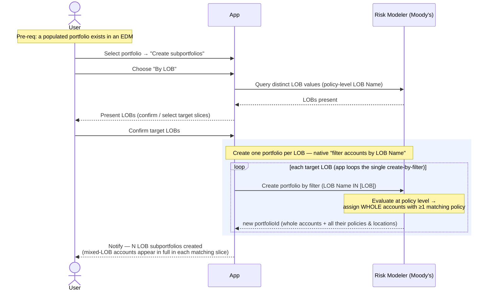

# Composite Flow — Create Subportfolios by LOB

The analyst's UI action for splitting a portfolio into subportfolios by line of
business. This is the "Create subportfolios (LOB / geographic)" capability from the
MVP spine — LOB is the worked example; a geographic split has the same shape with a
different filter attribute.

> **This flow is API-agnostic.** `irp-integration` does not yet expose the two pieces
> this needs — enumerating the distinct LOB values, and creating a portfolio **by
> filter**. Those are **enhancements to build** (lighter than they first appear — see
> boundaries). The flow describes the *work*, not specific package calls.

**Composed of:** Risk Modeler's native **"Create Portfolio by Filtering Accounts"**,
run **once per LOB**, plus a read to enumerate the distinct LOB values. Unlike
`create_subportfolio.md` (which creates a single *empty* portfolio), the filter
variant produces a *populated* portfolio — Risk Modeler does the account selection
server-side.

**Classification:** one **create-portfolio-by-filter** per LOB, app-orchestrated as a
loop of single calls (single-endpoint rule). The heavy selection work happens
**inside Risk Modeler**, not in the app. Whether each create returns synchronously or
spawns a job to poll is **TBD** pending the real endpoint.

**How Risk Modeler actually splits by LOB (the key facts).** Moody's exposure
hierarchy is:

```
EDM → (Groups/Portfolios) → Accounts → Policies → Locations / location-coverages
```

- **LOB is a policy-level attribute**, but Risk Modeler exposes **`LOB Name`** as a
  filter field in "Create Portfolio by Filtering Accounts" (operators `=`, `<>`,
  `IN`, `NOT IN`). So we do **not** manage LOB at the account/location level ourselves
  — RM understands it at policy level and rolls it up for portfolio filtering.
- **Portfolios are account-bucketed.** The filter is evaluated at policy level, but
  the unit assigned to the portfolio is the **whole account**: if *any* policy on an
  account matches the LOB, the **entire account** (all its policies **and** all its
  locations) is assigned. This is documented, general filter behavior.
- A policy is **not** guaranteed to cover every location in its account (special
  conditions / sublimits can scope a policy to a subset). So the earlier "any policy
  applies to any location" assumption does not hold — though it doesn't change this
  flow, since RM buckets whole accounts regardless.

Pre-requisites:
- A populated portfolio (or EDM) exists with accounts whose policies carry LOB.

**Definition:**

1. **Select + choose split** — User selects a portfolio in an EDM, chooses "Create
   subportfolios", and picks **By LOB**.
2. **Enumerate LOBs** — App determines the distinct `LOB Name` values present (a
   read over policies), and presents them so the analyst can confirm / choose which
   slices to build. (This is the only discovery read — **no full tree walk**.)
3. **Create one portfolio per LOB, by filter** — for each target LOB the app issues a
   "create portfolio by filtering accounts" with `LOB Name IN [LOB]`. Risk Modeler
   evaluates the filter at policy level and assigns every account with ≥1 matching
   policy — **in full** — to the new portfolio.
4. **Complete** — one subportfolio per LOB. Notify the analyst, flagging that
   mixed-LOB accounts appear in full in every slice they match (see boundaries).

**Sequence Flow:**


---

**Boundaries worth noting** (candidates for metamodel bounding boxes — observations, not decisions):

- **Risk Modeler does the split natively — no tree reconstruction.** This corrects an
  earlier assumption: the platform exposes `LOB Name` as a policy-level filter in
  "Create Portfolio by Filtering Accounts." We create one portfolio per LOB with a
  filter and RM does the selection. There is **no** need to read and rebuild the
  account → {policies, locations} tree by hand — the feature is far lighter than a
  bulk reconstruction.
- **Portfolios are account-bucketed — the split does not partition exposure.** A
  filter matching any policy on an account pulls the **entire account** (all policies
  and all locations) into the slice. So a mixed-LOB account appears, in full, in
  **every** LOB slice it matches, and summing the slices **double-counts** shared
  accounts. This is inherent Risk Modeler behavior — not something the app chooses or
  can avoid via filtering.
- **"Pure" LOB portfolios are not achievable by filtering.** You cannot get "only the
  Property policies" out of a mixed-LOB account this way. Pure slices would require
  **restructuring the exposure upstream** (splitting accounts by LOB before import) —
  a data-authoring effort well beyond portfolio creation, and out of MVP scope. If
  the client ever needs pure slices, that is a separate, much larger capability.
- **The split key is pluggable but not symmetric-and-clean.** A geographic split uses
  a location-level filter attribute instead of `LOB Name`, but the **same
  whole-account assignment** applies — an account with locations in two regions lands
  in **both** regional slices in full. (This corrects an earlier note: geography does
  **not** partition cleanly either, because RM still buckets whole accounts.)
- **Enhancements needed (light):** (a) enumerate distinct `LOB Name` values over the
  portfolio's policies; (b) a **create-portfolio-by-filter** call mirroring the UI's
  attribute / operator / value filter. Today's `create_portfolio` makes an *empty*
  portfolio — the filter variant is the gap, and it is the whole feature.
- **Single-endpoint loop; sync-vs-job TBD.** One create-by-filter per LOB, looped
  app-side so each slice is independent. Whether the create is synchronous or returns
  a pollable job is unknown until the endpoint is built — a real branch for how the
  app tracks it.
