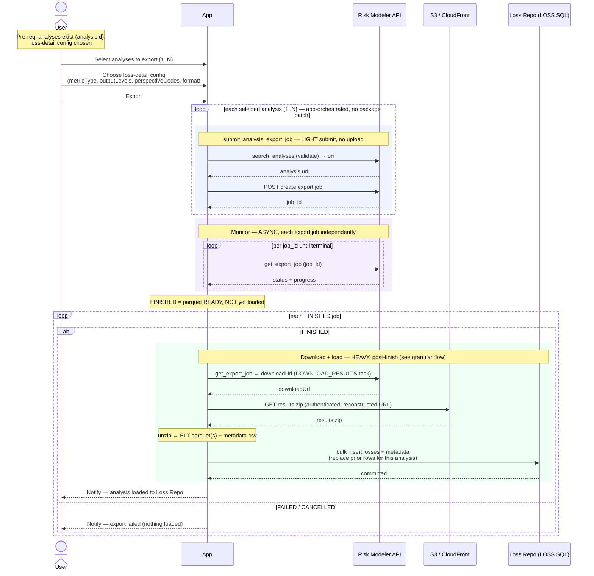

# Composite Flow — Export to Loss Repository

The analyst's UI action for pushing analysis results into the client's Loss
Repository (LOSS SQL). The analyst selects one or more analyses, chooses the
loss-detail configuration, and clicks **Export**. Under the hood each analysis
becomes an independent export job whose parquet is downloaded and loaded into LOSS
SQL. The action is **"done" only when the rows are loaded** — not when Risk Modeler
reports the export FINISHED.

**Composed of:**
- `granular/export_to_loss_repo.md` — `analysis.submit_analysis_export_job` (async)
  → poll `export_job.get_export_job` → authenticated download → unzip → bulk insert
  into LOSS SQL.

**Classification:** **N async Jobs** (one per analysis) each with a **heavy
post-finish load** (download + bulk insert). Unlike upload, the heavy work is *after*
the job finishes, not in the submit. Multi-analysis export is **entirely
app-orchestrated** — the package has no plural export helper and no up-front batch
validation.

Pre-requisites:
- The analyses exist and their `analysisId`s are known (a grouped analysis is still
  just an analysis and can be exported the same way).
- A loss-detail configuration is chosen: `metricType` (e.g. `LOSS_TABLES`),
  `outputLevels` (e.g. `["Portfolio"]`), `perspectiveCodes` (e.g. `["GU","GR"]`),
  and file format (default `PARQUET`).
- The app has an authenticated session capable of fetching the results object
  directly (see the download caveat in the granular flow).

**Definition:**

1. **Select analyses** — User picks one or more analyses (and/or groups) to export.
2. **Choose loss-detail config** — User sets `metricType`, `outputLevels`,
   `perspectiveCodes`, and format. In this flow the chosen config applies uniformly
   to every selected analysis (there is no package concept of per-analysis config
   within one action).
3. **Submit** — User clicks "Export". The app loops the selected analyses and, for
   each, calls `submit_analysis_export_job(analysisId, loss_details, "PARQUET")`.
   - This is a **light** submit (validate analysis exists → `POST` export job →
     `job_id`); no bulk bytes move yet.
   - There is **no plural helper and no up-front batch validation** — each analysis
     is submitted independently; a bad analysis fails only its own submit.
4. **Monitor (async, independent)** — Poll `get_export_job(job_id)` per job until
   terminal. `FINISHED` here means **parquet is ready in Moody's object store**, not
   that it is in the Loss Repo.
5. **Download + load (heavy, post-finish, per analysis)** — for each `FINISHED` job:
   1. Read the `downloadUrl` from the export job's `DOWNLOAD_RESULTS` task.
   2. Fetch the results zip through the app's **authenticated** session
      (reconstructed object URL — the package's `download_export_results` is
      unauthenticated and unusable here).
   3. Unzip → read the ELT parquet(s) + `metadata.csv`.
   4. **Bulk insert** the loss rows + export metadata into LOSS SQL, **replacing any
      prior rows for that analysis** (so a retry can't double-load).
6. **Done = loaded** — an analysis's export is complete only after its rows are in
   the Loss Repository. Notify per analysis as each finishes loading.

**Sequence Flow:**

---

**Boundaries worth noting** (candidates for metamodel bounding boxes — observations, not decisions):

- **This is the flow that most needs an app-owned state Risk Modeler doesn't have.**
  RM `FINISHED` ≠ done; there is a genuine app phase *after* the IRP job finishes
  (download → load), and "done" means "loaded into LOSS SQL." The prototype models
  this as an app-only `LOADING` state between RM-FINISHED and loaded. Any bounding
  box here has to span *past* the Risk Modeler job's terminal state.
- **Multi-analysis export is pure app orchestration.** Unlike analyses (which have a
  plural helper + up-front all-names-unique validation), export has neither. The app
  loops single submits; each analysis is fully independent from selection through
  load. There is nothing batch-scoped at all — even less of a case for a *Batch*
  entity than analyses had.
- **Heavy work is on the load, not the submit** — the inverse of EDM/RDM upload.
  Upload goes off-request because the *submit* is heavy; export goes off-request
  because the *post-finish load* is heavy. Same "off the request thread"
  conclusion, opposite end of the lifecycle.
- **Idempotency is first-class.** The load replaces prior rows for the analysis
  before inserting, so a retried load can't double-count. Whatever bounds
  "export/load" needs a re-runnable, replace-not-append contract per analysis.
- **The only spine action that writes outside Risk Modeler.** Its product lands in
  the client's own SQL (the Loss Repo), making this the natural seam between "IRP
  integration" and "our data" — and the one place the metamodel touches a real
  external system that is *not* Risk Modeler.
- **The package download helper can't be trusted.** `download_export_results` is
  unauthenticated and returns the login SPA; the real download needs URL
  reconstruction + the authenticated session. Whatever owns the load step must own
  that, not lean on the package method.
