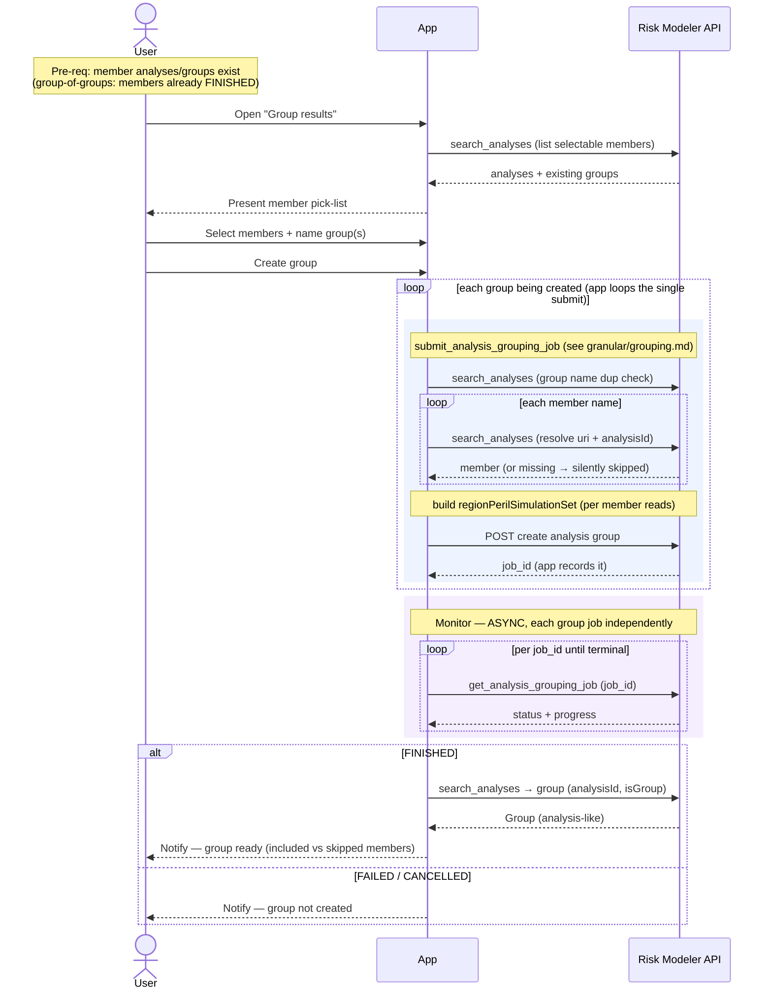

# Composite Flow — Group Results

The analyst's UI action for combining existing analyses (and/or existing groups)
into a new analysis group — e.g. an "all-perils" roll-up, or grouping by region.
The analyst picks the members from their existing results, names the group, and
submits. A group **is itself an analysis** in Risk Modeler, so the product feeds
straight back into View Results and Export like any other analysis.

**Composed of:**
- `granular/grouping.md` — `analysis.submit_analysis_grouping_job(...)` (async) →
  poll `analysis.get_analysis_grouping_job` per job.
- A `search_analyses` **read** to populate the member pick-list.
- If several groups are created in one action, the app **loops the single submit**
  per group (single-endpoint rule — one independent job each).

**Classification:** **async Job** per group (usually one). Not heavy in bytes, but
each submit is **read-fan-out heavy** (resolve every member + build the
`regionPerilSimulationSet`). Multiple groups = app-orchestrated loop of singles.

Pre-requisites:
- The member analyses/groups exist and are resolvable by name (or name + EDM, since
  analysis names are unique only within an EDM).
- For a group-of-groups, the member groups have already **finished** (a group can
  only be grouped once it exists as an analysis).

**Definition:**

1. **Open grouping** — User opens "Group results" for a portfolio/EDM. The app lists
   the selectable analyses/groups (`search_analyses`) so the analyst can pick members.
2. **Select members + name** — User selects the member analyses/groups and names the
   new group. (Optionally the analyst defines more than one group in one action —
   e.g. one per region.)
3. **Submit** — User clicks "Create group". The app calls the single
   `analysis.submit_analysis_grouping_job(group_name, member_names, …)` per group
   being created (looping the single submit if several), capturing each `job_id`.
   Each submit synchronously (see `granular/grouping.md`):
   1. dup-name-checks the group name (`search_analyses`);
   2. resolves each member name → `uri` + `analysisId` — **missing members are
      silently skipped** (`skip_missing=True` default); if *all* are missing the job
      is skipped (`job_id=None`);
   3. builds the `regionPerilSimulationSet` (per member: `get_analysis_by_id` +
      `get_regions` + reference data);
   4. `POST`s the group → `job_id`.
4. **Monitor (async, independent)** — poll `get_analysis_grouping_job(job_id)` per
   group until terminal.
5. **On FINISHED** — the group exists as an analysis-like entity (`analysisId`,
   `isGroup`), resolvable via `search_analyses` and readable through View Results /
   exportable like any analysis. Surface which members were **included vs skipped**
   to the analyst.

**Sequence Flow:**

---

**Boundaries worth noting** (candidates for metamodel bounding boxes — observations, not decisions):

- **The product is just another analysis.** A group is stored as an analysis
  (`isGroup`) and is read, viewed, and exported identically. This composite therefore
  produces nothing structurally new — it feeds `view_results.md` and
  `export_to_loss_repo.md` with the same shape as `submit_analyses.md`. Strong signal
  that "analysis" and "group" are **one entity type**, and that grouping is another
  way to *make* an analysis, not a separate kind of thing to model.
- **Silent partial membership must surface at the UI.** With `skip_missing=True`
  (default), a group can be built from fewer members than the analyst selected and
  the job still succeeds. The `included_items` / `skipped_items` result is the only
  signal — the composite has to show it, or the analyst won't know the group is
  incomplete. Candidate for an app-side audit record of "what was asked vs included."
- **Group-of-groups is a sequencing gate.** A group can only be grouped once it
  exists, so building a hierarchy in one sitting means the member groups must have
  finished first — the same "finished, not merely submitted" dependency seen in
  EDM→RDM. Usually this plays out across separate actions rather than one click.
- **Multiple groups follow the single-endpoint rule.** If the analyst defines several
  groups at once, the app loops the single submit and captures each `job_id` — no
  plural helper — so a failure in one group doesn't abort or orphan the others.
- **Coupling is name-based.** Members are resolved by name (or name+EDM). Whatever the
  app stores about analyses must let it hand the correct names to the submit — the
  boundary is name-based, not id-based.
