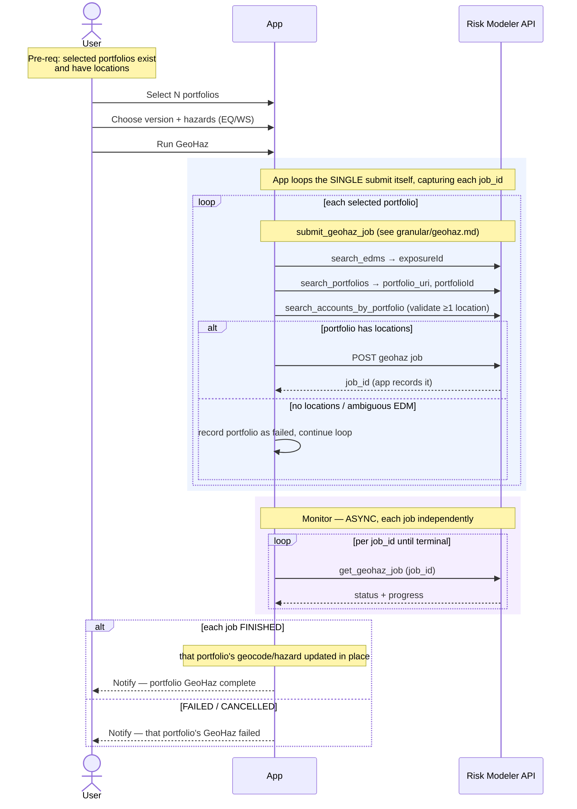

# Composite Flow — Run GeoHaz (multiple portfolios)

The analyst's UI action for re-geocoding / re-running hazard on **several portfolios
at once** — the common case (e.g. refreshing many portfolios for a new model
version). The analyst selects multiple portfolios, chooses the geocode version and
hazards, and submits all the GeoHaz jobs in one click.

**Composed of:**
- `granular/geohaz.md` — `portfolio.submit_geohaz_job(...)` (per portfolio) → poll
  `portfolio.get_geohaz_job` per job.
- The app **orchestrates the loop itself over the single-portfolio submit** —
  deliberately **not** the plural `submit_geohaz_jobs` helper (see boundaries for
  why).

**Classification:** **N async Jobs** (one per portfolio). Not heavy (no bulk bytes;
work runs server-side). Each submit is a synchronous validation fan-out + `POST`;
the **app loops them itself**, capturing each `job_id` as it returns so one
portfolio's failure doesn't abort or orphan the rest.

Pre-requisites:
- The target EDM(s) exist and resolve uniquely by name.
- Each selected portfolio exists **and has accounts with locations** (GeoHaz on an
  empty portfolio is rejected — per-portfolio, at submit time).

**Definition:**

1. **Select portfolios** — User selects N portfolios to GeoHaz. Each carries its own
   `edm_name` + `portfolio_name`, so the selection can span more than one EDM.
2. **Choose settings** — User picks the geocode `version` and which hazards
   (`hazard_eq` / `hazard_ws`). In this flow the chosen settings apply uniformly to
   every selected portfolio (the API accepts per-item settings, but the UI action is
   one setting set for the batch).
3. **Submit** — User clicks "Run GeoHaz". The app **loops the selected portfolios
   itself**, calling the single-portfolio `submit_geohaz_job(...)` once per
   portfolio (deliberately not the plural helper — see boundaries). For each
   portfolio the submit synchronously:
   1. resolves the EDM (`search_edms` → `exposureId`, must be exactly 1),
   2. resolves the portfolio (`search_portfolios` → `portfolio_uri`, `portfolioId`),
   3. **validates the portfolio has ≥1 location** (`search_accounts_by_portfolio`),
   4. `POST`s the GeoHaz job → `job_id`.
   - Because the app owns the loop, it **records each `job_id` as it returns** and
     decides per-portfolio failure handling — a portfolio that fails validation is
     recorded as failed and the loop **continues** with the rest, rather than
     aborting and orphaning already-submitted jobs.
4. **Monitor (async, independent)** — Poll `get_geohaz_job(job_id)` per job until
   each reaches its own terminal state. Jobs finish at different times.
5. **Per portfolio result** — On `FINISHED`, that portfolio's geocode/hazard data is
   updated **in place** (no new entity is produced). Notify per portfolio, or once
   all are terminal.

**Sequence Flow:**

---

**Boundaries worth noting** (candidates for metamodel bounding boxes — observations, not decisions):

- **We loop the single submit ourselves — deliberately not the plural helper.** The
  package's `submit_geohaz_jobs` is fail-fast with no rollback: the first failure
  aborts the whole call, leaves earlier portfolios already submitted to Risk Modeler,
  and returns *no* `job_id`s (orphaned, untracked jobs). By owning the loop over the
  single `submit_geohaz_job`, the app **captures each `job_id` as it returns** and
  chooses per-portfolio failure handling (record-and-continue), so partial submission
  is fully trackable. This is the concrete reason the workbench prefers single
  endpoints over the batch helpers across the board.
- **Validation is per-portfolio, at its own submit.** There is no "validate the whole
  selection first" step — the has-locations check for a portfolio runs when its turn
  in the loop comes up. The app can add an up-front pre-validation pass itself if a
  "check all before submitting any" UX is wanted; nothing in the package provides it.
- **Sequential, synchronous submit fan-out.** Submitting N portfolios is N × (three
  RM reads + one POST), run one after another on the request. For a large selection
  this is itself slow enough to want to be off-request, even though no single job is
  heavy — a different reason-to-go-async than upload/export (many light submits vs.
  one heavy one).
- **Produces no entity — mutates portfolios in place.** Like the granular flow, each
  job changes a portfolio's hazard state rather than creating anything. The only
  things to track are the N jobs and the fact that N portfolios changed. A candidate
  for "Job bounding box, but no new entity."
- **A batch that is genuinely per-portfolio.** The only batch-scoped thing is the
  analyst's intent + the shared settings. Each job validates, runs, finishes, and
  can fail independently — so as with analyses and export, the "batch" is a
  submission-time grouping, not a runtime unit.
