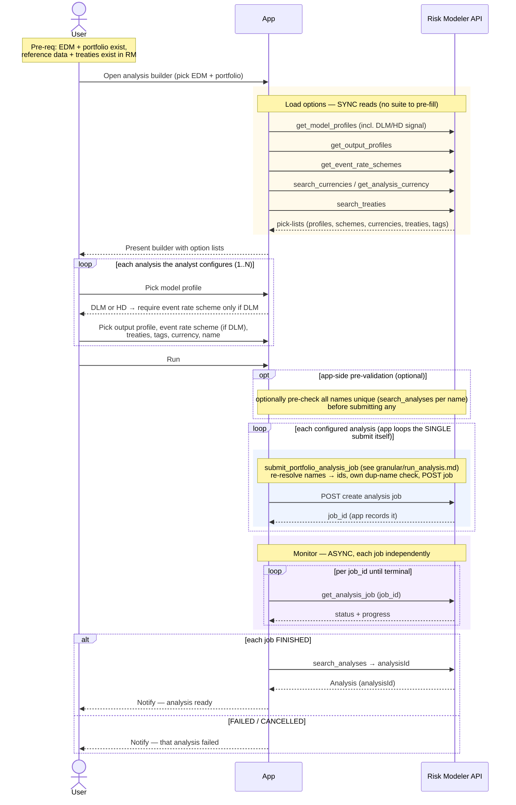

# Composite Flow — Submit Analyses (manual configuration, no suite)

The analyst's UI action for running one or more analyses against a portfolio.
**This flow assumes there is no "analysis suite" concept** — the analyst cannot
one-click a pre-defined bundle of analyses. Every required setting is picked by
hand, per analysis. A "batch" here is therefore "the analyst manually configured
several analyses and submitted them together," not "expanded a saved template."

**Composed of:**
- `granular/run_analysis.md` — `analysis.submit_portfolio_analysis_job` (single),
  looped app-side per analysis → poll `analysis.get_analysis_job` per job.
- Reference-data **reads** to populate the pick-lists the analyst chooses from
  (`ReferenceDataManager.get_model_profiles` / `get_output_profiles` /
  `get_event_rate_schemes` / `search_currencies` / tags; `treaty.search_treaties`).

**Classification:** a **fan of sync reads** (load the option lists) → **manual
config** (no server calls) → **N async Jobs** (one per configured analysis). The
submit itself is not heavy (no bulk bytes); the compute runs server-side.

Pre-requisites:
- The target EDM + portfolio exist (`exposureId`, portfolio `uri` resolvable).
- Any treaties the analyst wants to name already exist on the EDM.
- The reference data exists in Risk Modeler (model profiles, output profiles, event
  rate schemes, currencies, tags).

**Definition:**

1. **Open the analysis builder** — User picks the EDM + portfolio to analyze.
2. **Load options (sync reads)** — Because there is no suite to pre-fill anything,
   the app fetches every pick-list the analyst will choose from:
   - `get_model_profiles()` — model/analysis profiles (each carries the
     `softwareVersionCode` that determines **DLM vs HD**).
   - `get_output_profiles()` — output profiles.
   - `get_event_rate_schemes()` — event rate schemes.
   - `search_currencies()` / `get_analysis_currency()` — loss currency options.
   - `treaty.search_treaties(...)` — treaties available to name.
   - existing tags (`get_tag_by_name`, or create new via `create_tag` at submit).
3. **Manually configure analysis #1** — User selects, by hand:
   - a **model profile** → the app now knows this analysis is **DLM or HD**;
   - an **output profile**;
   - an **event rate scheme** — **required if DLM**, optional/omitted if HD (the UI
     can only enforce this *after* the model profile is picked, step 3.1);
   - **treaties** (by name), **tags**, **loss currency**;
   - an **analysis name** (the analyst applies the naming convention manually —
     there is no suite to generate it).
4. **Add more analyses (optional)** — To run a batch, the user repeats step 3 for
   each analysis. Every analysis is configured independently and fully by hand.
   Nothing is shared except the intent to submit together.
5. **Submit** — User clicks "Run". The app **loops the configured analyses itself**,
   calling the single `submit_portfolio_analysis_job(...)` once per analysis
   (deliberately not the plural helper — see boundaries), capturing each `job_id` as
   it returns.
   - Each single submit re-resolves the chosen names → ids, does its **own
     per-analysis duplicate-name check** (`search_analyses`), and `POST`s a job (the
     full `run_analysis.md` granular flow). One `job_id` per analysis.
   - Because the app owns the loop, an analysis whose submit fails (e.g. a name
     collision) is recorded as failed and the loop continues; the app can also run
     an **up-front name pre-validation pass itself** if a "reject all before
     submitting any" UX is wanted.
6. **Monitor (async, independent)** — Poll `get_analysis_job(job_id)` per job until
   each reaches its own terminal state. Jobs finish at different times.
7. **Notify** — As each job finishes, its Analysis exists (`analysisId`, resolvable
   via `search_analyses`). Notify per analysis (or once all are terminal).

**Sequence Flow:**

---

**Boundaries worth noting** (candidates for metamodel bounding boxes — observations, not decisions):

- **Without a suite, the composite is mostly a UI-config exercise over the granular
  flow.** The only things this composite adds beyond `run_analysis.md` are (a) the
  up-front pick-list reads and (b) the manual per-analysis configuration. There is
  no app-side bundling to model. This is precisely the seam where a future
  **analysis-suite / template** construct would live — its *absence* is what forces
  the analyst to hand-configure every analysis. Worth flagging as the strongest
  argument for that construct, and as an explicit non-goal for now.
- **A "batch" is still N independent jobs, and we loop the singles ourselves.**
  Same as the granular flow, and reinforced by the workbench-wide rule to prefer
  single endpoints: the app loops `submit_portfolio_analysis_job` per analysis (not
  the plural `submit_portfolio_analysis_jobs`) so it captures each `job_id` and
  handles per-analysis failure. The only batch-scoped thing is the analyst's intent
  to submit together (plus any app-side pre-validation) — with manual configuration
  a batch of N is N× the work, with nothing shared to hang a *Batch* entity on
  besides "submitted in one click."
- **DLM vs HD is discovered at profile-pick time and drives the form.** The UI can
  only know whether to require the event rate scheme once the analyst has chosen a
  model profile (`softwareVersionCode`). That's a real intra-form dependency, and a
  reason the app may want to record job type on whatever represents the analysis.
- **The pick-list reads are pure, cacheable reference data.** Model/output profiles,
  schemes, currencies change rarely. They are a candidate for "read and cache," not
  for a per-submission bounding box — distinct from the analysis jobs themselves.
- **Names are chosen by hand, so uniqueness is a live risk.** With no suite to
  generate names, two hand-typed names can collide. Because we loop single submits,
  a collision fails only *that* analysis (its own `search_analyses` dup-check),
  leaving the rest to proceed — unless the app deliberately runs an up-front
  pre-validation pass to reject the whole submission first. Whether a naming
  collision fails one analysis or the whole batch is therefore an **app decision
  here, not a package behavior** — worth being explicit about in any bounding box
  around "submit analyses."
- **`analysisId` resolves only after each job FINISHES**, per job — the analysis
  entity exists in the app's intent before it has a Risk Modeler id (same late-id
  pattern as EDM's `exposureId`).
