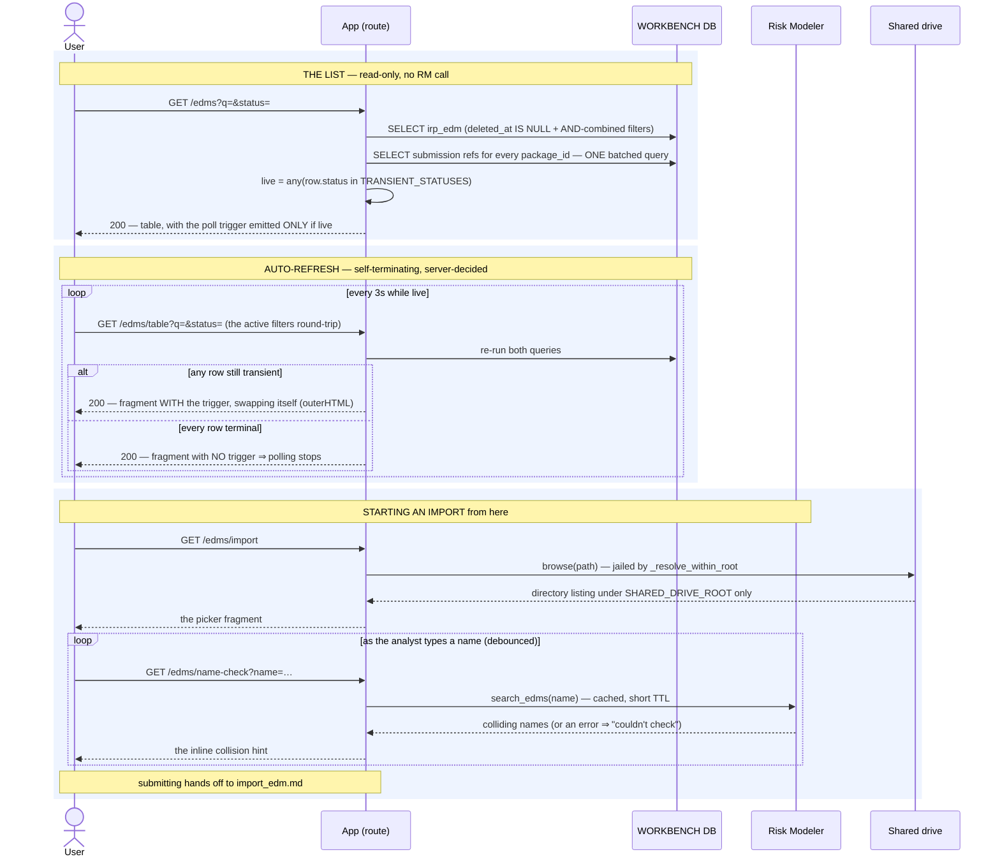

# Execution Flow — Browse the EDM & RDM Libraries (003 US7)

The global entry point to entity work. `/edms` and `/rdms` list **every** EDM and RDM in the
workbench — regardless of which submission (if any) they belong to — with a name filter, a
status filter, the submissions each is attached to, and a **live-refreshing table** while
anything is still importing. This is also where an import starts, and where the analyst
watches it progress.

Code: `edms.library` / `library_table` → `edm_service.list_edms` →
`package_service.submission_refs_for_packages`; the same shape for RDMs. The shared-drive
picker is `shared_drive.browse`; the as-you-type check is `edm_service.check_name_collision`.

**Classification:** the lists are **sync** and read-only. The only Risk Modeler contact on any
of these routes is the cached collision **read** behind the name-check fragment.

## Records read (none written)

| # | Query | Source rows |
|---|---|---|
| 1 | the rows: `id, package_id, source_file_path, name, irp_id, status, inserted_at, updated_at` (+ `as_of` for RDMs), `ORDER BY inserted_at DESC, name` | `irp_edm` / `irp_rdm WHERE deleted_at IS NULL` |
| 2 | the submissions each row's package is attached to — **one batched query for the whole page** | `package` ⋈ `submission_package` |

Filters are AND-combined onto query 1:

| Filter | Clause | Note |
|---|---|---|
| package | `AND package_id = :pid` | used by callers, not the library UI |
| name | `AND name LIKE '%…%'` | case-insensitive by SQL Server's default collation |
| status | `AND status = :status` | exact match against the entity's own status set — six for EDM (incl. the delete states), four for RDM |

Standalone entities (no package) simply carry an empty submission list. **No row scoping
anywhere** (Article 6 / FR-037).

## Sequence



## How the auto-refresh stops

Entirely server-side, decided per render:

```python
live = any(r.status in TRANSIENT_STATUSES for r in rows)
```

`TRANSIENT_STATUSES` is `('pending_import','importing','delete_pending')` for EDMs and
`('pending_import','importing')` for RDMs. The template emits `hx-get` / `hx-trigger="every
3s"` **only when `live`**, and the fragment swaps *itself* (`outerHTML` on `#lib-live`). Once
every row is terminal the next render omits the trigger and there is nothing left to fire — no
client-side counter, no max-attempts, nothing to leak.

The active filters are round-tripped through the polled URL, so a poll can never silently
widen the result set out from under the analyst.

---

**Boundaries worth noting**

- **The libraries are global, and that's the point (FR-037).** An EDM does not need a
  submission or a package. The library is the flat truth; packages and submissions are
  groupings layered over it.
- **The poll watches entity status, not jobs.** A `backfill_edm_detail` in flight does **not**
  keep the library refreshing — only the [detail page](view_edm_detail.md) tracks that. So a
  row can read `ready` in the library while its portfolios are still landing. Deliberate: the
  library answers "did it import?", the detail page answers "what's in it?".
- **`as_of` is not watched either**, and isn't shown in the EDM list at all — freshness is a
  detail-page concern.
- **The name-check fragment is the one request-path RM call in this whole area**, and it is a
  read. Everything it feeds is advisory until the actual save re-runs the same (cached) check
  as a **blocking** gate — see [import an EDM](import_edm.md).
- **The picker cannot escape the shared drive.** `_resolve_within_root` canonicalises and
  rejects anything outside `SHARED_DRIVE_ROOT`, and the same `validate_selection` runs again on
  save — the browse endpoint is a convenience, never the security boundary.
- **`list_route` / `detail_prefix` / `entity_label` come from one shared context builder**
  specifically so the full page and the polled fragment cannot drift apart.
