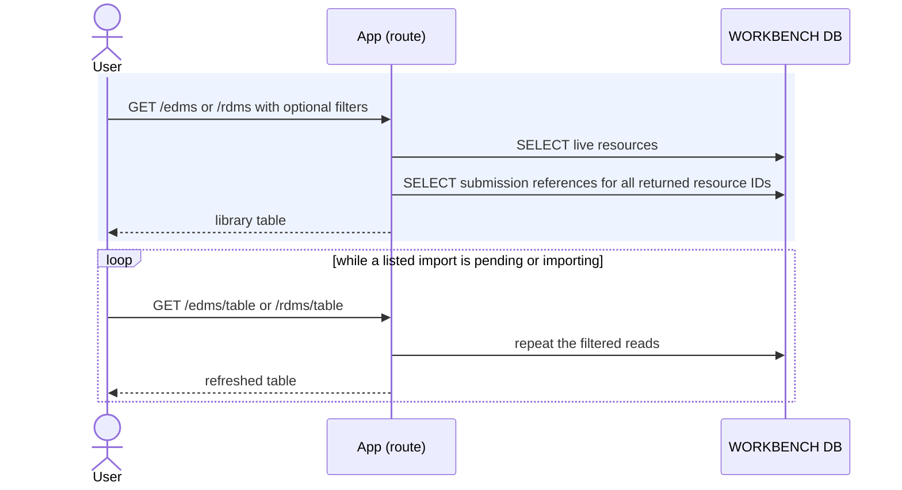

# Execution — Browse EDM and RDM Libraries

The EDM and RDM libraries list every live resource. Each row includes every related
submission. A resource with no association remains visible with an empty submission
list.

Code: `edm_service.list_edms`, `rdm_service.list_rdms`, and each service's
`_attach_submissions` query.

## Rows read

| Query | Tables |
|---|---|
| Filtered EDM rows | `irp_edm` |
| Submission references for the returned EDMs | `submission_edm`, `submission` |
| Filtered RDM rows | `irp_rdm` |
| Submission references for the returned RDMs | `submission_rdm`, `submission` |

The submission-reference read is one batched query for the returned rows. Library
routes do not infer a source submission and do not call Risk Modeler.
