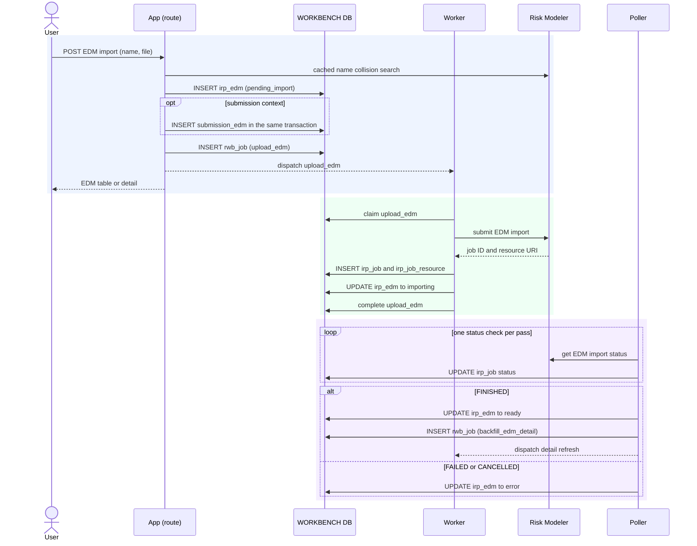

# Execution — Import an EDM

An analyst imports one exposure file as an EDM. A submission-context import inserts
`submission_edm` in the same transaction as the EDM row. A library import creates no
submission association.

Code: `edm_service.import_edm` → `entity_jobs._upload_edm_body` →
`poller.run._handle_import_edm_terminal` → `backfill_edm_detail`.

## Rows written

| Order | Table | Change | Process |
|---|---|---|---|
| 1 | `irp_edm` | insert with `pending_import` | request handler |
| 2 | `submission_edm` | insert for a submission-context request | request handler, same transaction as row 1 |
| 3 | `rwb_job` | enqueue `upload_edm` | request handler |
| 4 | `irp_job` | insert tracked `import_edm` operation | worker |
| 5 | `irp_job_resource` | store the submit response resource URI | worker |
| 6 | `irp_edm` | update to `importing` | worker |
| 7 | `irp_job` | update mirrored Risk Modeler status | poller |
| 8 | `irp_edm` | update to `ready` or `error` | poller |
| 9 | `rwb_job` | enqueue `backfill_edm_detail` after `FINISHED` | poller |

The poller resolves the Risk Modeler exposure ID by name after completion. A delayed
name-search result can leave a ready EDM without `irp_id`; the detail worker retries
the lookup. EDM completion does not enqueue RDM work.
