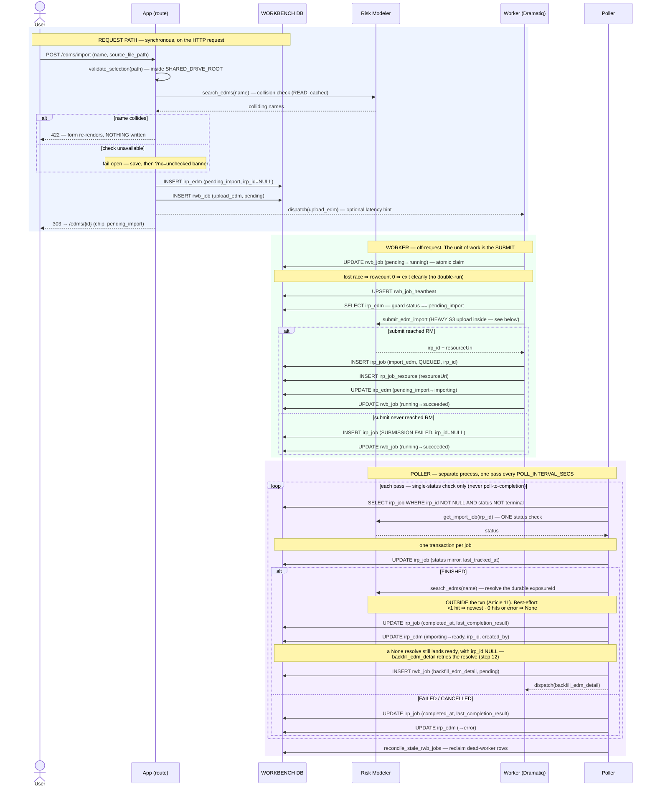
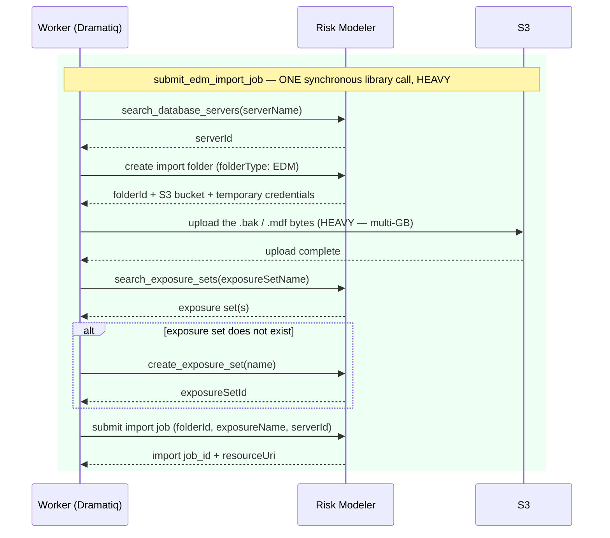

# Execution Flow — Import an EDM (US1)

The analyst imports one exposure file as an `irp_edm`. The click does the *fast* things
only — validate the file, a name-collision **search**, and insert two rows — then returns.
The actual Risk Modeler submit runs in a **worker**; the **poller** mirrors the import
status, flips the entity to `ready`/`error`, and chains the detail backfill.

Code: `edm_service.import_edm` → `rwb_job` → `package_jobs._upload_edm_body` →
`poller.run._handle_import_edm_terminal`.

**Classification:** request path = **sync**; the import submit = **async (worker)**; the
import finish = **async (poller)**. One RM call *is* made on the request path — the
collision **search** (a read) — but never the submit (FR-042 / Article 11).

**The collision check blocks** (003 amendment, 2026-07-27). `app/services/name_check.py`
distinguishes three outcomes, and only the middle one is a warning:

| Outcome | Effect |
|---|---|
| a colliding name exists | `NameCollisionError` → **422**, the form re-renders, nothing is written |
| the gateway can't answer | **fail open** — the import is saved and the detail page shows a one-time banner via `?nc=unchecked`; the worker-side submit validation (irp-integration ≥ 0.2.1 rejects duplicate names before upload) is the backstop |
| no collision | proceed |

Results are cached in-process for a short TTL, so the as-you-type `GET /edms/name-check`
fragment and the save-time check usually share one RM call. Failures are never cached.

## Records written (in order)

| # | Table | Row / change | Written by | Process |
|---|---|---|---|---|
| 1 | `irp_edm` | INSERT — `status='pending_import'`, `irp_id=NULL`, `source_file_path` | `import_edm` | 🟦 request |
| 2 | `rwb_job` | INSERT — `rwb_job_type='upload_edm'`, `status_code='pending'`, `requestor_type='analyst_request'`, `requestor_id=irp_edm.id` | `enqueue_rwb_job` | 🟦 request |
| 3 | `rwb_job` | UPDATE — `pending → running`, `claimed_by` (atomic claim) | `claim_rwb_job` | 🟩 worker |
| 4 | `rwb_job_heartbeat` | UPSERT — one row for the job, refreshed on an interval | heartbeat thread | 🟩 worker |
| 5 | `irp_job` | INSERT — `irp_job_type='import_edm'`, `status='QUEUED'`, `irp_id` set | `record_submitted_irp_job` | 🟩 worker |
| 6 | `irp_job_resource` | INSERT — the `resourceUri` captured at submit | `record_submitted_irp_job` | 🟩 worker |
| 7 | `irp_edm` | UPDATE — `pending_import → importing` | `mark_importing` | 🟩 worker |
| 8 | `rwb_job` | UPDATE — `running → succeeded` (+ `output_data`, `completed_at`) | `complete_rwb_job` | 🟩 worker |
| 9 | `irp_job` | UPDATE — status mirror + `last_tracked_at` (every pass while non-terminal) | `update_tracking` | 🟪 poller |
| 10 | `irp_job` | UPDATE — terminal status + `completed_at` + `last_completion_result` | `update_tracking` | 🟪 poller |
| 11 | `irp_edm` | UPDATE — `importing → ready`, backfill `irp_id` + `created_by_irp_job_irp_id` (FINISHED) — **or** `→ error` (FAILED/CANCELLED) | `backfill_on_terminal` | 🟪 poller |
| 11a | `irp_edm` | UPDATE — `→ ready` with **`irp_id` still NULL** when the by-name `exposureId` resolve misses; `created_by_irp_job_irp_id` is stamped either way | `backfill_on_terminal` | 🟪 poller |
| 12 | `rwb_job` | INSERT — `backfill_edm_detail`, `pending`, keyed `('irp_job', <this import_edm irp_job.id>)` — *same transaction as 10–11*, FINISHED only | `enqueue_rwb_job` | 🟪 poller |

*Submit-failure variant:* if the worker's submit never reaches RM, step 5 instead writes
`irp_job(status='SUBMISSION FAILED', irp_id=NULL)` and steps 6–7 are skipped; the poller
never tracks it (no `irp_id`). The `_submission_retry` batch that was meant to own it is
still a **no-op scaffold** (003 T017a), so the only recovery today is the analyst clicking
Retry — see [recover an import](recover_import.md).

*What happens next:* step 12 hands off to
[the detail backfill](../backfill/backfill_edm_detail.md), which populates the portfolios
and treaties the analyst actually came to look at. When the EDM is a **package member**,
the same poller transaction *also* enqueues an `upload_rdm` head — see
[save & sync](../packages/save_and_sync_package.md).

## Sequence

## Inside `submit_edm_import` — what the one HEAVY arrow expands to

The worker makes a single `irp-integration` call, but that call is five RM round-trips with
a multi-GB S3 upload in the middle. Worth knowing, because it is the reason this step can
never live on the request path:

The whole block returns *before* the import itself runs — `job_id` in hand, import still
`QUEUED` inside Risk Modeler. That return is the sync→async seam the poller picks up.

---

**Boundaries worth noting**

- **The only request-path RM call is the collision *search*** — a read. The *submit* is
  deferred to the worker. This is the concrete line Article 11 draws: reads-on-request are
  fine; job submits and status polls are not.
- **`exposureId` cannot be known at submit time.** The submit returns a *job* id; the EDM's
  own id only becomes resolvable (by name search) after the import finishes, and RM's
  search can lag by a pass or two. That is why step 11 is a backfill rather than an insert
  value, and why `_resolve_edm_exposure_id` takes the **newest** of multiple hits — it
  knows the one it just created is the newest.
- **Sync → async seam is between step 2 and step 3.** The request commits the two
  `pending` rows and returns; from the claim onward everything outlives the HTTP request.
- **`irp_id` does not exist until the worker submits** (step 5). The `irp_edm` row lives
  as `pending_import`/`importing` with `irp_id=NULL` until the poller backfills it on
  `ready` (step 11). Nothing downstream may assume an `irp_id` before then.
- **`ready` does NOT guarantee an `irp_id`.** `_resolve_edm_exposure_id` is best-effort by
  design: a search error or zero hits returns `None`, and the EDM still reaches `ready`
  (step 11a) — deliberately, because RM's name search lags the import and FR-005/R7 say a
  successful import must not be shown as failed over a lookup miss. Two things make that
  safe to live with. First, `backfill_edm_detail` retries the resolve on its own terms
  (stricter — exactly one hit, since it can't assume "newest is mine") and writes `irp_id`
  back when it succeeds. Second, `created_by_irp_job_irp_id` **is** stamped on every ready
  transition regardless, so `irp_id IS NULL AND created_by_irp_job_irp_id IS NOT NULL` is
  the durable signature of "imported, exposureId unresolved" — as distinct from
  `both NULL` = "never imported". Consumers that act on the absence of `irp_id` must test
  both columns; [delete](../packages/delete_package.md) currently does not, which is the
  open defect noted there.
- **Two distinct failure modes.** `SUBMISSION FAILED` (worker; the submit never reached
  RM; `irp_id=NULL`) is deliberately *not* the same as an RM-side `FAILED`/`CANCELLED` (a
  real `irp_id` exists, then the import failed; the poller flips the entity to `error`).
  Only the second is visible to the poller at all — nothing polls a row with no `irp_id`.
- **Idempotency is by durable state, not memory.** The worker only submits a
  `pending_import` EDM (step-6 guard), so a Dramatiq redelivery or a reconciler
  re-dispatch is a no-op. Retry from the UI (`retry_import`) uses `ensure_pending_rwb_job`,
  which *can* reset a failed head — the one place a terminal `rwb_job` is revived.
- **The analyst watches this from the library, not this flow.** `/edms/table` re-fetches
  every 3 s while any row is in a transient status and **stops on its own** once they are
  all terminal — see [browse the libraries](browse_libraries.md).
