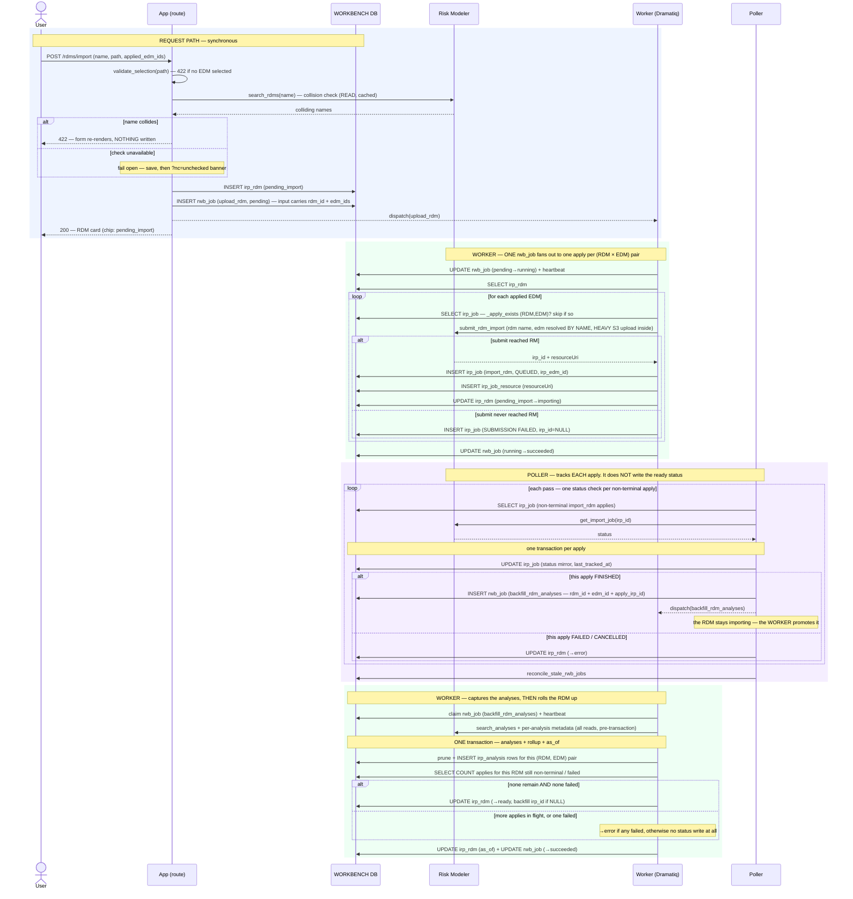

# Execution Flow — Import an RDM (US2)

The analyst imports one results file as an `irp_rdm`, applying it to one or more EDMs. Same
request-path discipline as [import EDM](import_edm.md) — including the **blocking**
name-collision check with its `?nc=unchecked` fail-open — with one shape difference: **one
`rwb_job` fans out in the worker to one `irp_job` apply per (RDM × EDM) pair**, and the
RDM's status is a **combined rollup** — `ready` only once *every* apply is `FINISHED`.

Code: `rdm_service.import_rdm` → one `upload_rdm` `rwb_job` → `package_jobs._upload_rdm_body`
(fan-out) → `poller.run._handle_import_rdm_terminal` → `backfill_rdm_analyses` →
`rdm_service.rollup_on_terminal`.

**Classification:** request path = **sync** (+ one collision **search**); the applies =
**async (worker)**, fanned out; the finishes = **async (poller)**, and the `ready` rollup
is **async (worker)** again — see below.

**Where the rollup happens depends on which way the apply went** — this is the one place
the RDM flow inverts the usual division of labour:

| Apply's terminal status | Who writes `irp_rdm.status` |
|---|---|
| `FINISHED` | the poller enqueues `backfill_rdm_analyses`, and the **worker** runs the rollup after capturing the analyses — so `ready` and the analyses land in one transaction |
| `FAILED` / `CANCELLED` | the **poller**, in place, via `rollup_on_terminal` → `error` |

**At least one applied EDM is required** (`POST /rdms/import` returns 422 without one). The
worker still supports a review-only apply with `irp_edm_id = NULL`, and the rollup treats it
as a set of one — but no UI path reaches it (deferred, 003 D3).

## Records written (in order)

| # | Table | Row / change | Written by | Process |
|---|---|---|---|---|
| 1 | `irp_rdm` | INSERT — `status='pending_import'`, `irp_id=NULL` | `import_rdm` | 🟦 request |
| 2 | `rwb_job` | INSERT — `rwb_job_type='upload_rdm'`, `pending`, `requestor_id=irp_rdm.id`, `input={rdm_ids:[rdm], edm_ids:[…], package_id}` | `enqueue_rwb_job` | 🟦 request |
| 3 | `rwb_job` | UPDATE — `pending → running` (atomic claim) + heartbeat upsert | `claim_rwb_job` | 🟩 worker |
| 4 | `irp_job` | INSERT **× one per (RDM, EDM) pair** — `import_rdm`, `QUEUED`, `irp_id`, `irp_edm_id` set (NULL for review-only) | `record_submitted_irp_job` | 🟩 worker |
| 5 | `irp_job_resource` | INSERT — one per apply (`resourceUri`) | `record_submitted_irp_job` | 🟩 worker |
| 6 | `irp_rdm` | UPDATE — `pending_import → importing` | `mark_importing` | 🟩 worker |
| 7 | `rwb_job` | UPDATE — `running → succeeded` (the whole fan-out is one unit of work) | `complete_rwb_job` | 🟩 worker |
| 8 | `irp_job` | UPDATE — status mirror per apply, every pass | `update_tracking` | 🟪 poller |
| 9a | `rwb_job` | INSERT — `backfill_rdm_analyses`, keyed `('irp_job', <this apply's irp_job.id>)`, input carries `rdm_id` + **`edm_id`** + `apply_irp_id` — *same transaction as 8*, **FINISHED only** | `enqueue_rwb_job` | 🟪 poller |
| 9b | `irp_rdm` | UPDATE — `→ error` (FAILED/CANCELLED path only) | `rollup_on_terminal` | 🟪 poller |
| 10 | `irp_rdm` | UPDATE — **the `ready` rollup**: only when NO `import_rdm` apply is non-terminal AND none failed; backfills `irp_id` + `created_by_irp_job_irp_id` *only when currently NULL* | `rollup_on_terminal` | 🟩 worker |

*Per-pair idempotency:* before each submit the worker checks `_apply_exists` — if an
`import_rdm` row already exists for that `(rdm_id, edm_id)` pair (and is not
`SUBMISSION FAILED`), it is skipped. So a redelivery re-runs the loop safely.

## Sequence

The worker half is only sketched here — see
[backfill the RDM's analyses](../backfill/backfill_rdm_analyses.md) for the full flow,
including the metadata-failure branches and the portfolio-linkage rule.

---

**Boundaries worth noting**

- **One `rwb_job`, M `irp_job` rows.** The fan-out lives *inside* the worker body, not in
  the enqueue. That keeps the unit of app-side work coarse (one claim, one heartbeat, one
  complete) while each RM apply is tracked independently.
- **The RDM's status is a rollup, not a mirror.** No single apply's terminal status sets
  the RDM `ready`; the rollup is re-derived from *all* of that RDM's applies each time one
  finishes, and only promotes the RDM when the whole set is `FINISHED`. One failed apply
  makes the RDM `error`. Because the rollup is a pure re-derivation, running it again is
  harmless — which is what lets a manual Sync reuse it.
- **`ready` is deferred one extra hop, deliberately.** The poller *could* promote the RDM
  the moment an apply finishes, but then the RDM would read `ready` with no analyses under
  it. Enqueueing `backfill_rdm_analyses` and letting the worker promote it inside the same
  transaction as the analysis capture means the analyst never sees that empty window.
- **The EDM is resolved by *name* at submit** (Article 2 — name-first resolution), inside
  the worker, so the apply doesn't depend on the EDM's `irp_id` being backfilled yet.
- **The submit is HEAVY, same as the EDM's**, and for the same reason — the file bytes go
  to S3 *inside* the synchronous library call, after it resolves the target EDM's resource
  URI by name. An RDM cannot be applied to an EDM that has not *finished* importing, which
  is exactly why the package flow chains on the EDM's terminal status rather than its
  submit.
- **This is the standalone-import flow.** When the RDM belongs to a package being synced,
  the `upload_rdm` head is not enqueued here on the request path — it is enqueued by the
  **poller** once the EDM finishes importing (see
  [save & sync](../packages/save_and_sync_package.md)).
