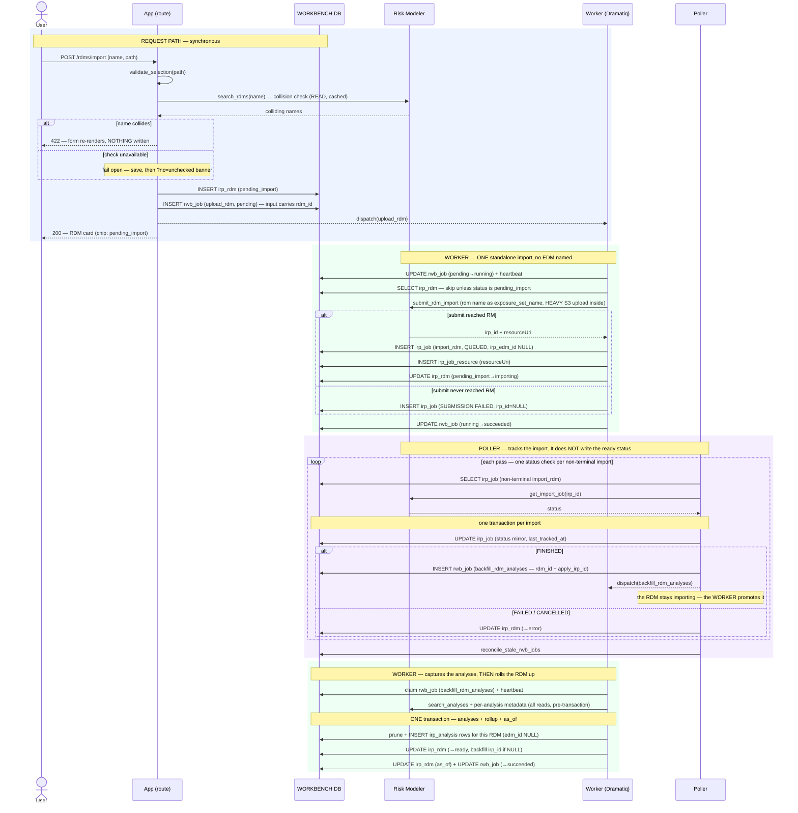

# Execution Flow — Import an RDM (US2)

The analyst imports one results file as an `irp_rdm`. Same request-path discipline as
[import EDM](import_edm.md) — including the **blocking** name-collision check with its
`?nc=unchecked` fail-open. The import is **standalone**: the RDM goes into an exposure set
of its own name (created on demand by the wheel), never into an EDM, so `irp_job.irp_edm_id`
is null and nothing here waits on an EDM import.

Code: `rdm_service.import_rdm` → one `upload_rdm` `rwb_job` → `package_jobs._upload_rdm_body`
→ `poller.run._handle_import_rdm_terminal` → `backfill_rdm_analyses` →
`rdm_service.rollup_on_terminal`.

**Classification:** request path = **sync** (+ one collision **search**); the import =
**async (worker)**; the finish = **async (poller)**, and the `ready` rollup is
**async (worker)** again — see below.

**Where the rollup happens depends on which way the import went** — this is the one place
the RDM flow inverts the usual division of labour:

| Terminal status | Who writes `irp_rdm.status` |
|---|---|
| `FINISHED` | the poller enqueues `backfill_rdm_analyses`, and the **worker** runs the rollup after capturing the analyses — so `ready` and the analyses land in one transaction |
| `FAILED` / `CANCELLED` | the **poller**, in place, via `rollup_on_terminal` → `error` |

**No EDM is involved anywhere.** Which EDMs an RDM belongs with is package membership, an
app-side fact that reaches Risk Modeler in no form.

## Records written (in order)

| # | Table | Row / change | Written by | Process |
|---|---|---|---|---|
| 1 | `irp_rdm` | INSERT — `status='pending_import'`, `irp_id=NULL` | `import_rdm` | 🟦 request |
| 2 | `rwb_job` | INSERT — `rwb_job_type='upload_rdm'`, `pending`, `requestor_id=irp_rdm.id`, `input={rdm_ids:[rdm], package_id}` | `enqueue_rwb_job` | 🟦 request |
| 3 | `rwb_job` | UPDATE — `pending → running` (atomic claim) + heartbeat upsert | `claim_rwb_job` | 🟩 worker |
| 4 | `irp_job` | INSERT — `import_rdm`, `QUEUED`, `irp_id`, **`irp_edm_id` NULL** | `record_submitted_irp_job` | 🟩 worker |
| 5 | `irp_job_resource` | INSERT — the exposure set's `resourceUri` | `record_submitted_irp_job` | 🟩 worker |
| 6 | `irp_rdm` | UPDATE — `pending_import → importing` | `mark_importing` | 🟩 worker |
| 7 | `rwb_job` | UPDATE — `running → succeeded` | `complete_rwb_job` | 🟩 worker |
| 8 | `irp_job` | UPDATE — status mirror, every pass | `update_tracking` | 🟪 poller |
| 9a | `rwb_job` | INSERT — `backfill_rdm_analyses`, keyed `('irp_job', <this import's irp_job.id>)`, input carries `rdm_id` + `apply_irp_id` — *same transaction as 8*, **FINISHED only** | `enqueue_rwb_job` | 🟪 poller |
| 9b | `irp_rdm` | UPDATE — `→ error` (FAILED/CANCELLED path only) | `rollup_on_terminal` | 🟪 poller |
| 10 | `irp_rdm` | UPDATE — **the `ready` rollup**, on the status of the import being handled; backfills `irp_id` + `created_by_irp_job_irp_id` *only when currently NULL* | `rollup_on_terminal` | 🟩 worker |

*Idempotency:* the worker submits only a `pending_import` RDM, so a redelivery re-runs
safely. It does not gate on `import_rdm` job history — that would read an RM-side `FAILED`
import as "already submitted" and block retry / replace-source-file (issue #38).

## Sequence

The worker half is only sketched here — see
[backfill the RDM's analyses](../backfill/backfill_rdm_analyses.md) for the full flow,
including the metadata-failure branches and the portfolio-linkage rule.

---

**Boundaries worth noting**

- **The RDM's status comes from the one import being handled.** One RDM means one import,
  so there is nothing to re-derive across rows — and an older failed attempt must not
  outvote the re-import that succeeded (issue #38). Because the same import always yields
  the same result, running the rollup again is harmless, which is what lets a manual Sync
  reuse it.
- **`ready` is deferred one extra hop, deliberately.** The poller *could* promote the RDM
  the moment the import finishes, but then the RDM would read `ready` with no analyses
  under it. Enqueueing `backfill_rdm_analyses` and letting the worker promote it inside the
  same transaction as the analysis capture means the analyst never sees that empty window.
- **No EDM is resolved at submit.** `exposure_set_name` is the RDM's own name, and the
  wheel creates the exposure set if none exists — so the import depends on no other entity
  and can be submitted the moment the analyst asks for it. Nothing deletes that exposure
  set when the RDM is deleted; only its analyses are removed.
- **The submit is HEAVY, same as the EDM's**, and for the same reason — the file bytes go
  to S3 *inside* the synchronous library call.
- **The package flow uses the same shape.** A package sync enqueues this same `upload_rdm`
  head on the request path, alongside each `upload_edm`, with no ordering between them (see
  [save & sync](../packages/save_and_sync_package.md)).
