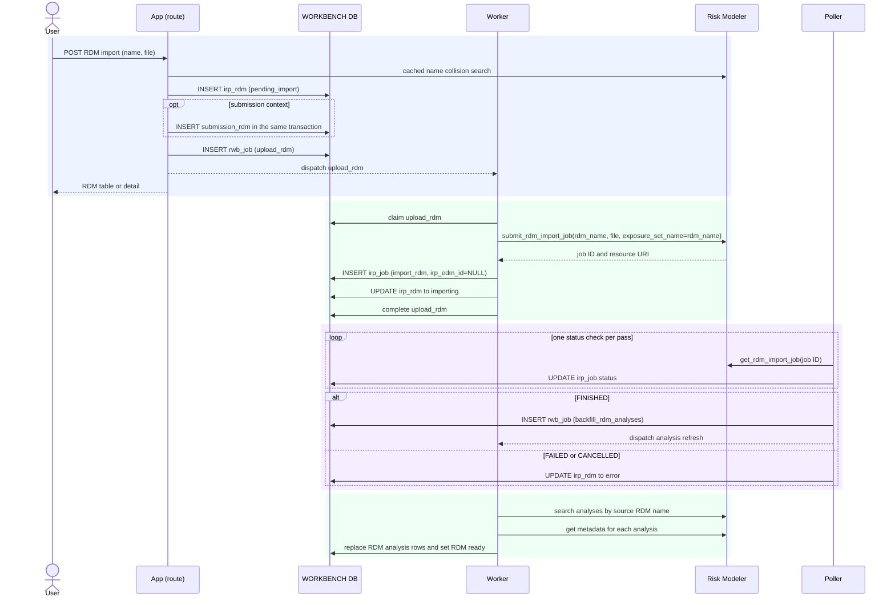

# Execution — Import an RDM

An analyst imports one RDM against its own exposure set. The RDM is not applied to
an EDM. A submission-context import inserts `submission_rdm` with the RDM row; a
library import has no submission association.

Code: `rdm_service.import_rdm` → `entity_jobs._upload_rdm_body` →
`poller.run._handle_import_rdm_terminal` →
`entity_jobs._backfill_rdm_analyses_body`.

## Rows written

| Order | Table | Change | Process |
|---|---|---|---|
| 1 | `irp_rdm` | insert with `pending_import` | request handler |
| 2 | `submission_rdm` | insert when requested from a submission | request handler, same transaction as row 1 |
| 3 | `rwb_job` | enqueue one `upload_rdm` job | request handler |
| 4 | `irp_job` | insert one `import_rdm` operation with `irp_edm_id` null | worker |
| 5 | `irp_rdm` | update to `importing` | worker |
| 6 | `irp_job` | update mirrored status | poller |
| 7 | `rwb_job` | enqueue one `backfill_rdm_analyses` job after `FINISHED` | poller |
| 8 | `irp_analysis` | replace RDM-wide analysis rows; `edm_id` remains null | worker |
| 9 | `irp_rdm` | update to `ready` and stamp `as_of` | worker |

The unique analysis identity is (`rdm_id`, `irp_id`). Metadata failure for one
analysis leaves its optional metadata blank without discarding the other analyses.
