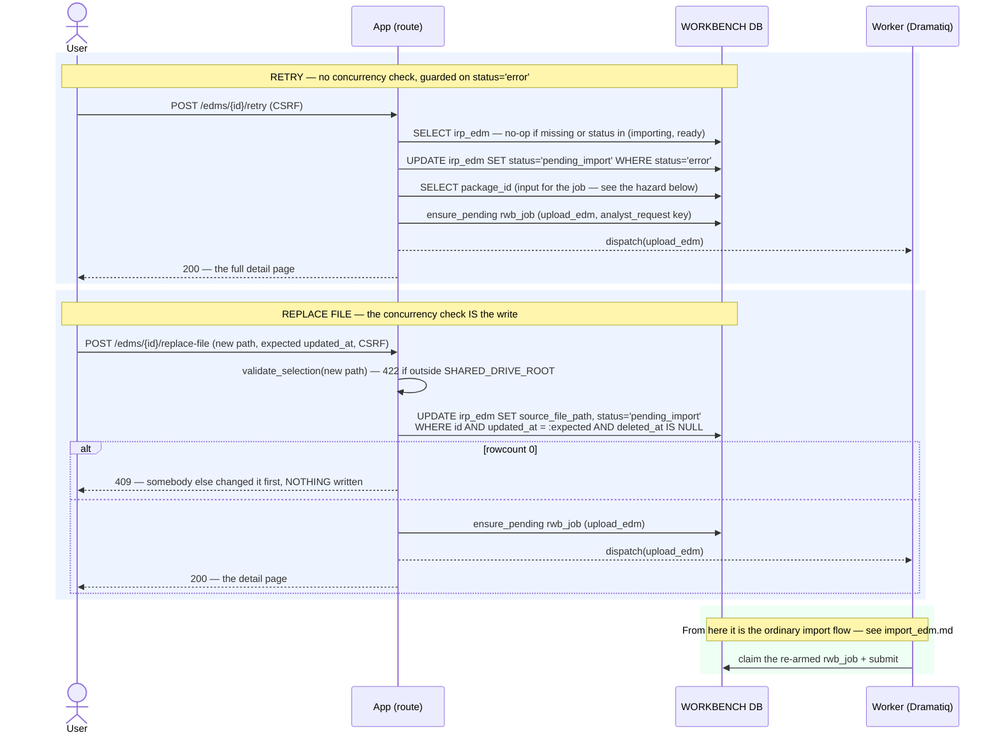

# Execution Flow — Recover a Failed Import (retry · replace file · member retry)

When an import fails, the analyst has two moves from the entity's detail page — **Retry** the
same file, or **Replace file** and try a different one — plus a third entry point on the
package card that delegates to those. All three reuse the **same** `irp_edm` / `irp_rdm` row;
recovery never creates a new entity.

Both are request-path only: reset the entity, re-arm the `rwb_job`, return. The re-submitted
work is the ordinary [import EDM](import_edm.md) / [import RDM](import_rdm.md) flow, unchanged.

Code: `edm_service.retry_import` / `replace_source_file`; `rdm_service.retry_import` /
`replace_source_file`; `package_sync_service.retry_member`.

**Classification:** **sync**, on the request path. No Risk Modeler call — not even the cached
name check (the name isn't changing).

## The two shapes differ in exactly one interesting way

|  | **Retry** | **Replace file** |
|---|---|---|
| Route | `POST /edms\|rdms/{id}/retry` | `POST /edms\|rdms/{id}/replace-file` |
| Entity write | `status → 'pending_import'` **`WHERE status = 'error'`** | `source_file_path` + `status → 'pending_import'`, **`WHERE updated_at = :expected`** |
| Concurrency | **none** — the status guard is the only protection | the WHERE clause **is** the check: `rows == 0` → `ConcurrencyConflict` → **409** |
| Applies to | `error` rows only; `pending_import` / `delete_pending` / `deleted` are untouched | any live row, whatever its status |
| Failure surface | silent no-op (`_LOCKED` = `importing`, `ready`) | **422** on a missing/invalid source, **409** on a stale `updated_at` |
| Response | re-renders the **full** detail page | re-renders the detail page |

The status reset is not cosmetic in either case: the upload worker only advances a
`pending_import` row, so without it the re-armed job would claim, find the wrong status, and
exit cleanly having done nothing.

## Records written (in order)

| # | Table | Row / change | Written by | Process |
|---|---|---|---|---|
| 1 | `irp_edm` / `irp_rdm` | UPDATE — `→ pending_import` (+ `source_file_path` on replace), guarded as above | `retry_import` / `replace_source_file` | 🟦 request |
| 2 | `rwb_job` | INSERT `upload_edm`/`upload_rdm` `pending` — **or** revive the existing terminal head in place: `→ pending`, `claimed_by`/`output_data`/`error_detail`/`completed_at`/`submitted_at` cleared, `input_data` replaced, `attempt_count + 1`, `correlation_id` re-stamped | `ensure_pending_rwb_job` | 🟦 request |

Nothing else. Steps 3+ are the import flow.

## Sequence



## The RDM variants do one extra read

Both RDM paths must re-derive which EDMs the RDM was applied to, so the re-submitted fan-out
targets the *same* pairs:

```sql
SELECT DISTINCT irp_edm_id FROM irp_job
WHERE irp_rdm_id = :r AND irp_job_type = 'import_rdm' AND irp_edm_id IS NOT NULL
```

That set goes into the job's `input_data` as `edm_ids`. The job history is the record of intent
here — there is no separate "applied EDMs" table.

## Retrying a package member

`POST /packages/{pid}/members/{mid}/retry` resolves the member's kind and calls
`edm_service.retry_import` or `rdm_service.retry_import`. Nothing new happens; it exists so the
analyst can recover from the [package card](../submissions/view_submission.md) without opening
the entity.

---

**Boundaries worth noting**

- **`ensure_pending_rwb_job` is the one place a terminal `rwb_job` is revived.** The poller's
  `enqueue_rwb_job` deliberately never does — that asymmetry is what makes the automatic chains
  idempotent while still letting a human say "try again". A revived row keeps its identity and
  increments `attempt_count`, so the history of attempts survives.
- **A revived row gets the retrying request's `correlation_id`.** A retry is a new causal
  chain, not a continuation of the failed one.
- **Retry has no optimistic-concurrency check, and that's a real difference.** Two analysts
  clicking Retry at the same time both succeed; the `status='error'` guard means only the first
  UPDATE matches, and `ensure_pending` collapses the second enqueue on the unique key. Two
  analysts clicking Replace file both submit a *different* path, so that one has to 409.
- **`_package_id()` returning NULL silently severs the EDM→RDM chain.** The job's
  `input_data.package_id` is what the poller keys the follow-on `upload_rdm` fan-out off. A
  retried EDM whose package lookup comes back empty will import fine and then never trigger its
  package's RDM applies. Worth checking first when a re-synced package stalls after the EDM
  turns `ready`.
- **`SUBMISSION FAILED` has no automatic recovery yet.** When the worker's submit never reaches
  Risk Modeler there is no `irp_id`, so the poller can't track it at all. The
  `_submission_retry` pass that was meant to own those rows is still a **no-op scaffold**
  (003 T017a) — manual Retry is the only route today. Say so rather than implying a retry loop
  exists.
- **Recovery is not delete-and-reimport.** Reusing the row keeps the entity's identity, its
  package membership, its job history and its audit trail intact — which is also why
  `replace-file` needs the optimistic check: the row it is mutating may be one somebody else is
  looking at.
