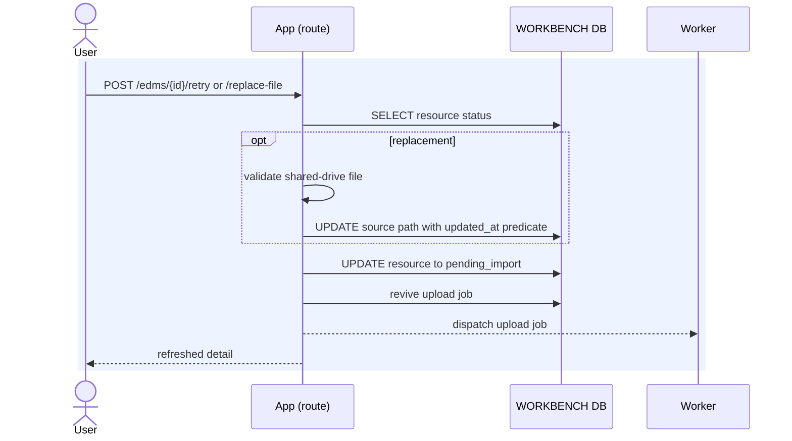

# Execution — Recover a Failed Import

Retry and Replace file reuse the same `irp_edm` or `irp_rdm` row. Both actions reset
the resource to `pending_import`, revive its upload job, and return without calling
Risk Modeler.

Code: `edm_service.retry_import`, `edm_service.replace_source_file`,
`rdm_service.retry_import`, and `rdm_service.replace_source_file`.

## Request changes

| Action | Resource change | Job change |
|---|---|---|
| Retry | set status to `pending_import` | revive `upload_edm` or `upload_rdm` |
| Replace file | validate and replace source path, then set `pending_import` | revive the same upload job |

Replace file uses `updated_at` in the update predicate and returns 409 after a
concurrent edit. Retry is a no-op for an importing or ready resource.

The worker and poller then run the ordinary [EDM import](import_edm.md) or
[RDM import](import_rdm.md) processing. Existing submission associations remain.
