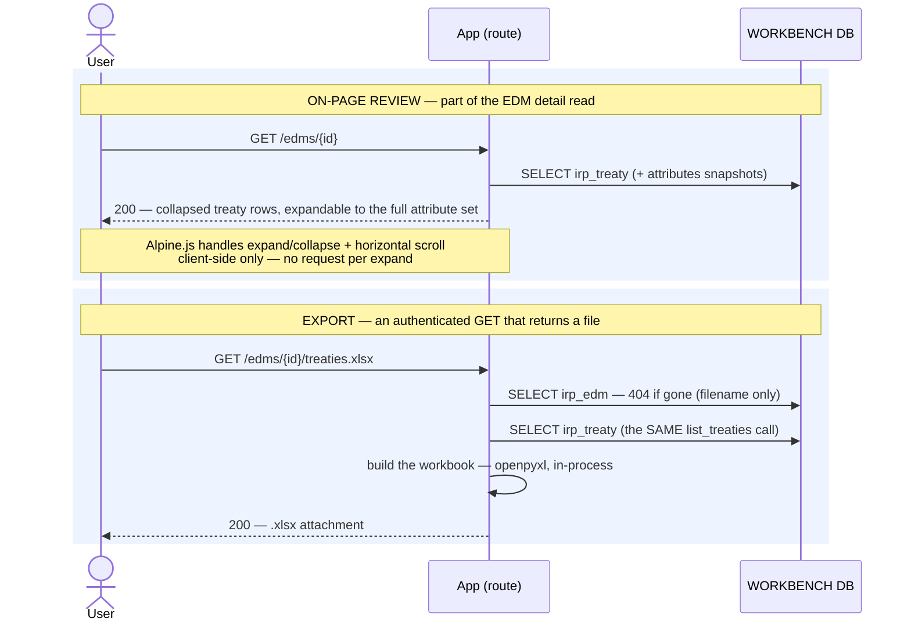

# Execution Flow — Review & Export an EDM's Treaties (004 US2)

Treaties are coded at the **EDM** level in Risk Modeler, so they belong to the
[EDM detail page](view_edm_detail.md): a full-attribute expand/collapse list with horizontal
scroll for the wide ones, and an **Excel export** for the analyst who wants the whole set in
a spreadsheet.

Both halves read the **stored `attributes` snapshot** that
[`backfill_edm_detail`](../backfill/backfill_edm_detail.md) wrote — the export makes **no Risk
Modeler call** and takes no CSRF (it is an authenticated GET).

Code: on-page — `edm_service.get_edm_detail` → `treaty_service.list_treaties`;
export — `treaties.export_treaties` → `edm_service.get_edm` +
`treaty_service.build_treaty_workbook`.

**Classification:** both **sync**, both read-only. Zero writes, zero RM calls.

## Records read (none written)

| # | Query | Source rows |
|---|---|---|
| 1 | the EDM, for the download filename (404 if gone) | `irp_edm` |
| 2 | every live treaty + its parsed `attributes` snapshot | `irp_treaty WHERE edm_id AND deleted_at IS NULL ORDER BY name` |

Query 2 is *literally the same call* the detail page makes — `list_treaties(edm_id=…)`. The
export has no query of its own.

## Sequence

## The workbook

- **Columns** are `Treaty`, `Treaty Id`, then the **union of every attribute key** across the
  treaty set, in **first-seen order**. A treaty missing a key gets a blank cell rather than a
  shifted row.
- **Values pass through `_cell` verbatim.** The humanisation that `attribute_items()` applies
  on the page (label prettifying, display formatting) is **display-only** and deliberately not
  applied here — the export is meant to carry Risk Modeler's own values.
- **A never-backfilled EDM exports a header-only workbook**, not an error. There is nothing to
  say about an EDM whose treaties were never fetched, and refusing the download would be worse
  than an empty one.

---

**Boundaries worth noting**

- **This is the only route in the app that returns a file rather than HTML**, and the only
  handler that doesn't take `request` — it relies on the auth middleware and does no CSRF,
  which is correct for a GET that mutates nothing.
- **The export cannot be more current than the last backfill.** It has no live path to Risk
  Modeler by design (Article 11), so an analyst wanting fresh figures clicks **Sync** first —
  see [manual sync](../backfill/manual_sync.md).
- **The empty workbook is a real state worth surfacing in the UI**, because it is
  indistinguishable in the file itself from "this EDM genuinely has no treaties". The page's
  `as_of` stamp is what tells them apart.
- **Treaty *editing* is not built.** RM's own treaty screen is reachable from the page via the
  navigation deep link; the workbench reads and exports only. The design-ahead flow for
  editing is [`planned/granular/treaty_view_edit.md`](../planned/granular/treaty_view_edit.md),
  which notes the edit path is a non-atomic 1+N call sequence.
- **Read scope is unrestricted (Article 6)** — any authenticated analyst can export any EDM's
  treaties.
