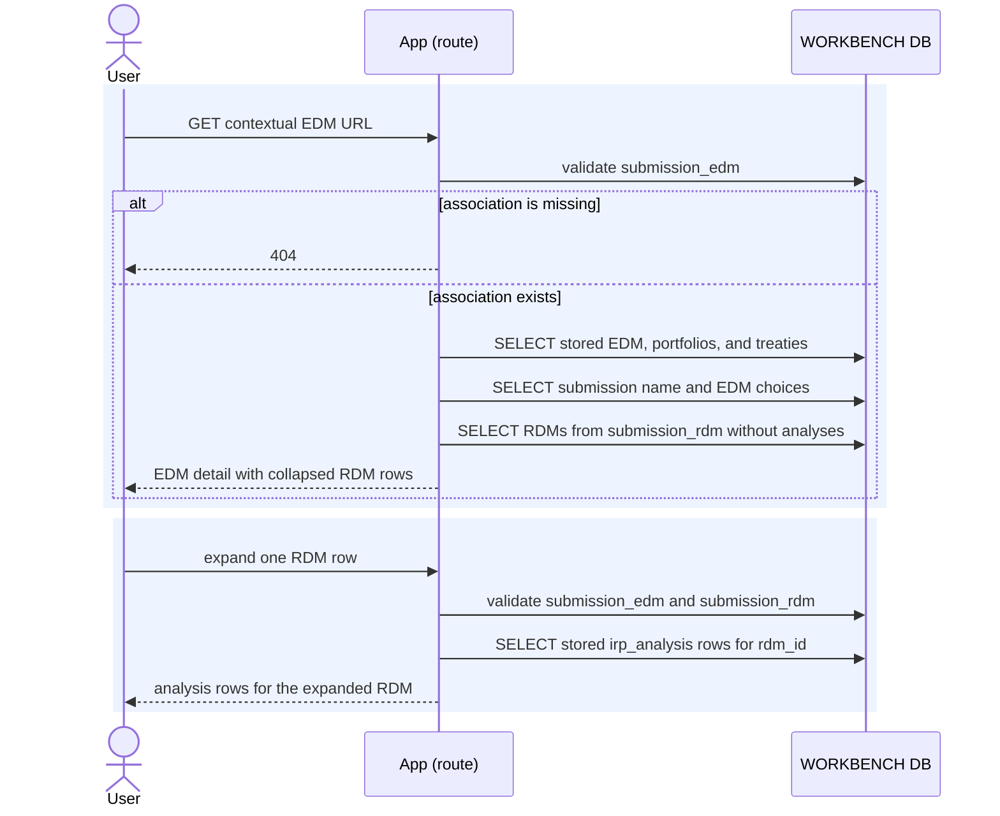

# Execution — View EDM Detail

The direct library URL renders stored EDM detail without choosing a submission.
The contextual URL validates `submission_edm`, names the selected submission,
provides the submission's EDM choices, and lists the submission's RDMs.

No detail route calls Risk Modeler. One RDM's stored analyses load only when the
analyst opens its disclosure.

## Routes and reads

| Route | Additional reads |
|---|---|
| `GET /edms/{edm_id}` | none beyond the EDM, portfolios, and treaties |
| `GET /submissions/{submission_id}/edms/{edm_id}` | association validation, submission name, submission EDM choices, submission RDM rows |
| `GET /submissions/{submission_id}/edms/{edm_id}/rdms/{rdm_id}/analyses` | validates both associations and reads stored analyses for the selected RDM |

The RDM list does not claim an EDM-to-RDM relationship. Both lists share only the
URL's `submission_id`. Switching EDMs changes the `edm_id` segment and keeps the
submission segment fixed.
