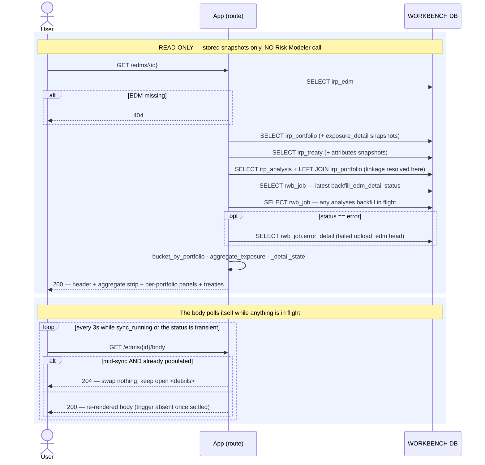

# Execution Flow — View an EDM's Detail (004 US1 / US4)

The page the whole detail iteration exists for. Opening an imported EDM shows what is *in*
it: a light header, a compact **aggregate rollup strip**, and the headline — a read-only
**per-portfolio breakdown** (location / account / policy counts, perils, geography, currency,
TIV) with each portfolio's linked broker analyses inline, plus the treaty set and the
standalone analyses below.

The page's centre of gravity is the **portfolio**, not the EDM, because analyses run against
portfolios.

**Every figure on this page comes from the stored snapshot cache** that
[`backfill_edm_detail`](../backfill/backfill_edm_detail.md) wrote. There is **no Risk Modeler
call on the request path** (Article 11), which is what lets the page meet its load budget
regardless of exposure size — a 25-portfolio EDM with a million records renders from the same
seven queries as an empty one.

Code: `edms._detail` → `edm_service.get_edm_detail` → `portfolio_service.list_portfolios` /
`aggregate_exposure`, `treaty_service.list_treaties`,
`analysis_service.list_edm_analyses` / `bucket_by_portfolio`.

**Classification:** entirely **sync**, entirely read-only. Zero writes, zero RM calls.

## Records read (none written)

| # | Query | Source rows |
|---|---|---|
| 1 | the EDM header | `irp_edm` (`None` → router **404**) |
| 2 | every live portfolio + its parsed `exposure_detail` snapshot | `irp_portfolio WHERE edm_id AND deleted_at IS NULL ORDER BY name` |
| 3 | every live treaty + its parsed `attributes` snapshot | `irp_treaty WHERE edm_id AND deleted_at IS NULL ORDER BY name` |
| 4 | this EDM's broker analyses, with portfolio linkage resolved | `irp_analysis` + LEFT JOIN `irp_edm`, `irp_rdm`, **`irp_portfolio`** |
| 5 | newest `backfill_edm_detail` status (both enqueue keys) | `rwb_job` LEFT JOIN `irp_job` |
| 6 | any in-flight `backfill_rdm_analyses` touching this EDM | `rwb_job` LEFT JOIN `irp_job` + a subselect on `irp_job` |
| 7 | the failed import's error text — **only when `status == 'error'`** | `rwb_job.error_detail` for the failed `upload_edm` head |

Then four derivations, all in Python over rows already fetched:

- **`bucket_by_portfolio`** attaches each portfolio's linked analyses. Only *clearly linked,
  non-group* analyses land in a bucket — `is_group` rows and unresolved pointers stay in the
  standalone section (R9).
- **`aggregate_exposure`** derives the US4 strip: sum the counts, union the perils, combine
  geography and currency across the per-portfolio snapshots. **Never stored, never fetched.**
- **`_detail_state`** picks which graceful section state renders — never an error.
- **`_rm_treaties_url`** builds a plain navigation deep link into the Risk Modeler web UI
  (tenant subdomain, not the API host). A link, never a call. `None` when the tenant isn't
  configured.

## `_detail_state` — six states, no error state

`empty` and `unavailable` look identical to a user but mean opposite things, and the only
thing separating them is the `as_of` stamp:

| State | Condition | Means |
|---|---|---|
| `importing` | `status` is `pending_import` / `importing` | the import hasn't finished; detail can't exist yet |
| `populated` | any portfolio row | the normal case |
| `pending` | backfill job `pending` / `running` | detail is on its way |
| `failed` | backfill job `failed` | the fetch broke; Sync to retry |
| `empty` | job `succeeded` **and** `as_of` is set | a genuine zero-portfolio EDM (FR-015) |
| `unavailable` | anything else | never fetched, or the worker skipped without enumerating (no resolvable `exposureId`) — so `as_of` was never stamped |

That distinction is exactly why the backfill worker stamps `as_of` *only* after a real
enumeration: an `ok(skipped)` run must not be able to claim "this EDM really has no
portfolios".

## Sequence

---

**Boundaries worth noting**

- **The request path reads a cache, not Risk Modeler.** This is the payoff of the whole
  backfill design: the analyst's page load never depends on RM being up or fast. The cost is
  that the page shows a snapshot, which is why the header carries `as_of` as an explicit trust
  signal rather than implying live data.
- **Portfolio linkage is resolved by a JOIN at read time**, not stored on the analysis. An
  analysis captured before its portfolio snapshot existed reads as unlinked and starts
  resolving on its own once the portfolio lands — no re-run, no repair job. See
  [backfill RDM analyses](../backfill/backfill_rdm_analyses.md#portfolio-linkage--the-r9-rule).
- **The aggregate is derived, never stored** (R2/R4). There is no rollup column to go stale,
  and the same function feeds the per-EDM line on the
  [submission's package cards](../submissions/view_submission.md).
- **Group and unresolved analyses are deliberately excluded from the portfolio buckets.** A
  group analysis has no single portfolio, and `group_parent_id` is deferred (004 T005), so it
  is shown standalone rather than guessed at.
- **Nothing here can fail loudly.** Every absent-data case resolves to one of the six graceful
  states; a missing snapshot is a state, not an exception. The only 404 is the EDM itself
  being gone.
- **Read scope is unrestricted (Article 6).** No `customer_id`, no `apply_scope` — every
  analyst sees every EDM's detail.
- **The treaty deep-link is the one place the page points at Risk Modeler's UI**, for the
  editing this iteration doesn't do. Treaty *editing* remains unbuilt — see
  [`planned/granular/treaty_view_edit.md`](../planned/granular/treaty_view_edit.md).
