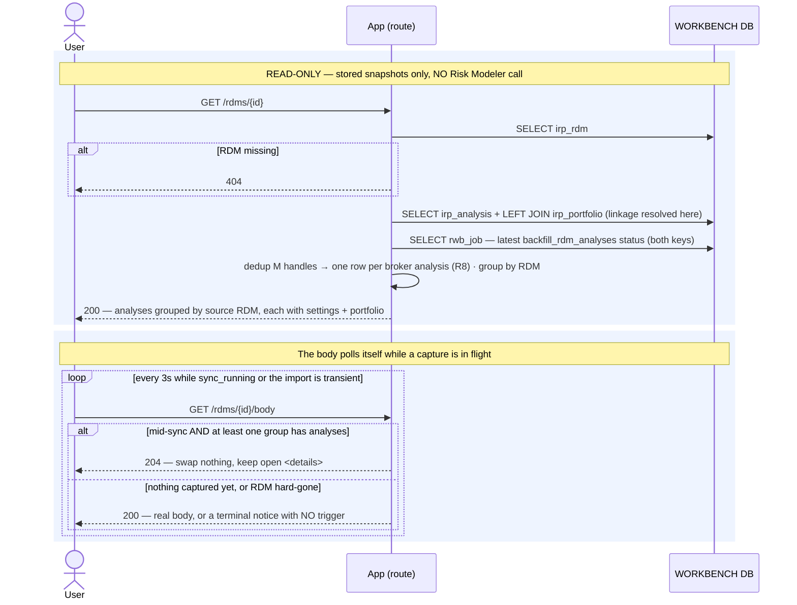

# Execution Flow — View an RDM's Broker Analyses (004 US3)

Opening an imported RDM shows what the broker actually sent: every analysis carried in that
RDM, **grouped by source RDM**, each with its parsed settings/metadata and the portfolio it
ran against — or `"Group"` for a group analysis, or `"— not linked"` when the pointer doesn't
resolve.

**No loss numbers.** This iteration surfaces identity, settings and linkage only; retrieving
actual results is Iteration 6.

Like the [EDM detail page](view_edm_detail.md), everything comes from the stored snapshot that
[`backfill_rdm_analyses`](../backfill/backfill_rdm_analyses.md) wrote — **no Risk Modeler call
on the request path** (Article 11).

Code: `rdms._detail` → `rdm_service.get_rdm_detail` →
`analysis_service.list_broker_analyses` → `latest_backfill_status`.

**Classification:** entirely **sync**, entirely read-only. Zero writes, zero RM calls.

## Records read (none written)

| # | Query | Source rows |
|---|---|---|
| 1 | the RDM header (incl. `as_of`) | `irp_rdm` (`None` → router **404**) |
| 2 | this RDM's analyses with linkage resolved, `ORDER BY name, irp_id, id` | `irp_analysis` + LEFT JOIN `irp_edm`, `irp_rdm`, **`irp_portfolio`** |
| 3 | newest `backfill_rdm_analyses` status across **both** enqueue keys | `rwb_job` LEFT JOIN `irp_job` |

Then two derivations:

- **`_group_by_rdm`** builds the divider-row grouping the template renders.
- **the handle collapse (R8)** — one analysis applied to M EDMs has M `irp_analysis` rows
  (one per `(rdm_id, edm_id)` handle). The read **dedups across them** so the analyst sees
  each broker analysis **once**, not once per EDM it was applied to.

`sync_running` is `sync_status in ('pending','running')` — and unlike the EDM page there is
**no cross-entity term**: an RDM only tracks its own capture.

## Sequence

## Three ways a portfolio cell can read

| Rendered as | Why |
|---|---|
| the portfolio's name | the pointer was `PORTFOLIO`-typed and the JOIN resolved it |
| `Group` | `is_group` — a group analysis spans portfolios, so there is nothing single to name |
| `— not linked` | the pointer is NULL (a `GROUP`/`ACCOUNT`-typed resource was deliberately dropped at capture) **or** the portfolio snapshot doesn't exist yet |

The third case is often temporary and heals itself: the JOIN starts resolving as soon as
[`backfill_edm_detail`](../backfill/backfill_edm_detail.md) lands the portfolio row, with no
re-capture.

---

**Boundaries worth noting**

- **An analysis is shown once, even when applied to many EDMs.** The workbench stores one
  `irp_analysis` row *per handle* — the grain it needs for pruning and linkage — and the read
  collapses them (R8). Diagrams elsewhere that count `irp_analysis` rows are counting handles,
  not analyses.
- **`as_of` and `status` can disagree.** The backfill stamps `as_of` even on a run where the
  rollup wrote no status, so a freshly-synced RDM can show a current timestamp while still
  reading `importing` because another EDM's apply is still in flight. That is honest, not a
  bug: the analyses *are* current; the RDM as a whole isn't done.
- **A mid-poll hard-gone RDM returns a terminal notice with no trigger**, so the 3-second poll
  ends instead of repeatedly returning 404.
- **This page is the recovery surface for pre-capability RDMs.** An RDM imported before the
  settings/pointer capture shipped is name-only forever unless the analyst clicks Sync — see
  [manual sync](../backfill/manual_sync.md).
- **Read scope is unrestricted (Article 6).**
