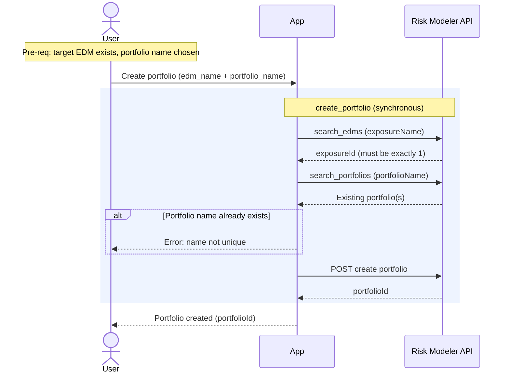

# Granular Flow — Create Subportfolio

Creates a new portfolio inside an existing EDM. In the MVP spine this is used to
carve out "subportfolios" (by LOB, geography, etc.), but see the boundary note —
`create_portfolio` itself only creates an **empty** portfolio; it does not filter
or populate locations.

`irp-integration`: `portfolio.create_portfolio(edm_name, portfolio_name, …)`.

**Classification:** **Sync**. Not heavy. No job, no poll.

Pre-requisites:
- The target EDM exists in Risk Modeler and is resolvable by name.
- User has chosen a portfolio name (and optionally number / description).

**Definition:**

1. User initiates "Create portfolio/subportfolio" with the EDM name and a
   portfolio name.
2. App calls `portfolio.create_portfolio(edm_name, portfolio_name, …)`, which
   synchronously performs:
   1. RM: `search_edms(exposureName="<edm_name>")` → resolve `exposureId`
      (errors unless exactly one EDM matches).
   2. RM: `search_portfolios(exposureId, portfolioName="<name>")` — duplicate-name
      guard; errors if a portfolio with that name already exists.
   3. RM: `POST` create portfolio → returns the new `portfolioId` (from the
      `Location` header).
   - Returns `(portfolioId, request_body)`.
3. App returns the new portfolio to the user — immediately; there is nothing to
   poll.

**Sequence Flow:**

---

**Boundaries worth noting** (candidates for metamodel bounding boxes — observations, not decisions):

- **Fully synchronous — no job.** `create_portfolio` returns the `portfolioId` on
  the request. There is nothing async to track: no poll, no follow-up. This is the
  clearest case for "entity produced, but no Job bounding box."
- **`create_portfolio` makes an *empty* portfolio.** The method takes only name /
  number / description — it does **not** accept LOB or geographic filter criteria,
  and does not copy or assign any locations. The MVP-scope notion of "create
  subportfolios by LOB / geography" is therefore **not satisfied by this call
  alone** — populating a subportfolio (assigning accounts/locations) is a separate
  capability not present in `create_portfolio`. **Open question / gap** to resolve
  before building the subportfolio feature.
- **The `exposureId` and portfolio dup-check are resolved live** inside the call
  from the EDM name — so the activity depends on the EDM being import-finished and
  uniquely named.
