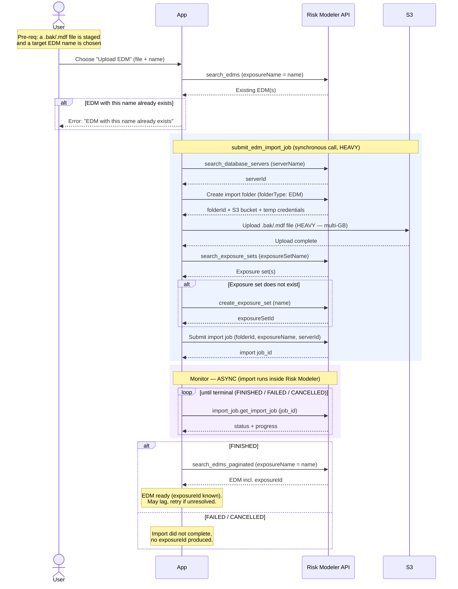

# Granular Flow — EDM Upload

Uploads an EDM (`.bak` / `.mdf`) into Risk Modeler / Data Bridge and produces a
Risk Modeler **exposure** (`exposureId`). This is the anchor activity of the MVP
spine: everything downstream (subportfolios, GeoHaz, analyses) hangs off the EDM.

`irp-integration`: `edm.search_edms` (dup check) → `edm.submit_edm_import_job`
→ (async) `import_job.get_import_job` → `edm.search_edms_paginated` (resolve id).

**Classification:** async **Job**, **Heavy** (the file bytes are pushed to S3
*inside* `submit_edm_import_job`).

Pre-requisites:
- User has a `.bak` / `.mdf` EDM file staged where the app can read it
- User has chosen a target EDM (exposure) name

**Definition:**

1. User initiates "Upload EDM" with the chosen file and target EDM name.
2. **Duplicate check** — App calls `edm.search_edms(filter='exposureName="<name>"')`.
   1. If a match is returned → surface error *"EDM with this name already exists"* and stop.
3. **Submit import** — App calls `edm.submit_edm_import_job(edm_name, edm_file_path, server_name)`.
   This is one synchronous library call that internally performs the following, and
   **includes the heavy S3 upload** of the file bytes:
   1. RM: `search_database_servers(serverName="<server>")` → resolve `serverId`.
   2. RM: create import folder (`folderType: EDM`) → returns `folderId` + `uploadDetails`
      (S3 bucket + temporary credentials).
   3. **S3: upload the `.bak`/`.mdf` file** (heavy; multi-GB).
   4. RM: `search_exposure_sets(exposureSetName="<name>")`; if none exists →
      `create_exposure_set(name)` → `exposureSetId`.
   5. RM: submit import job (`folderId` + `exposureName` + `serverId`, resource = exposure set)
      → returns the import **`job_id`**.
   - Returns `(job_id, request_body)`.
4. **Monitor (async)** — the import now runs inside Risk Modeler. Poll
   `import_job.get_import_job(job_id)` until the workflow reaches a terminal status
   (`FINISHED` / `FAILED` / `CANCELLED`), tracking `progress` along the way.
5. **Resolve exposureId** — on `FINISHED`, resolve the new EDM's `exposureId` via
   `edm.search_edms_paginated(filter='exposureName="<name>"')`. The EDM may lag in
   search immediately after finishing; if unresolved, retry on a later pass.
6. Activity complete — the EDM exists in Risk Modeler with a known `exposureId`.

**Sequence Flow:**

---

**Boundaries worth noting** (candidates for metamodel bounding boxes — observations, not decisions):

- **Sync/async seam is inside step 3→4.** `submit_edm_import_job` returns
  synchronously with a `job_id`, but the actual import is async. Everything from
  step 4 on is off-request work that outlives the HTTP request.
- **The heavy S3 upload lives *inside* the synchronous submit call**, not in the
  async phase. Whoever runs step 3 blocks on a multi-GB upload — this is the
  reason EDM upload can't run on the request thread and is the strongest
  candidate for an off-request (heavy-queue) boundary.
- **`exposureId` is not known at submit time** — it only becomes resolvable after
  the async import finishes (step 5), and may lag. Any record representing "the
  EDM" starts life without its Risk Modeler id.
- **Two distinct failure modes**: the pre-submit duplicate check (synchronous,
  user-facing, no job exists yet) vs. an async import failure (a job exists and
  then fails). These likely want different handling.
