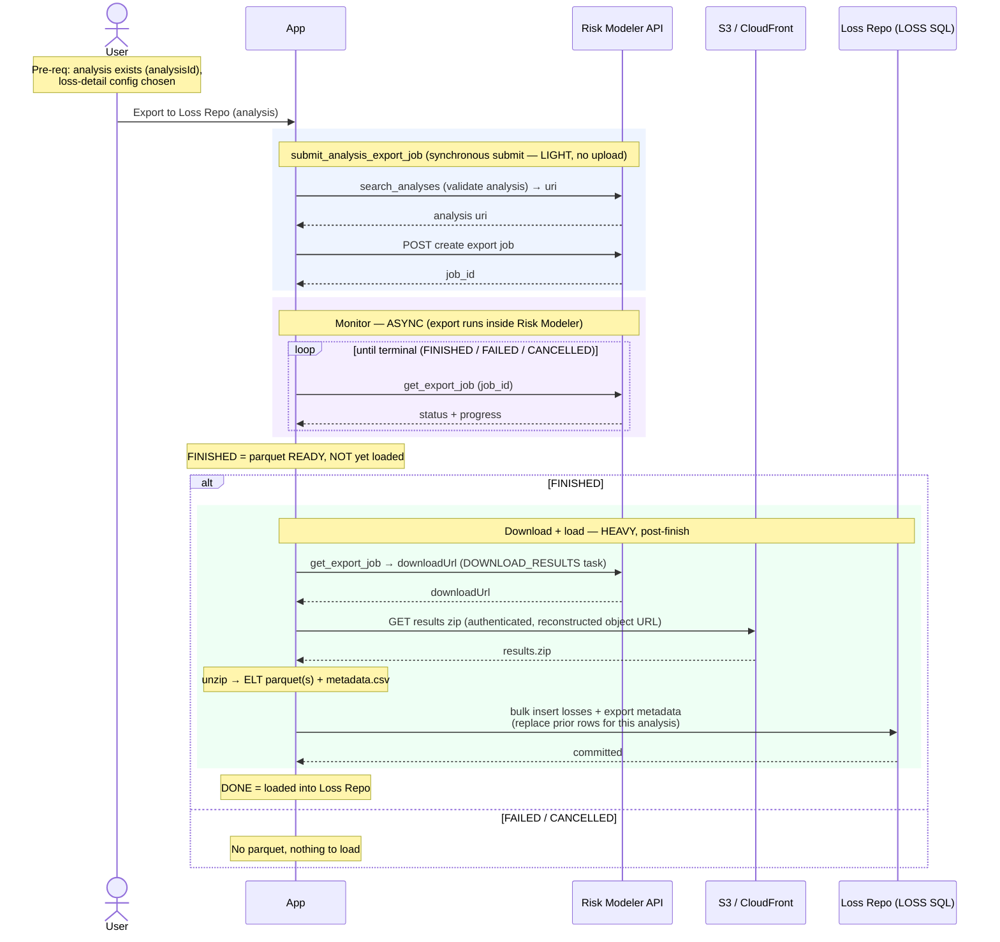

# Granular Flow — Export ELTs → Loss Repository

Exports an analysis's ELT results from Risk Modeler as parquet, then downloads and
loads them into the client's LOSS SQL Server. The activity is only "done" once the
rows are **loaded into the Loss Repository** — not when Risk Modeler reports the
export FINISHED.

`irp-integration`: `analysis.submit_analysis_export_job` → (async)
`export_job.get_export_job` → download the results zip → (app-side) unzip + load
into LOSS SQL.

**Classification:** async **Job + follow-up load**. **Heavy** — but the heavy work
(download + bulk insert) is on the **post-finish load**, not the submit.

Pre-requisites:
- The analysis exists and its `analysisId` is known.
- Loss-detail config chosen (metric type, output level(s), perspective code(s));
  the prototype defaults to `LOSS_TABLES` / `Portfolio` / `GU`, PARQUET.

**Definition:**

1. User initiates "Export to Loss Repo" for an analysis.
2. **Submit export** — App calls
   `analysis.submit_analysis_export_job(analysisId, loss_details, file_extension="PARQUET")`,
   which:
   1. RM: validate the analysis exists (`search_analyses` by `analysisId`, then
      `appAnalysisId`) → resource `uri`.
   2. RM: `POST` create export job → returns the **`job_id`**. (No upload — this
      submit is *light*.)
   - Returns `(job_id, request_body)`.
3. **Monitor (async)** — poll `export_job.get_export_job(job_id)` until terminal.
   `FINISHED` here means **the parquet is ready in Moody's object store**, not that
   it is in the Loss Repo.
4. **Download (heavy)** — extract the `downloadUrl` from the export job's
   `DOWNLOAD_RESULTS` task and fetch the results zip.
   - ⚠️ The package's `download_export_results` issues an **unauthenticated** GET,
     which lands on the login SPA rather than the file. The real download
     reconstructs the direct object URL (decode path, drop query string) and fetches
     it through the client's **authenticated** session (the prototype's
     `_download_results`). Treat the package helper as insufficient here.
5. **Load into Loss Repo (heavy)** — unzip; read the ELT parquet(s) under
   `ELT/<level>/<perspective>/*.parquet` plus `metadata.csv`; **bulk insert** the
   loss rows + export metadata into the LOSS SQL schema (replacing any prior rows
   for this analysis, so a retry can't double-load).
6. Activity complete only now — the analysis's ELTs are in the Loss Repository.

**Sequence Flow:**

---

**Boundaries worth noting** (candidates for metamodel bounding boxes — observations, not decisions):

- **The activity's terminal state is downstream of Risk Modeler's.** RM `FINISHED`
  ≠ done. There is a genuine app-owned phase *after* the IRP job finishes
  (download → load), and "done" means "loaded into LOSS SQL." This is the strongest
  case in the whole spine for a state that Risk Modeler doesn't have — the
  prototype models it as an app-only `LOADING` state between RM-FINISHED and
  loaded.
- **Heavy work is on the load, not the submit** — the inverse of EDM/RDM upload.
  If EDM/RDM upload go off-request because the *submit* is heavy, export goes
  off-request because the *post-finish load* is heavy. Same "off the request
  thread" conclusion, opposite end of the lifecycle.
- **The package's download helper can't be trusted here.** `download_export_results`
  is unauthenticated and returns the login SPA. The real download needs URL
  reconstruction + the authenticated session. Whatever runs step 4 must own that,
  not lean on the package method.
- **Idempotency is a first-class concern.** The load replaces prior rows for the
  analysis before inserting, so a retried load can't double-count. Any bounding box
  around "export/load" needs a re-runnable, replace-not-append contract.
- **This is the one flow that writes outside Risk Modeler.** It is the only spine
  activity whose product lands in the client's own SQL (the Loss Repo), making it
  the natural seam between "IRP integration" and "our data."
