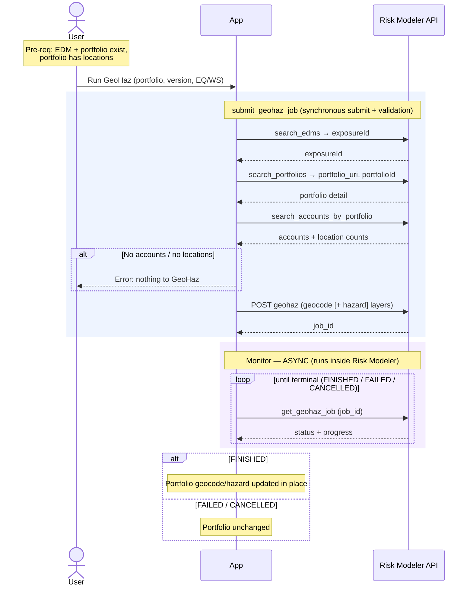

# Granular Flow — GeoHaz (Geocode / Hazard)

Re-runs geocoding and/or hazard retrieval on a portfolio (e.g. for new model
versions). Mutates the portfolio's geocode/hazard data in place — it does not
produce a new entity.

`irp-integration`: `portfolio.submit_geohaz_job(...)` → (async)
`portfolio.get_geohaz_job(job_id)`.

**Classification:** async **Job**. Not heavy (no bulk byte movement; the work
happens server-side in Risk Modeler).

Pre-requisites:
- The target EDM exists and is resolvable by name (`exposureId` known).
- The target portfolio exists within that EDM **and has accounts with locations**
  (GeoHaz on an empty portfolio is rejected).

**Definition:**

1. User initiates "Run GeoHaz" for a portfolio, choosing geocode version and
   which hazards (EQ / WS).
2. App calls `portfolio.submit_geohaz_job(portfolio_name, edm_name, version, hazard_eq, hazard_ws)`,
   which synchronously performs pre-submit validation:
   1. RM: `search_edms(exposureName="<edm_name>")` → `exposureId`.
   2. RM: `search_portfolios(exposureId, portfolioName="<name>")` → `portfolio_uri` + `portfolioId`.
   3. RM: `search_accounts_by_portfolio(exposureId, portfolioId)` → **validates the
      portfolio has ≥1 account with ≥1 location**; errors otherwise.
   4. Builds the layer set (a `geocode` layer always; `earthquake` / `windstorm`
      hazard layers appended per the flags).
   5. RM: `POST` GeoHaz → returns the **`job_id`**.
   - Returns `(job_id, request_body)`.
3. **Monitor (async)** — poll `portfolio.get_geohaz_job(job_id)` until terminal
   (`FINISHED` / `FAILED` / `CANCELLED`), tracking `progress`.
4. On `FINISHED`, the portfolio's geocode/hazard data has been updated in place.

**Sequence Flow:**

---

**Boundaries worth noting** (candidates for metamodel bounding boxes — observations, not decisions):

- **Async job that produces no entity.** Unlike EDM/RDM/analysis, GeoHaz creates
  nothing new — it mutates the portfolio. The only thing to track is the job
  itself and the fact that the portfolio's hazard state changed.
- **Meaningful pre-submit validation is synchronous.** The "does this portfolio
  have locations" check happens *before* a job exists, on the request path — a
  user-facing failure distinct from an async job failure (same split as EDM
  upload's dup-check).
- **Sync submit, no heavy upload.** The submit is a quick POST (no S3 upload), so
  GeoHaz is a candidate for the *light* tier at submit time even though it spawns
  an async job — different from EDM/RDM whose submit is heavy.
- **Per-portfolio granularity.** One job per portfolio; re-geocoding an EDM with
  many portfolios is many jobs.
