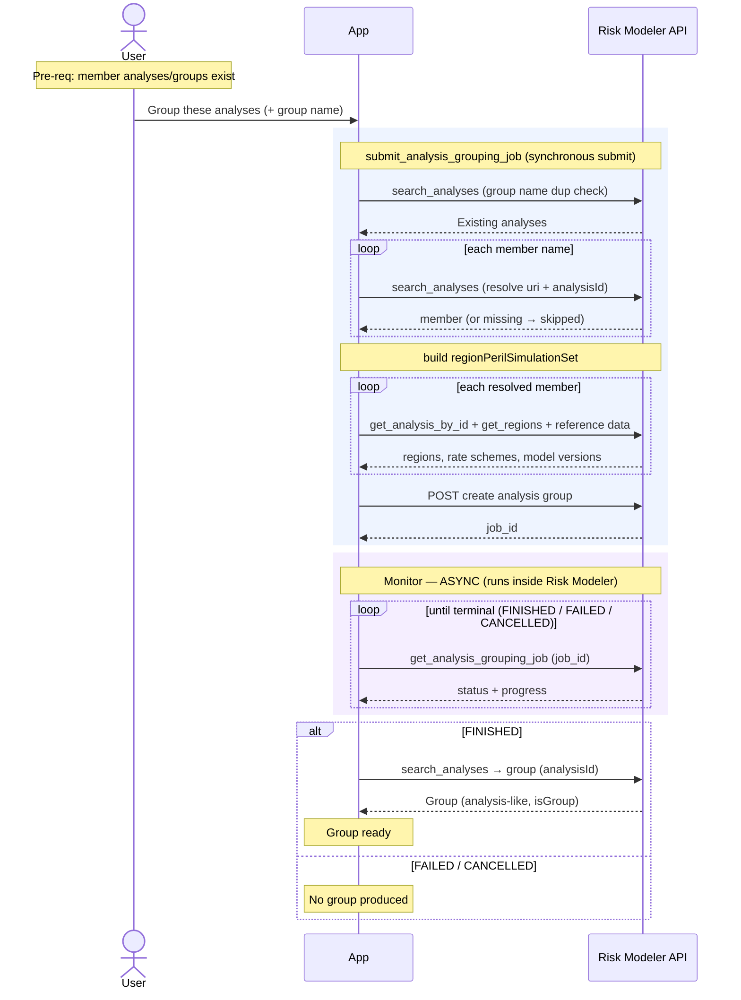

# Granular Flow — Grouping Analyses

Combines existing analyses (and/or existing groups) into a new analysis group,
tracked to completion. In Risk Modeler a group **is itself an analysis** (stored
with an engine/`isGroup` marker), so groups can contain groups.

`irp-integration`: `analysis.submit_analysis_grouping_job` → (async)
`analysis.get_analysis_grouping_job(job_id)`. Internally uses `search_analyses`,
`get_analysis_by_id`, `get_regions`, and reference-data lookups to build the
`regionPerilSimulationSet`.

**Classification:** async **Job**. Not heavy in bytes, but the submit is
**read-fan-out heavy** (many RM calls to resolve members and build the simulation
set).

Pre-requisites:
- The member analyses/groups exist and are resolvable by name (optionally
  name + EDM, since analysis names are unique only within an EDM).

**Definition:**

1. User selects analyses/groups to combine and names the new group.
2. App calls `analysis.submit_analysis_grouping_job(group_name, analysis_names, …)`,
   which synchronously performs:
   1. RM: duplicate-name check — `search_analyses(analysisName="<group_name>")`;
      errors if the group name already exists.
   2. RM: resolve each member name → `uri` + `analysisId`
      (`search_analyses`, by name or name+EDM). **Missing members are silently
      skipped when `skip_missing=True` (the default)**; if *all* are missing the
      job is skipped (returns `job_id=None`).
   3. RM: build `regionPerilSimulationSet` — for each member, `get_analysis_by_id`
      + `get_regions` + reference-data lookups (simulation set, model version).
      Required for mixed ELT/PLT (DLM + HD) grouping.
   4. RM: `POST` create analysis group → returns the **`job_id`**.
   - Returns `{job_id, included_items, skipped_items, …}`.
3. **Monitor (async)** — poll `analysis.get_analysis_grouping_job(job_id)` until
   terminal (`FINISHED` / `FAILED` / `CANCELLED`), tracking `progress`.
4. On `FINISHED`, the group exists as an analysis-like entity (`analysisId`),
   resolvable via `search_analyses`.

**Sequence Flow:**

---

**Boundaries worth noting** (candidates for metamodel bounding boxes — observations, not decisions):

- **A group is an analysis.** The output is stored as an analysis (with an
  `isGroup` / `Group` engine marker) and can itself be a member of another group
  (group-of-groups). Whatever represents "analysis" and "group" is likely **one
  entity type**, not two — a real modelling decision this flow surfaces.
- **Silent partial membership.** With `skip_missing=True` (default), a group can be
  built from fewer members than the user selected, and the job still succeeds. The
  `included_items` / `skipped_items` result is the only signal — if the app
  doesn't capture it, the discrepancy is invisible. Candidate for an app-side
  guard or an audit record.
- **Read-fan-out at submit, not bytes.** The submit is "not heavy" in the S3 sense
  but does a large number of RM reads to build the simulation set. It's still a
  synchronous submit that can fail before the job exists.
- **Members must resolve by name.** Grouping resolves members by name (or
  name+EDM). Whatever the app stores about analyses must let it hand the right
  names in — the coupling is name-based, not id-based, at this boundary.
