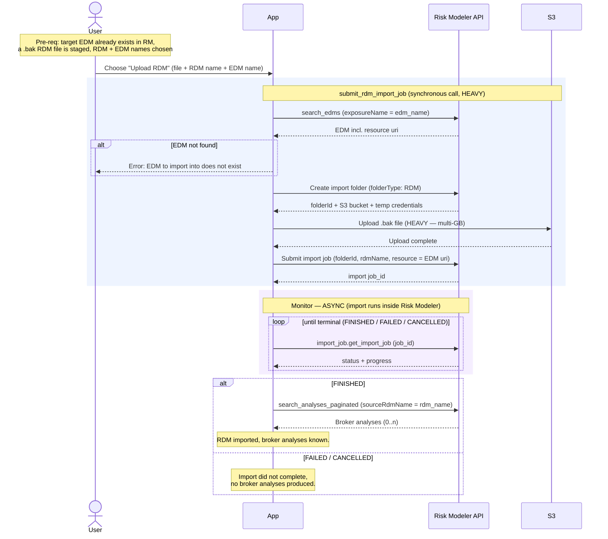

# Granular Flow — RDM Upload

Uploads a broker-provided RDM (`.bak`) into Risk Modeler / Data Bridge, **imported
into an existing EDM**, and makes the RDM's broker analyses discoverable. An RDM
cannot stand alone — it must be imported against an EDM that already exists in
Risk Modeler (the import resolves the EDM by name to get its resource URI).

`irp-integration`: `edm.search_edms` (resolve EDM uri, inside submit) →
`rdm.submit_rdm_import_job` → (async) `import_job.get_import_job` →
`analysis.search_analyses_paginated` (discover broker analyses).

**Classification:** async **Job**, **Heavy** (the file bytes are pushed to S3
*inside* `submit_rdm_import_job`).

Pre-requisites:
- **An EDM already exists in Risk Modeler** and is resolvable by name (i.e. its
  own upload has finished). This is the hard EDM→RDM dependency.
- User has a `.bak` RDM file staged where the app can read it
- User has chosen a target RDM name and the name of the EDM to import into

**Definition:**

1. User initiates "Upload RDM" with the chosen file, target RDM name, and the
   target EDM name.
2. **Submit import** — App calls `rdm.submit_rdm_import_job(rdm_name, edm_name, rdm_file_path)`.
   One synchronous library call that internally performs the following, and
   **includes the heavy S3 upload** of the file bytes:
   1. RM: `search_edms(filter='exposureName="<edm_name>"')` → resolve the EDM's
      resource `uri`. If the EDM is not found → error (the import has nothing to
      import into).
   2. RM: create import folder (`folderType: RDM`) → returns `folderId` +
      `uploadDetails` (S3 bucket + temporary credentials).
   3. **S3: upload the `.bak` file** (heavy; multi-GB).
   4. RM: submit import job (`folderId` + `rdmName`, resource = the EDM `uri`)
      → returns the import **`job_id`**.
   - Returns `(job_id, request_body)`.
3. **Monitor (async)** — the import runs inside Risk Modeler. Poll
   `import_job.get_import_job(job_id)` until the workflow reaches a terminal status
   (`FINISHED` / `FAILED` / `CANCELLED`), tracking `progress` along the way.
4. **Discover broker analyses** — on `FINISHED`, the broker's analyses carried in
   the RDM are now present in Risk Modeler. Enumerate them via
   `analysis.search_analyses_paginated(filter='sourceRdmName="<rdm_name>"')`.
   (An RDM may legitimately carry zero, one, or many analyses.)
5. Activity complete — the RDM is imported against its EDM and its broker analyses
   are known.

**Sequence Flow:**

---

**Boundaries worth noting** (candidates for metamodel bounding boxes — observations, not decisions):

- **Hard prerequisite on EDM.** The submit resolves the EDM by name to get its
  URI, so an RDM upload cannot even start until its EDM's upload has *finished*
  (not merely been submitted). In the "Create submission" composite this becomes
  a sequencing gate: EDM upload → (finished) → RDM upload.
- **Same sync/async/heavy shape as EDM upload.** Synchronous submit (with the
  heavy S3 upload inside it) → async import → post-finish follow-up. If EDM and
  RDM upload share a bounding box for "heavy submit off the request thread," they
  share it identically.
- **The post-finish follow-up produces *entities the user didn't name*.** EDM's
  tail resolves one id (`exposureId`); RDM's tail can surface 0..n broker
  analyses. Whatever represents "an analysis" first appears here, sourced from an
  RDM rather than from a user-run analysis job.
- **No pre-submit duplicate guard.** Unlike EDM upload (which does an explicit
  `search_edms` name check first), `submit_rdm_import_job` has no name-collision
  check before uploading. A dup guard, if wanted, would be an app-side addition.
