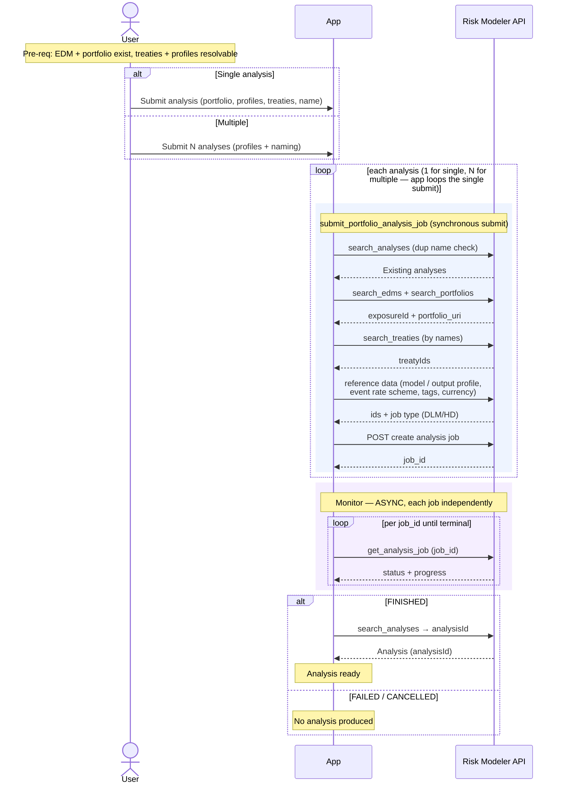

# Granular Flow — Run Analysis (single + batch)

Submits a portfolio analysis (DLM or HD) and tracks it to completion, producing an
Analysis (`analysisId`). Submitting several is **N independent analysis jobs**, not
one job — the app loops the single submit per analysis.

`irp-integration`: `analysis.submit_portfolio_analysis_job` → (async)
`analysis.get_analysis_job(job_id)`.

**Classification:** async **Job** (N jobs for a batch). Not heavy (the analysis
compute runs server-side; the submit moves no bulk bytes).

Pre-requisites:
- The target EDM + portfolio exist (`exposureId`, portfolio `uri` resolvable).
- Any named treaties exist on the EDM.
- The named reference data resolves: model profile (determines **DLM vs HD**),
  output profile, event rate scheme (**required for DLM**, optional for HD), tags,
  currency.

**Definition (single):**

1. User submits an analysis: EDM, portfolio, job name, analysis (model) profile,
   output profile, event rate scheme, treaty names, tags.
2. App calls `analysis.submit_portfolio_analysis_job(...)`, which synchronously
   performs:
   1. RM: duplicate-name check — `search_analyses(analysisName + exposureName)`;
      errors if the analysis name already exists for that EDM.
   2. RM: `search_edms` → `exposureId`; `search_portfolios` → `portfolio_uri`.
   3. RM: `search_treaties` (by names) → `treatyIds` (count must match).
   4. RM (reference data): resolve model profile → `modelProfileId` **and job type
      (DLM/HD)**; output profile → `outputProfileId`; event rate scheme →
      `eventRateSchemeId` (DLM requires it); tag ids; currency.
   5. RM: `POST` create analysis job → returns the **`job_id`**.
   - Returns `(job_id, request_body)`.
3. **Monitor (async)** — poll `analysis.get_analysis_job(job_id)` until terminal
   (`FINISHED` / `FAILED` / `CANCELLED`), tracking `progress`.
4. On `FINISHED`, the Analysis exists (`analysisId`), resolvable via
   `search_analyses`.

**Definition (multiple):**

1. User submits a list of analyses (e.g. from saved profiles + a naming convention).
2. App **loops `submit_portfolio_analysis_job(...)` per analysis**, capturing each
   `job_id` as it returns — one independent job per analysis. Each submit does its
   own per-analysis duplicate-name check; a submit that fails is recorded and the
   loop continues. (Any "reject all before submitting any" name pre-check is an
   app-side pass.)
3. **Monitor (async)** — each job is polled independently to its own terminal state
   (`get_analysis_job` per job); they finish at different times.

**Sequence Flow:**

---

**Boundaries worth noting** (candidates for metamodel bounding boxes — observations, not decisions):

- **A "batch" is a submission-time convenience, not a runtime unit.** Looping the
  single submit yields N independent jobs that run and finish separately. The only
  thing genuinely batch-scoped is the user's intent to submit them together (plus any
  optional app-side name pre-check). This is the sharpest test of whether a *Batch*
  bounding box earns its place, or whether it's just "N jobs created by one click."
- **Heavy reference-data resolution on the submit path.** A single submit fans out
  into many synchronous RM reads (profiles, event rate scheme, treaties, tags,
  currency) before the job is created. Any of them can fail the submit
  synchronously — a user-facing failure distinct from an async run failure.
- **DLM vs HD is discovered, not declared.** The job type comes from the model
  profile's `softwareVersionCode` at submit time; it affects downstream results
  (HD → PLT available). Whatever represents an analysis may want to record this.
- **`analysisId` resolves only after FINISHED**, like EDM's `exposureId` — the
  analysis entity exists before it has its Risk Modeler id.
