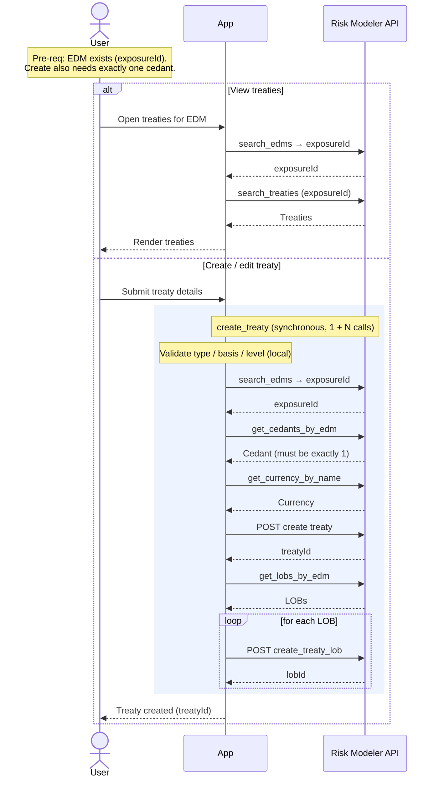

# Granular Flow — Treaty View / Edit

Views the treaties (reinsurance) on an EDM and creates/edits treaties. Viewing is
a plain read; creating a treaty is synchronous but fans out into several
dependent calls (cedant + currency lookups, then one LOB-assignment call per LOB
on the EDM).

`irp-integration`: `treaty.search_treaties` (view); `treaty.create_treaty` →
which internally uses `edm.get_cedants_by_edm`, `reference_data.get_currency_by_name`,
`edm.get_lobs_by_edm`, and `treaty.create_treaty_lob` (edit/create).

**Classification:** **Sync**. Not heavy. No job, no poll.

Pre-requisites:
- The target EDM exists and is resolvable by name (`exposureId` known).
- **For create:** the EDM has exactly **one cedant** (the call errors on zero or
  multiple), and the chosen currency + treaty enums are valid reference data.

**Definition:**

*View:*
1. User opens the treaties for an EDM.
2. App resolves the EDM (`search_edms` → `exposureId`) and calls
   `treaty.search_treaties(exposureId[, filter])` → list of treaties.
3. App renders them.

*Create / edit:*
1. User submits treaty details (name, number, type, limits, dates, currency, …).
2. App calls `treaty.create_treaty(edm_name, …)`, which synchronously performs:
   1. Validates `treaty_type` / `attachment_basis` / `attachment_level` against
      the package's allowed constants (local validation).
   2. RM: `search_edms` → `exposureId`.
   3. RM: `get_cedants_by_edm(exposureId)` → **requires exactly one cedant**.
   4. RM: `reference_data.get_currency_by_name(currency)` → currency object.
   5. RM: `POST` create treaty → `treatyId`.
   6. RM: `get_lobs_by_edm(exposureId)` → then **for each LOB**, `POST`
      `create_treaty_lob(exposureId, treatyId, lobId, lobName)`.
   - Returns `(treatyId, request_body)`.
3. App returns the created treaty to the user — immediately; nothing to poll.

**Sequence Flow:**

---

**Boundaries worth noting** (candidates for metamodel bounding boxes — observations, not decisions):

- **Synchronous but not atomic.** `create_treaty` is a single library call, but it
  issues `1 + N` writes (the treaty, then one LOB assignment per LOB). A failure
  partway through the LOB loop leaves a treaty with only some LOBs assigned — there
  is no transaction. If anything wants a "treaty fully created" guarantee, that
  reconciliation is app-side.
- **Hard dependency on EDM reference data.** Creation requires exactly one cedant
  on the EDM and a resolvable currency — both are EDM/reference-data facts, not
  user inputs the app fully controls. Worth surfacing as pre-conditions.
- **Treaties are inputs to analysis, not results.** A treaty is referenced by name
  when submitting an analysis (`treaty_names`). That coupling (treaty → analysis)
  is a relationship the metamodel will likely need even though treaty create/view
  itself produces no job.
- **"Edit" in MVP scope = create/add.** The package exposes create (treaty + LOBs)
  and read (search); there is no generic treaty-update method here, so "edit"
  likely means create/replace rather than in-place field updates.
