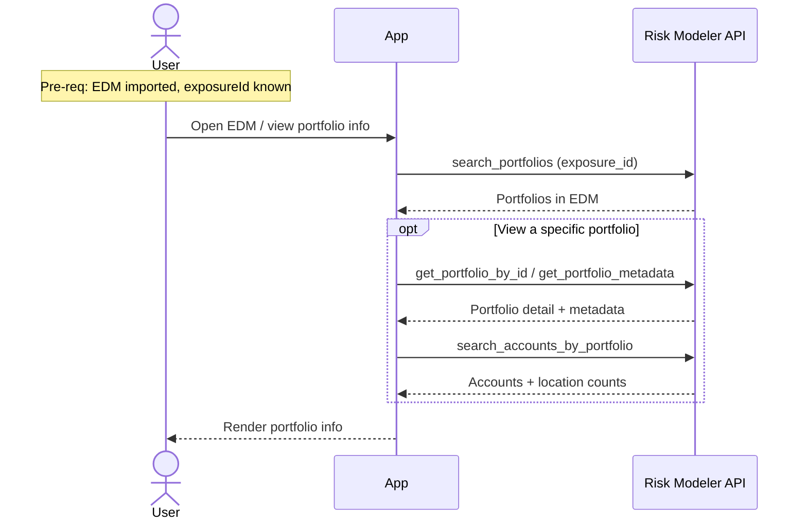

# Granular Flow — View Portfolio Info

Reads portfolio-level information for an imported EDM: the portfolios inside it,
each portfolio's metadata, and the accounts/locations within a portfolio. Pure
read; no job, no mutation.

`irp-integration`: `portfolio.search_portfolios` / `get_portfolio_by_id` /
`get_portfolio_metadata` / `search_accounts_by_portfolio`.

**Classification:** **Sync** read. Not heavy.

Pre-requisites:
- The EDM's import has finished and its `exposureId` is known.

**Definition:**

1. User opens an EDM to view its portfolio information.
2. **List portfolios** — App calls `portfolio.search_portfolios(exposure_id)`
   (or `search_portfolios_paginated`) → the portfolios within the EDM.
3. **Per-portfolio detail** (on demand) — App calls
   `portfolio.get_portfolio_by_id(exposure_id, portfolio_id)` and/or
   `get_portfolio_metadata(exposure_id, portfolio_id)`.
4. **Accounts / locations** (on demand) — App calls
   `portfolio.search_accounts_by_portfolio(exposure_id, portfolio_id)` → the
   accounts and their location counts.
5. App renders the information to the user.

**Sequence Flow:**

---

**Boundaries worth noting** (candidates for metamodel bounding boxes — observations, not decisions):

- **Everything hangs off `exposureId`.** Every call here needs the EDM's
  `exposureId` (and portfolio-level calls need the `portfolioId` too). These reads
  are only possible once EDM upload has resolved the id.
- **Pure read, nothing produced.** No entity is created and nothing is tracked;
  this is a candidate for "no bounding box at all" — live pass-through to RM.
- **Freshness vs. caching is an open choice.** Whether the app reads these live
  every time or caches portfolio metadata is a decision the flow doesn't force.
