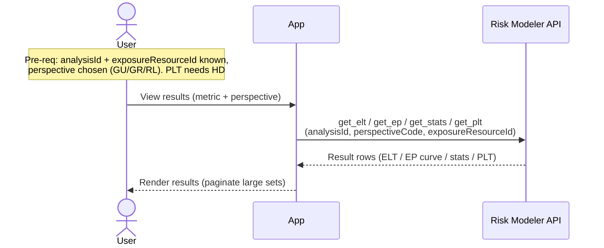

# Granular Flow — View Results (ELT / EP / Stats / PLT)

Reads an analysis's results. Pure REST reads — no Data Bridge, no job, no
mutation. Covers both CRe-run analyses and broker analyses carried in an RDM
(they are all just analyses in Risk Modeler once present).

`irp-integration`: `analysis.get_elt` / `get_ep` / `get_stats` / `get_plt`.

**Classification:** **Sync** read. Medium (result sets can be large; `get_plt`
defaults to a 100k-row limit). Not heavy in the S3 sense.

Pre-requisites:
- The analysis exists and the app knows its `analysisId` **and its
  `exposureResourceId`** (the portfolio id the results are keyed to — carried on
  the analysis record).
- A perspective code is chosen: `GU` (ground-up), `GR` (gross), or `RL`
  (reinsurance layer).
- For `get_plt`: the analysis is **HD** (PLT is HD-only).

**Definition:**

1. User opens an analysis's results and picks a metric (ELT / EP / stats / PLT)
   and a perspective code.
2. App calls the matching read, passing `analysisId`, `perspectiveCode`, and
   `exposureResourceId` (as `PORTFOLIO`):
   - `get_elt(analysisId, perspective, exposureResourceId[, filter, limit, offset])`
   - `get_ep(analysisId, perspective, exposureResourceId)`
   - `get_stats(analysisId, perspective, exposureResourceId)`
   - `get_plt(analysisId, perspective, exposureResourceId[, filter, limit, offset])` — HD only.
3. RM returns the rows; App renders / paginates them.

**Sequence Flow:**

---

**Boundaries worth noting** (candidates for metamodel bounding boxes — observations, not decisions):

- **Reads need two ids, not one.** Every result read needs both the `analysisId`
  and the analysis's `exposureResourceId` (portfolio id). Whatever represents an
  analysis must carry `exposureResourceId`, or the app must resolve it before it
  can show results.
- **REST-only, never Data Bridge.** Results retrieval is purely the Risk Modeler
  REST API. (Data Bridge only appears on the export path — see
  `export_to_loss_repo.md`.)
- **Pure read, nothing produced or tracked.** Like `view_portfolio`, a candidate
  for "no bounding box." The interesting persistence question is not here but on
  export (where results become durable rows in the Loss Repo).
- **Broker vs. CRe results are the same shape.** A broker analysis (from an RDM)
  and a CRe-run analysis are both just analyses; results are read identically.
  Any "who produced this" distinction is app-side metadata, not a difference in
  this flow.
- **PLT is HD-only** and defaults to a large row cap — a real branch the UI must
  respect (don't offer PLT for DLM analyses).
