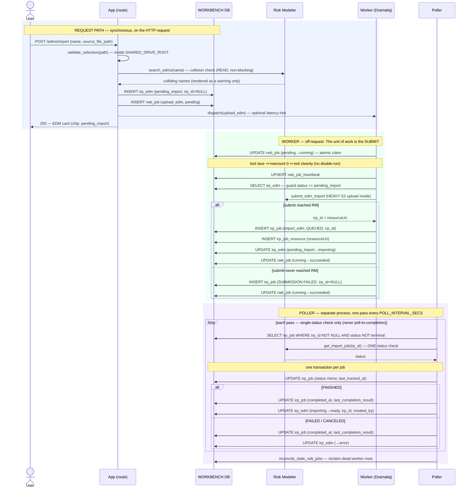

# Execution Flow — Import an EDM (US1)

The analyst imports one exposure file as an `irp_edm`. The click does the *fast* things
only — validate the file, a lightweight name-collision **search**, and insert two rows —
then returns. The actual Risk Modeler submit runs in a **worker**; the **poller** mirrors
the import status and flips the entity to `ready`/`error`.

Code: `edm_service.import_edm` → `rwb_job` → `package_jobs._upload_edm_body` →
`poller.run._handle_import_edm_terminal`.

**Classification:** request path = **sync**; the import submit = **async (worker)**; the
import finish = **async (poller)**. One RM call *is* made on the request path — the
collision **search** (a read, non-blocking) — but never the submit (FR-042 / Article 11).

## Records written (in order)

| # | Table | Row / change | Written by | Process |
|---|---|---|---|---|
| 1 | `irp_edm` | INSERT — `status='pending_import'`, `irp_id=NULL`, `source_file_path` | `import_edm` | 🟦 request |
| 2 | `rwb_job` | INSERT — `rwb_job_type='upload_edm'`, `status_code='pending'`, `requestor_type='analyst_request'`, `requestor_id=irp_edm.id` | `enqueue_rwb_job` | 🟦 request |
| 3 | `rwb_job` | UPDATE — `pending → running`, `claimed_by` (atomic claim) | `claim_rwb_job` | 🟩 worker |
| 4 | `rwb_job_heartbeat` | UPSERT — one row for the job, refreshed on an interval | heartbeat thread | 🟩 worker |
| 5 | `irp_job` | INSERT — `irp_job_type='import_edm'`, `status='QUEUED'`, `irp_id` set | `record_submitted_irp_job` | 🟩 worker |
| 6 | `irp_job_resource` | INSERT — the `resourceUri` captured at submit | `record_submitted_irp_job` | 🟩 worker |
| 7 | `irp_edm` | UPDATE — `pending_import → importing` | `mark_importing` | 🟩 worker |
| 8 | `rwb_job` | UPDATE — `running → succeeded` (+ `output_data`, `completed_at`) | `complete_rwb_job` | 🟩 worker |
| 9 | `irp_job` | UPDATE — status mirror + `last_tracked_at` (every pass while non-terminal) | `update_tracking` | 🟪 poller |
| 10 | `irp_job` | UPDATE — terminal status + `completed_at` + `last_completion_result` | `update_tracking` | 🟪 poller |
| 11 | `irp_edm` | UPDATE — `importing → ready`, backfill `irp_id` + `created_by_irp_job_irp_id` (FINISHED) — **or** `→ error` (FAILED/CANCELED) | `backfill_on_terminal` | 🟪 poller |

*Submit-failure variant:* if the worker's submit never reaches RM, step 5 instead writes
`irp_job(status='SUBMISSION FAILED', irp_id=NULL)` and steps 6–7 are skipped; the poller
never tracks it (no `irp_id`) — the `submission_retry` batch owns it (US6).

## Sequence

---

**Boundaries worth noting**

- **The only request-path RM call is the collision *search*** — a read that produces a
  non-blocking warning. The *submit* is deferred to the worker. This is the concrete line
  Article 11 draws: reads-on-request are fine; job submits and status polls are not.
- **Sync → async seam is between step 2 and step 3.** The request commits the two
  `pending` rows and returns; from the claim onward everything outlives the HTTP request.
- **`irp_id` does not exist until the worker submits** (step 5). The `irp_edm` row lives
  as `pending_import`/`importing` with `irp_id=NULL` until the poller backfills it on
  `ready` (step 11). Nothing downstream may assume an `irp_id` before then.
- **Two distinct failure modes.** `SUBMISSION FAILED` (worker; the submit never reached
  RM; `irp_id=NULL`; owned by the poller's `submission_retry`) is deliberately *not* the
  same as an RM-side `FAILED`/`CANCELED` (a real `irp_id` exists, then the import failed;
  the poller flips the entity to `error`).
- **Idempotency is by durable state, not memory.** The worker only submits a
  `pending_import` EDM (step-6 guard), so a Dramatiq redelivery or a reconciler
  re-dispatch is a no-op. Retry from the UI (`retry_import`) uses `ensure_pending_rwb_job`,
  which *can* reset a failed head — the one place a terminal `rwb_job` is revived.
