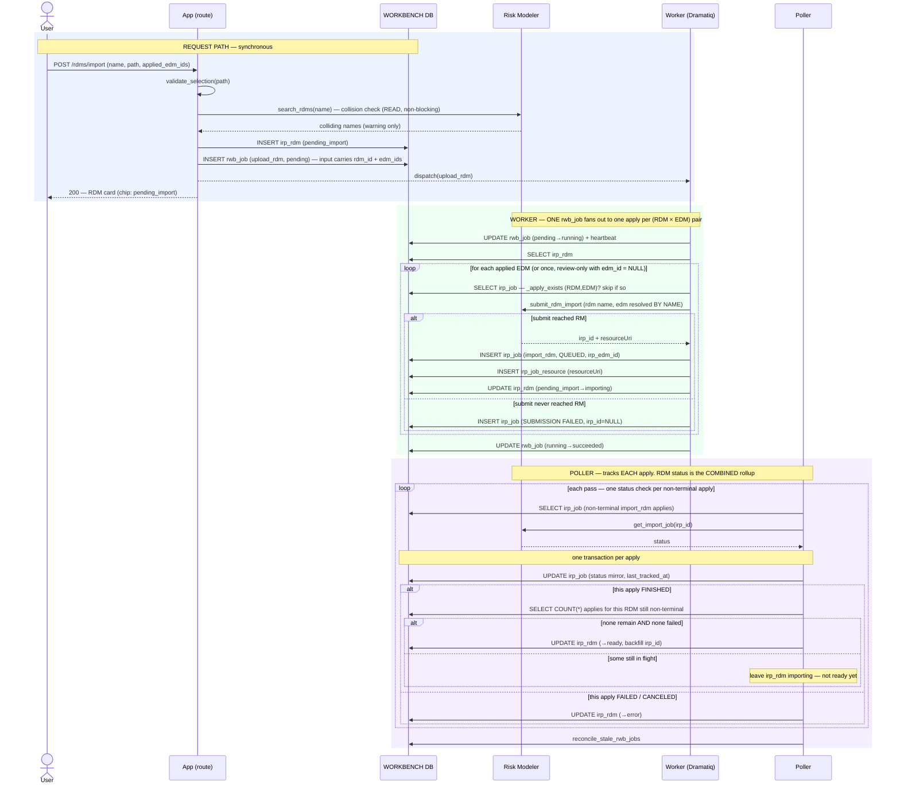

# Execution Flow — Import an RDM (US2)

The analyst imports one results file as an `irp_rdm`, optionally applying it to one or more
EDMs. Same request-path discipline as [import EDM](import_edm.md), with one shape
difference: **one `rwb_job` fans out in the worker to one `irp_job` apply per (RDM × EDM)
pair**, and the poller's status write is a **combined rollup** — the RDM is `ready` only
once *every* apply is `FINISHED`.

Code: `rdm_service.import_rdm` → one `upload_rdm` `rwb_job` → `package_jobs._upload_rdm_body`
(fan-out) → `poller.run._handle_import_rdm_terminal` → `rdm_service.rollup_on_terminal`.

**Classification:** request path = **sync** (+ one collision **search**); the applies =
**async (worker)**, fanned out; the finishes = **async (poller)**, rolled up. With no
applied EDMs it degrades to a single **review-only** apply (FR-002/FR-016).

## Records written (in order)

| # | Table | Row / change | Written by | Process |
|---|---|---|---|---|
| 1 | `irp_rdm` | INSERT — `status='pending_import'`, `irp_id=NULL` | `import_rdm` | 🟦 request |
| 2 | `rwb_job` | INSERT — `rwb_job_type='upload_rdm'`, `pending`, `requestor_id=irp_rdm.id`, `input={rdm_ids:[rdm], edm_ids:[…], package_id}` | `enqueue_rwb_job` | 🟦 request |
| 3 | `rwb_job` | UPDATE — `pending → running` (atomic claim) + heartbeat upsert | `claim_rwb_job` | 🟩 worker |
| 4 | `irp_job` | INSERT **× one per (RDM, EDM) pair** — `import_rdm`, `QUEUED`, `irp_id`, `irp_edm_id` set (NULL for review-only) | `record_submitted_irp_job` | 🟩 worker |
| 5 | `irp_job_resource` | INSERT — one per apply (`resourceUri`) | `record_submitted_irp_job` | 🟩 worker |
| 6 | `irp_rdm` | UPDATE — `pending_import → importing` | `mark_importing` | 🟩 worker |
| 7 | `rwb_job` | UPDATE — `running → succeeded` (the whole fan-out is one unit of work) | `complete_rwb_job` | 🟩 worker |
| 8 | `irp_job` | UPDATE — status mirror per apply, every pass | `update_tracking` | 🟪 poller |
| 9 | `irp_rdm` | UPDATE — **rollup**: `→ ready` only when NO `import_rdm` apply is non-terminal AND none failed (backfill `irp_id` from the first finished); `→ error` if any apply FAILED/CANCELED | `rollup_on_terminal` | 🟪 poller |

*Per-pair idempotency:* before each submit the worker checks `_apply_exists` — if an
`import_rdm` row already exists for that `(rdm_id, edm_id)` pair (and is not
`SUBMISSION FAILED`), it is skipped. So a redelivery re-runs the loop safely.

## Sequence

---

**Boundaries worth noting**

- **One `rwb_job`, M `irp_job` rows.** The fan-out lives *inside* the worker body, not in
  the enqueue. That keeps the unit of app-side work coarse (one claim, one heartbeat, one
  complete) while each RM apply is tracked independently.
- **The RDM's status is a rollup, not a mirror.** No single apply's terminal status sets
  the RDM `ready`; the poller re-derives it each time an apply finishes and only promotes
  the RDM when the whole set is `FINISHED`. One failed apply makes the RDM `error`.
- **The EDM is resolved by *name* at submit** (Article 2 — name-first resolution), inside
  the worker, so the apply doesn't depend on the EDM's `irp_id` being backfilled yet.
- **Review-only is the `edm_ids = []` degenerate case** — a single apply with
  `irp_edm_id = NULL`. The rollup logic is identical (a set of one).
- **This is the standalone-import flow.** When the RDM belongs to a package being synced,
  the `upload_rdm` head is not enqueued here on the request path — it is enqueued by the
  **poller** once the EDM finishes importing (see [save & sync](save_and_sync_package.md)).
