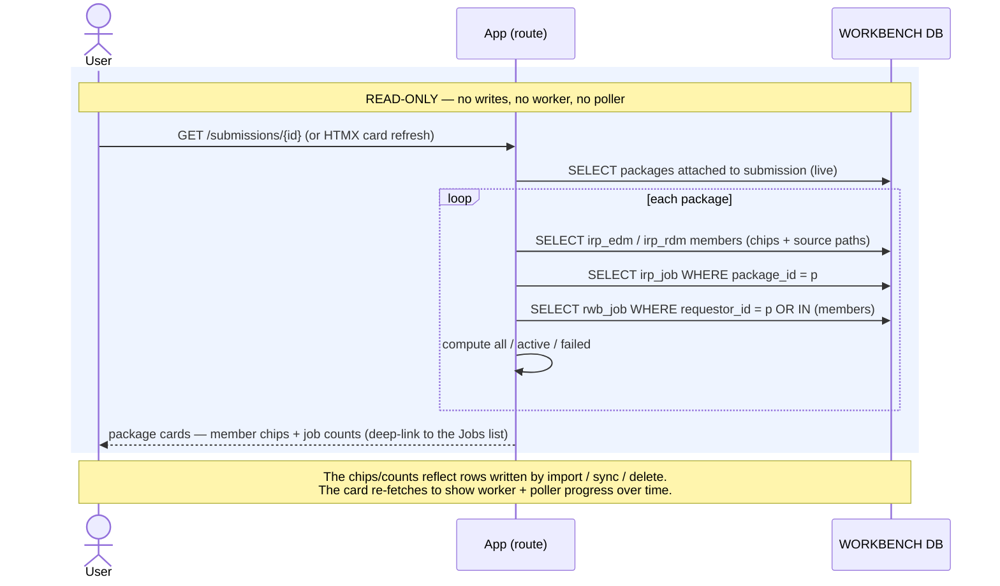

# Execution Flow — Package Cards on the Submission (US5)

The read side. When the analyst opens a submission (or the card auto-refreshes), the app
renders one **package card** per attached package: each member's own status chip, its
source path, and **all / active / failed job counts** for the package's work. This is the
surface where the analyst *sees* the progress the worker and poller are driving.

**This flow writes nothing** — no `rwb_job`, no `irp_job`, no entity mutation, no worker,
no poller. It is pure query + render. It is included because it is the user-visible half of
every other Iteration-2 flow: the counts and chips are reading the very rows those flows
write.

Code: `submissions._detail_context` → `package_sync_service.get_package_cards` →
`get_package_card(with_counts=True)` → `job_query.package_job_counts`.

## Records read (none written)

| # | Query | Source rows |
|---|---|---|
| 1 | packages attached to the submission (live only) | `package` ⋈ `submission_package`, `deleted_at IS NULL` |
| 2 | per package: live members + their status chips + source paths | `irp_edm`, `irp_rdm` where `package_id`, `deleted_at IS NULL` |
| 3 | per package: `irp_job` rows at the package grain | `irp_job WHERE package_id = :p` |
| 4 | per package: `rwb_job` rows for the package or any member | `rwb_job WHERE requestor_id = :p OR requestor_id IN (members)` |

The counts are computed in Python from 3 + 4:

- **all** = `len(irp) + len(rwb)`
- **active** = `irp` not in the terminal set **+** `rwb` in `('pending','running')`
- **failed** = `irp` in `('FAILED','CANCELED','SUBMISSION FAILED')` **+** `rwb` = `'failed'`

There is deliberately **no rolled-up package status** (FR-018) — each member carries its own
chip; the card shows counts, not a single package verdict.

## Sequence

---

**Boundaries worth noting**

- **This is the only Iteration-2 user action with zero writes and no off-request work.**
  It is the mirror of the others: import/sync/delete *produce* the `rwb_job` / `irp_job` /
  entity rows; the card *reads* them.
- **The counts union both job tables** because the two halves of every operation live in
  different tables — the app-side queue (`rwb_job`) and the RM-op bridge (`irp_job`) — and
  each has its own terminal vocabulary. `job_query` owns that union so neither write-service
  leaks into the read path.
- **Progress appears by re-fetching, not by push.** The card is re-requested (HTMX) and
  re-runs these reads; between fetches the worker and poller are advancing the underlying
  rows off-request. There is no websocket and no server push — the read is cheap and
  idempotent.
- **Read scope is unrestricted (Article 6).** No `customer_id`, no `apply_scope` — every
  analyst sees every package's counts. The read-only *gate* enforced elsewhere
  (`_package_actionable`) governs whether the **action buttons** render, not whether the
  card is visible.
