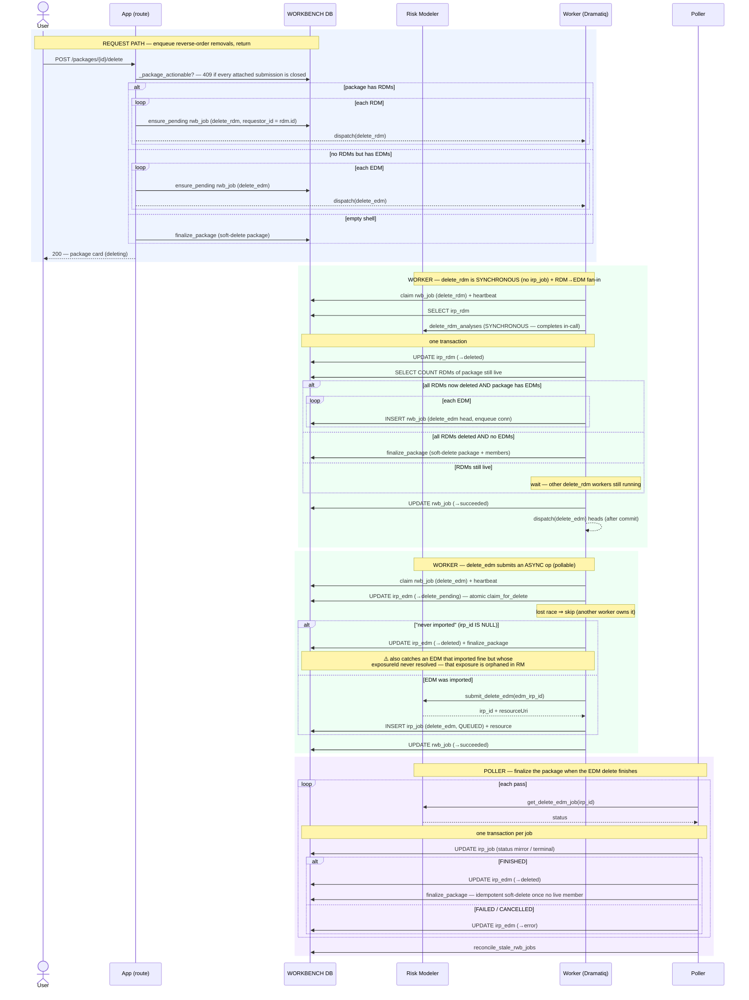

# Execution Flow — Delete a Package (US4)

The analyst deletes a package. Removal is **reverse order** (RDMs before EDMs, R6/FR-019)
and the two halves are **asymmetric**:

- **RDM removal is synchronous in Risk Modeler** → a `delete_rdm` `rwb_job` that does the
  whole thing in the worker and writes **no `irp_job`**.
- **EDM removal is a long async op** → a `delete_edm` `rwb_job` whose worker *submits* and
  records a **pollable `irp_job`**; the poller finalizes on `FINISHED`.

The `delete_edm` heads are not enqueued up front — they are enqueued by an **app-side
fan-in inside the `delete_rdm` worker**, only once *all* the package's RDMs are `deleted`
(you cannot drop an EDM while RDMs still reference it). The package shell is soft-deleted by
an **idempotent finalize** that runs whenever the last live member goes. **Nothing is ever
hard-deleted.**

Code: `package_sync_service.delete_package` → `package_jobs._delete_rdm_body` (sync +
fan-in) → `_delete_edm_body` (async) → `poller.run._handle_delete_edm_terminal` →
`package_sync_service.finalize_package`.

## Records written (in order)

| # | Table | Row / change | Written by | Process |
|---|---|---|---|---|
| 1 | `rwb_job` | INSERT one `delete_rdm` per RDM (`requestor_id=rdm.id`) — *or* `delete_edm` per EDM if the package has no RDMs | `delete_package` | 🟦 request |
| 2 | `rwb_job` | claim `pending→running` + heartbeat | worker | 🟩 worker |
| 3 | `irp_rdm` | UPDATE `status='deleted'` (after the **synchronous** RM delete; **no `irp_job` written**) | `_delete_rdm_body` | 🟩 worker |
| 4 | `rwb_job` | INSERT `delete_edm` head per EDM — **fan-in**, only when 0 RDMs remain live (same txn, `enqueue(conn)`) | `_delete_rdm_body` | 🟩 worker |
| 5 | `irp_edm` | UPDATE `→ delete_pending` — atomic claim guard | `claim_for_delete` | 🟩 worker |
| 6a | `irp_edm` | UPDATE `→ deleted` **inline** + finalize — when the EDM has no `irp_id` (read as "never imported"; no async op) — ⚠️ see the `irp_id IS NULL` note below | `_delete_edm_body` | 🟩 worker |
| 6b | `irp_job` | INSERT `delete_edm`, `QUEUED`, `irp_id` — when the EDM *was* imported | `record_submitted_irp_job` | 🟩 worker |
| 7 | `irp_job` | UPDATE status mirror per pass; terminal on finish | `update_tracking` | 🟪 poller |
| 8 | `irp_edm` | UPDATE `→ deleted` (FINISHED) — or `→ error` (FAILED/CANCELLED) | `set_deleted` / `backfill_on_terminal` | 🟪 poller |
| 9 | `package`, `irp_edm`, `irp_rdm` | UPDATE `deleted_at` — **idempotent finalize** once no live member remains | `finalize_package` | 🟩 worker or 🟪 poller (whoever is last) |

## Sequence

---

**Boundaries worth noting**

- **The asymmetry is the whole point (R6).** RDM analyses delete *synchronously* in RM, so
  that worker needs no `irp_job` and no poller — it does the delete, marks the RDM
  `deleted`, done. EDM delete is a minutes-long async op, so it takes the full
  worker-submit → `irp_job(QUEUED)` → poller-finish path, exactly like an import.
- **The RDM→EDM ordering is enforced by an app-side fan-in, not by the request path.** The
  `delete_edm` heads are enqueued *inside* the last `delete_rdm` worker (step 4), gated on
  "0 RDMs remain live", because an EDM can't be dropped while an RDM references it. The
  request path only ever kicks off the RDM deletes.
- **`finalize_package` is idempotent and last-one-wins.** It soft-deletes the package +
  members *only* when no member is still un-removed in RM, and can be called by the
  `delete_rdm` worker (RDM-only package), the `delete_edm` worker (EDM never imported), or
  the poller (EDM delete finished) — whichever removes the last live member. The others are
  no-ops.
- **`claim_for_delete` is the atomic delete guard.** It flips the EDM to `delete_pending`
  only if it isn't already deleting/deleted, so a redelivered/duplicated `delete_edm` can't
  submit the RM delete twice.
- **A failed EDM delete deliberately *keeps* its `irp_id`.** `mark_delete_error` preserves
  it, unlike the import path's `backfill_on_terminal`, which nulls it on a non-ready
  terminal. Without that, a re-triggered delete would take the "never imported" inline
  branch (step 6a) and mark an EDM `deleted` that still exists in Risk Modeler.
- **⚠️ `irp_id IS NULL` is not actually a reliable "never imported" test.** The bullet above
  guards the *delete-failure* route into step 6a, but the same hazard exists on the *import*
  route and is currently unguarded: an import that reaches FINISHED while
  `_resolve_edm_exposure_id` misses lands the EDM at `ready` with `irp_id=NULL`
  (see [import an EDM](../entities/import_edm.md), step 11a). Deleting that EDM takes the
  inline branch, marks it `deleted` locally, and never calls Risk Modeler — orphaning a real
  exposure. It takes a double miss to get there (`backfill_edm_detail` retries the resolve),
  but nothing prevents it. The discriminator already exists in the schema:
  `created_by_irp_job_irp_id` is stamped on every ready transition whether or not the
  exposureId resolved, so step 6a should require **both** columns NULL and otherwise fail the
  job for recovery rather than delete locally.
- **Soft delete only.** Every "delete" here is a `deleted_at` / `status='deleted'` stamp.
  Rows are never removed — the audit trail and the Jobs list stay intact.
- **The request path is gated on the submissions, not the package.** `_package_actionable`
  409s when *every* submission the package is attached to is closed — but the card itself
  stays visible (Article 6: reads are never scoped). The gate governs the buttons.
