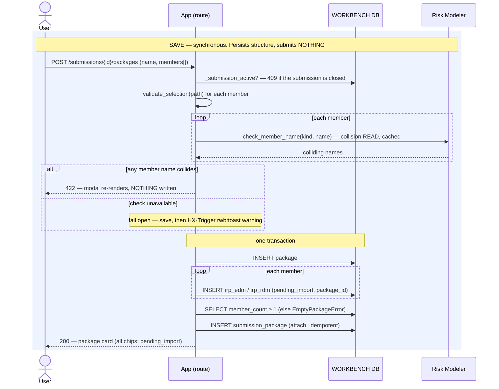
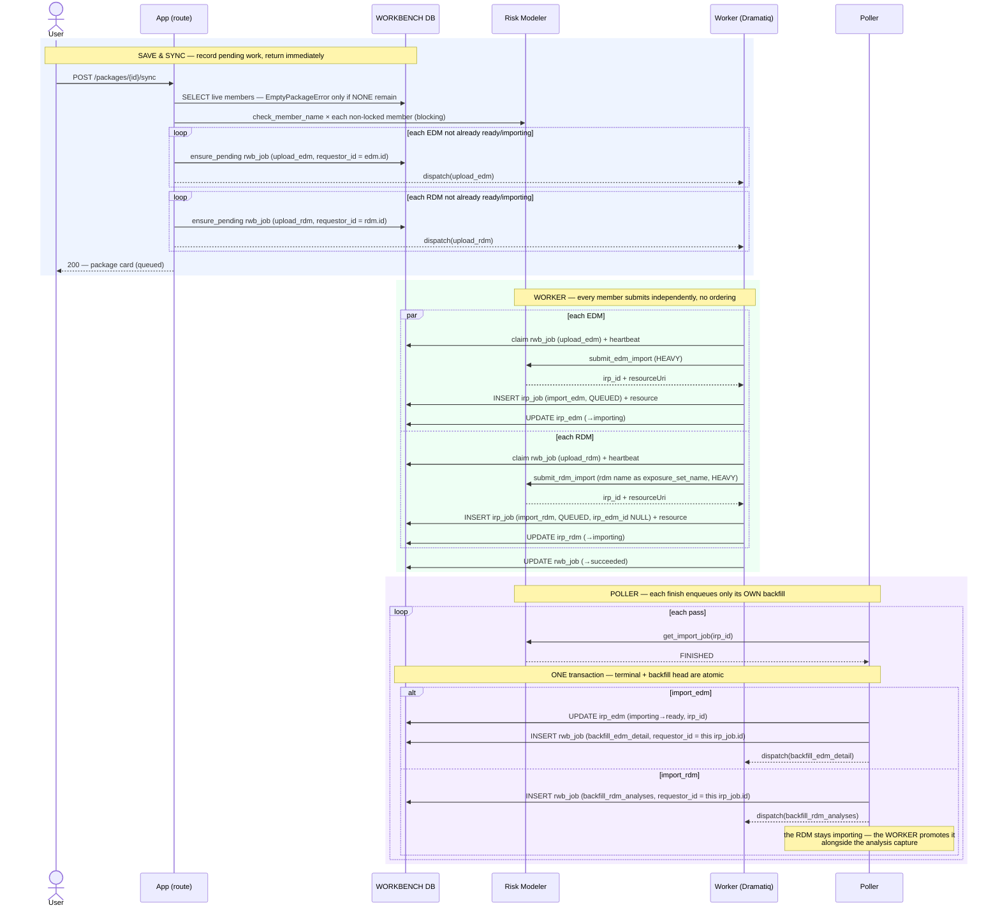

# Execution Flow — Assemble & Sync a Package (US3)

The headline action. The analyst assembles a package (EDMs + RDMs) on the submission
detail, **Saves** it (persists the shell + members, submits nothing), then **Save & Syncs**
(records the pending work and returns). All the Risk Modeler work is carried off-request by
the worker and poller. **The members are independent:** an RDM is imported standalone, so
for **N EDMs and M RDMs** Save & Sync enqueues **N + M heads in one pass**, and no member
waits on another.

Code: `package_sync_service.save_package` / `save_and_sync` →
`package_jobs._upload_edm_body` / `_upload_rdm_body` →
`poller.run._handle_import_edm_terminal` / `_handle_import_rdm_terminal` (each enqueues
only its own backfill).

**Two request-path operations. Neither submits to Risk Modeler (FR-042):**

- **Save** — per-member collision **check** + `INSERT package` + one member entity per
  EDM/RDM (each `pending_import`) + `INSERT submission_package`. **No `rwb_job`, no RM
  submit.**
- **Save & Sync** — the same, plus one `upload_edm` `rwb_job` per pending EDM and one
  `upload_rdm` per pending RDM (idempotent). Returns immediately. Everything after is
  worker + poller.

**The member name-check blocks** (003 amendment, 2026-07-27), the same three-way outcome as
[import EDM](../entities/import_edm.md) but applied per member via
`name_check.check_member_name(kind, name)`: a real collision raises and **nothing is
written**; an unreachable gateway **fails open**, saving the package and raising an
`HX-Trigger: rwb:toast` warning so the analyst knows the names went unverified. The modal
also checks as-you-type through `GET /packages/member-name-check`, sharing the same cache.

Two details of the batch check worth knowing: a name **repeated within the same package** is
reported as a collision even though neither exists in RM yet (the first submit would create
it and the second would fail minutes later at the worker backstop), and at *sync* time the
check covers only members that will actually be (re)submitted — anything already
`importing`/`ready` is skipped, so a `ready` member never collides with itself.

---

## Phase A — Save (synchronous, no jobs)

### Records written

| # | Table | Row / change | Written by |
|---|---|---|---|
| 1 | `package` | INSERT (create) — or UPDATE `name` with optimistic-concurrency on `updated_at` (edit) | `save_package` |
| 2 | `irp_edm` / `irp_rdm` | INSERT one per member — `status='pending_import'`, `package_id` set | `save_package` |
| 3 | `submission_package` | INSERT `(submission_id, package_id)` — idempotent | `attach_to_submission` |

---

## Phase B — Save & Sync (async)

This is the core. The EDM column and the RDM column below run **concurrently** — they share
no step.

### Records written (per EDM, and per RDM)

| # | Table | Row / change | Written by | Process |
|---|---|---|---|---|
| 1a | `rwb_job` | INSERT/ensure — `upload_edm`, `pending`, `requestor_id=edm.id` (one per pending EDM) | `ensure_pending_rwb_job` | 🟦 request |
| 1b | `rwb_job` | INSERT/ensure — `upload_rdm`, `pending`, `requestor_id=rdm.id` (one per pending RDM) | `ensure_pending_rwb_job` | 🟦 request |
| 2 | `rwb_job` | claim `pending→running` + heartbeat | worker | 🟩 worker |
| 3a | `irp_job` | INSERT — `import_edm`, `QUEUED`, `irp_id` | `record_submitted_irp_job` | 🟩 worker |
| 3b | `irp_job` | INSERT — `import_rdm`, `QUEUED`, `irp_id`, **`irp_edm_id` NULL** | `record_submitted_irp_job` | 🟩 worker |
| 4 | `irp_edm` / `irp_rdm` | UPDATE `pending_import→importing` | `mark_importing` | 🟩 worker |
| 5 | `rwb_job` | UPDATE `running→succeeded` | `complete_rwb_job` | 🟩 worker |
| 6 | `irp_job` | UPDATE terminal (FINISHED) — *in the same txn as ↓* | `update_tracking` | 🟪 poller |
| 7a | `irp_edm` | UPDATE `importing→ready` + backfill `irp_id` | `backfill_on_terminal` | 🟪 poller |
| 7b | `rwb_job` | INSERT — `backfill_edm_detail`, keyed on the finished `import_edm` job | `enqueue_rwb_job(conn=…)` | 🟪 poller |
| 8 | `rwb_job` | INSERT — `backfill_rdm_analyses`, keyed on the finished `import_rdm` job | `enqueue_rwb_job` | 🟪 poller |
| 9 | `irp_rdm` | UPDATE **rollup** `→ready`, in the same txn as the analysis capture | `rollup_on_terminal` | 🟩 worker |

Step 7b is where each EDM's own detail backfill starts; see
[backfill the EDM's detail](../backfill/backfill_edm_detail.md).

**Fan-out summary:** 1 Save & Sync click → **N + M** heads → **N** `import_edm` + **M**
`import_rdm` jobs, all in flight at once → (poller) **N** `backfill_edm_detail` + **M**
`backfill_rdm_analyses` heads. Nothing waits on anything: the EDM's DataBridge import and
the RDM's standalone import are unrelated operations in Risk Modeler.

---

**Boundaries worth noting**

- **Save vs. Save & Sync is the deliberate submit boundary.** Save is pure structure —
  the package can sit half-built indefinitely with every member `pending_import` and *zero*
  jobs. Nothing reaches Risk Modeler until Sync.
- **Each terminal step is one atomic poller transaction**: "mark the `irp_job` FINISHED",
  "flip the entity", and "enqueue the backfill head" all commit together. A crash leaves
  either the whole step done or none of it — on retry `update_tracking` is an in-place
  no-op and `enqueue_rwb_job` dedups.
- **A backfill head is keyed on the finished `irp_job.id`, not the package.** That is what
  makes N EDMs each spawn exactly one head, and makes re-processing idempotent (the unique
  key `(requestor_type, requestor_id, rwb_job_type)` collapses a duplicate).
- **`enqueue` (poller, mechanical) never revives a terminal row; `ensure_pending` (request
  path, human) does.** Re-clicking Sync resets a *failed* member's head to `pending` and
  skips ready/in-flight ones — a mechanical re-poll can never do that.
- **A package of any shape syncs.** EDM-only, RDM-only, or both: every member is submitted
  the same way, and `save_and_sync` raises `EmptyPackageError` only when no live member
  remains at all. Attaching an already-`ready` RDM therefore submits nothing — it is
  already in Risk Modeler, and there is no per-EDM apply left to perform.
- **The `_LOCKED` set is what makes re-clicking Sync safe.** Only members whose status is
  outside `(importing, ready)` are name-checked and enqueued, so a partially-synced package
  advances the stragglers and leaves the rest alone.
